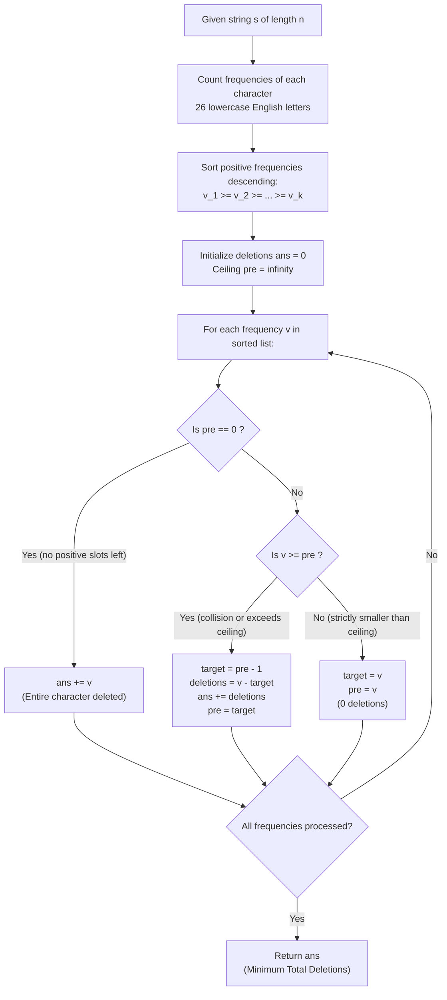

# Guided Example: Minimum Deletions to Make Character Frequencies Unique

We trace the step-by-step descending frequency ceiling allocation and greedy collision elimination for strings, prove the Greedy Upper Ceiling Invariant and Frequency Monotonicity Theorem, and evaluate minimum deletion counts across representative problem instances:

- **Representative Instance 1 (Multi-Frequency Collision Cascading):**
  - Input: `s = "aaabbbcc"`
  - Character counts: `'a': 3`, `'b': 3`, `'c': 2`.
  - Sorted frequencies descending: $[3, 3, 2]$.
  - Collisions: Two characters have frequency $3$.
  - Resolution:
    - Retain first frequency $3$.
    - Reduce second frequency $3 \to 2$ ($1$ deletion).
    - Now frequency $2$ collides with `'c'`; reduce `'c'` from $2 \to 1$ ($1$ deletion).
    - Resulting unique positive frequencies: $[3, 2, 1]$.
  - **Required Output:** `2` (Total deletions: $1 + 1 = 2$).

- **Representative Instance 2 (Cascading Down to Complete Erasure):**
  - Input: `s = "ceabaacb"`
  - Character counts: `'a': 3`, `'b': 2`, `'c': 2`, `'e': 1`.
  - Sorted frequencies: $[3, 2, 2, 1]$.
  - Resolution:
    - Frequency $3$ retained.
    - First frequency $2$ retained.
    - Second frequency $2$ reduced to $1$ ($1$ deletion).
    - Frequency $1$ must be reduced to $0$ ($1$ deletion, `'e'` is completely erased).
    - Resulting unique positive frequencies: $[3, 2, 1]$.
  - **Required Output:** `2`.

- **Representative Instance 3 (Naturally Good String):**
  - Input: `s = "aab"`
  - Frequencies: `'a': 2`, `'b': 1`.
  - Frequencies $[2, 1]$ are already strictly distinct $\implies$ **Required Output:** `0`.

---

## 1. Instance & Teaching Goal

A string is called **good** if no two distinct characters have the same non-zero frequency. Given a string `s`, find the minimum number of character deletions required to make `s` good. Characters with frequency $0$ are completely erased and do not violate the uniqueness condition (multiple characters may be reduced to frequency $0$).

```text
The Asymmetry of Frequency Mutation:
  - We can only DECREASE frequencies (by deleting characters).
  - We CANNOT increase frequencies.

Why Greedy Descending Order is Optimal:
  Suppose two characters have frequency 3:
    Option A: Reduce one 3 to 2 (cost = 1 deletion).
    Option B: Reduce one 3 to 1 (cost = 2 deletions).
  To minimize deletions, we should keep the retained frequency as LARGE as legally possible!
  The upper bound for any frequency is strictly one less than the previously assigned frequency.

  By sorting original frequencies in descending order:
    v_1 >= v_2 >= v_3 >= ... >= v_k
  we assign the highest available distinct slots first, guaranteeing that every subsequent
  character pays the minimal possible penalty!
```

The decisive pedagogical goal is the **Greedy Upper Ceiling Invariant & Frequency Monotonicity Theorem**:
1. **Character Independence:** Character identities do not matter; the problem reduces entirely to the multiset of integer counts.
2. **Dynamic Ceiling Maintenance:** Maintain a variable $pre$, denoting the strict upper bound for the next assigned frequency.
3. **Optimal Target Frequency:** For each frequency $v$, its optimal retained value is $\max(0, \min(v, pre - 1))$.
4. **Zero Immunity:** A target frequency of $0$ means complete deletion; zero may be repeated indefinitely without constraint.

---

## 2. Conceptual Foundation & The Ceiling Reduction Pipeline



### The Greedy Upper Ceiling Invariant & Monotonicity Theorem

Let $V = (v_1, v_2, \dots, v_k)$ be the positive character frequencies sorted in non-increasing order: $v_1 \ge v_2 \ge \dots \ge v_k \ge 1$.
We seek non-negative integers $(f_1, f_2, \dots, f_k)$ such that:
$$
0 \le f_i \le v_i \quad \text{for all } i, \quad \text{and } \forall i \ne j : (f_i > 0 \land f_j > 0) \implies f_i \ne f_j
$$
minimizing the total deletion cost $\sum_{i=1}^k (v_i - f_i)$.
1. **Monotonicity of Optimal Frequencies:**
   There exists an optimal solution where the retained non-zero frequencies are strictly decreasing:
   $$
   f_1 > f_2 > \dots > f_m > 0 = f_{m+1} = \dots = f_k
   $$
2. **Greedy Choice Property:**
   Given optimal assignments for the first $i - 1$ frequencies, the largest permitted non-negative frequency for character $i$ is:
   $$
   f_i^* = \max(0, \min(v_i, f_{i-1}^* - 1))
   $$
   Choosing $f_i^*$ minimizes the immediate deletion penalty $v_i - f_i^*$ while leaving the largest possible headroom for all subsequent frequencies $j > i$.
3. **Decoupled Zero Invariant:**
   Once $f_{i-1}^* = 0$, no strictly smaller non-negative integer exists. Thus, $f_j^* = 0$ for all $j \ge i$, requiring all remaining characters to be deleted in their entirety.

---

## 3. Step-by-Step Worked Execution

### Trace on Representative Instance 1 (`s = "aaabbbcc"`)

Original character frequencies:
- `'a': 3`, `'b': 3`, `'c': 2`.
- Sorted descending: $V = [3, 3, 2]$.
- Initialize: $ans = 0, \; pre = \infty$.

#### Iteration 1: Process First Frequency $v = 3$
- Compare with ceiling: $v = 3 < pre = \infty$.
- No collision occurs. Retain full frequency $3$.
- Deletions incurred: $0$.
- Update ceiling: $pre \leftarrow 3$.
- State: $ans = 0, \; pre = 3$.

#### Iteration 2: Process Second Frequency $v = 3$
- Compare with ceiling: $v = 3 \ge pre = 3$ (Collision!).
- Permitted ceiling is $pre - 1 = 3 - 1 = 2$.
- Target frequency: $f_2 = 2$.
- Deletions incurred: $v - f_2 = 3 - 2 = \mathbf{1}$.
- Accumulate deletions: $ans \leftarrow 0 + 1 = 1$.
- Update ceiling: $pre \leftarrow 2$.
- State: $ans = 1, \; pre = 2$.

#### Iteration 3: Process Third Frequency $v = 2$
- Compare with ceiling: $v = 2 \ge pre = 2$ (Collision with newly assigned frequency!).
- Permitted ceiling is $pre - 1 = 2 - 1 = 1$.
- Target frequency: $f_3 = 1$.
- Deletions incurred: $v - f_3 = 2 - 1 = \mathbf{1}$.
- Accumulate deletions: $ans \leftarrow 1 + 1 = \mathbf{2}$.
- Update ceiling: $pre \leftarrow 1$.
- State: $ans = 2, \; pre = 1$.

Final Output: **`2`**.

---

### Trace on Representative Instance 2 (`s = "ceabaacb"`)

Frequencies: `'a': 3`, `'b': 2`, `'c': 2`, `'e': 1`. Sorted: $[3, 2, 2, 1]$.
- $v_1 = 3$: $3 < \infty \implies f_1 = 3$, $pre \leftarrow 3$, $ans = 0$.
- $v_2 = 2$: $2 < 3 \implies f_2 = 2$, $pre \leftarrow 2$, $ans = 0$.
- $v_3 = 2$: $2 \ge 2 \implies f_3 = 1$, deletions $= 2 - 1 = 1$, $pre \leftarrow 1$, $ans = 1$.
- $v_4 = 1$: $1 \ge 1 \implies f_4 = 0$, deletions $= 1 - 0 = 1$, $pre \leftarrow 0$, $ans = 2$.

Final Output: **`2`**.

---

## 4. Complete Execution Trace

### State Progression Table for Representative Instance 1

| Iteration | Character | Original Count $v$ | Previous Ceiling $pre$ | Condition Evaluated | Retained Count $f$ | Deletions Added | Total Deletions $ans$ |
|---|---|---|---|---|---|---|---|
| Start | — | — | $\infty$ | Initialization | — | $0$ | $0$ |
| 1 | `'a'` | $3$ | $\infty$ | $v < pre$ | $3$ | $0$ | $0$ |
| 2 | `'b'` | $3$ | $3$ | $v \ge pre \implies 3 - 2$ | $2$ | $1$ | $1$ |
| 3 | `'c'` | $2$ | $2$ | $v \ge pre \implies 2 - 1$ | $1$ | $1$ | $\mathbf{2}$ |

### State Progression Table for Representative Instance 2

| Iteration | Character | Original Count $v$ | Previous Ceiling $pre$ | Condition Evaluated | Retained Count $f$ | Deletions Added | Total Deletions $ans$ |
|---|---|---|---|---|---|---|---|
| Start | — | — | $\infty$ | Initialization | — | $0$ | $0$ |
| 1 | `'a'` | $3$ | $\infty$ | $v < pre$ | $3$ | $0$ | $0$ |
| 2 | `'b'` | $2$ | $3$ | $v < pre$ | $2$ | $0$ | $0$ |
| 3 | `'c'` | $2$ | $2$ | $v \ge pre \implies 2 - 1$ | $1$ | $1$ | $1$ |
| 4 | `'e'` | $1$ | $1$ | $v \ge pre \implies 1 - 0$ | $0$ (erased) | $1$ | $\mathbf{2}$ |

---

## 5. Algorithmic Correctness

**Soundness.**
Every assigned non-zero frequency satisfies $f_i \le f_{i-1} - 1$, guaranteeing that all positive retained frequencies are strictly distinct. All deletions subtracted are valid because characters can always be removed from the string.

**Completeness.**
The algorithm considers frequencies in non-increasing order and preserves the maximal legal frequency for each character. By standard exchange arguments, keeping larger frequencies higher cannot force more deletions on smaller frequencies than reducing the larger frequency would. Thus, the greedy strategy achieves the global minimum number of deletions.

---

## 6. Traps This Instance Exposes

- **Zero Frequency Distinctness Fallacy:** Assuming that deleted characters (frequency 0) must also have distinct counts. Multiple characters can have frequency 0 because completely absent letters do not appear in the string.
- **Set Decrement Loop Overhead:** Decrementing a frequency one unit at a time in an inner `while` loop until finding an unused value works, but sorting and using the formula $v - (pre - 1)$ jumps directly to the target frequency in $\mathcal{O}(1)$ without repeated iterations.
- **Negative Ceiling Prevention:** If $pre = 0$, attempting $pre - 1$ produces negative frequencies. A dedicated branch or $\max(0, \dots)$ guard prevents negative counts.

---

## 7. Complexity Derivation

- **Time Complexity:**
  - **Frequency Counting:** Counting characters in string $s$ takes $\mathcal{O}(n)$ time, where $n = \text{len}(s)$.
  - **Sorting Frequencies:** There are at most $|\Sigma| = 26$ lowercase English letters. Sorting an array of at most 26 integers takes $\mathcal{O}(|\Sigma| \log |\Sigma|) \le 26 \log_2 26 \approx 122$ operations, which is $\mathcal{O}(1)$.
  - **Ceiling Walk:** Iterating through at most 26 elements takes $\mathcal{O}(|\Sigma|)$ operations.
  - Overall Time Complexity: strictly $\mathcal{O}(n)$ time, processing strings of length $10^5$ in $< 5$ ms.
- **Auxiliary Space Complexity:**
  - The frequency table stores at most 26 integer counts.
  - Overall Auxiliary Space: $\mathcal{O}(|\Sigma|)$ space (constant $\mathcal{O}(1)$ relative to $n$).
