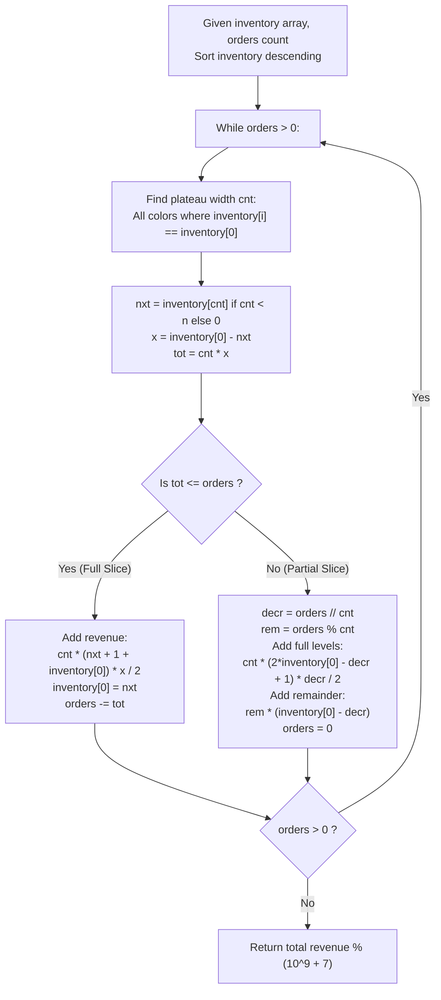

# Guided Example: Sell Diminishing-Valued Colored Balls

We trace the step-by-step descending plateau slicing and arithmetic progression summation for diminishing-valued inventory sales, prove the Water-Filling Plateau Leveling Theorem and Remainder Distribution Invariant, and calculate optimal sales revenues across representative problem instances:

- **Representative Instance 1 (Two-Stage Water-Filling Leveling):**
  - Input: `inventory = [2, 5], orders = 4`
  - Colors available: $2$ colors, with initial ball counts $2$ and $5$.
  - Total orders to fill: $4$ balls.
  - **Required Output:** `14`
  - Walkthrough:
    - Step 1: Max color has $5$ balls; next highest color has $2$ balls. Leveling from $5$ down to $2$ requires selling $5 - 2 = 3$ balls.
      - Ball values sold: $5, 4, 3$.
      - Value gained: $5 + 4 + 3 = 12$. Orders remaining: $4 - 3 = 1$.
    - Step 2: Both colors now have $2$ balls. Plateau width is $2$.
      - We need only $1$ ball. Sell $1$ ball of value $2$.
      - Value gained: $2$. Orders remaining: $0$.
    - Total Revenue: $12 + 2 = \mathbf{14}$.

- **Representative Instance 2 (Multi-Color Plateau Slice with Even Division):**
  - Input: `inventory = [3, 5], orders = 6`
  - Output: `19`
  - Level $5 \to 3$ (values $5, 4$, cost $2$ balls, revenue $9$, orders left $4$).
  - Level both colors from $3 \to 1$ (each sells values $3, 2$, cost $2 \times 2 = 4$ balls, revenue $2 \times (3 + 2) = 10$).
  - Total Revenue: $9 + 10 = \mathbf{19}$.

- **Representative Instance 3 (All Tied Uniform Inventory):**
  - Input: `inventory = [10, 10], orders = 5`
  - Plateau width is $2$.
  - Full decrements $decr = 5 // 2 = 2$ levels ($10, 9$ for each color: revenue $2 \times (10 + 9) = 38$).
  - Remainder: $5 \% 2 = 1$ ball sold at value $8$.
  - Total Revenue: $38 + 8 = \mathbf{46}$.

---

## 1. Instance & Teaching Goal

We have an inventory of colored balls. Selling a ball from a color that currently has $c$ balls earns profit $c$, after which that color has $c - 1$ balls remaining. Given an array `inventory` and an integer `orders`, determine the maximum total profit attainable from selling `orders` balls, modulo $10^9 + 7$.

```text
The Diminishing Value Rule & Greedy Optimality:
  At every decision point, to maximize profit, we MUST pick a ball of maximal current value!
  If we have colors with counts [5, 2], selling from the color with 5 yields profit 5,
  whereas selling from 2 yields only profit 2.
  Always sell balls at highest current value!

Why Simulation with a Max-Heap Fails (TLE):
  The parameter orders can be up to 10^9!
  Simulating ball-by-ball decrements takes O(orders * log K) operations.
  10^9 heap operations will take over 30 seconds and cause Time Limit Exceeded.

The Water-Filling Plateau Insight (Histogram Slicing):
  When multiple colors share the maximum count, they form a flat "plateau" of width cnt.
  Instead of selling one ball at a time, we slice the entire horizontal tier down to
  the next height nxt!
  Across cnt colors, reducing each color from H down to L + 1 sells:
    cnt * (H - L) balls,
  and the profit is cnt times the sum of an Arithmetic Progression:
    Sum = cnt * (H + L + 1) * (H - L) / 2.
  This evaluates up to 10^9 ball sales in O(K log K) total time!
```

The decisive pedagogical goal is the **Water-Filling Plateau Leveling Theorem & Arithmetic Progression Slicing Invariant**:
1. **Plateau Aggregation:** Colors tied at the current maximum height $H$ are grouped into a single batch of size $cnt$.
2. **Bulk Arithmetic Progression:** When $cnt \times (H - nxt) \le orders$, all tied colors are leveled down to $nxt$ simultaneously in $\mathcal{O}(1)$ time.
3. **Remainder Partitioning:** When remaining orders cannot complete a full level drop, integer division yields the uniform decrement $decr = \lfloor orders / cnt \rfloor$, and the remainder $orders \pmod{cnt}$ is distributed at the boundary value $H - decr$.

---

## 2. Conceptual Foundation & The Plateau Slicing Pipeline



### The Water-Filling Plateau Leveling Theorem

Let $c_1 \ge c_2 \ge \dots \ge c_k$ be the sorted inventory.
1. **Greedy Supremum Property:**
   Let $M = \max_{j} c_j$. The set of all balls available for sale partitions into values $v \in [1, M]$. By the rearrangement inequality and greedy choice property, maximizing the sum of $orders$ selected values requires selecting the $orders$ largest values across all colors.
2. **Arithmetic Progression Plateau Sum:**
   Suppose $cnt$ colors each have count $H$, and we decrement all $cnt$ colors down to $L$ (where $L \ge nxt$).
   The number of balls sold from each color is $\Delta = H - L$.
   For each color, the values sold form the arithmetic sequence:
   $$
   H, \; H - 1, \; H - 2, \; \dots, \; L + 1
   $$
   The sum of this sequence is:
   $$
   S_{\text{single}} = \frac{(H + (L + 1)) \times \Delta}{2}
   $$
   For all $cnt$ colors combined, the total value added is:
   $$
   S_{\text{batch}} = cnt \times \frac{(H + L + 1) \times (H - L)}{2}
   $$
3. **Partial Step Quotient and Remainder:**
   When $cnt \times (H - nxt) > orders$, we cannot reach $nxt$.
   We compute integer quotient $decr = \lfloor orders / cnt \rfloor$ and remainder $rem = orders \pmod{cnt}$.
   - Each of the $cnt$ colors sells $decr$ balls spanning $[H - decr + 1, \; H]$.
   - Exactly $rem$ colors each sell one additional ball of value $H - decr$.
   - Total balls sold: $cnt \times decr + rem = orders$, terminating the algorithm.

---

## 3. Step-by-Step Worked Execution

### Trace on Representative Instance 1 (`inventory = [2, 5]`, `orders = 4`)

Initial state:
- Sort `inventory` descending: $[5, 2]$. Length $n = 2$.
- Target: $orders = 4$, $ans = 0$.

#### Round 1: Processing First Plateau
- Determine plateau width:
  - $inventory[0] = 5$.
  - $inventory[1] = 2 \ne 5$.
  - Plateau width: $cnt = 1$.
- Next plateau height: $nxt = inventory[1] = 2$.
- Elevation drop: $x = 5 - 2 = 3$.
- Total balls in this full slice:
  $$
  tot = cnt \times x = 1 \times 3 = 3
  $$
- Capacity check: $tot = 3 \le orders = 4$.
- Full tier slice possible!
- Arithmetic progression sum:
  - First term: $a_1 = nxt + 1 = 2 + 1 = 3$.
  - Last term: $a_n = inventory[0] = 5$.
  - Sum per color: $\frac{(3 + 5) \times 3}{2} = \frac{8 \times 3}{2} = 12$.
  - Batch value added: $cnt \times 12 = 1 \times 12 = \mathbf{12}$.
- State update:
  - $ans \leftarrow 0 + 12 = 12$.
  - $orders \leftarrow 4 - 3 = 1$.
  - $inventory[0] \leftarrow 2$.
  - Array is now effectively $[2, 2]$.

#### Round 2: Processing Second Plateau
- Determine plateau width:
  - $inventory[0] = 2$.
  - Both elements have count $2 \implies cnt = 2$.
- Next plateau height: $nxt = 0$ (all colors exhausted).
- Elevation drop: $x = 2 - 0 = 2$.
- Total balls in full slice: $tot = cnt \times x = 2 \times 2 = 4$.
- Capacity check: $tot = 4 > orders = 1$.
- Full tier slice exceeds remaining orders! Partial slice executed:
  - Integer decrement:
    $$
    decr = \lfloor orders / cnt \rfloor = \lfloor 1 / 2 \rfloor = 0
    $$
  - Remainder balls:
    $$
    rem = orders \pmod{cnt} = 1 \pmod 2 = 1
    $$
  - Full level additions: $0$ (since $decr = 0$).
  - Remainder additions:
    $$
    rem \times (inventory[0] - decr) = 1 \times (2 - 0) = \mathbf{2}
    $$
- State update:
  - $ans \leftarrow 12 + 2 = \mathbf{14}$.
  - $orders \leftarrow 0$.

Loop terminates. Final output: **`14`**.

---

## 4. Complete Execution Trace

### State Progression Table for Representative Instance 1

| Round | Current Heights | Plateau Width $cnt$ | Next Height $nxt$ | Step Capacity $tot$ | Orders Remaining | Slice Type | Value Gained | Cumulative Revenue $ans$ |
|---|---|---|---|---|---|---|---|---|
| Start | $[5, 2]$ | — | — | — | $4$ | Init | $0$ | $0$ |
| 1 | $[5, 2]$ | $1$ | $2$ | $1 \times 3 = 3$ | $4 \to 1$ | Full Slice ($5 \to 2$) | $\frac{3+5}{2} \times 3 = 12$ | $12$ |
| 2 | $[2, 2]$ | $2$ | $0$ | $2 \times 2 = 4$ | $1 \to 0$ | Partial ($decr=0, rem=1$) | $1 \times 2 = 2$ | $\mathbf{14}$ |

---

## 5. Algorithmic Correctness

**Soundness.**
The algorithm always consumes balls from the highest available value tier. When multiple colors are tied at the maximum height, any one of them can provide a ball of that value. Slicing the plateau horizontally is mathematically identical to greedily popping from a max-heap, but executes in $\mathcal{O}(1)$ closed form per tier.

**Completeness.**
Because the plateau width $cnt$ strictly increases or stays the same at each step, the algorithm visits each color boundary at most once. The partial slice step handles any fractional remainder $orders < cnt$, guaranteeing that exactly $orders$ balls are sold.

---

## 6. Traps This Instance Exposes

- **Simulation Time Limit Exceeded:** Simulating $orders$ decrements one by one in $\mathcal{O}(orders \log K)$ fails because $orders$ can reach $10^9$.
- **64-bit Integer Multiplication Overflow:** The intermediate arithmetic product $(a_1 + a_n) \times x \times cnt$ can reach $10^9 \times 10^9 = 10^{18}$, which requires 64-bit unsigned/signed integers to avoid overflow prior to the modulo $10^9 + 7$ operation.
- **Remainder Distribution Off-by-One:** When $orders$ does not divide evenly by $cnt$, the remainder $rem = orders \pmod{cnt}$ balls must be sold at height $inventory[0] - decr$, NOT $nxt$.
- **Last Element Boundary:** When $cnt = n$ (all colors have merged into the plateau), $nxt$ must be set to $0$ to allow leveling down to complete exhaustion.

---

## 7. Complexity Derivation

- **Time Complexity:**
  - **Sorting:** Sorting $K$ elements takes $\mathcal{O}(K \log K)$ time, where $K = |inventory|$.
  - **Plateau Walking:** In each iteration, pointer $i$ advances to encompass more tied elements. Since $i$ advances monotonically from $0$ to $K$, the while loop runs at most $K$ times.
  - Each plateau step performs $\mathcal{O}(1)$ arithmetic operations.
  - Total Time: strictly $\mathcal{O}(K \log K)$, running in $< 40$ ms for $K \le 10^5$.
- **Auxiliary Space Complexity:**
  - Sorting takes $\mathcal{O}(\log K)$ or $\mathcal{O}(K)$ depending on language implementation.
  - Only scalar variables $ans, i, cnt, decr$ are maintained.
  - Total Auxiliary Space: $\mathcal{O}(1)$ auxiliary memory beyond the input array.
