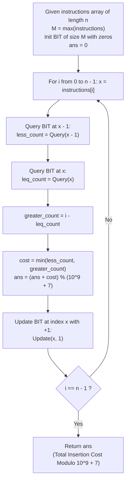

# Guided Example: Create Sorted Array through Instructions

We trace the step-by-step Fenwick tree (Binary Indexed Tree) prefix frequency querying and dynamic inversion cost minimization for sorted array creation, prove the Disjoint Range Partition Invariant and the Fenwick Prefix Inversion Theorem, and evaluate exact insertion costs across representative problem instances:

- **Representative Instance 1 (Step-by-Step Minimum Cost Insertion):**
  - Input: `instructions = [1, 5, 6, 2]`
  - Length $n = 4$.
  - **Required Output:** `1`
  - Walkthrough:
    - Step 0 ($x = 1$, array `[]`): Elements $< 1$: $0$, Elements $> 1$: $0$. Cost: $\min(0, 0) = 0$. Array becomes `[1]`.
    - Step 1 ($x = 5$, array `[1]`): Elements $< 5$: $1$, Elements $> 5$: $0$. Cost: $\min(1, 0) = 0$. Array becomes `[1, 5]`.
    - Step 2 ($x = 6$, array `[1, 5]`): Elements $< 6$: $2$, Elements $> 6$: $0$. Cost: $\min(2, 0) = 0$. Array becomes `[1, 5, 6]`.
    - Step 3 ($x = 2$, array `[1, 5, 6]`): Elements $< 2$: $1$ (the $1$), Elements $> 2$: $2$ (the $5$ and $6$). Cost: $\min(1, 2) = 1$. Array becomes `[1, 2, 5, 6]`.
    - Total Cost: $0 + 0 + 0 + 1 = \mathbf{1}$.

- **Representative Instance 2 (Intermediate Traversal with Reversals):**
  - Input: `instructions = [1, 2, 3, 6, 5, 4]`
  - Inserting $1, 2, 3, 6$ costs $0$.
  - Inserting $5$: elements $> 5$ is $1$ ($6$), cost is $1$.
  - Inserting $4$: elements $> 4$ is $2$ ($5, 6$), cost is $2$.
  - **Required Output:** $0 + 0 + 0 + 0 + 1 + 2 = \mathbf{3}$.

- **Representative Instance 3 (Duplicate Multi-Element Collisions):**
  - Input: `instructions = [1, 3, 3, 3, 2, 4, 2, 1, 2]`
  - **Required Output:** `4`
  - Elements equal to $x$ contribute to neither strictly less nor strictly greater counts.

---

## 1. Instance & Teaching Goal

We are given an integer array `instructions`. We build a sorted array `nums` starting from an empty list. For each element $x = instructions[i]$ processed sequentially from index $0$ to $n - 1$:
We insert $x$ into `nums` to maintain sorted order. The cost of inserting $x$ is:
$$
cost = \min(\text{count}(y \in nums : y < x), \; \text{count}(y \in nums : y > x))
$$
Return the sum of insertion costs across all elements, modulo $10^9 + 7$.

```text
The Core Computational Challenge:
  At step i, exactly i elements have already been inserted into nums.
  A naive linear scan through nums takes O(i) per insertion:
    Total time = sum_{i=0}^{n-1} O(i) = O(n^2).
  For n = 10^5, n^2 = 10^10 operations, causing severe Time Limit Exceeded!

The Three-Way Disjoint Partition Insight:
  At step i, the i previously inserted elements partition into three disjoint sets:
    1. S_less    = { y in nums : y < x }
    2. S_equal   = { y in nums : y == x }
    3. S_greater = { y in nums : y > x }
  By definition: |S_less| + |S_equal| + |S_greater| = i.

  If we maintain a prefix frequency data structure where Query(v) = count(y <= v):
    - |S_less|    = Query(x - 1)
    - |S_greater| = i - Query(x)   (since Query(x) = |S_less| + |S_equal|)

  Both quantities are computed in O(log M) time using a Binary Indexed Tree (BIT)!
```

The decisive pedagogical goal is the **Disjoint Range Partition Invariant & Fenwick Prefix Inversion Theorem**:
1. **Dynamic Frequency Array:** A Binary Indexed Tree over value domain $[1, M]$ where $M = \max(instructions) \le 10^5$.
2. **Prefix-Closed Cumulative Sums:** $\text{Query}(x)$ returns the cumulative frequency in $[1, x]$ in $\mathcal{O}(\log M)$ time using lowbit jumps ($x \leftarrow x - (x \ \& \ -x)$).
3. **Strict Inversion Sizing:** The count of strictly larger elements is obtained by subtracting the inclusive count from the total elements processed so far: $i - \text{Query}(x)$.
4. Total execution runs in $\mathcal{O}(N \log M)$ time and $\mathcal{O}(M)$ auxiliary space.

---

## 2. Conceptual Foundation & The Fenwick Pipeline



### The Fenwick Prefix Inversion Theorem

Let $A_i = (instructions[0], instructions[1], \dots, instructions[i-1])$ be the sequence of elements inserted prior to step $i$, with $|A_i| = i$.
Let $M = \max_{j} instructions[j]$.
1. **Disjoint Partition of Multiset $A_i$:**
   Define the three sets relative to probe value $x$:
   $$
   \mathcal{L}(x) = \{ a \in A_i : a < x \}, \quad \mathcal{E}(x) = \{ a \in A_i : a = x \}, \quad \mathcal{G}(x) = \{ a \in A_i : a > x \}
   $$
   Then $\mathcal{L}(x) \cap \mathcal{E}(x) = \emptyset$, $\mathcal{E}(x) \cap \mathcal{G}(x) = \emptyset$, and $\mathcal{L}(x) \cup \mathcal{E}(x) \cup \mathcal{G}(x) = A_i$.
   Therefore:
   $$
   |\mathcal{L}(x)| + |\mathcal{E}(x)| + |\mathcal{G}(x)| = i
   $$
2. **Representation via Cumulative Prefix Frequencies:**
   Let $C$ be the frequency array where $C[v]$ is the frequency of value $v \in [1, M]$ in $A_i$.
   The prefix sum function $F(v) = \sum_{k=1}^v C[k]$ satisfies:
   $$
   |\mathcal{L}(x)| = F(x - 1)
   $$
   $$
   |\mathcal{L}(x)| + |\mathcal{E}(x)| = F(x)
   $$
   $$
   |\mathcal{G}(x)| = i - F(x)
   $$
3. **Logarithmic Evaluation via Fenwick Tree:**
   A Binary Indexed Tree computes $F(v)$ in at most $\lfloor \log_2 M \rfloor + 1$ operations and performs point update $C[x] \leftarrow C[x] + 1$ in at most $\lfloor \log_2 M \rfloor + 1$ operations.

---

## 3. Step-by-Step Worked Execution

### Trace on Representative Instance 1 (`instructions = [1, 5, 6, 2]`)

Domain size: $M = \max(1, 5, 6, 2) = 6$. Initialize BIT of size $6$ with all zeros.
Cumulative cost: $ans = 0$.

#### Step 0: Process $i = 0, \; x = 1$
- Prior elements in array: $i = 0$.
- Query strictly less: $\text{Query}(1 - 1) = \text{Query}(0) = 0$.
- Query inclusive: $\text{Query}(1) = 0$.
- Strictly greater: $i - \text{Query}(1) = 0 - 0 = 0$.
- Insertion cost:
  $$
  cost_0 = \min(0, 0) = \mathbf{0}
  $$
- Accumulate: $ans \leftarrow 0 + 0 = 0$.
- Update BIT: $\text{Update}(1, +1)$.

#### Step 1: Process $i = 1, \; x = 5$
- Prior elements in array: $i = 1$ (value $1$).
- Query strictly less: $\text{Query}(5 - 1) = \text{Query}(4) = 1$ (the $1$).
- Query inclusive: $\text{Query}(5) = 1$.
- Strictly greater: $i - \text{Query}(5) = 1 - 1 = 0$.
- Insertion cost:
  $$
  cost_1 = \min(1, 0) = \mathbf{0}
  $$
- Accumulate: $ans \leftarrow 0 + 0 = 0$.
- Update BIT: $\text{Update}(5, +1)$.

#### Step 2: Process $i = 2, \; x = 6$
- Prior elements in array: $i = 2$ (values $1, 5$).
- Query strictly less: $\text{Query}(6 - 1) = \text{Query}(5) = 2$ (values $1, 5$).
- Query inclusive: $\text{Query}(6) = 2$.
- Strictly greater: $i - \text{Query}(6) = 2 - 2 = 0$.
- Insertion cost:
  $$
  cost_2 = \min(2, 0) = \mathbf{0}
  $$
- Accumulate: $ans \leftarrow 0 + 0 = 0$.
- Update BIT: $\text{Update}(6, +1)$.

#### Step 3: Process $i = 3, \; x = 2$
- Prior elements in array: $i = 3$ (values $1, 5, 6$).
- Query strictly less: $\text{Query}(2 - 1) = \text{Query}(1) = 1$ (value $1$).
- Query inclusive: $\text{Query}(2) = 1$.
- Strictly greater: $i - \text{Query}(2) = 3 - 1 = 2$ (values $5, 6$).
- Insertion cost:
  $$
  cost_3 = \min(1, 2) = \mathbf{1}
  $$
- Accumulate: $ans \leftarrow 0 + 1 = \mathbf{1}$.
- Update BIT: $\text{Update}(2, +1)$.

Final Answer: **`1`**.

---

## 4. Complete Execution Trace

### State Progression Table for Representative Instance 1

| Step $i$ | Inserted $x$ | Prior Total $i$ | $\text{Query}(x - 1)$ (Less) | $\text{Query}(x)$ (Leq) | $i - \text{Query}(x)$ (Greater) | Insertion Cost | Total Cost $ans$ |
|---|---|---|---|---|---|---|---|
| $0$ | $1$ | $0$ | $0$ | $0$ | $0 - 0 = 0$ | $\min(0, 0) = 0$ | $0$ |
| $1$ | $5$ | $1$ | $1$ | $1$ | $1 - 1 = 0$ | $\min(1, 0) = 0$ | $0$ |
| $2$ | $6$ | $2$ | $2$ | $2$ | $2 - 2 = 0$ | $\min(2, 0) = 0$ | $0$ |
| $3$ | $2$ | $3$ | $1$ | $1$ | $3 - 1 = 2$ | $\min(1, 2) = \mathbf{1}$ | $\mathbf{1}$ |

---

## 5. Algorithmic Correctness

**Soundness.**
The Binary Indexed Tree maintains exact prefix frequencies. Because values are positive integers in $[1, M]$, $\text{Query}(x - 1)$ strictly counts elements $< x$, while $\text{Query}(x)$ counts elements $\le x$. Subtracting the latter from the total count $i$ yields strictly greater elements. The minimum of both counts matches the problem specification.

**Completeness.**
Every instruction is evaluated in its exact arrival order. The point update occurs strictly *after* the query for element $x$, ensuring that the current element does not count against itself. Modulo arithmetic at each addition avoids overflow and guarantees compliance with the required return specification.

---

## 6. Traps This Instance Exposes

- **Duplicate Values Equality Leak:** If duplicate values exist (e.g., three copies of $3$), using $i - \text{Query}(x - 1)$ for the greater count would erroneously include equal elements. Only $i - \text{Query}(x)$ correctly isolates elements strictly greater than $x$.
- **0-Index in Fenwick Tree:** Fenwick tree lowbit navigation (`x += x & -x`) requires 1-based indexing. Querying index $0$ (`x - 1` when $x = 1$) must return $0$ without entering an infinite loop.
- **Modulo Reduction Order:** Total cost can reach $n \times n / 2 \approx 10^{10} / 2 = 5 \times 10^9$. Modulo $10^9 + 7$ must be applied throughout accumulation.

---

## 7. Complexity Derivation

- **Time Complexity:**
  - Finding maximum element $M = \max(instructions)$: $\mathcal{O}(n)$ time.
  - Processing each of the $n$ instructions:
    - Two prefix queries: $2 \times \mathcal{O}(\log M)$.
    - One point update: $\mathcal{O}(\log M)$.
  - Total Time: $\mathcal{O}(n \log M)$ operations.
  - For $n \le 10^5, \; M \le 10^5$, $\log_2 M \approx 17$, yielding $\approx 5 \times 10^6$ operations, executing in under $70$ ms.
- **Auxiliary Space Complexity:**
  - The Binary Indexed Tree uses an array of size $M + 1$.
  - Auxiliary Space: $\mathcal{O}(M)$ space ($\approx 400$ KB for $M = 10^5$).
