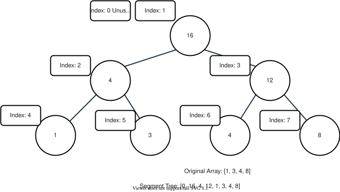
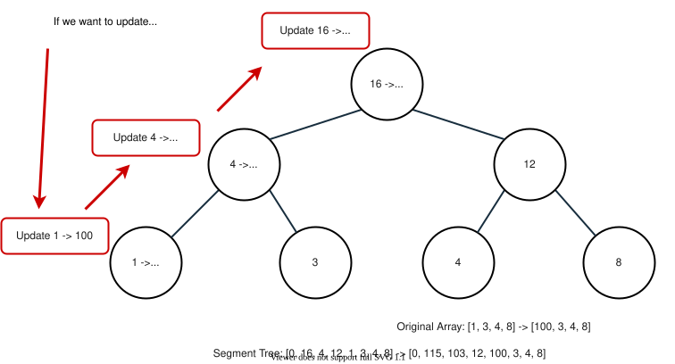
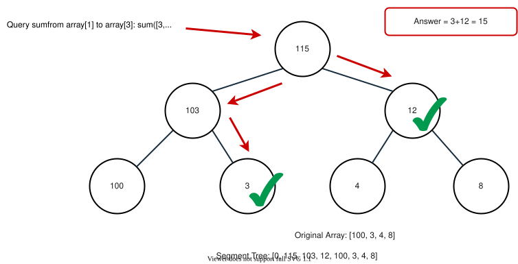
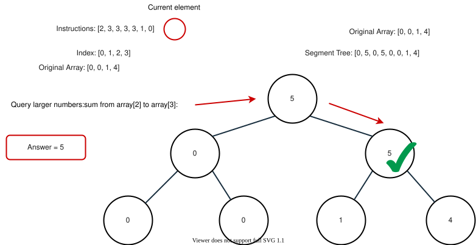
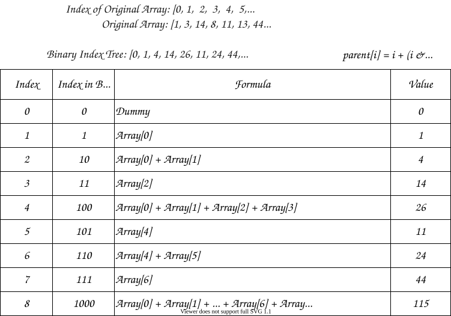
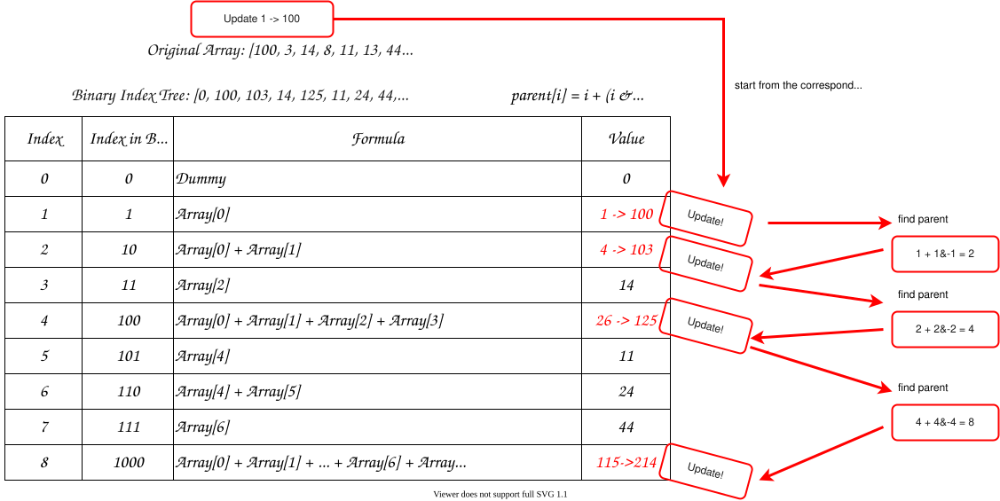
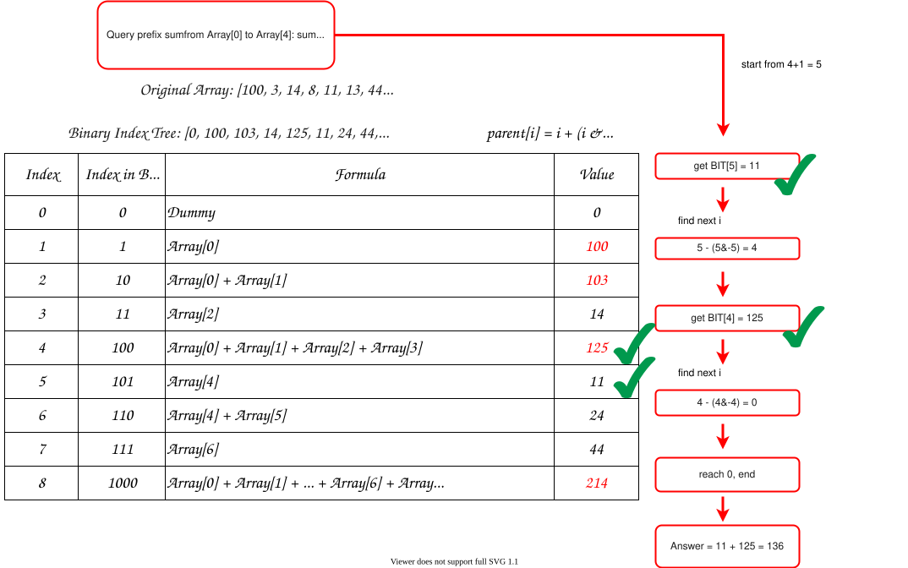
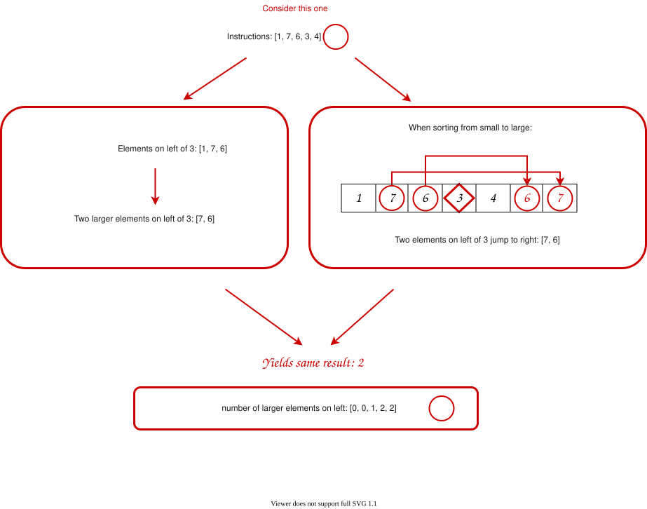
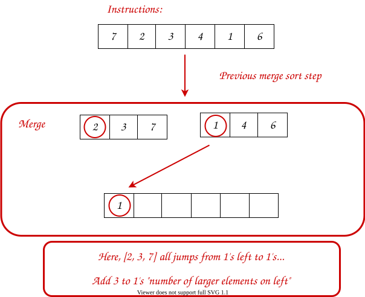

## Solution

---

#### Overview

The problem is straightforward. We need to obtain the cost of inserting each element in sorted order and return the total cost.

How to determine the cost? According to the description, we need to find the number of elements on the left side strictly less/larger than the current element.

One natural idea is to maintain a sorted array and search with [Binary Search](https://leetcode.com/explore/learn/card/binary-search/). However, the array insertion takes $\mathcal{O}(M)$, given that $M$ is the length of the array, which is too slow. We need something quicker.

Luckily, there are two helpful and fast data structures: Segment Tree and Binary Indexed Tree.

Also, if one is not familiar with those trees, a solution of simple modifications on [Merge Sort](https://en.wikipedia.org/wiki/Merge_sort) is available.

Below, we will discuss three approaches: *Segment Tree*, *Binary Indexed Tree*, and *Merge Sort*.

At the end of the article, in *Extra* part, we will present some interesting relevant facts that may not be useful in the interview though. We leave that for interested readers.

---

#### Approach 1: Segment Tree

**Intuition**

Since we already have some great explanations on [Segment Tree](https://en.wikipedia.org/wiki/Segment_tree), here we will not provide a detailed explanation of implementation. You can find some comprehensive tutorials on [Recursive Approach to Segment Trees](https://leetcode.com/articles/a-recursive-approach-to-segment-trees-range-sum-queries-lazy-propagation/) or [Range Sum Query - Mutable](https://leetcode.com/problems/range-sum-query-mutable/solution/).

Now, we will have a quick review of the segment tree and then explain how we can use it to tackle our problem.

As we know, segment tree is a data structure used for storing information about intervals. Given that $M$ is the size of the tree, this data structure allows us to `query` and to `update` the information about a certain interval in $\mathcal{O}(\log(M))$ time.

Take the segment tree for querying interval **sum** for an example:



Usually, we store the tree in an array. We need twice the size of the original array to store the segment tree.

Here, we leave the index `0` unused for the convenience of indexing. You can also choose to use it by shifting the whole tree one unit left. In our approach, the left and right children of node `i` are `2*i` and `2*i+1` respectively.

Given that `m` is the size of the original array, from the node `m` to node $2*m - 1$, we store the original array itself. For other nodes, we store the value of node `i` as the sum of node `2*i` and node `2*i+1`.

The segment tree allows us to `query` the **sum** of a certain interval and to `update` the values of elements. It should be able to process both actions in $\mathcal{O}(\log(M))$ time. Let's see some examples.

*Updating Value*

For `update`, what we do is simple. Just update the value from the leaf to the root. For instance:



*Querying Sum*

For `query`, the case is a bit complicated. Generally speaking, we are dividing the target interval into a few pre-calculated segments to reduced run time. For example:



OK. Now back to our problem. We need to find the cost of each element. How can we use the segment tree?

Using some idea from [Bucket](https://en.wikipedia.org/wiki/Bucket_(computing)), we can store the **occurrence number** of values in a bucket array. Then, by querying the interval sum for the current value to the maximum value, we obtain the number of larger elements.

To give you an idea, consider this case: `instructions` is `[2, 3, 3, 3, 3, 1, 0]`, and we are processing element $\text{instructions}[5] = 1$. When we want to query the number of larger elements, we want to query the sum from `2` to the largest value `3` (i.e., the sum on the right of value `1` in Segment Tree):



Updating the segment tree is also easy. We just need to add `1` to the node of the current element and all the path up to the root.

**Algorithm**

*Step 1:* Implement the Segment Tree. Since the tree is initialized to all zeros, only `update` and `query` needs to be implemented.

*Step 2:* Iterate over `instructions`. For each element:

- Calculate the left cost (smaller cost) and right cost (larger cost).
- Add the minimal one to the total cost.
- Update the element into the Segment Tree.

*Step 3:* Return the total cost after iteration.

> Challenge: Can you implement the code yourself without seeing our implementations?

**Implementation**

```python
class Solution:
    def createSortedArray(self, instructions: List[int]) -> int:
        # implement Segment Tree
        def update(index, value, tree, m):
            index += m
            tree[index] += value
            while index > 1:
                index >>= 1
                tree[index] = tree[index << 1] + tree[(index << 1)+1]

        def query(left, right, tree, m):
            result = 0
            left += m
            right += m
            while left < right:
                if left & 1:
                    result += tree[left]
                    left += 1
                left >>= 1
                if right & 1:
                    right -= 1
                    result += tree[right]
                right >>= 1
            return result

        MOD = 10**9+7
        m = max(instructions)+1
        tree = [0]*(2*m)
        cost = 0
        for x in instructions:
            left_cost = query(0, x, tree, m)
            right_cost = query(x+1, m, tree, m)
            cost += min(left_cost, right_cost)
            update(x, 1, tree, m)
        return cost % MOD
```

**Complexity Analysis**

Let $N$ be the length of `instructions` and $M$ be the maximum value in `instructions`.

* Time Complexity: $\mathcal{O}(N\log(M))$. We need to iterate over `instructions`, and for each element, the time to find the left cost and right cost is $\mathcal{O}(\log(M))$, and we spend $\mathcal{O}(\log(M))$ inserting the current element into the Segment Tree. In total, we need $\mathcal{O}(N \cdot \log(M)) = \mathcal{O}(N\log(M))$.

* Space Complexity: $\mathcal{O}(M)$, since we need an array of size $2M$ to store Segment Tree.

---

#### Approach 2: Binary Indexed Tree (BIT)

**Intuition**

[Binary indexed tree](https://en.wikipedia.org/wiki/Fenwick_tree) (or Fenwick Tree, BIT) is a data structure similar to the segment tree that maintains information about the **prefix**.

Compared with the segment tree, BIT has smaller space complexity and faster performance (same complexity but smaller constant) but lower expandability. For example, it is hard for BIT to address the interval minimum problem while the segment tree can easily handle it.

You can find some relevant tutorials on [Reverse Pairs](https://leetcode.com/problems/reverse-pairs/solution/) or [Range Sum Query 2D - Mutable](https://leetcode.com/problems/range-sum-query-2d-mutable/solution/).

Now, we will have a quick review of BIT and then explain how we can use it to tackle our problem.

Like the segment tree, BIT empowers us to `update` the values of elements and to `query` the information from node `0` to node `i`. It can answer both actions in $\mathcal{O}(\log(M))$ time, given that the size of BIT is $\mathcal{O}(M)$.

For intuitive understanding, it is not recommended to view BIT as a tree but as an **array** with parents relationship for beginners.

Take the BIT for querying prefix **sum** for an example.



We construct this relationship: the parent of node `i` is node $i + (i \& -i)$, where `&` is the bitwise AND operator.

> In fact, $i \& -i$ have some connections to the position of the rightmost $1$ in binary form counting from right. Say, the position of the rightmost $1$ in binary representation of $i$ is $k$, and then we have $i \& -i = 2^{k-1}$.
>
> For example, the base-2 form of $6$ is $110$, the position of the rightmost $1$ is in the **second** position counting from right. We have $6 \& -6 = 2^{2-1} = 2$.
>
> Also, $2^{k-1}$ represents the number of elements adding up. For instance, $\text{BIT}[6] = \text{arr}[4] + \text{arr}[5]$, which consists of **two** elements: $\text{arr}[4]$ and $\text{arr}[5]$.

When building BIT, we initialize the array `BIT` of length $M+1$, where $M$ is the size of the original array.

We use index `0` as a dummy node for the convenience of indexing. Then for each element $\text{arr}[j]$ in original array `arr`, we put it in `BIT[j+1]`. Also, we maintain `BIT` such that the value of every node is the sum of the values of its children. Therefore, we add $\text{arr}[j]$ all the path from `BIT[j+1]` to the root in `BIT`.

Similarly, `update` and `query` are available in BIT. Let's check the detail.

*Updating Value*

It is easy to `update` an element. For instance, if we need to `update` `1` to `100` in the last example:



*Querying Sum*

For `query`, it is also simple. Say, if we want to calculate the prefix sum to $\text{arr}[j]$. We need to initialize `i` to `j+1`, and then add $\text{BIT}[i]$ to the query answer. After that, replace `i` to $i - (i \& -i)$, and then add new $\text{BIT}[i]$, until `i` reaches `0`.

For example, if we need to sum up from $\text{arr}[0]$ to $\text{arr}[4]$:



> Note that BIT only supports prefix information querying, so we can only query from start to a certain element, not any interval.

OK. Now back to our problem. How can we use BIT to resolve this problem?

Similar to *Approach 1*, we store the **occurrence number** of values in an array. Then, by querying the interval sum for the current value to the maximum value, we obtain the number of larger elements.

Updating the BIT is also easy. We just need to add `1` to the node of the current element and add other corresponding nodes.

**Algorithm**

*Step 1:* Implement the Binary Indexed Tree. Since the tree is initialized to all zeros, only `update` and `query` is needed to implement.

*Step 2:* Iterate over `instructions`. For each element:

- Calculate the left cost (smaller cost) and right cost (larger cost).
- Add the minimal one to the total cost.
- Update the element into the Binary Indexed Tree.

*Step 3:* Return the total cost after iteration.

> Challenge: Can you implement the code yourself without seeing our implementations?

**Implementation**

```python
class Solution:
    def createSortedArray(self, instructions: List[int]) -> int:
        # implement Binary Index Tree
        def update(index, value, bit, m):
            index += 1
            while index < m:
                bit[index] += value
                index += index & -index

        def query(index, bit):
            index += 1
            result = 0
            while index >= 1:
                result += bit[index]
                index -= index & -index
            return result

        MOD = 10**9+7
        m = max(instructions)+2
        bit = [0]*m
        cost = 0

        n = len(instructions)
        for i in range(n):
            left_cost = query(instructions[i]-1, bit)
            right_cost = i - query(instructions[i], bit)
            cost += min(left_cost, right_cost)
            update(instructions[i], 1, bit, m)
        return cost % MOD
```

**Complexity Analysis**

Let $N$ be the length of `instructions` and $M$ be the maximum value in `instructions`.

* Time Complexity: $\mathcal{O}(N\log(M))$. We need to iterate over `instructions`, and for each element, the time to find the left cost and right cost is $\mathcal{O}(\log(M))$, and we spend $\mathcal{O}(\log(M))$ inserting the current element into the BIT. In total, we need $\mathcal{O}(N \cdot \log(M)) = \mathcal{O}(N\log(M))$.

* Space Complexity: $\mathcal{O}(M)$, since we need an array of size $\mathcal{O}(M)$ to store BIT.

---

#### Approach 3: Merge Sort

**Intuition**

In fact, this problem is a kind of extension of the original [Count of Smaller Numbers After Self](https://leetcode.com/problems/count-of-smaller-numbers-after-self/). They are similar except we need both smaller and larger ones on the left.

Inspired from the approach of the original problem, a simple modification of merge sort will help us address this problem. Let's see the idea.

Without loss of generality, consider larger ones on the left first.

If you consider the process of sorting, you will find out a useful insight:

> The larger elements on the left of a number are exactly those that **jump from its left to its right** during a stable sort.

For example, consider when $instructions = [1, 7, 6, 3, 4]$ and we want to calculate the number of larger elements on the left of $\text{instructions}[3] = 3$:



> We use the term **stable** sort here since we do not want to count the jumping of adjacent elements with the same values. We want to keep them as what they are.

Therefore, we want to record the jumping numbers when sorting.

But which sorting method? Well, many sorting methods can do it. Here, we pick merge sort for an example.

Merge sort is simple: split the array into two parts, recursively call merge sort on each part, and then merge two parts.

Note that in the "merge" step what we do is exactly deciding which element goes left and which element goes right. We can record the jumping number when merging.

For instance, consider when $instructions = [7, 2, 3, 4, 1, 6]$ and we already have divided it into two parts and sorted them: `[2, 3, 7]` and `[1, 4, 6]`. Now we need to merge those two parts:



When we decide that we should put the number in the second array, all elements remaining in the first array are jumping from left to right. What we need to do is to add the length of the first array.

The case of smaller ones is similar. We can record the number of elements that **stay** on left after sorting. To avoid counting those with the same value, we need a totally unstable sort here (i.e., adjacent same values become reversed order).

> Alternatively, you can stably sort them from large to small, and record those jump from left to right.

> However, one should notice that this approach may be slower than previous approaches since we do merge sort twice to solve the larger case and smaller case respectively.

**Algorithm**

*Step 1:* Initialize `larger` array and `smaller` array, which store the number of elements on left strictly larger and smaller than the current element, respectively.

*Step 2:* Implement two merge sort function: `sortLarger`and ``sortSmaller``.

- For `sortLarger`, we perform a stable merge sort. When merging, we record the number of elements jumping from left to right.
- For `sortSmaller`, we perform a totally unstable merge sort. When merging, we record the number of elements staying on left.

*Step 3:* Iterate over `instructions`. For each element:

- Add the minimal of $\text{smaller}[i]$ and $\text{larger}[i]$ to the total cost.
- Update the element into the Binary Indexed Tree.

*Step 3:* Return the total cost after iteration.

> Challenge: Can you implement the code yourself without seeing our implementations?

**Implementation**

```python
class Solution:
    def createSortedArray(self, instructions: List[int]) -> int:
        n = len(instructions)
        smaller = [0]*n
        larger = [0]*n
        temp = [0]*n  # record some temporal information

        def sort_smaller(arr, left, right):
            if left == right:
                return
            mid = (left + right) // 2
            sort_smaller(arr, left, mid)
            sort_smaller(arr, mid+1, right)
            merge_smaller(arr, left, right, mid)

        def merge_smaller(arr, left, right, mid):
            # merge [left, mid] and [mid+1, right]
            i = left
            j = mid+1
            k = left
            # use temp[left...right] to temporarily store sorted array
            while i <= mid and j <= right:
                if arr[i][0] < arr[j][0]:
                    temp[k] = arr[i]
                    k += 1
                    i += 1
                else:
                    temp[k] = arr[j]
                    smaller[arr[j][1]] += i - left
                    k += 1
                    j += 1

            while i <= mid:
                temp[k] = arr[i]
                k += 1
                i += 1
            while j <= right:
                temp[k] = arr[j]
                smaller[arr[j][1]] += i - left
                k += 1
                j += 1
            # restore from temp
            for i in range(left, right+1):
                arr[i] = temp[i]

        def sort_larger(arr, left, right):
            if left == right:
                return
            mid = (left + right) // 2
            sort_larger(arr, left, mid)
            sort_larger(arr, mid+1, right)
            merge_larger(arr, left, right, mid)

        def merge_larger(arr, left, right, mid):
            # merge [left, mid] and [mid+1, right]
            i = left
            j = mid+1
            k = left
            # use temp[left...right] to temporarily store sorted array
            while i <= mid and j <= right:
                if arr[i][0] <= arr[j][0]:
                    temp[k] = arr[i]
                    k += 1
                    i += 1
                else:
                    temp[k] = arr[j]
                    larger[arr[j][1]] += mid - i + 1
                    k += 1
                    j += 1

            while i <= mid:
                temp[k] = arr[i]
                k += 1
                i += 1
            while j <= right:
                temp[k] = arr[j]
                larger[arr[j][1]] += mid - i + 1
                k += 1
                j += 1
            # restore from temp
            for i in range(left, right+1):
                arr[i] = temp[i]

        MOD = 10**9+7
        cost = 0

        arr_smaller = [[v, i] for i, v in enumerate(instructions)]
        arr_larger = [[v, i] for i, v in enumerate(instructions)]

        sort_smaller(arr_smaller, 0, n-1)
        sort_larger(arr_larger, 0, n-1)

        for i in range(n):
            cost += min(smaller[i], larger[i])
        return cost % MOD
```

Note:

- In C++ code, we used a raw array instead of `vector` to avoid TLE. However, in most cases, `vector` should be preferred since it has more functions and is safer than the array.
- The Python version is likely to yield a TLE since Python itself is slow. This time limit may be extended in the future.

**Complexity Analysis**

Let $N$ be the length of `instructions`.

* Time Complexity: $\mathcal{O}(N\log(N))$. We need to perform $\mathcal{O}(N\log(N))$ merge sort twice. All other operations take no more than $\mathcal{O}(N)$.

* Space Complexity: $\mathcal{O}(N)$, since we need constant number of arrays of size $\mathcal{O}(N)$.

---

#### Extra

**1. Order Statistic Tree**

In fact, what we do in *Approach 1* and *Approach 2* is implementing an [Order Statistic Tree](https://en.wikipedia.org/wiki/Order_statistic_tree) interface with different implementations. The wiki page also gives us another implementation, but that requires extra code and we leave that for interested readers.

**2. The $\mathcal{O}(N^2)$ Python Approach**

Though Python itself is slow, its many built-in functions are written in C which is fast. As a result, sometimes the built-in functions are faster than our manual implementation, even with larger time complexity.

In this case, maintaining a sorted list with `bisect` is sometimes faster than the Segment Tree Approach in the current data scale.

```python
class Solution:
    def createSortedArray(self, instructions: List[int]) -> int:
        MOD = 10**9+7
        current = []
        cost = 0
        for x in instructions:
            left_cost = bisect.bisect_left(current, x)
            right_cost = len(current) - bisect.bisect_right(current, x)
            cost += min(left_cost, right_cost)
            bisect.insort(current, x)
            cost %= MOD
        return cost % MOD
```

**3. The $\mathcal{O}(N\log(N))$ built-in Python Approach**

Python is an interesting language with many useful libraries. In a third-party library `sortedcontainers`, we have a `SortedList` that supports update in $\mathcal{O}(\log(N))$, given that $N$ is the length of the sorted list.

You can check the implementation detail in its [official docs](http://www.grantjenks.com/docs/sortedcontainers/implementation.html). In short, it implements a Segment-Tree-like structure.

```python
from sortedcontainers import SortedList

class Solution:
    def createSortedArray(self, instructions: List[int]) -> int:
        sorted_list = SortedList()
        MOD = 10**9+7
        cost = 0

        size = len(instructions)
        for i in range(size):
            left_cost = sorted_list.bisect_left(instructions[i])
            right_cost = i - sorted_list.bisect_right(instructions[i])
            cost += min(left_cost, right_cost)
            sorted_list.add(instructions[i])
        return cost % MOD
```

**4. The $\mathcal{O}(N\sqrt{N})$ Approach**

Though with larger time complexity, this approach can be solved with *Sqrt Decomposition*. We will not introduce it in detail since it yields TLE for this problem.

Generally speaking, what we do is to split the sorted list into $\mathcal{O}(\sqrt{N})$ sublists of size $\mathcal{O}(\sqrt{N})$, and we only need to spend $\mathcal{O}(\sqrt{N})$ on insertion. Interested readers can check [Range Sum Query - Mutable](https://leetcode.com/problems/range-sum-query-mutable/solution/) for some idea.

Thanks for reading!