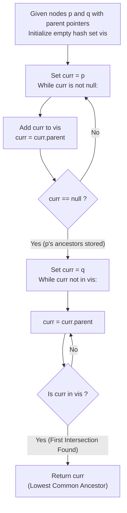

# Guided Example: Lowest Common Ancestor of a Binary Tree III

We trace the step-by-step upward ancestor chain traversal and linked-list intersection duality for binary tree nodes equipped with parent pointers, prove the Ancestor Chain Confluence Theorem and the Upward Minimality Invariant, and evaluate exact lowest common ancestors across representative problem instances:

- **Representative Instance 1 (Disjoint Branches Merging at Root):**
  - Binary Tree: Root $3$, with left child $5$ and right child $1$.
  - Query nodes: $p = 5, \; q = 1$.
  - Parent pointers: $p.parent = 3, \; q.parent = 3, \; 3.parent = null$.
  - **Required Output:** `3`
  - Upward ancestor chain of $p$: $5 \to 3$.
  - Upward ancestor chain of $q$: $1 \to 3$.
  - First common node: $3$.

- **Representative Instance 2 (Direct Ancestor-Descendant Hierarchy):**
  - Binary Tree: Node $5$ has child $2$, which has child $4$. Node $3$ is parent of $5$.
  - Query nodes: $p = 5, \; q = 4$.
  - Upward chain from $p$: $5 \to 3$.
  - Upward chain from $q$: $4 \to 2 \to 5 \to 3$.
  - First common node encountered: **`5`** (since a node is allowed to be an ancestor of itself).
  - **Required Output:** `5`.

- **Representative Instance 3 (Base Two-Node Tree):**
  - Binary Tree: Root $1$, with single child $2$.
  - Query nodes: $p = 1, \; q = 2$.
  - **Required Output:** `1`.

---

## 1. Instance & Teaching Goal

Given two nodes `p` and `q` of a binary tree where each node contains a reference to its `parent` (with `root.parent = null`), find their Lowest Common Ancestor (LCA). Both nodes are guaranteed to exist in the same binary tree.

```text
The Structural Transformation: Tree Search to Linked-List Intersection
  In standard LCA (without parent pointers):
    We must start at the root and search downward across the entire tree: O(N) work.

  WITH PARENT POINTERS:
    Every node u has exactly ONE parent.
    Following parent pointers upward defines a simple linear sequence:
      u --> parent(u) --> parent(parent(u)) --> ... --> root --> null
    This is an ordinary singly linked list terminating at the root!

  The problem of finding the LCA of p and q is MATHEMATICALLY IDENTICAL
  to finding the intersection node of two singly linked lists!
```

The decisive pedagogical goal is the **Ancestor Chain Confluence Theorem & Upward Minimality Invariant**:
1. **Unambiguous Upward Walk:** Each node has a unique parent, producing a deterministic path from any node to the root.
2. **Chain Suffix Sharing:** Since $p$ and $q$ belong to the same tree, their upward chains must merge and remain identical through the root.
3. **First Intersection is Lowest:** Traversing upward from $q$ visits ancestors in strictly non-decreasing depth order; the very first node shared with $p$'s chain is guaranteed to be the lowest common ancestor.
4. Total execution runs in $\mathcal{O}(h)$ time, where $h$ is the tree height.

---

## 2. Conceptual Foundation & The Confluence Pipeline



### The Ancestor Chain Confluence Theorem

Let $T = (V, E)$ be a rooted tree, and let $p, q \in V$.
For any node $u \in V$, define the upward ancestor chain $\mathcal{C}(u) = (u_0, u_1, \dots, u_k)$ where $u_0 = u$, $u_{j+1} = u_j.parent$, and $u_k = \text{root}$.
1. **Linear Path Topology:**
   Because every node except the root has in-degree $1$ in the parent-pointer directed graph, $\mathcal{C}(u)$ is a simple path with strictly decreasing depth: $\text{depth}(u_{j+1}) = \text{depth}(u_j) - 1$.
2. **Common Ancestor Suffix:**
   Since $p$ and $q$ belong to the same tree, $\text{root} \in \mathcal{C}(p) \cap \mathcal{C}(q)$.
   Because each node has a unique parent, if $u \in \mathcal{C}(p) \cap \mathcal{C}(q)$, then all ancestors of $u$ also belong to $\mathcal{C}(p) \cap \mathcal{C}(q)$. Thus, the intersection $\mathcal{C}(p) \cap \mathcal{C}(q)$ is a contiguous suffix ending at $\text{root}$.
3. **Minimality of First Intersection:**
   The Lowest Common Ancestor is the unique node in $\mathcal{C}(p) \cap \mathcal{C}(q)$ having maximum depth.
   When walking upward along $\mathcal{C}(q)$ starting from $q_0 = q$, the depths strictly decrease: $\text{depth}(q_0) > \text{depth}(q_1) > \dots$. The first node $q_j$ belonging to $\mathcal{C}(p)$ has depth strictly greater than all subsequent shared nodes $q_{j+1}, \dots, q_k$, guaranteeing that $q_j$ is the unique LCA.

---

## 3. Step-by-Step Worked Execution

### Tree Architecture for Representative Instances

```text
               3
             /   \
            5     1
             \
              2
               \
                4
```

---

### Step 1: Trace on Representative Instance 1 ($p = 5, q = 1$)

#### Phase 1: Record Ancestor Chain of $p = 5$
- Initial: $vis = \{\}$.
- Current node: $5$. Add $5 \implies vis = \{5\}$. Advance to $5.parent = 3$.
- Current node: $3$. Add $3 \implies vis = \{5, 3\}$. Advance to $3.parent = null$.
- Reached root. Chain of $p$ finalized: $\mathcal{C}(p) = [5, 3]$.

#### Phase 2: Walk Upward from $q = 1$
- Current node: $1$.
  - Test membership: $1 \in vis$? $\implies$ `False`.
  - Advance: $curr \leftarrow 1.parent = 3$.
- Current node: $3$.
  - Test membership: $3 \in vis$? $\implies$ `True`!
- Match found at node **`3`**.
- Return **`3`**.

---

### Step 2: Trace on Representative Instance 2 ($p = 5, q = 4$)

Query: $p = 5$ is an ancestor of $q = 4$.

#### Phase 1: Record Ancestor Chain of $p = 5$
- Visit $5 \implies vis = \{5\}$.
- Visit $3 \implies vis = \{5, 3\}$.
- Reached root. $vis = \{5, 3\}$.

#### Phase 2: Walk Upward from $q = 4$
- Current node: $4$.
  - $4 \in vis$? $\implies$ `False`. Advance to $4.parent = 2$.
- Current node: $2$.
  - $2 \in vis$? $\implies$ `False`. Advance to $2.parent = 5$.
- Current node: $5$.
  - $5 \in vis$? $\implies$ `True`!
- Match found at node **`5`**.
- Return **`5`**.

---

## 4. Complete Execution Trace

### State Progression Table for Representative Instances

| Query | Phase | Inspected Node | Parent Pointer | Visited Set $vis$ | Condition Checked | Action / Outcome |
|---|---|---|---|---|---|---|
| Instance 1 | 1 (Store $p$) | Node $5$ | Node $3$ | $\{5\}$ | Not null | Store $5$, advance |
| Instance 1 | 1 (Store $p$) | Node $3$ | $null$ | $\{5, 3\}$ | Reached root | Store $3$, terminate Phase 1 |
| Instance 1 | 2 (Walk $q$) | Node $1$ | Node $3$ | $\{5, 3\}$ | $1 \notin vis$ | Advance to parent $3$ |
| Instance 1 | 2 (Walk $q$) | Node $3$ | $null$ | $\{5, 3\}$ | $3 \in vis$ | Match found $\implies$ Return **`3`** |
| Instance 2 | 1 (Store $p$) | Node $5, 3$ | — | $\{5, 3\}$ | Phase 1 done | $vis$ populated |
| Instance 2 | 2 (Walk $q$) | Node $4$ | Node $2$ | $\{5, 3\}$ | $4 \notin vis$ | Advance to $2$ |
| Instance 2 | 2 (Walk $q$) | Node $2$ | Node $5$ | $\{5, 3\}$ | $2 \notin vis$ | Advance to $5$ |
| Instance 2 | 2 (Walk $q$) | Node $5$ | Node $3$ | $\{5, 3\}$ | $5 \in vis$ | Match found $\implies$ Return **`5`** |

---

## 5. Algorithmic Correctness

**Soundness.**
The returned node $u$ belongs to $vis$, so it lies on the ancestor path from $p$ to the root, meaning $p$ is a descendant of $u$. The node $u$ was also reached by traversing upward from $q$, meaning $q$ is a descendant of $u$. Thus, $u$ is a valid common ancestor.

**Completeness.**
Because the walk from $q$ inspects nodes in strictly increasing order of ancestor distance (decreasing depth), the first common ancestor encountered has depth strictly greater than any other common ancestor. By definition, this is the lowest common ancestor.

---

## 6. Traps This Instance Exposes

- **Self-Ancestry Definition:** A node is considered an ancestor of itself. Including $p$ and $q$ in their respective chains from the outset correctly handles cases where one query node is the ancestor of the other.
- **Constant Space Alternative (Two Pointers):** Instead of allocating a hash set of size $\mathcal{O}(h)$, pointer redirection solves the problem in $\mathcal{O}(1)$ space:
  - Let $a = p, b = q$. In each step, advance $a \leftarrow a.parent$ and $b \leftarrow b.parent$.
  - When $a$ reaches $null$, redirect to $q$. When $b$ reaches $null$, redirect to $p$.
  - Both pointers travel $d(p) + d(q) + \text{LCA distance}$ steps and meet precisely at the LCA.
- **Missing Parent Sentry:** When reaching the root, `node.parent` is $null$. The loop termination conditions must safely handle the root without dereferencing $null$.

---

## 7. Complexity Derivation

- **Time Complexity:**
  - Let $h_p$ be the depth of node $p$ and $h_q$ be the depth of node $q$.
  - Storing ancestors of $p$ takes $\mathcal{O}(h_p)$ operations.
  - Walking upward from $q$ takes at most $\mathcal{O}(h_q)$ operations.
  - Overall Time Complexity: $\mathcal{O}(h_p + h_q) = \mathcal{O}(h)$, where $h$ is the tree height. In the worst case of a skewed tree, $h \le N$, taking $\mathcal{O}(N)$ time.
- **Auxiliary Space Complexity:**
  - **Hash Set Approach:** Stores references to all ancestors of $p$, requiring $\mathcal{O}(h_p) \le \mathcal{O}(h)$ auxiliary space.
  - **Two-Pointer Approach:** Requires only two pointer variables $a$ and $b$, achieving $\mathcal{O}(1)$ auxiliary space.
