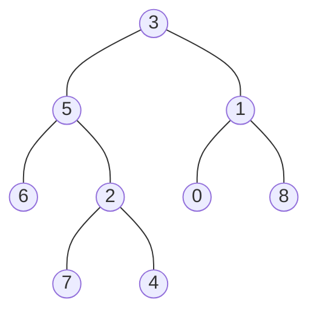

## Examples

**Example 1**

- **Input:** `root = [3, 5, 1, 6, 2, 0, 8, null, null, 7, 4], p = 5, q = 1`
- **Output:** `3`
- **Explanation:** The lowest common ancestor of nodes 5 and 1 is node 3.

**Example 2**

- **Input:** `root = [3, 5, 1, 6, 2, 0, 8, null, null, 7, 4], p = 5, q = 4`
- **Output:** `5`
- **Explanation:** Node 5 is an ancestor of node 4 and is also its own ancestor, so the LCA of nodes 5 and 4 is node 5.

**Example 3**

- **Input:** `root = [1, 2], p = 1, q = 2`
- **Output:** `1`
- **Explanation:** Node 1 is the parent of node 2, so the lowest common ancestor is node 1.
