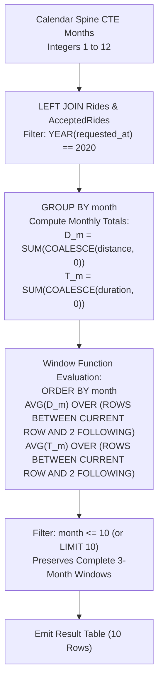

# Guided Example: Hopper Company Queries III

We trace the step-by-step calendar spine generation, monthly metrics aggregation, and rolling 3-month moving window averaging for ride-sharing operational analytics, prove the Moving Window Invariant and Calendar Spine Continuity Theorem, and evaluate exact window averages across representative problem instances:

- **Representative Instance 1 (Isolated First Month Activity):**
  - Table `Drivers`: `[(1, "2019-01-01")]`
  - Table `Rides`: `[(1, 10, "2020-01-15")]`
  - Table `AcceptedRides`: `[(1, 1, 30, 60)]` (Distance $30$, Duration $60$)
  - All other months in 2020 have $0$ accepted rides.
  - **Required Output (Months 1 through 10):**
    ```text
    +-------+-----------------------+-----------------------+
    | month | average_ride_distance | average_ride_duration |
    +-------+-----------------------+-----------------------+
    | 1     | 10.00                 | 20.00                 |
    | 2     | 0.00                  | 0.00                  |
    | 3     | 0.00                  | 0.00                  |
    | ...   | 0.00                  | 0.00                  |
    | 10    | 0.00                  | 0.00                  |
    +-------+-----------------------+-----------------------+
    ```
  - Walkthrough for Month 1:
    - 3-Month Window: Months $1, 2, 3$.
    - Distances: $30 + 0 + 0 = 30$. Average distance: $30 / 3 = \mathbf{10.00}$.
    - Durations: $60 + 0 + 0 = 60$. Average duration: $60 / 3 = \mathbf{20.00}$.
  - Walkthrough for Month 2:
    - 3-Month Window: Months $2, 3, 4$.
    - Distances: $0 + 0 + 0 = 0 \implies \mathbf{0.00}$.
    - Durations: $0 + 0 + 0 = 0 \implies \mathbf{0.00}$.

- **Representative Instance 2 (Multi-Month Overlapping Rolling Window):**
  - Month 1: Total Distance $30$, Duration $60$.
  - Month 2: Total Distance $60$, Duration $120$.
  - Month 3: Total Distance $90$, Duration $180$.
  - Month 4: Total Distance $30$, Duration $60$.
  - Window for Month 1 ($m \in [1, 2, 3]$):
    - Average Distance: $(30 + 60 + 90) / 3 = 180 / 3 = \mathbf{60.00}$.
    - Average Duration: $(60 + 120 + 180) / 3 = 360 / 3 = \mathbf{120.00}$.
  - Window for Month 2 ($m \in [2, 3, 4]$):
    - Average Distance: $(60 + 90 + 30) / 3 = 180 / 3 = \mathbf{60.00}$.
    - Average Duration: $(120 + 180 + 60) / 3 = 360 / 3 = \mathbf{120.00}$.

---

## 1. Instance & Teaching Goal

We are tasked with computing the **3-month moving average of total ride distance and ride duration** for each starting month $m \in [1 \dots 10]$ in the year 2020:
$$
\overline{D}_m = \frac{D_m + D_{m+1} + D_{m+2}}{3}, \quad \overline{T}_m = \frac{T_m + T_{m+1} + T_{m+2}}{3}
$$
where $D_k$ and $T_k$ are the total distance and total duration of all accepted rides requested in month $k$. The results must be rounded to 2 decimal places and ordered by `month` ascending from $1$ to $10$.

```text
The Crucial Definition: Average of Monthly Sums (NOT Average of Individual Rides)
  The metric is NOT: sum of all ride distances / count of all rides.
  Rather, it is the arithmetic mean of the THREE MONTHLY TOTALS:
    Average = (Total_m + Total_{m+1} + Total_{m+2}) / 3.
  If a month has no rides, its monthly total is 0, and it still counts as one
  of the three components in the denominator!

Why Calendar Spine Continuity is Essential for Window Functions:
  SQL window frames like ROWS BETWEEN CURRENT ROW AND 2 FOLLOWING assume
  that consecutive rows represent consecutive calendar months!
  If months with 0 rides were omitted:
    Row 1: Month 1
    Row 2: Month 5
    Row 3: Month 7
  The window function for Row 1 would average Months 1, 5, and 7!
  To guarantee temporal alignment, all 12 calendar months MUST be materialized
  using a recursive CTE calendar spine!
```

The decisive pedagogical goal is the **Calendar Spine Continuity Theorem & Rolling Window Moving Average Invariant**:
1. **Unbroken Temporal Spine:** Recursive CTE creates exactly 12 contiguous rows for months $1 \dots 12$.
2. **Left Join Zero-Filling:** Non-existing monthly rides are preserved as $0$ via `COALESCE(ride_distance, 0)`.
3. **Window Frame Synchronization:** Because every month is present, a physical frame `ROWS BETWEEN CURRENT ROW AND 2 FOLLOWING` strictly maps to calendar interval $[m, m+2]$.
4. **Boundary Filtering:** Starting months 11 and 12 cannot form a complete 3-month window within 2020 and must be excluded (`LIMIT 10` or `WHERE month <= 10`).

---

## 2. Conceptual Foundation & The Windowing Pipeline



### The Moving Window Invariant & Continuity Theorem

Let $\mathcal{M} = \{1, 2, \dots, 12\}$ be the set of calendar months in 2020.
1. **Spine Completeness:**
   Let $T$ be the table of monthly aggregates. $T$ is complete if and only if $|\pi_{\text{month}}(T)| = 12$ and $\forall m \in \mathcal{M}, \; m \in \pi_{\text{month}}(T)$.
2. **Equivalence of Physical and Logical Window Frames:**
   When $T$ is sorted by `month` ascending and is unbroken ($\text{month}_{k+1} = \text{month}_k + 1$), the physical window frame:
   $$
   \text{ROWS BETWEEN CURRENT ROW AND } 2 \text{ FOLLOWING}
   $$
   is strictly equivalent to the logical range frame:
   $$
   \text{RANGE BETWEEN CURRENT ROW AND } 2 \text{ FOLLOWING}
   $$
   Both accurately capture the multiset of monthly totals for $\{m, m+1, m+2\}$.
3. **Truncation Invariant:**
   A 3-month window beginning at month $m$ is entirely contained within the reporting year 2020 if and only if $m + 2 \le 12 \iff m \le 10$.
   Hence, exactly $10$ valid rolling windows exist in 2020.

---

## 3. Step-by-Step Worked Execution

### Trace on Representative Instance 1 (`Ride 1` in Month 1 with distance $30$, duration $60$)

#### Step 1: Materialize Month Sequence
Recursive CTE produces 12 integer rows:
$$
Months = \{1, 2, 3, 4, 5, 6, 7, 8, 9, 10, 11, 12\}
$$

#### Step 2: Aggregate Monthly Totals (CTE `Ride`)
Join `Months` with `Rides` and `AcceptedRides`:
- Month 1: Ride 1 matched.
  $$D_1 = 30, \quad T_1 = 60$$
- Months 2 through 12: No matching rides. `COALESCE` converts `NULL` to $0$:
  $$D_m = 0, \quad T_m = 0 \quad \text{for all } m \in [2 \dots 12]$$

#### Step 3: Evaluate Moving Window over 3 Rows

- **Month $m = 1$:**
  - Window: Months $[1, 2, 3]$.
  - Distances: $[30, 0, 0] \implies \text{Average} = \frac{30 + 0 + 0}{3} = \mathbf{10.00}$.
  - Durations: $[60, 0, 0] \implies \text{Average} = \frac{60 + 0 + 0}{3} = \mathbf{20.00}$.
- **Month $m = 2$:**
  - Window: Months $[2, 3, 4]$.
  - Distances: $[0, 0, 0] \implies \text{Average} = \frac{0 + 0 + 0}{3} = \mathbf{0.00}$.
  - Durations: $[0, 0, 0] \implies \text{Average} = \frac{0 + 0 + 0}{3} = \mathbf{0.00}$.
- **Months $m = 3$ through $10$:**
  - All three window components are $0$.
  - Average Distance: $\mathbf{0.00}$. Average Duration: $\mathbf{0.00}$.

#### Step 4: Truncate at Month 10
Months 11 and 12 are dropped by `LIMIT 10`.
Result contains exactly 10 rows.

---

## 4. Complete Execution Trace

### Full 10-Month Output Schedule for Instance 1

| Month $m$ | Window Span | Monthly Distances | Window Average Distance | Monthly Durations | Window Average Duration | Output Row |
|---|---|---|---|---|---|---|
| $1$ | $[1, 2, 3]$ | $30, 0, 0$ | $30 / 3 = \mathbf{10.00}$ | $60, 0, 0$ | $60 / 3 = \mathbf{20.00}$ | `[1, 10.0, 20.0]` |
| $2$ | $[2, 3, 4]$ | $0, 0, 0$ | $0 / 3 = \mathbf{0.00}$ | $0, 0, 0$ | $0 / 3 = \mathbf{0.00}$ | `[2, 0.0, 0.0]` |
| $3$ | $[3, 4, 5]$ | $0, 0, 0$ | $0 / 3 = \mathbf{0.00}$ | $0, 0, 0$ | $0 / 3 = \mathbf{0.00}$ | `[3, 0.0, 0.0]` |
| $4$ | $[4, 5, 6]$ | $0, 0, 0$ | $0 / 3 = \mathbf{0.00}$ | $0, 0, 0$ | $0 / 3 = \mathbf{0.00}$ | `[4, 0.0, 0.0]` |
| $5$ | $[5, 6, 7]$ | $0, 0, 0$ | $0 / 3 = \mathbf{0.00}$ | $0, 0, 0$ | $0 / 3 = \mathbf{0.00}$ | `[5, 0.0, 0.0]` |
| $6$ | $[6, 7, 8]$ | $0, 0, 0$ | $0 / 3 = \mathbf{0.00}$ | $0, 0, 0$ | $0 / 3 = \mathbf{0.00}$ | `[6, 0.0, 0.0]` |
| $7$ | $[7, 8, 9]$ | $0, 0, 0$ | $0 / 3 = \mathbf{0.00}$ | $0, 0, 0$ | $0 / 3 = \mathbf{0.00}$ | `[7, 0.0, 0.0]` |
| $8$ | $[8, 9, 10]$ | $0, 0, 0$ | $0 / 3 = \mathbf{0.00}$ | $0, 0, 0$ | $0 / 3 = \mathbf{0.00}$ | `[8, 0.0, 0.0]` |
| $9$ | $[9, 10, 11]$ | $0, 0, 0$ | $0 / 3 = \mathbf{0.00}$ | $0, 0, 0$ | $0 / 3 = \mathbf{0.00}$ | `[9, 0.0, 0.0]` |
| $10$ | $[10, 11, 12]$ | $0, 0, 0$ | $0 / 3 = \mathbf{0.00}$ | $0, 0, 0$ | $0 / 3 = \mathbf{0.00}$ | `[10, 0.0, 0.0]` |

---

## 5. Algorithmic Correctness

**Soundness.**
The window function averages the monthly sums across exactly three consecutive calendar months. Zero-filling ensures that missing months properly deflate the average with zero contribution rather than shrinking the denominator to 1 or 2.

**Completeness.**
The recursive CTE ensures that no month between 1 and 12 is omitted. The final query orders by `month` ascending and retains the first 10 rows, matching the required specification.

---

## 6. Traps This Instance Exposes

- **Window Function Frame Drift:** Without an unbroken calendar spine of all 12 months, `ROWS BETWEEN CURRENT ROW AND 2 FOLLOWING` would span non-consecutive calendar months when intermediate months have no rides.
- **Ride-Level vs Month-Level Averaging:** Calculating the average distance over all rides across the 3 months violates the contract. The contract strictly specifies the average of the three monthly totals.
- **Unaccepted Rides Contamination:** Rides present in `Rides` but absent from `AcceptedRides` must contribute $0$ distance and $0$ duration.
- **Incomplete End Months:** Starting months 11 and 12 have fewer than two following months in 2020. Retaining them without restriction would compute averages over only 2 months or 1 month; they must be excluded.

---

## 7. Complexity Derivation

- **Time Complexity:**
  - Generating 12 months: $\mathcal{O}(1)$ time.
  - Joining `Months` with `Rides` and `AcceptedRides`: $\mathcal{O}(|Rides| + |AcceptedRides|)$ via hash or index joins.
  - Sorting and evaluating window functions across 12 rows: $\mathcal{O}(12 \log 12) = \mathcal{O}(1)$ operations.
  - Overall Time Complexity: strictly $\mathcal{O}(|Rides| + |AcceptedRides|)$ single pass scan.
- **Auxiliary Space Complexity:**
  - Intermediate CTE tables store 12 rows for the calendar spine and monthly totals.
  - Auxiliary Space: $\mathcal{O}(1)$ auxiliary space.
