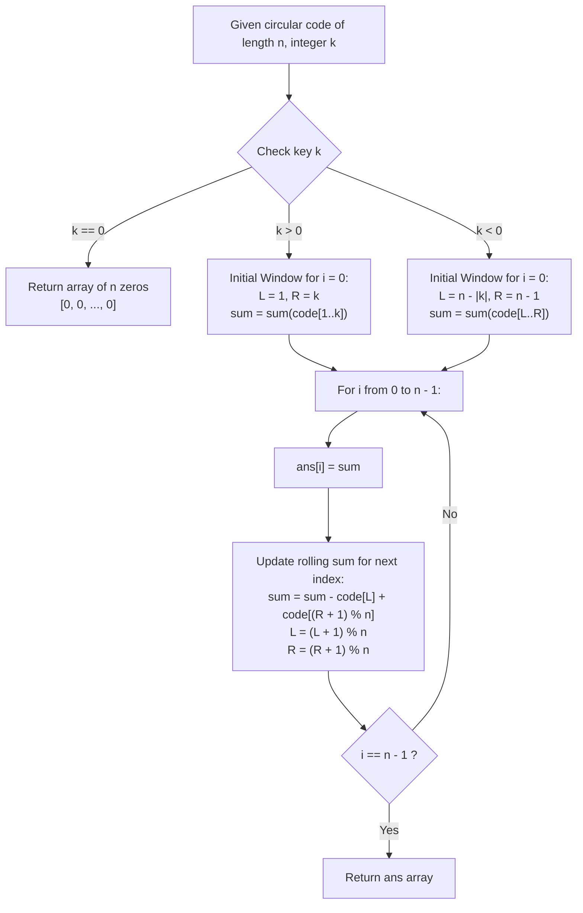

# Guided Example: Defuse the Bomb

We trace the step-by-step circular array sliding window evaluation and modulo boundary navigation for decrypting code ciphers, prove the Circular Window Sliding Invariant and Modular Interval Transition Theorem, and calculate decrypted arrays across representative problem instances:

- **Representative Instance 1 (Forward Circular Horizon $k > 0$):**
  - Input: `code = [5, 7, 1, 4], k = 3`
  - Circular length $n = 4$, lookahead horizon $k = 3$.
  - **Required Output:** `[12, 10, 16, 13]`
  - Walkthrough:
    - Index $0$: Sum next $3$ elements: $code[1] + code[2] + code[3] = 7 + 1 + 4 = \mathbf{12}$.
    - Index $1$: Sum next $3$ elements: $code[2] + code[3] + code[0] = 1 + 4 + 5 = \mathbf{10}$ (wrapped around to index $0$).
    - Index $2$: Sum next $3$ elements: $code[3] + code[0] + code[1] = 4 + 5 + 7 = \mathbf{16}$.
    - Index $3$: Sum next $3$ elements: $code[0] + code[1] + code[2] = 5 + 7 + 1 = \mathbf{13}$.

- **Representative Instance 2 (Backward Circular Horizon $k < 0$):**
  - Input: `code = [2, 4, 9, 3], k = -2`
  - Circular length $n = 4$, lookbehind span $|k| = 2$.
  - **Required Output:** `[12, 5, 6, 13]`
  - Walkthrough:
    - Index $0$: Sum previous $2$ elements: $code[3] + code[2] = 3 + 9 = \mathbf{12}$.
    - Index $1$: Sum previous $2$ elements: $code[0] + code[3] = 2 + 3 = \mathbf{5}$.
    - Index $2$: Sum previous $2$ elements: $code[1] + code[0] = 4 + 2 = \mathbf{6}$.
    - Index $3$: Sum previous $2$ elements: $code[2] + code[1] = 9 + 4 = \mathbf{13}$.

- **Representative Instance 3 (Zero Window Quiescence $k = 0$):**
  - Input: `code = [1, 2, 3, 4], k = 0`
  - **Required Output:** `[0, 0, 0, 0]` (every number replaced with $0$).

---

## 1. Instance & Teaching Goal

Given a circular array `code` of length $n$ and a key integer $k$, decrypt the code according to three operational rules:
- If $k > 0$: Replace the $i$-th number with the sum of the **next** $k$ numbers in cyclic order.
- If $k < 0$: Replace the $i$-th number with the sum of the **previous** $|k|$ numbers in cyclic order.
- If $k == 0$: Replace the $i$-th number with $0$.
Because the array is circular, index $n - 1$ connects back to index $0$, and index $0$ precedes index $n - 1$.

```text
Circular Array Indexing & Wrap-Around:
  Every index calculation uses modulo arithmetic:
    Next index after j:     (j + 1) mod n
    Previous index before j: (j - 1 + n) mod n

Why Recomputing Window Sums from Scratch is Suboptimal:
  For each index i, summing |k| elements takes O(|k|) operations.
  Across n elements, total time is O(n * |k|).
  While acceptable for small inputs, this recomputes identical sums repeatedly!

The Sliding Window Invariant (O(n) Linear Time):
  As the target index advances from i to i + 1:
    The circular window of size |k| also shifts by exactly ONE position!
    - Exactly ONE element exits the window from the left.
    - Exactly ONE new element enters the window from the right.
    New Window Sum = Old Window Sum - Exiting Element + Entering Element!
  This updates every replacement value in strictly O(1) time!
```

The decisive pedagogical goal is the **Circular Window Sliding Invariant & Modular Interval Transition Theorem**:
1. **Initial Window Localization:** Establish initial window bounds $[L, R]$ based on the sign of $k$.
2. **Online Rolling Update:** Slide the window circularly in $\mathcal{O}(1)$ time per step using $\text{sum} \leftarrow \text{sum} - code[L] + code[(R + 1) \pmod n]$.
3. **Zero Quiescence:** Immediate early return of an all-zero vector when $k = 0$.

---

## 2. Conceptual Foundation & The Circular Sliding Pipeline



### The Modular Interval Transition Theorem

Let $code$ be an array of length $n$, and let $k \ne 0$ with $|k| < n$.
1. **Cyclic Window Interval Definition:**
   For index $i \in \{0, 1, \dots, n-1\}$, the active summand set $\mathcal{W}_k(i)$ is:
   $$
   \mathcal{W}_k(i) =
   \begin{cases}
   \{ (i + j) \pmod n : 1 \le j \le k \}, & \text{if } k > 0 \\
   \{ (i - j + n) \pmod n : 1 \le j \le |k| \}, & \text{if } k < 0
   \end{cases}
   $$
   In both cases, $|\mathcal{W}_k(i)| = |k|$.
2. **Circular Rolling Shift Invariant:**
   Consider the transition from index $i$ to index $(i + 1) \pmod n$.
   - When $k > 0$: The element exiting the window is $(i + 1) \pmod n$, and the element entering is $(i + k + 1) \pmod n$.
     $$
     \sum_{j \in \mathcal{W}_k(i+1)} code[j] = \left( \sum_{j \in \mathcal{W}_k(i)} code[j] \right) - code[(i+1)\%n] + code[(i+k+1)\%n]
     $$
   - When $k < 0$: The element exiting is $(i - |k| + n) \pmod n$, and the element entering is $i \pmod n$.
     $$
     \sum_{j \in \mathcal{W}_k(i+1)} code[j] = \left( \sum_{j \in \mathcal{W}_k(i)} code[j] \right) - code[(i - |k| + n)\%n] + code[i]
     $$

---

## 3. Step-by-Step Worked Execution

### Trace on Representative Instance 1 (`code = [5, 7, 1, 4]`, `k = 3`)

Length $n = 4$. Key $k = 3 > 0$.
Initial window for $i = 0$: indices $[1, 2, 3]$.
- Initial elements: $code[1] = 7, \; code[2] = 1, \; code[3] = 4$.
- Initial window sum: $S = 7 + 1 + 4 = 12$.
- Window boundaries: $L = 1, \; R = 3$.

#### Step 0: Record $ans[0]$ and Shift
- Record: $ans[0] = S = \mathbf{12}$.
- Next index is $1$. Window shifts by $1$:
  - Exiting element at $L = 1$: $code[1] = 7$.
  - Entering element at $(R + 1) \pmod 4 = 4 \pmod 4 = 0$: $code[0] = 5$.
  - Updated sum: $S \leftarrow 12 - 7 + 5 = \mathbf{10}$.
  - Updated boundaries: $L \leftarrow 2, \; R \leftarrow 0$.

#### Step 1: Record $ans[1]$ and Shift
- Record: $ans[1] = S = \mathbf{10}$.
- Window shifts:
  - Exiting element at $L = 2$: $code[2] = 1$.
  - Entering element at $(R + 1) \pmod 4 = 1$: $code[1] = 7$.
  - Updated sum: $S \leftarrow 10 - 1 + 7 = \mathbf{16}$.
  - Updated boundaries: $L \leftarrow 3, \; R \leftarrow 1$.

#### Step 2: Record $ans[2]$ and Shift
- Record: $ans[2] = S = \mathbf{16}$.
- Window shifts:
  - Exiting element at $L = 3$: $code[3] = 4$.
  - Entering element at $(R + 1) \pmod 4 = 2$: $code[2] = 1$.
  - Updated sum: $S \leftarrow 16 - 4 + 1 = \mathbf{13}$.
  - Updated boundaries: $L \leftarrow 0, \; R \leftarrow 2$.

#### Step 3: Record $ans[3]$
- Record: $ans[3] = S = \mathbf{13}$.
- All $4$ indices evaluated.

Final Decrypted Array: `[12, 10, 16, 13]`.

---

### Trace on Representative Instance 2 (`code = [2, 4, 9, 3]`, `k = -2`)

Length $n = 4$, $k = -2 < 0$, window width $|k| = 2$.
Initial window for $i = 0$: previous $2$ elements, indices $n - 2 = 2$ and $n - 1 = 3$.
- Initial elements: $code[2] = 9, \; code[3] = 3$.
- Initial window sum: $S = 9 + 3 = 12$.
- Window boundaries: $L = 2, \; R = 3$.

- **$i = 0$:** $ans[0] = 12$. Shift: subtract $code[2] = 9$, add $code[0] = 2 \implies S = 12 - 9 + 2 = \mathbf{5}$.
- **$i = 1$:** $ans[1] = 5$. Shift: subtract $code[3] = 3$, add $code[1] = 4 \implies S = 5 - 3 + 4 = \mathbf{6}$.
- **$i = 2$:** $ans[2] = 6$. Shift: subtract $code[0] = 2$, add $code[2] = 9 \implies S = 6 - 2 + 9 = \mathbf{13}$.
- **$i = 3$:** $ans[3] = 13$.

Final Decrypted Array: `[12, 5, 6, 13]`.

---

## 4. Complete Execution Trace

### State Progression Table for Instance 1 (`k = 3`)

| Target Index $i$ | Window Indices | Window Elements | Window Sum $S$ | Exiting Element | Entering Element | Decrypted Value $ans[i]$ |
|---|---|---|---|---|---|---|
| $0$ | $[1, 2, 3]$ | $7, 1, 4$ | $12$ | $code[1] = 7$ | $code[0] = 5$ | **`12`** |
| $1$ | $[2, 3, 0]$ | $1, 4, 5$ | $10$ | $code[2] = 1$ | $code[1] = 7$ | **`10`** |
| $2$ | $[3, 0, 1]$ | $4, 5, 7$ | $16$ | $code[3] = 4$ | $code[2] = 1$ | **`16`** |
| $3$ | $[0, 1, 2]$ | $5, 7, 1$ | $13$ | $code[0] = 5$ | $code[3] = 4$ | **`13`** |

---

## 5. Algorithmic Correctness

**Soundness.**
For each index $i$, the window interval precisely spans the $k$ consecutive elements preceding or succeeding index $i$ in cyclical order. The current element $code[i]$ is strictly omitted.

**Completeness.**
The loop covers every index from $0$ to $n - 1$. The sliding window maintainer applies algebraic difference updates without intermediate rounding or cumulative drift, ensuring exact equivalence to summing all window elements directly.

---

## 6. Traps This Instance Exposes

- **Including Current Element:** A frequent error is summing a range of length $k$ that includes $code[i]$. The definition requires the sum of elements *after* (or *before*) $i$, strictly excluding $code[i]$.
- **Negative Modulo Arithmetic in C/Java:** In Python, `-1 % 4 = 3`. In C, C++, and Java, `-1 % 4 = -1`. The safe mathematical expression $(j + n) \pmod n$ guarantees non-negative array indexing across all programming environments.
- **Window Initialization Bounds for $k < 0$:** When $k < 0$, the initial window for $i = 0$ begins at index $n - |k|$ and ends at $n - 1$.

---

## 7. Complexity Derivation

- **Time Complexity:**
  - **Using Circular Sliding Window:**
    - Computing the initial window sum of $|k|$ elements: $\mathcal{O}(|k|)$ operations.
    - Sliding the window across all $n$ positions: $n$ steps of $1$ addition and $1$ subtraction each, taking $\mathcal{O}(n)$ time.
    - Overall Time Complexity: strictly $\mathcal{O}(n)$ time.
  - **Using Direct Nested Loops:**
    - For each of the $n$ elements, summing $|k|$ values takes $\mathcal{O}(n \cdot |k|)$ operations.
- **Auxiliary Space Complexity:**
  - The algorithm only requires a few integer index and sum variables beyond the returned answer array of length $n$.
  - Auxiliary Space: $\mathcal{O}(1)$ auxiliary memory.
