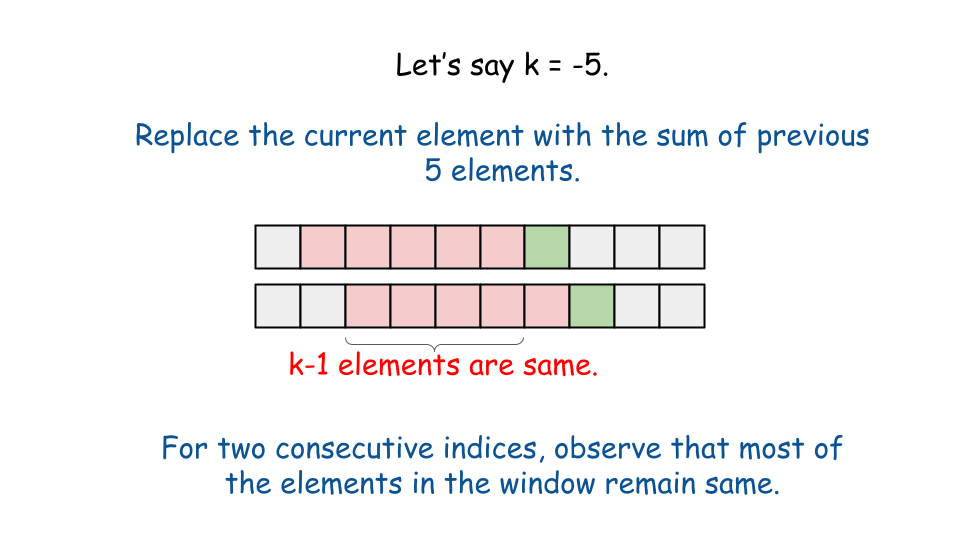
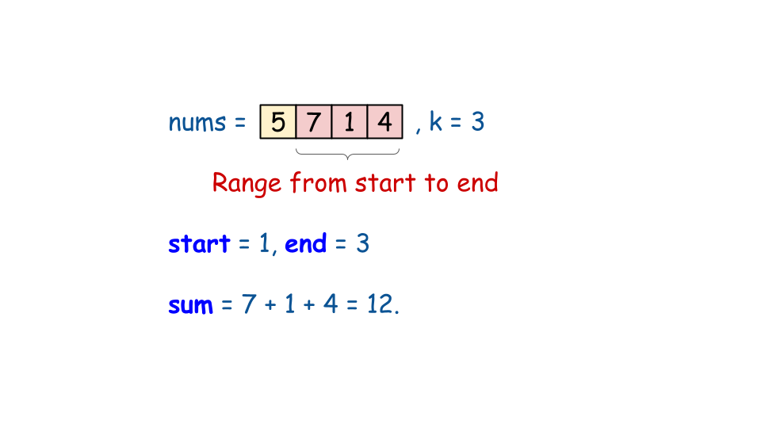
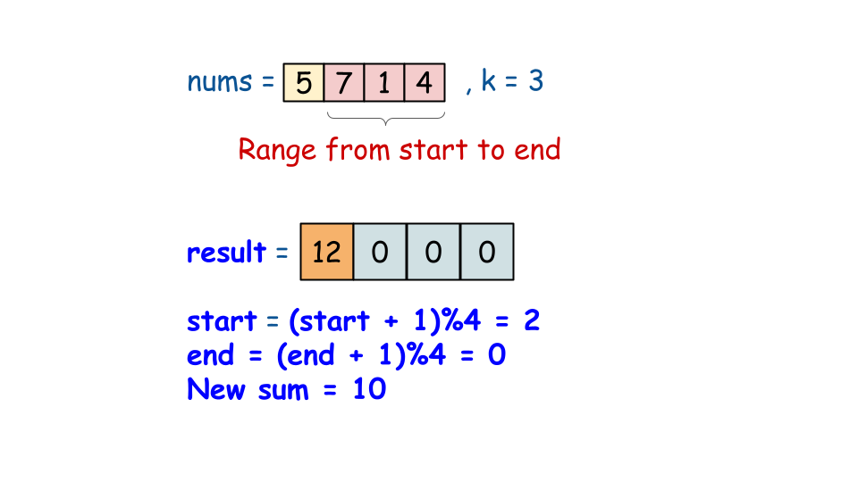
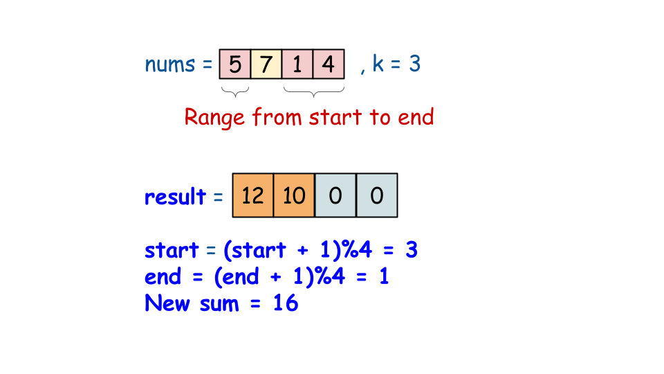
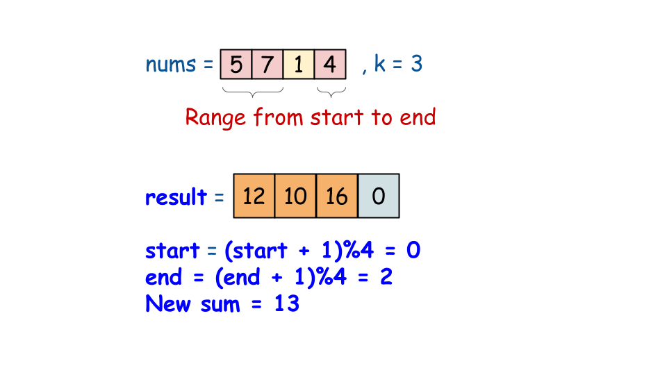
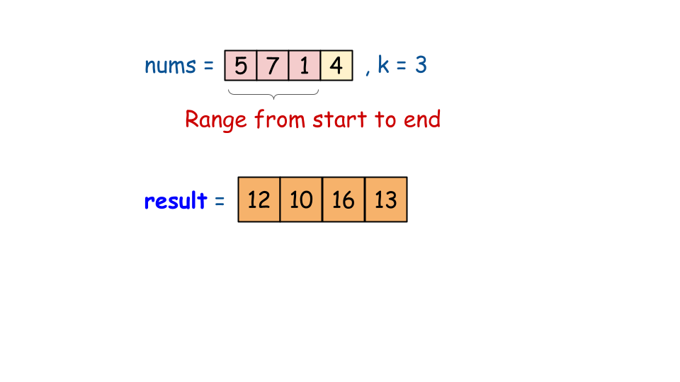

## Solution

---

### Overview

We are given a circular array `code` of length `n` and a key `k`, we need to update each element in `code` as follows:
1. If `k > 0`, replace each element with the sum of the next `k` elements.
2. If `k < 0`, replace each element with the sum of the previous `|k|` elements.
3. If $k = 0$, replace all elements with `0`.

Since the array is circular, when we go beyond the end, we wrap back to the start using the modulo operator `%`. For example, `i % n` keeps an index `i` within bounds of an array of length `n`, so if `i` exceeds `n`, it wraps back to `0`, `1`, etc. This lets us navigate the circular array without additional conditions to reset indices.

---

### Approach 1: Brute Force

#### Intuition

Given the low constraints on `n` and `k`, we can use a simple brute-force approach to simulate the required operation for each index based on `k`:

- If `k` is 0, we return an array of size `n` filled with 0s.
- If `k` is positive, we replace each element with the sum of the next `k` elements, using the modulo operator to handle circular bounds.
- If `k` is negative, we replace each element with the sum of the previous `|k|` elements, again using the modulo operator for circular bounds.

#### Algorithm

1. Create an array `result` of the same length as `code` to store the decrypted values.
2. If `k` is 0, return `result`, as it should contain only zeros.
3. Loop through each element in `code` with index `i`:
- If `k` is positive:
- For each `j` from $i + 1$ to $i + k$:
- Add `code[j % code.length]` to $\text{result}[i]$.
- If `k` is negative:
- For each `j` from $i - |k|$ to $i - 1$:
- Add $code[(j + \text{code.length}) \% \text{code.length}]$ to $\text{result}[i]$.
4. After processing all elements, return `result`.

#### Implementation

```python
class Solution:
    def decrypt(self, code: List[int], k: int) -> List[int]:
        result = [0] * len(code)
        # If k is 0, return the result directly.
        if k == 0:
            return result
        for i in range(len(result)):
            if k > 0:
                # If k is greater than 0, store the sum of next k numbers.
                for j in range(i + 1, i + k + 1):
                    result[i] += code[j % len(code)]
            else:
                # If k is less than 0, store the sum of previous -1*k numbers.
                for j in range(i - abs(k), i):
                    result[i] += code[(j + len(code)) % len(code)]
        return result
```

#### Complexity Analysis

Let $n$ be the size of the given `code` array.

- Time Complexity: $O(n \cdot |k|)$

    The outer loop iterates over each element in `code`, so it runs `n` times, where `n` is the length of `code`. For each element, the inner loop runs $|k|$ times (either forward or backward, depending on the value of `k`). Therefore, the overall time complexity is $O(n \cdot |k|)$.

- Space complexity: $O(1)$

    The output array `result` is not considered additional space as it is required to store the answer. No other data structures are used, so the space complexity is $O(1)$.

---

### Approach 2: Sliding Window

#### Intuition

In the previous approach, we calculate the sum of `|k|` consecutive elements and store it in the `result` array for each index. But notice this: each time we move to the next window, most of the numbers (specifically, `|k|-1` of them) stay the same! Only one element is removed from the start, and a new one is added at the end. Therefore, instead of calculating the sum for every index, we can make changes to the initial sum for these two elements. Checkout the visual given below for a better understanding:



For positive `k`, we start by calculating the sum of the first `k` elements and store it in $\text{result}[0]$. Let’s call this initial sum `sum`. As we shift the window to each new index, we update `sum` by subtracting the element that's leaving the window and adding the new element entering it. We repeat this process until we cover all indices and store each updated `sum` in `result`.

Similarly, when `k` is negative, we calculate the sum of the `|k|` elements preceding each index, beginning with the last `|k|` elements for the first index. Then, for each subsequent index, we update the `sum` by adjusting for the outgoing and incoming elements as before. After visiting all indices, we return the `result` array.

#### Algorithm

1. Create an array `result` of the same length as `code` to store the decrypted values.
2. If `k` is 0, return `result`, since all values should be zero.
3. Set initial `start` and `end` indices based on `k`.
- If `k` > 0:
- Set `start` = 1 and `end` = `k`.
- If `k` < 0:
- Set `start` to $\text{code.length} - |k|$ and `end` to $\text{code.length} - 1$.
4. Calculate the initial sum of elements from `start` to `end`.
5. Loop through each index `i` in `code`:
- Store the current `sum` in $\text{result}[i]$.
- Update `sum` by subtracting the element at `start` and adding the element at $end + 1$, using modulo to handle wrapping around the array.
- Increment `start` and `end` by 1 to slide the window right.
6. Return the `result` array with the decrypted values.











#### Implementation

```python
class Solution:
    def decrypt(self, code: List[int], k: int) -> List[int]:
        result = [0 for _ in range(len(code))]
        if k == 0:
            return result
        # Define the initial window and initial sum
        start, end, window_sum = 1, k, 0
        # If k < 0, the starting point will be end of the array.
        if k < 0:
            start = len(code) - abs(k)
            end = len(code) - 1
        for i in range(start, end + 1):
            window_sum += code[i]
        # Scan through the code array as i moving to the right, update the window sum.
        for i in range(len(code)):
            result[i] = window_sum
            window_sum -= code[start % len(code)]
            window_sum += code[(end + 1) % len(code)]
            start += 1
            end += 1
        return result
```

#### Complexity Analysis

Let $n$ be the size of the given `code` array.

- Time Complexity: $O(n)$

    The first loop calculates the initial `sum` for the window, which takes $O(|k|)$ time. The second loop iterates through each element in the `code` array, which takes $O(n)$ time. Therefore, the overall time complexity is $O(|k|+n)$. In the worst case, `|k|` can be as large as `n`, and the time complexity simplifies to $O(n)$.

- Space complexity: $O(1)$

    The output array `result` is not considered additional space as it is required to store the answer. The only extra variables used are `start`, `end`, and `sum`, so the space complexity is $O(1)$.

---