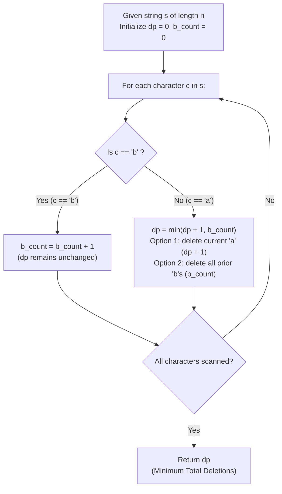

# Guided Example: Minimum Deletions to Make String Balanced

We trace the step-by-step dynamic programming state transitions and prefix decision dichotomy for balancing binary character strings, prove the Dual Choice Substructure Theorem and the 'b'-Counter Monotonicity Invariant, and evaluate exact minimum deletions across representative problem instances:

- **Representative Instance 1 (Interleaved Alternating Sequence):**
  - Input: `s = "aababbab"`
  - Length $n = 8$.
  - Characters:
    - Indices $0, 1$: `'a', 'a'`
    - Index $2$: `'b'`
    - Index $3$: `'a'` (inversion with preceding `'b'`)
    - Indices $4, 5$: `'b', 'b'`
    - Index $6$: `'a'` (inversion with preceding `'b'`s)
    - Index $7$: `'b'`
  - **Required Output:** `2`
  - Deleting index $2$ (`'b'`) and index $5$ (`'b'`) yields `"aaaab"`, which is balanced ($2$ deletions).
  - Alternatively, deleting index $3$ (`'a'`) and index $6$ (`'a'`) yields `"aabbbb"`, also requiring $2$ deletions.

- **Representative Instance 2 (Prefix Block Inversion):**
  - Input: `s = "bbaaaaabb"`
  - Two `'b'`s precede five `'a'`s.
  - Deleting the $2$ leading `'b'`s yields `"aaaaabb"`.
  - **Required Output:** `2`.

- **Representative Instance 3 (Naturally Balanced String):**
  - Input: `s = "aaabbb"`
  - All `'a'`s already precede all `'b'`s $\implies$ **Required Output:** `0`.

---

## 1. Instance & Teaching Goal

A string $s$ consisting only of `'a'` and `'b'` is called **balanced** if there is no pair of indices $(i, j)$ such that $i < j$, $s[i] = \text{'b'}$, and $s[j] = \text{'a'}$. Equivalently, a balanced string has the regular expression structure $a^* b^*$: all occurrences of `'a'` must precede all occurrences of `'b'`. Given a string $s$, find the minimum number of character deletions required to make $s$ balanced.

```text
The Inversion Condition:
  A violation occurs if and only if any 'b' is followed by an 'a'.
  Valid balanced forms:
    - All 'a's:          "aaaa"
    - All 'b's:          "bbbb"
    - 'a's then 'b's:    "aaabbbb"

The Online Decision Dilemma When Processing Character c = s[i]:
  1. If c == 'b':
     Appending 'b' to a balanced string NEVER causes a violation!
     Any preceding characters are either 'a' or 'b', and placing 'b' at the end
     maintains valid a*b* form.
     No deletions needed: f[i] = f[i-1].
     Increment the count of seen 'b's: b = b + 1.

  2. If c == 'a':
     If there are b preceding 'b's in the prefix, adding 'a' violates the property!
     We face a binary choice:
       Option A (Delete this 'a'):
         Cost = f[i-1] + 1 (keep earlier deletions, discard current 'a').
       Option B (Keep this 'a'):
         To keep this 'a', NO 'b' can precede it!
         Therefore, ALL b preceding 'b's must be deleted!
         Cost = b (erase every earlier 'b', leaving only pure 'a's up to now).
     Optimal decision: f[i] = min(f[i-1] + 1, b).
```

The decisive pedagogical goal is the **Dual Choice Substructure Theorem & 'b'-Counter Monotonicity Invariant**:
1. **Zero Penalty for 'b':** Appending `'b'` preserves existing balance without adding deletions.
2. **Optimal 'a' Resolution:** An `'a'` following preceding `'b'`s is resolved by balancing the cost of deleting the single `'a'` against wiping out all preceding `'b'`s.
3. **Space Compression to Scalar State:** Because $f[i]$ depends solely on $f[i-1]$ and scalar count $b$, the DP reduces from an array to $\mathcal{O}(1)$ auxiliary variables.

---

## 2. Conceptual Foundation & The DP Recurrence Pipeline



### The Dual Choice Substructure Theorem

Let $s[0 \dots n-1]$ be a string over $\{\text{'a'}, \text{'b'}\}$.
For any prefix $s[0 \dots i-1]$ (length $i$), define $f[i]$ as the minimum deletions to balance $s[0 \dots i-1]$, and let $b_i = |\{ j < i : s[j] = \text{'b'} \}|$.
1. **Base Case:**
   For an empty prefix ($i = 0$), $f[0] = 0$ and $b_0 = 0$.
2. **Transition for Character $s[i-1] = \text{'b'}$:**
   $$
   f[i] = f[i-1], \quad b_i = b_{i-1} + 1
   $$
   *Proof:* Any balanced string $w$ formed from $s[0 \dots i-2]$ has the form $a^* b^*$. Appending `'b'` to $w$ yields $w \cdot \text{'b'} \in a^* b^*$. No new inversions are created, so no additional deletions are required.
3. **Transition for Character $s[i-1] = \text{'a'}$:**
   $$
   f[i] = \min(f[i-1] + 1, \; b_{i-1}), \quad b_i = b_{i-1}
   $$
   *Proof:* In any valid balanced string $w$ formed from $s[0 \dots i-1]$:
   - Either $s[i-1]$ is deleted: The remaining characters must form a balanced string from $s[0 \dots i-2]$, requiring $f[i-1] + 1$ deletions.
   - Or $s[i-1]$ is retained: Since $s[i-1] = \text{'a'}$, no `'b'` can appear anywhere before $s[i-1]$. Thus, all $b_{i-1}$ occurrences of `'b'` in $s[0 \dots i-2]$ must be deleted, leaving only the original `'a'` characters.
   Since these two cases exhaust all possibilities, the minimum cost is $\min(f[i-1] + 1, b_{i-1})$.

---

## 3. Step-by-Step Worked Execution

### Trace on Representative Instance 1 (`s = "aababbab"`)

Initialize: $f = 0, \; b = 0$.

#### Step 1: Character $s[0] = \text{'a'}$
- Character is `'a'`.
- Option 1 (delete `'a'`): $f + 1 = 0 + 1 = 1$.
- Option 2 (delete prior `'b'`s): $b = 0$.
- $f \leftarrow \min(1, 0) = \mathbf{0}$. ($b$ remains $0$).

#### Step 2: Character $s[1] = \text{'a'}$
- Character is `'a'`.
- Option 1: $f + 1 = 0 + 1 = 1$.
- Option 2: $b = 0$.
- $f \leftarrow \min(1, 0) = \mathbf{0}$. ($b$ remains $0$).

#### Step 3: Character $s[2] = \text{'b'}$
- Character is `'b'`.
- No penalty: $f$ remains $0$.
- Increment `'b'` counter: $b \leftarrow 0 + 1 = \mathbf{1}$.

#### Step 4: Character $s[3] = \text{'a'}$
- Character is `'a'`.
- Option 1 (delete this `'a'`): $f + 1 = 0 + 1 = 1$.
- Option 2 (delete all prior `'b'`s): $b = 1$ (the `'b'` at index $2$).
- Both options cost $1 \implies f \leftarrow \min(1, 1) = \mathbf{1}$.

#### Step 5: Character $s[4] = \text{'b'}$
- Character is `'b'`.
- $f$ remains $1$.
- Increment `'b'` counter: $b \leftarrow 1 + 1 = \mathbf{2}$.

#### Step 6: Character $s[5] = \text{'b'}$
- Character is `'b'`.
- $f$ remains $1$.
- Increment `'b'` counter: $b \leftarrow 2 + 1 = \mathbf{3}$.

#### Step 7: Character $s[6] = \text{'a'}$
- Character is `'a'`.
- Option 1 (delete this `'a'`): $f + 1 = 1 + 1 = 2$.
- Option 2 (delete all prior `'b'`s): $b = 3$ (deleting all $3$ `'b'`s seen so far).
- $f \leftarrow \min(2, 3) = \mathbf{2}$.

#### Step 8: Character $s[7] = \text{'b'}$
- Character is `'b'`.
- $f$ remains $2$.
- Increment `'b'` counter: $b \leftarrow 3 + 1 = \mathbf{4}$.

Traversal finished. Final answer: **`2`**.

---

## 4. Complete Execution Trace

### State Progression Table for Representative Instance 1

| Step $i$ | Character $s[i-1]$ | Preceding `'b'`s ($b$) | Option 1 ($f + 1$) | Option 2 ($b$) | Minimum Selected $f$ | Active Prefix Balanced Form |
|---|---|---|---|---|---|---|
| Start | — | $0$ | — | — | $0$ | `""` |
| $1$ | `'a'` | $0$ | $1$ | $0$ | $0$ | `"a"` |
| $2$ | `'a'` | $0$ | $1$ | $0$ | $0$ | `"aa"` |
| $3$ | `'b'` | $1$ | — | — | $0$ | `"aab"` |
| $4$ | `'a'` | $1$ | $1$ | $1$ | $1$ | `"aab"` or `"aaa"` |
| $5$ | `'b'` | $2$ | — | — | $1$ | `"aabb"` |
| $6$ | `'b'` | $3$ | — | — | $1$ | `"aabbb"` |
| $7$ | `'a'` | $3$ | $2$ | $3$ | $\mathbf{2}$ | `"aabbbb"` or `"aaaabb"` |
| $8$ | `'b'` | $4$ | — | — | $\mathbf{2}$ | `"aabbbbb"` |

---

## 5. Algorithmic Correctness

**Soundness.**
At every step $i$, $f[i]$ stores the optimal cost for balancing the prefix $s[0 \dots i-1]$. When a new character `'a'` is considered, any valid balanced string retaining this `'a'` must contain zero `'b'`s prior to it; hence, exactly $b$ deletions are necessary and sufficient. If this `'a'` is discarded, the prior optimal configuration $f[i-1]$ is augmented by $1$. Taking the minimum is provably sound.

**Completeness.**
The algorithm considers the entire input string from left to right in $\mathcal{O}(N)$ steps. Because dynamic programming guarantees optimal substructure, the terminal state $f[n]$ represents the exact global minimum deletions required.

---

## 6. Traps This Instance Exposes

- **Prefix-Suffix Partition Alternative:** Another common solution computes prefix counts of `'b'` and suffix counts of `'a'`, testing all $n + 1$ split points where left elements retain `'a'` and right elements retain `'b'`. While also $\mathcal{O}(N)$ time, it requires two passes and $\mathcal{O}(N)$ auxiliary memory, whereas the online DP runs in a single pass with $\mathcal{O}(1)$ space.
- **Off-by-One in 'b' Counting:** The count $b$ must reflect only `'b'`s occurring *strictly before* the current `'a'`.
- **All-'b' or All-'a' Inputs:** If the string contains only one character type, $f$ remains $0$ throughout, requiring no special branch.

---

## 7. Complexity Derivation

- **Time Complexity:**
  - The algorithm iterates through string $s$ of length $n$ exactly once.
  - In each iteration, constant-time operations (integer addition, comparison, and increment) are performed.
  - Overall Time Complexity: strictly $\mathcal{O}(n)$ time, running in $< 10$ ms for $n \le 10^5$.
- **Auxiliary Space Complexity:**
  - Only two integer variables ($f$ and $b$) are tracked throughout execution.
  - Overall Auxiliary Space: strictly $\mathcal{O}(1)$ auxiliary space.
