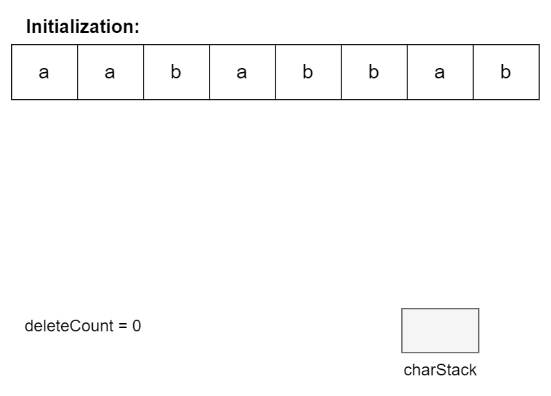
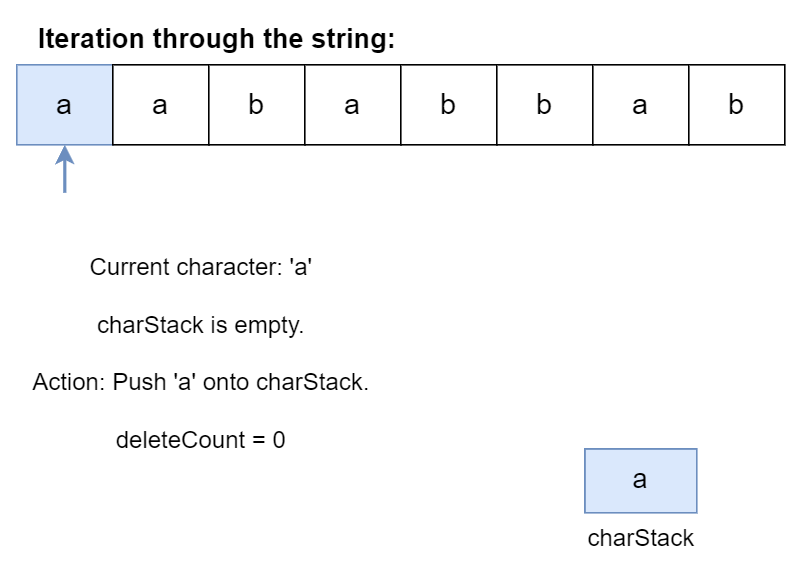
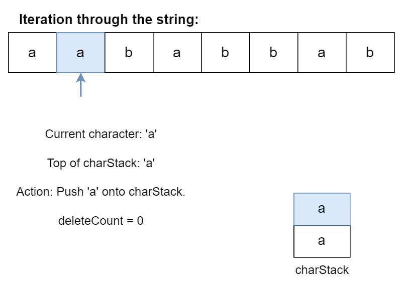
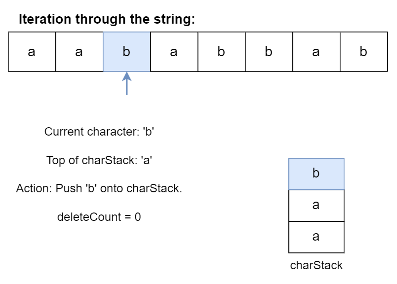
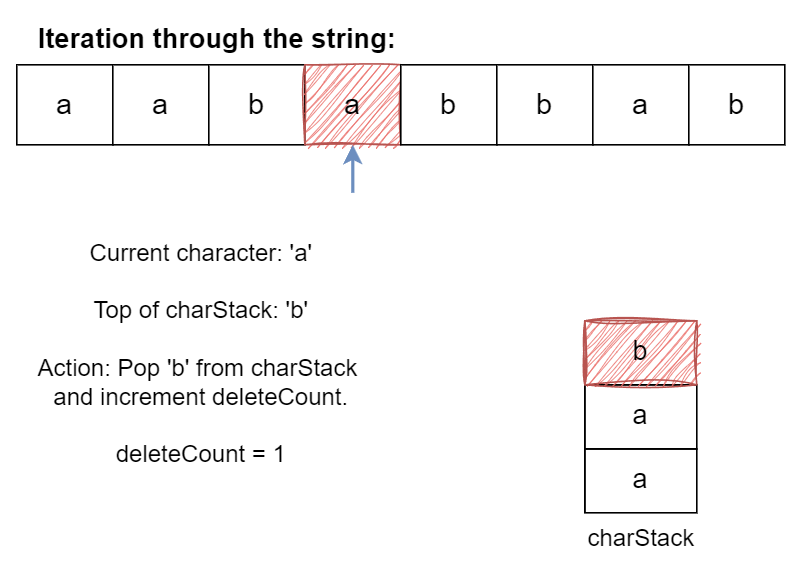
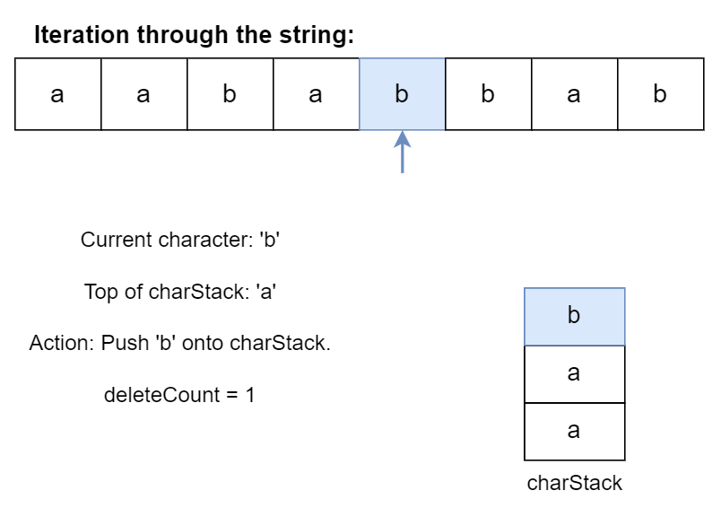
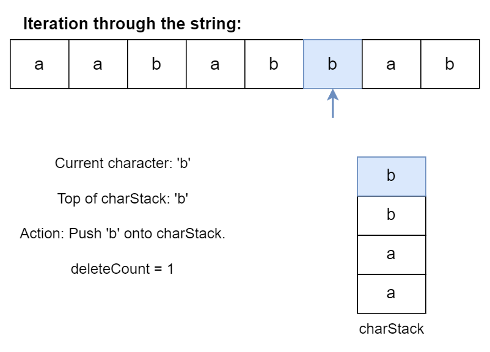
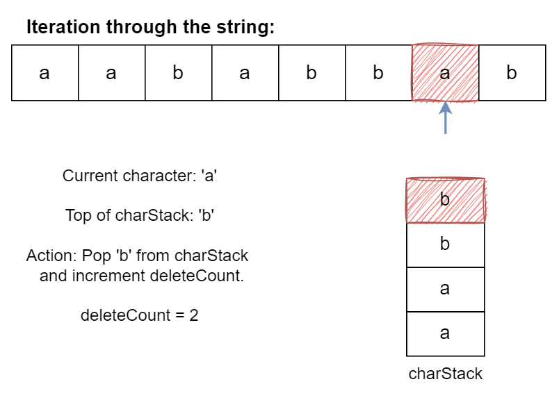
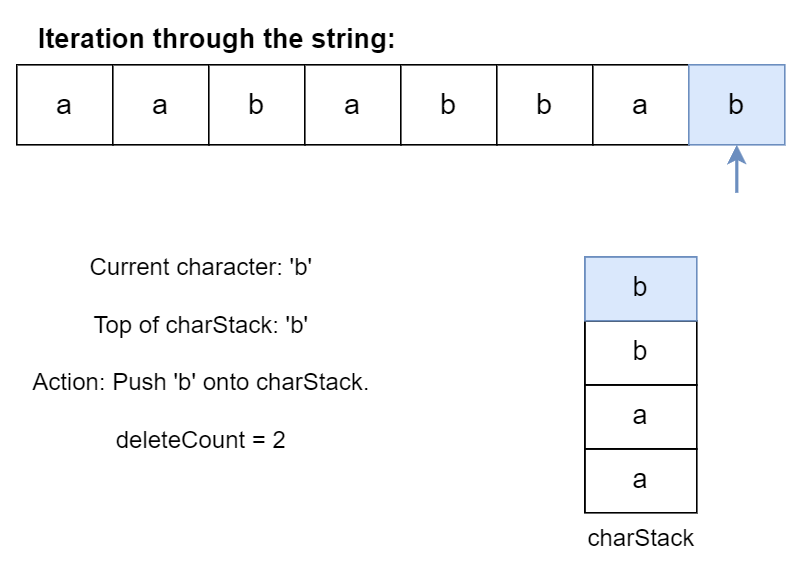

## Solution

---

### Overview

We are given a string `s` containing only two characters: `'a'` and `'b'`. Our goal is to make the string "balanced" by removing any number of characters in the string. A string is considered "balanced" if there are no occurrences where a `'b'` is followed by an `'a'` at any point later in the string.

We have to find the minimum number of deletions required to balance the string. In other words, after all the deletions, when reading the string from left to right, if you see the character `'b'`, there should not be any `'a'` following it.

---

### Approach 1: Three-Pass Count Method

#### Intuition

Each position in the string can be a potential dividing point such that all the characters to the left of that character are `'a'`s and all the characters to the right are `'b'`s. The idea is to find the dividing point that minimizes the number of deletions. For example, in the string $s = aabbabba$, if the dividing point is located at index `2` (0-indexed), two deletions are required to balance `s`. On the other hand, if the dividing point is located at index `5`, three deletions are required to balance `s`.

To implement this, we use three passes through the string. In the first pass, we count and store the number of `'b'`s that occur to the left of each position. In the second pass, we count and store the number of `'a'`s that occur to the right of each position.

We can balance the string around a dividing point by deleting all `'b'`s to the left and all `'a'`s to the right of the point. Thus, in the third pass, we calculate the minimum deletions required at each position by adding the number of `'a'`s to the right and the number of `'b'`s to the left.

By checking every position, we ensure we find the optimal dividing line that minimizes the number of deletions.

#### Algorithm

- Initialize arrays $\text{count}_{a}$ and $\text{count}_{b}$ of size `n` to store counts of `'a'`s and `'b'`s.
- Traverse the string from left to right:
- Update $\text{count}_{b}[i]$ with the cumulative count of `'b'`s encountered so far.
- Traverse the string from right to left:
- Update $\text{count}_{a}[i]$ with the cumulative count of `'a'`s encountered so far.
- Traverse the string from left to right:
- Compute the minimum deletions needed as $\text{count}_{a}[i] + \text{count}_{b}[i]$.
- Return the minimum value computed.

#### Implementation

```python
class Solution:
    def minimumDeletions(self, s: str) -> int:
        n = len(s)
        count_a = [0] * n
        count_b = [0] * n
        b_count = 0

        # First pass: compute count_b which stores the number of
        # 'b' characters to the left of the current position.
        for i in range(n):
            count_b[i] = b_count
            if s[i] == "b":
                b_count += 1

        a_count = 0
        # Second pass: compute count_a which stores the number of
        # 'a' characters to the right of the current position
        for i in range(n - 1, -1, -1):
            count_a[i] = a_count
            if s[i] == "a":
                a_count += 1

        min_deletions = n
        # Third pass: iterate through the string to find the minimum deletions
        for i in range(n):
            min_deletions = min(min_deletions, count_a[i] + count_b[i])
        return min_deletions
```

#### Complexity Analysis

Let $n$ be the length of the string `s`.

- Time complexity: $O(n)$

    The algorithm performs three linear passes over the string.

- Space complexity: $O(n)$

    We use two arrays of size `n` to store counts, resulting in linear space complexity.

---

### Approach 2: Combined Pass Method

#### Intuition

In the previous approach, we traversed the string twice to count and store the number of `'a'`s after and the number of `'b'`s before for each position. We can improve efficiency by merging the two passes into a single pass.

Although we still need to count the occurrences of `'a'`s and `'b'`s, we can optimize our process by avoiding storing the counts of `'b'`s to the left at every position. Instead, we count the `'a'`s while traversing the string from right to left. Then, during the second pass, we count the `'b'`s and simultaneously calculate the minimum deletions required. We achieve this by adding the current number of `'b'`s encountered to the pre-stored count of `'a'`s.

This optimization reduces our passes from three to two, which is an improvement in time efficiency. However, we are still using $O(n)$ extra space to store the `'a'` counts.

#### Algorithm

- Initialize array $\text{count}_{a}$ of size `n` to store counts of `'a'`s from the right.
- Traverse the string from right to left:
- Update $\text{count}_{a}[i]$ with the cumulative count of `'a'`s encountered so far.
- Initialize $b_{count}$ to 0.
- Traverse the string from left to right:
- Compute the minimum deletions needed as $\text{count}_{a}[i] + b_{count}$.
- Update $b_{count}$ with the count of `'b'`s encountered so far.
- Return the minimum value computed.

#### Implementation

```python
class Solution:
    def minimumDeletions(self, s: str) -> int:
        n = len(s)
        count_a = [0] * n
        a_count = 0

        # First pass: compute count_a which stores the number of
        # 'a' characters to the right of the current position
        for i in range(n - 1, -1, -1):
            count_a[i] = a_count
            if s[i] == "a":
                a_count += 1

        min_deletions = n
        b_count = 0
        # Second pass: compute minimum deletions on the fly
        for i in range(n):
            min_deletions = min(count_a[i] + b_count, min_deletions)
            if s[i] == "b":
                b_count += 1

        return min_deletions
```

#### Complexity Analysis

Let $n$ be the length of the string `s`.

* Time complexity: $O(n)$

    The algorithm performs two linear passes over the string.

* Space complexity: $O(n)$

    We use one array of size `n` to store counts, resulting in linear space complexity.

---

### Approach 3: Two-Variable Method

#### Intuition

We can optimize our previous approach even further by using two variables to track the total counts of `'a'`s and `'b'`s. In the first pass, we traverse the string from left to right to count all occurrences of `'a'`. Then, in the second pass, we maintain and update these counts as we move through the string.

As we iterate through the string in the second pass, we keep track of the current number of `'b'`s encountered to the left and the remaining number of `'a'`s to the right. At each position, we calculate the minimum deletions required by adding the current count of `'b'`s to the left and the remaining count of `'a'`s to the right.

#### Algorithm

- Initialize $a_{count}$ to the total number of `'a'`s in the string.
- Initialize $b_{count}$ to 0.
- Initialize $\text{min}_{deletions}$ to the length of the string.
- Traverse the string from left to right:
- If the current character is `'a'`, decrement $a_{count}$.
- Compute the minimum deletions needed as $a_{count} + b_{count}$.
- If the current character is `'b'`, increment $b_{count}$.
- Return the minimum value computed.

#### Implementation

```python
class Solution:
    def minimumDeletions(self, s: str) -> int:
        n = len(s)
        a_count = sum(1 for ch in s if ch == "a")

        b_count = 0
        min_deletions = n

        # Second pass: iterate through the string to compute minimum deletions
        for ch in s:
            if ch == "a":
                a_count -= 1
            min_deletions = min(min_deletions, a_count + b_count)
            if ch == "b":
                b_count += 1

        return min_deletions
```

#### Complexity Analysis

Let $n$ be the length of the string `s`.

- Time complexity: $O(n)$

    The algorithm performs a single linear pass over the string.

- Space complexity: $O(1)$

    We only use constant space auxiliary variables, resulting in constant space complexity.

---

### Approach 4: Using stack (one pass)

#### Intuition

What if we focus on removing "ba" pairs? These pairs unbalance the string because an `'a'` character is to the right of a `'b'` character. By leveraging a stack, we can efficiently count and remove these pairs in a single traversal of the string.

To implement this approach, we traverse the string and push each character onto the stack. When we encounter a "ba" pair—where an `'a'` is on top of the stack and a `'b'` is currently being processed—we pop the `'a'` from the stack, effectively "removing" this out-of-order pair. We keep a count of such removals throughout this process.

However, in the worst case (when no deletions are needed), it still uses $O(n)$ space for the stack.

#### Algorithm

- Initialize an empty stack $\text{char}_{stack}$ and $\text{delete}_{count}$ to 0.
- Traverse the string from left to right:
- If the stack is not empty and the top of the stack is `'b'` and the current character is `'a'`, pop the stack and increment $\text{delete}_{count}$.
- Otherwise, push the current character onto the stack.
- Return $\text{delete}_{count}$.

The algorithm is visualized below:



















#### Implementation

```python
class Solution:
    def minimumDeletions(self, s: str) -> int:
        char_stack = []
        delete_count = 0

        # Iterate through each character in the string
        for char in s:
            # If stack is not empty, top of stack is 'b',
            # and current char is 'a'
            if char_stack and char_stack[-1] == "b" and char == "a":
                char_stack.pop()  # Remove 'b' from stack
                delete_count += 1  # Increment deletion count
            else:
                char_stack.append(char)  # Append current character to stack

        return delete_count
```

#### Complexity Analysis

Let $n$ be the size of string `s`.

* Time complexity: $O(n)$

    The algorithm performs a single linear pass over the string, with stack operations (push and pop) taking $O(1)$ time.

* Space complexity: $O(n)$

    The algorithm uses a stack that may grow up to the size of the string.

---

### Approach 5: Using DP (One Pass)

#### Intuition

Notice that we can use the solution for a smaller subproblem to solve the bigger problem. For example, if we knew how many deletions are required to balance the first 8 characters of the string `s`, we can use this information to find how many deletions are required to balance the first 9 characters of `s`.

Thus, the problem has an optimal substructure, meaning the solution for the entire string can be built from solutions to its prefixes. This leads us to consider a dynamic programming approach.

Let's define the `dp` array such that, $\text{dp}[i]$ is the minimum number of deletions required to balance the substring $s[0 ... i - 1]$. We initialize the first element of the array based on whether the first character of the substring is `'a'` or `'b'`. As we traverse the string, we update the dp array by considering the current character and the state of the previous elements.

The key to this approach is the DP formula used when we encounter an `'a'` character:

```
dp[i + 1] = min(dp[i] + 1, b_count)
```

This formula encapsulates two possible actions:

1. "Remove `'a'`" case ($\text{dp}[i] + 1$):
   This represents the option of deleting the current `'a'`. If we choose to remove it, we need one more deletion than what was required for the previous substring ($\text{dp}[i]$), hence $\text{dp}[i] + 1$.

2. "Keep `'a'`" case ($b_{count}$):
   This represents the option of keeping the current `'a'` and removing all the `'b'`s that came before it. The number of `'b'`s we've seen so far is $b_{count}$, so this is the number of deletions needed if we keep this `'a'`.

We consider these two cases to balance the string:
- By removing `'a'`, we're reducing the number of `'a'`s to match the existing `'b'`s.
- By keeping `'a'` and removing all previous `'b'`s, we're ensuring all `'a'`s come before `'b'`s.

We take the minimum of these two options because we want the least number of deletions. This approach helps balance the string because at each step, we're either making the current prefix end with `'b'` (by removing `'a'`) or making it end with `'a'` (by removing all previous `'b'`s). Both of these actions move us towards a balanced string where all `'a'`s come before all `'b'`s.

The DP approach allows us to solve the problem in a single pass, which is efficient in time. However, it requires $O(n)$ space to store the `dp` array.

#### Algorithm

- Initialize array `dp` of size $n + 1$ to 0, and $b_{count}$ to 0.
- Traverse the string from left to right:
- If the current character is `'b'`, update $dp[i + 1]$ as $\text{dp}[i]$ and increment $b_{count}$.
- If the current character is `'a'`, update $dp[i + 1]$ as $min(\text{dp}[i] + 1, b_{count})$.
- Return $\text{dp}[n]$.

#### Implementation

```python
class Solution:
    def minimumDeletions(self, s: str) -> int:
        n = len(s)
        dp = [0] * (n + 1)
        b_count = 0

        # dp[i]: The number of deletions required to
        # balance the substring s[0, i)
        for i in range(n):
            if s[i] == "b":
                dp[i + 1] = dp[i]
                b_count += 1
            else:
                # Two cases: remove 'a' or keep 'a'
                dp[i + 1] = min(dp[i] + 1, b_count)

        return dp[n]
```

#### Complexity Analysis

Let $n$ be the size of string `s`.

- Time complexity: $O(n)$

    The algorithm performs a single linear pass over the string with updates to the `dp` array.

- Space complexity: $O(n)$

    The algorithm uses requires additional space for the `dp` array.

---

### Approach 6: Optimized DP

#### Intuition

Reviewing our dynamic programming (DP) solution, we observe that calculating the current state only requires knowledge of the previous state and a running count of `'b'`s. This insight indicates that storing the entire DP array is unnecessary. Instead, we can simplify the approach by using a single variable to keep track of the current minimum deletions and update the counts as we process the string.

To implement this optimization, we maintain two variables: one to track the current minimum deletions and another to count the number of `'b'`s encountered up to the current position. As we iterate through each character in the string, we update these variables accordingly. By doing so, we streamline our solution and reduce both time and space complexity, focusing only on the essential information needed to compute the minimum deletions efficiently.

#### Algorithm

- Initialize $\text{min}_{deletions}$ to 0 and $b_{count}$ to 0.
- Traverse the string from left to right:
- If the current character is `'b'`, increment $b_{count}$.
- If the current character is `'a'`, update $\text{min}_{deletions}$ as $min(\text{min}_{deletions} + 1, b_{count})$.
- Return $\text{min}_{deletions}$.

#### Implementation

```python
class Solution:
    def minimumDeletions(self, s: str) -> int:
        min_deletions = 0
        b_count = 0

        # min_deletions variable represents dp[i]
        for ch in s:
            if ch == "b":
                b_count += 1
            else:
                # Two cases: remove 'a' or keep 'a'
                min_deletions = min(min_deletions + 1, b_count)

        return min_deletions
```

#### Complexity Analysis

Let $n$ be the size of string `s`.

* Time complexity: $O(n)$

    The algorithm performs a single linear pass over the string.

* Space complexity: $O(1)$

    The algorithm uses a constant amount of additional space for $\text{min}_{deletions}$ and $b_{count}$.

---