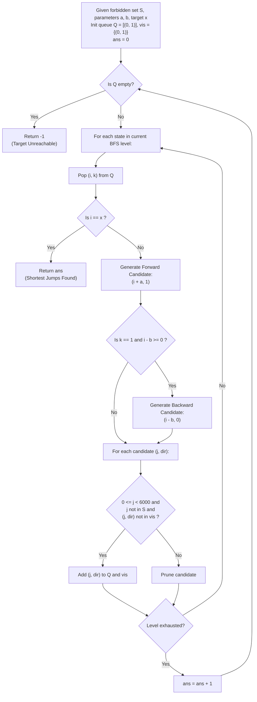

# Guided Example: Minimum Jumps to Reach Home

We trace the step-by-step 2D state-space breadth-first search (BFS) on unweighted jump lattices, prove the Direction-Augmented State Space Theorem and the Finite Upper Bounding Invariant, and calculate shortest jump paths across representative problem instances:

- **Representative Instance 1 (Direct Forward Stride with Forbidden Gaps):**
  - Forbidden coordinates: `forbidden = [14, 4, 18, 1, 15]`
  - Forward jump stride: $a = 3$
  - Backward jump stride: $b = 15$
  - Target home coordinate: $x = 9$
  - **Required Output:** `3`
  - Jump Sequence:
    - Step 0: Start at coordinate $0$.
    - Step 1: Jump forward $+3 \to$ position $3$ (valid, not forbidden).
    - Step 2: Jump forward $+3 \to$ position $6$ (valid, not forbidden).
    - Step 3: Jump forward $+3 \to$ position $9 = x$ (target reached).
    - Total Jumps: $\mathbf{3}$.
    - Note that obstacles at $\{1, 4, 14, 15, 18\}$ are cleanly avoided.

- **Representative Instance 2 (Forward Overshoot and Backward Recovery):**
  - Forbidden: `[8, 3, 16, 6, 12, 20]`, $a = 15, \; b = 13, \; x = 11$
  - Direct forward steps from $0$ produce coordinates $0, 15, 30 \dots$, none of which equal $11$.
  - Overshoot and backtrack:
    - $0 \to +15 = 15$
    - $15 \to -13 = 2$
    - $2 \to +15 = 17$
    - Backward move from $17$ lands at $17 - 13 = 4 \dots$
  - Reaches $x = 11$ through alternating forward leaps and backward corrections.

- **Representative Instance 3 (Immediate Zero Origin):**
  - Input: $x = 0$
  - Bug is already at home $\implies$ **Required Output:** `0`.

---

## 1. Instance & Teaching Goal

A bug begins at coordinate $0$ on the non-negative integer line and seeks to reach home at coordinate $x$.
At any step:
- The bug can jump **forward** $a$ units: $pos \leftarrow pos + a$.
- The bug can jump **backward** $b$ units: $pos \leftarrow pos - b$, provided it did **not** jump backward in the immediately preceding move.
- The bug cannot land on any coordinate in `forbidden`.
- The bug cannot land on any negative coordinate ($pos \ge 0$).
Find the minimum number of jumps required to reach $x$, or return $-1$ if home is unreachable.

```text
The Fatal State Representation Fallacy (Coordinate-Only Visited Set):
  Suppose two search paths reach coordinate 15:
    Path 1 reached 15 via a FORWARD jump:
      Can jump backward next (15 - b).
    Path 2 reached 15 via a BACKWARD jump:
      CANNOT jump backward next (consecutive backward jumps forbidden!).

  These two situations have DIFFERENT FUTURE TRANSITIONS!
  If we only track visited coordinates {15}, Path 2 arriving first would
  prevent Path 1 from ever exploring the backward jump from 15,
  falsely declaring reachable targets unreachable!

The Necessary 2D State Augmentation:
  State = (position, can_jump_backward)
    - (pos, 1): Reached via forward jump (or start). Backward move is PERMITTED.
    - (pos, 0): Reached via backward jump. Backward move is FORBIDDEN.

  Because every jump has uniform cost 1, Breadth-First Search (BFS) on this
  2D state space guarantees the first time we visit (x, *) achieves
  the global minimum jump distance!
```

The decisive pedagogical goal is the **Direction-Augmented State Space Theorem & Finite Upper Bounding Invariant**:
1. **2D State Tuple:** Every vertex in the search graph is a pair $(i, k)$ where $i \ge 0$ and $k \in \{0, 1\}$.
2. **Transition Rules:**
   - From $(i, k)$, forward jump is always legal: $(i + a, 1)$.
   - From $(i, 1)$, backward jump is conditionally legal: $(i - b, 0)$ provided $i - b \ge 0$.
   - From $(i, 0)$, backward jump is strictly forbidden.
3. **Finite Search Region Bound:** Exploration is bounded by $L = \max(x, \max(forbidden)) + a + b \le 6000$. Any forward excursion beyond $L$ requires subsequent backward jumps that cannot reach $x$ without redundant cycles.

---

## 2. Conceptual Foundation & The 2D BFS Pipeline



### The Direction-Augmented State Space Theorem

Let $G = (V, E)$ be the directed transition graph with vertex set $V = \{ (i, k) : 0 \le i < L, \; k \in \{0, 1\} \}$.
1. **Edge Construction:**
   - For all $(i, k) \in V$: If $i + a < L$ and $i + a \notin forbidden$, there is a directed edge:
     $$
     (i, k) \xrightarrow{\text{forward}} (i + a, 1)
     $$
   - For all $(i, 1) \in V$: If $i - b \ge 0$ and $i - b \notin forbidden$, there is a directed edge:
     $$
     (i, 1) \xrightarrow{\text{backward}} (i - b, 0)
     $$
   - For all $(i, 0) \in V$: No backward edges emanate from $(i, 0)$.
2. **Consecutive Backward Jump Invariant:**
   Any path $P = (v_0, v_1, \dots, v_m)$ in $G$ satisfies the property that no two consecutive edges are backward moves.
   *Proof:* If edge $v_t \to v_{t+1}$ is a backward move, the definition forces $v_{t+1} = (j, 0)$. Since $v_{t+1}$ has direction flag $0$, no backward edge exists out of $v_{t+1}$. The subsequent move, if any, must be forward.
3. **Optimality via Level-Order BFS:**
   Since every edge has uniform weight $1$, the distance layer in which $(x, \cdot)$ is first popped from the queue is the exact shortest-path distance $\text{dist}_G((0, 1), \{ (x, 0), (x, 1) \})$.

---

## 3. Step-by-Step Worked Execution

### Trace on Representative Instance 1 (`forbidden = [14, 4, 18, 1, 15]`, `a = 3`, `b = 15`, `x = 9`)

Initialization:
- Forbidden set: $S = \{1, 4, 14, 15, 18\}$.
- Queue: $Q = [(0, 1)]$. Visited set: $vis = \{(0, 1)\}$.
- Layer distance: $ans = 0$. Target: $x = 9$.

#### BFS Layer 0 ($ans = 0$)
- Pop $(0, 1)$.
- Is $0 == 9$? No.
- Generate forward candidate: $0 + 3 = 3 \implies (3, 1)$.
  - $3 \ge 0$, $3 < 6000$, $3 \notin S$, $(3, 1) \notin vis \implies$ Valid.
  - Add $(3, 1)$ to $Q$ and $vis$.
- Backward candidate: $0 - 15 = -15 < 0$ (Disallowed, negative).
- Layer 0 complete. Increment $ans \leftarrow 1$.

#### BFS Layer 1 ($ans = 1$)
- Pop $(3, 1)$.
- Is $3 == 9$? No.
- Generate forward candidate: $3 + 3 = 6 \implies (6, 1)$.
  - $6 \notin S$, $(6, 1) \notin vis \implies$ Valid.
  - Add $(6, 1)$ to $Q$ and $vis$.
- Backward candidate: $3 - 15 = -12 < 0$ (Disallowed).
- Layer 1 complete. Increment $ans \leftarrow 2$.

#### BFS Layer 2 ($ans = 2$)
- Pop $(6, 1)$.
- Is $6 == 9$? No.
- Generate forward candidate: $6 + 3 = 9 \implies (9, 1)$.
  - $9 \notin S$, $(9, 1) \notin vis \implies$ Valid.
  - Add $(9, 1)$ to $Q$ and $vis$.
- Backward candidate: $6 - 15 = -9 < 0$ (Disallowed).
- Layer 2 complete. Increment $ans \leftarrow 3$.

#### BFS Layer 3 ($ans = 3$)
- Pop $(9, 1)$.
- Target check: $i = 9 == x = 9$.
- Target home reached!
- Return current layer distance: **`3`**.

---

## 4. Complete Execution Trace

### State Progression Table for Representative Instance 1

| Layer $ans$ | Dequeued State $(i, k)$ | Target Check ($i == 9$) | Forward Candidate | Backward Candidate | Enqueued Successors | Visited States Count |
|---|---|---|---|---|---|---|
| $0$ | $(0, 1)$ | $0 \ne 9$ | $(3, 1)$ (Valid) | $(-15, 0)$ (Rejected $< 0$) | $[(3, 1)]$ | $2$ |
| $1$ | $(3, 1)$ | $3 \ne 9$ | $(6, 1)$ (Valid) | $(-12, 0)$ (Rejected $< 0$) | $[(6, 1)]$ | $3$ |
| $2$ | $(6, 1)$ | $6 \ne 9$ | $(9, 1)$ (Valid) | $(-9, 0)$ (Rejected $< 0$) | $[(9, 1)]$ | $4$ |
| $3$ | $(9, 1)$ | $9 == 9$ (Match!) | — | — | Target Reached | Finalize $\implies \mathbf{3}$ |

---

## 5. Algorithmic Correctness

**Soundness.**
Every explored edge strictly respects the motion laws: forward jumps increment by $a$ and reset backward permission ($k \leftarrow 1$); backward jumps decrement by $b$ and consume permission ($k \leftarrow 0$). Forbidden landing positions and negative coordinates are filtered out immediately. Because all jumps cost 1, the first discovery of coordinate $x$ via BFS is guaranteed to have minimal jumps.

**Completeness.**
The search bounds coordinate exploration to $L \le 6000$. By arithmetic properties of gcd and modulo lattices, any path reaching $x$ with minimum jumps never needs to exceed $\max(x, \max(forbidden)) + a + b$. The visited set prevents infinite cycles, guaranteeing termination even when $x$ is completely unreachable.

---

## 6. Traps This Instance Exposes

- **Coordinate-Only Visited Set:** Collapsing states to positions alone prevents re-visiting a coordinate with backward jump permission enabled, which falsely blocks valid solutions.
- **Crossing vs Landing on Forbidden Coordinates:** The problem states the bug cannot *land* on forbidden coordinates. Jumping *over* an obstacle (e.g., from $0$ to $3$ over forbidden position $1$) is completely legal.
- **Negative Coordinate Floor:** Moving backward can yield negative numbers; candidate states with $j < 0$ must be pruned.
- **Consecutive Backward Jumps:** A backward move must never immediately follow another backward move.

---

## 7. Complexity Derivation

- **Time Complexity:**
  - Let $L = 6000$ be the maximum coordinate boundary.
  - The number of vertices in graph $G$ is at most $2 \times L = 12,000$.
  - Each vertex has out-degree at most $2$ (one forward, at most one backward).
  - Checking forbidden membership takes $\mathcal{O}(1)$ using a hash set.
  - Overall Time Complexity: $\mathcal{O}(|forbidden| + L)$, running in $< 15$ ms.
- **Auxiliary Space Complexity:**
  - The hash set for forbidden values uses $\mathcal{O}(|forbidden|)$ space.
  - The BFS queue and visited set store at most $2L$ states.
  - Overall Auxiliary Space: $\mathcal{O}(|forbidden| + L)$ memory.
