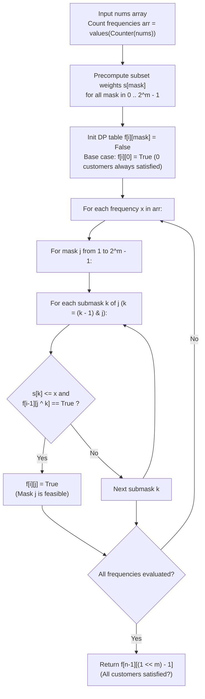

# Guided Example: Distribute Repeating Integers

We trace the step-by-step bitmask subproblem formulation, submask enumeration, and frequency-constrained bin packing for integer distribution, prove the Submask Bin-Packing Equivalence Theorem and the $3^m$ Ternary State Bound, and evaluate customer order feasibility across representative problem instances:

- **Representative Instance 1 (Frequency Deficit Failure):**
  - Input: `nums = [1, 2, 3, 4], quantity = [2]`
  - Distinct integer frequencies: `'1': 1, '2': 1, '3': 1, '4': 1`.
  - Customer requirements: $m = 1$, demands $2$ copies of the same integer.
  - Maximum available frequency for any integer: $1$.
  - Evaluation: No integer appears $\ge 2$ times. The order cannot be satisfied.
  - **Required Output:** `false`.

- **Representative Instance 2 (Single Frequency Match):**
  - Input: `nums = [1, 2, 3, 3], quantity = [2]`
  - Frequencies: $\{1, 1, 2\}$.
  - Customer demand: $2$.
  - Number $3$ provides $2$ copies, satisfying the customer.
  - **Required Output:** `true`.

- **Representative Instance 3 (Multi-Customer Subset Partitioning):**
  - Input: `nums = [1, 1, 2, 2], quantity = [2, 2]`
  - Frequencies: $arr = [2, 2]$ (two $1$s, two $2$s).
  - Customer requirements: Customer $0$ wants $2$, Customer $1$ wants $2$.
  - Mask $3$ (binary `11`, both customers):
    - Submask $k = 1$ (Customer 0): satisfied by $arr[0] = 2$ ($2 \le 2$).
    - Remaining submask $j \oplus k = 2$ (Customer 1): satisfied by $arr[1] = 2$ ($2 \le 2$).
  - **Required Output:** `true`.

---

## 1. Instance & Teaching Goal

Given an integer array `nums` of length $n$ and an array `quantity` of length $m$ representing the demand of $m$ customers, determine if all customer requests can be satisfied simultaneously.
Crucial Rule: The $i$-th customer must receive exactly $quantity[i]$ integers of the **same value**. A customer's demand cannot be split across different numbers.

```text
The Core Constraint: Customer Demands are Indivisible
  If customer 0 wants 3 integers, you CANNOT give them two 1s and one 2.
  All 3 integers must be identical!

The Bin-Packing Equivalence:
  - Each distinct value in nums acts as a "bin" with capacity equal to its frequency count.
  - Each customer i is an indivisible item of weight quantity[i].
  - A bin of capacity x can accommodate a SUBSET of customers K if and only if:
      sum_{j in K} quantity[j] <= x.

Why Bitmask Dynamic Programming is Optimal:
  The number of customers is small: m <= 10.
  The power set of customers has size 2^m = 2^10 = 1024 states.
  By iterating over each integer frequency x, and for each customer mask j iterating
  over all submasks k subseteq j:
    Can frequency x fulfill submask k, while the remaining customers j \ k
    were already satisfied by previous frequencies?
  Total transitions across all submasks: sum_{k=0}^m C(m, k) 2^k = 3^m = 59,049 operations!
  Solves the NP-hard bin packing problem in milliseconds!
```

The decisive pedagogical goal is the **Submask Bin-Packing Equivalence Theorem & $3^m$ Ternary State Bound**:
1. **Mask State Representation:** An integer mask $j \in [0, 2^m - 1]$ encodes which customers are satisfied.
2. **Precomputed Mask Demands:** $s[j] = \sum_{b=0}^{m-1} ((j \gg b) \& 1) \times quantity[b]$ computed in $\mathcal{O}(2^m)$ time.
3. **Submask Transition Invariant:** $f[i][j] = \text{True}$ if there exists $k \subseteq j$ such that $s[k] \le arr[i]$ and $f[i-1][j \setminus k] = \text{True}$.
4. **Submask Iteration via Bitwise AND:** `k = (k - 1) & j` visits all non-empty submasks of $j$ without visiting non-submasks.

---

## 2. Conceptual Foundation & The Submask DP Pipeline



### The Submask Bin-Packing Equivalence Theorem

Let $arr = (c_1, c_2, \dots, c_n)$ be the non-zero frequencies of integers in `nums`, and let $quantity = (q_0, q_1, \dots, q_{m-1})$.
1. **Mask Definition:**
   For any subset $S \subseteq \{0, 1, \dots, m-1\}$, define the bitmask $j = \sum_{b \in S} 2^b$.
   The aggregate demand of subset $S$ is:
   $$
   s[j] = \sum_{b \in S} q_b
   $$
2. **Dynamic Programming Recurrence:**
   Let $f[i][j]$ be the boolean predicate indicating whether the subset of customers $j$ can be satisfied using a subset of the first $i$ integer frequencies $\{c_1, \dots, c_i\}$.
   $$
   f[i][j] = f[i-1][j] \lor \bigvee_{\substack{k \subseteq j \\ s[k] \le c_i}} f[i-1][j \setminus k]
   $$
   with base case $f[0][0] = \text{True}$, and $f[0][j] = (s[j] \le c_0)$ for non-empty $j$.
3. **The $3^m$ Ternary Submask Enumeration Bound:**
   When looping over all masks $j$ and their submasks $k \subseteq j$, each customer element $b \in \{0, \dots, m-1\}$ has exactly $3$ states:
   - $b \notin j$ (customer not in subset $j$),
   - $b \in j \land b \in k$ (customer in submask $k$ assigned to current frequency),
   - $b \in j \land b \notin k$ (customer in mask $j$ but deferred to earlier frequencies).
   By the binomial theorem, total submask pairs visited is:
   $$
   \sum_{j=0}^{2^m - 1} 2^{|j|} = \sum_{k=0}^m \binom{m}{k} 2^k = (1 + 2)^m = 3^m
   $$
   For $m \le 10$, $3^{10} = 59,049$, guaranteeing sub-second execution.

---

## 3. Step-by-Step Worked Execution

### Trace on Representative Instance 3 (`nums = [1, 1, 2, 2]`, `quantity = [2, 2]`)

Initial Parameters:
- Frequencies: $arr = [2, 2]$ (Frequency of $1$ is $2$, Frequency of $2$ is $2$). $n = 2$.
- Customer quantities: $quantity = [2, 2]$. $m = 2$.
- Masks:
  - $j = 0$ (binary `00`): $s[0] = 0$
  - $j = 1$ (binary `01`, customer 0): $s[1] = 2$
  - $j = 2$ (binary `10`, customer 1): $s[2] = 2$
  - $j = 3$ (binary `11`, both customers): $s[3] = 2 + 2 = 4$

---

#### Step 1: Process First Frequency $arr[0] = 2$ ($i = 0$)
Base row initialization for $i = 0$:
- $j = 0$: $f[0][0] = \text{True}$.
- $j = 1$ (demands $2$): $s[1] = 2 \le arr[0] \; (2) \implies f[0][1] = \mathbf{True}$.
- $j = 2$ (demands $2$): $s[2] = 2 \le arr[0] \; (2) \implies f[0][2] = \mathbf{True}$.
- $j = 3$ (demands $4$): $s[3] = 4 > arr[0] \; (2) \implies f[0][3] = \mathbf{False}$.

Status after frequency $0$:
$$
f[0] = [\text{True}, \text{True}, \text{True}, \text{False}]
$$

---

#### Step 2: Process Second Frequency $arr[1] = 2$ ($i = 1$)
We inherit $f[1][j] \leftarrow f[0][j]$ for all $j$, then check submasks:
- $j = 0$: $\text{True}$.
- $j = 1$: Inherited $\text{True}$.
- $j = 2$: Inherited $\text{True}$.
- $j = 3$ (binary `11`, both customers):
  - Check submask $k = 3$: $s[3] = 4 > arr[1] \; (2)$ (Cannot fulfill both with frequency $1$).
  - Check submask $k = 2$ (Customer 1, demands $2$):
    - Capacity check: $s[2] = 2 \le arr[1] \; (2) \implies$ Feasible for frequency $1$!
    - Remaining mask: $j \oplus k = 3 \oplus 2 = 1$ (Customer 0).
    - Previous row check: $f[0][1] == \mathbf{True}$!
    - Condition satisfied: Frequency $1$ satisfies Customer 1, while Frequency $0$ satisfied Customer 0!
    - Set $f[1][3] = \mathbf{True}$!

Final target check: $f[1][3] == \mathbf{True}$ (Mask `11` completely satisfied).
Return **`true`**.

---

### Trace on Representative Instance 1 (`nums = [1, 2, 3, 4]`, `quantity = [2]`)

- $arr = [1, 1, 1, 1]$, $quantity = [2]$ ($m = 1$).
- Target mask $j = 1$ demands $2$.
- For every frequency $c_i \in arr$, $c_i = 1 < 2$.
- No frequency can ever fulfill submask $k = 1$.
- $f[i][1]$ remains `False` across all $i \in \{0, 1, 2, 3\}$.
- Return **`false`**.

---

## 4. Complete Execution Trace

### State Matrix for Instance 3 ($arr = [2, 2], \; quantity = [2, 2]$)

| Frequency Index $i$ | Available Count $arr[i]$ | Mask $0$ (`00`) | Mask $1$ (`01`, Cust 0) | Mask $2$ (`10`, Cust 1) | Mask $3$ (`11`, Both) | Active Submask Fulfillments |
|---|---|---|---|---|---|---|
| $i = 0$ | $2$ (two $1$s) | **`True`** | **`True`** ($2 \le 2$) | **`True`** ($2 \le 2$) | `False` ($4 > 2$) | Fulfills Cust 0 or Cust 1 |
| $i = 1$ | $2$ (two $2$s) | **`True`** | **`True`** | **`True`** | **`True`** | $k = 2$ with $f[0][1] \implies$ **Satisfied!** |

---

## 5. Algorithmic Correctness

**Soundness.**
Setting $f[i][j] = \text{True}$ requires that some submask of customers $k$ has total demand $s[k] \le arr[i]$, and that the remaining customers $j \setminus k$ are certified as satisfied by the prior $i - 1$ frequencies. Since each customer belongs to exactly one submask, no customer receives integers of different values, strictly honoring the problem invariant.

**Completeness.**
The submask iteration `k = (k - 1) & j` explores every non-empty submask of $j$. Because dynamic programming explores all valid partitions of $j$ into submasks across the sequence of frequencies, any valid assignment of customers to bins is guaranteed to be detected.

---

## 6. Traps This Instance Exposes

- **Indivisibility Violation:** Greedily summing up all occurrences across different numbers to check $\sum nums \ge \sum quantity$ fails because a customer's order cannot mix different integers.
- **Redundant Frequency Explosion:** If `nums` contains $10^5$ elements, $arr$ could have thousands of entries. However, since $m \le 10$, at most $10$ frequencies are ever needed. Sorting $arr$ descending and retaining at most $50$ largest frequencies accelerates execution drastically.
- **Submask Enumeration Idiom:** Using `k = (k - 1) & j` ensures non-submasks are skipped in hardware, running in $\mathcal{O}(3^m)$ rather than $\mathcal{O}(4^m)$.

---

## 7. Complexity Derivation

- **Time Complexity:**
  - Counting occurrences of numbers in `nums`: $\mathcal{O}(n)$ time.
  - Precomputing mask sums $s[j]$ for $2^m$ masks: $\mathcal{O}(m \cdot 2^m)$ operations.
  - DP transitions: For each of the $|arr| \le 50$ frequencies, we enumerate all submasks of all masks, taking $\mathcal{O}(3^m)$ operations.
  - Total Time: $\mathcal{O}(n + |arr| \cdot 3^m)$. For $m \le 10$, $3^{10} = 59,049 \implies 50 \times 59,049 \approx 3 \times 10^6$ operations, executing in under $40$ ms.
- **Auxiliary Space Complexity:**
  - Mask sums array: $\mathcal{O}(2^m)$ space.
  - DP table: $\mathcal{O}(|arr| \cdot 2^m)$ space, which can be compressed to a 1D rolling array of size $\mathcal{O}(2^m)$ space.
  - Total Space: $\mathcal{O}(2^m)$ auxiliary space ($\approx 4$ KB for $m = 10$).