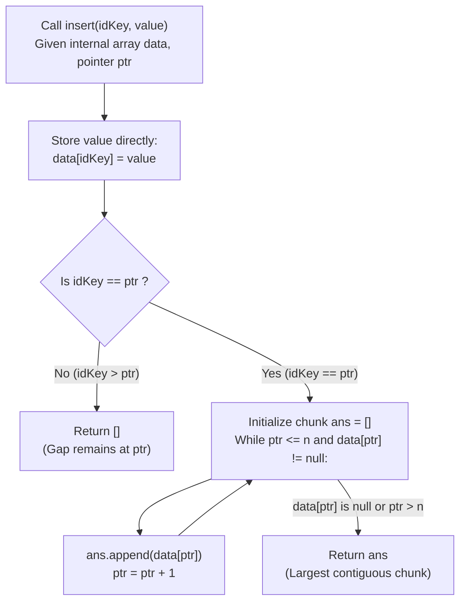

# Guided Example: Design an Ordered Stream

We trace the step-by-step buffer accumulation, contiguous frontier advancement, and packet reassembly for out-of-order streaming protocols, prove the Monotonic Frontier Invariant and Amortized $\mathcal{O}(1)$ Stream Drain Theorem, and evaluate output chunks across representative problem instances:

- **Representative Instance 1 (Out-of-Order Buffering and Cascading Drain):**
  - Stream Capacity: $n = 5$
  - Initial State: Array `data` of size $6$ (indices $0 \dots 5$), frontier pointer $ptr = 1$.
  - Operations and Outputs:
    1. `insert(3, "ccccc")`: $idKey = 3 > ptr = 1$. Buffered at index $3$. Returns `[]`.
    2. `insert(1, "aaaaa")`: $idKey = 1 == ptr = 1$. Emits `["aaaaa"]`, pointer advances to $ptr = 2$.
    3. `insert(2, "bbbbb")`: $idKey = 2 == ptr = 2$. Emits index $2$ (`"bbbbb"`), then detects pre-buffered index $3$ (`"ccccc"`). Emits `["bbbbb", "ccccc"]`, pointer advances to $ptr = 4$.
    4. `insert(5, "eeeee")`: $idKey = 5 > ptr = 4$. Buffered at index $5$. Returns `[]`.
    5. `insert(4, "ddddd")`: $idKey = 4 == ptr = 4$. Emits index $4$ (`"ddddd"`), then detects pre-buffered index $5$ (`"eeeee"`). Emits `["ddddd", "eeeee"]`, pointer advances to $ptr = 6$.
  - Sequence of returned chunks: `[[], ["aaaaa"], ["bbbbb", "ccccc"], [], ["ddddd", "eeeee"]]`.

- **Representative Instance 2 (Strict Sequential Arrival):**
  - $n = 3$, insertions arrive in order: $(1, \text{"a"}), (2, \text{"b"}), (3, \text{"c"})$.
  - Every insertion immediately matches $ptr$: outputs `[["a"], ["b"], ["c"]]`.

- **Representative Instance 3 (Reverse Arrival Single Final Flush):**
  - $n = 3$, insertions arrive in reverse order: $(3, \text{"c"}), (2, \text{"b"}), (1, \text{"a"})$.
  - Operations $1$ and $2$ return `[]`. Operation $3$ unblocks the entire stream, returning `["a", "b", "c"]`.

---

## 1. Instance & Teaching Goal

We design an ordered stream data structure that accepts a stream of $n$ `(idKey, value)` pairs arriving in arbitrary order, where $idKey \in [1, n]$ and each $idKey$ is distinct. Each call to `insert(idKey, value)` must return the largest possible consecutive chunk of values starting from the stream's current frontier pointer $ptr$, ordered by increasing $idKey$. Once a value is emitted, it is never emitted again.

```text
The Core Architectural Paradigm: Network Packet Reassembly (TCP Window)
  In packet transmission, network packets often arrive out of sequence:
    Packet 3 arrives first --> MUST BE BUFFERED (cannot be processed yet).
    Packet 1 arrives       --> Immediately delivered to application.
    Packet 2 arrives       --> Delivers Packet 2 AND unblocks buffered Packet 3!

Why Sorting and Searching are Unnecessary:
  - If we sort stored packets on each insert: O(n log n) per operation (expensive!).
  - If we maintain a min-heap: O(log n) overhead per operation.

The Frontier Pointer Invariant:
  We maintain an array data of size n + 1 and a scalar pointer ptr = 1.
  When (idKey, value) arrives:
    1. Directly store data[idKey] = value in O(1) time.
    2. If idKey == ptr, drain consecutive non-null values while advancing ptr!
    3. If idKey > ptr, do nothing (return empty list).

  Because ptr starts at 1 and only ever moves forward up to n + 1,
  the while loop runs at most n times ACROSS THE ENTIRE LIFETIME of the stream!
  Every insertion runs in AMORTIZED O(1) TIME!
```

The decisive pedagogical goal is the **Monotonic Frontier Invariant & Amortized $\mathcal{O}(1)$ Stream Drain Theorem**:
1. **Contiguous Prefix Guarantee:** All IDs in $[1, ptr - 1]$ have been returned in strictly increasing order.
2. **First Missing Key:** Index $ptr$ is the smallest ID that has not yet been emitted.
3. **Amortized Complexity:** Across all $n$ insertions, $ptr$ increments exactly $n$ times, yielding $\mathcal{O}(1)$ amortized time per insertion and $\mathcal{O}(n)$ total time.

---

## 2. Conceptual Foundation & The Reassembly Pipeline



### The Monotonic Frontier Invariant & Amortized Bound Theorem

Let $\mathcal{U}_t \subseteq \{1, \dots, n\}$ be the set of IDs inserted up to step $t$.
1. **Frontier Invariant Formulation:**
   At any step $t$, the internal pointer $ptr_t$ satisfies:
   $$
   \{1, 2, \dots, ptr_t - 1\} \subseteq \mathcal{U}_t \quad \text{and} \quad ptr_t \notin \text{Emitted}_t
   $$
   Specifically, every index $k < ptr_t$ has been emitted in a previous chunk, while $ptr_t$ is the unique minimal missing element in the emitted set.
2. **Chunk Maximality:**
   When $data[ptr_t] \ne null$, the while loop drains elements until index $ptr_{t+1}$ where $data[ptr_{t+1}] = null$ (or $ptr_{t+1} = n + 1$).
   Any subset of values including an index $> ptr_{t+1}$ would skip the gap at $ptr_{t+1}$, violating the requirement for consecutive ordered output. Hence, the chunk is maximal.
3. **Amortized Constant Time:**
   Let the potential function be $\Phi = n - ptr$.
   Each time $ptr$ increments, $\Phi$ decreases by $1$. Since $1 \le ptr \le n + 1$, the total number of while-loop iterations across all $n$ calls to `insert` is bounded by $n$.
   Therefore, the amortized cost per `insert` is:
   $$
   \frac{1}{n} \sum_{t=1}^n \mathcal{O}(1 + \text{chunk\_size}_t) = \mathcal{O}(1)
   $$

---

## 3. Step-by-Step Worked Execution

### Detailed Trace on Representative Instance 1 ($n = 5$)

Initialization:
- Allocate `data` of length $6$: `[None, None, None, None, None, None]`.
- Set frontier: $ptr = 1$.

#### Call 1: `insert(3, "ccccc")`
- Store: `data[3] = "ccccc"`.
- Check condition: `data[ptr] == data[1] == None`.
- The frontier slot $1$ is empty. No contiguous chunk can start.
- Loop does not execute. Pointer remains $ptr = 1$.
- Return: **`[]`**.

#### Call 2: `insert(1, "aaaaa")`
- Store: `data[1] = "aaaaa"`.
- Check condition: `data[ptr] == data[1] != None`.
- Loop starts at $ptr = 1$:
  - Append `data[1]` (`"aaaaa"`).
  - Advance pointer: $ptr \leftarrow 2$.
  - Next slot: `data[2] == None` (loop halts).
- Frontier is now $ptr = 2$.
- Return: **`["aaaaa"]`**.

#### Call 3: `insert(2, "bbbbb")`
- Store: `data[2] = "bbbbb"`.
- Check condition: `data[ptr] == data[2] != None`.
- Loop starts at $ptr = 2$:
  - Iteration 1:
    - Append `data[2]` (`"bbbbb"`).
    - Advance pointer: $ptr \leftarrow 3$.
  - Iteration 2:
    - Check `data[3]`: It already holds `"ccccc"` from Call 1!
    - Append `data[3]` (`"ccccc"`).
    - Advance pointer: $ptr \leftarrow 4$.
  - Iteration 3:
    - Check `data[4]`: `data[4] == None` (loop halts).
- Frontier is now $ptr = 4$.
- Return: **`["bbbbb", "ccccc"]`**.

#### Call 4: `insert(5, "eeeee")`
- Store: `data[5] = "eeeee"`.
- Check condition: `data[ptr] == data[4] == None`.
- Frontier slot $4$ is empty.
- Return: **`[]`**. Pointer remains $ptr = 4$.

#### Call 5: `insert(4, "ddddd")`
- Store: `data[4] = "ddddd"`.
- Check condition: `data[ptr] == data[4] != None`.
- Loop starts at $ptr = 4$:
  - Iteration 1:
    - Append `data[4]` (`"ddddd"`).
    - Advance pointer: $ptr \leftarrow 5$.
  - Iteration 2:
    - Check `data[5]`: Holds `"eeeee"` from Call 4!
    - Append `data[5]` (`"eeeee"`).
    - Advance pointer: $ptr \leftarrow 6$.
  - Iteration 3:
    - $ptr = 6 == \text{len}(data)$ (boundary reached, loop halts).
- Frontier is now $ptr = 6$.
- Return: **`["ddddd", "eeeee"]`**.

---

## 4. Complete Execution Trace

### State Progression Table for Representative Instance 1

| Call # | Operation | Input $(idKey, val)$ | Buffer State `data[1..5]` | $ptr$ Before | While Iterations | Emitted Chunk | $ptr$ After |
|---|---|---|---|---|---|---|---|
| Init | `__init__(5)` | — | `[null, null, null, null, null]` | $1$ | — | — | $1$ |
| 1 | `insert` | $(3, \text{"ccccc"})$ | `[null, null, "ccccc", null, null]` | $1$ | $0$ (slot $1$ null) | `[]` | $1$ |
| 2 | `insert` | $(1, \text{"aaaaa"})$ | `["aaaaa", null, "ccccc", null, null]` | $1$ | $1$ (drains $1$) | `["aaaaa"]` | $2$ |
| 3 | `insert` | $(2, \text{"bbbbb"})$ | `["aaaaa", "bbbbb", "ccccc", null, null]` | $2$ | $2$ (drains $2, 3$) | `["bbbbb", "ccccc"]` | $4$ |
| 4 | `insert` | $(5, \text{"eeeee"})$ | `["aaaaa", "bbbbb", "ccccc", null, "eeeee"]` | $4$ | $0$ (slot $4$ null) | `[]` | $4$ |
| 5 | `insert` | $(4, \text{"ddddd"})$ | `["aaaaa", "bbbbb", "ccccc", "ddddd", "eeeee"]` | $4$ | $2$ (drains $4, 5$) | `["ddddd", "eeeee"]` | $6$ |

---

## 5. Algorithmic Correctness

**Soundness.**
Values are placed into `data` at their 1-based index $idKey$. Because every returned list begins strictly at the current $ptr$ and advances by $1$ until encountering an empty cell, the returned chunk is guaranteed to consist of strictly consecutive, previously un-emitted IDs.

**Completeness.**
Every unique $idKey \in [1, n]$ arrives exactly once. Since $ptr$ only halts when encountering an unassigned slot, once all $n$ keys have arrived, all $n$ values will have been drained, and $ptr$ will terminate at $n + 1$. No value can be permanently stranded in the buffer.

---

## 6. Traps This Instance Exposes

- **1-Based Indexing Alignment:** The IDs range from $1$ to $n$. Allocating an array of size $n + 1$ allows direct indexing `data[idKey]` without subtraction errors.
- **Empty String vs Null:** Checking `data[ptr]` directly works when strings are non-empty, but if empty strings `""` were allowed as valid values, checking truthiness would mistake `""` for an unassigned slot. Using explicit sentinel comparison (`data[ptr] is not None`) is the robust approach.
- **Array Bounds on Final Element:** When $idKey = n$ is drained, $ptr$ increments to $n + 1$. The loop condition must verify $ptr < \text{len}(data)$ *before* dereferencing `data[ptr]` to prevent `IndexError`.

---

## 7. Complexity Derivation

- **Time Complexity:**
  - Initialization: Allocating an array of size $n + 1$ takes $\mathcal{O}(n)$ time.
  - Per `insert` Call:
    - Writing `data[idKey] = value` takes $\mathcal{O}(1)$ time.
    - Advancing $ptr$ takes $\mathcal{O}(k)$ time, where $k$ is the number of elements emitted in that call.
    - Across all $n$ calls to `insert`, $ptr$ moves from $1$ to $n + 1$, taking exactly $n$ total increments.
    - Total Time for $n$ operations: strictly $\mathcal{O}(n)$, yielding an **amortized $\mathcal{O}(1)$ time per operation**.
- **Auxiliary Space Complexity:**
  - The array `data` stores $n + 1$ string references.
  - Overall Auxiliary Space: $\mathcal{O}(n)$ memory.
