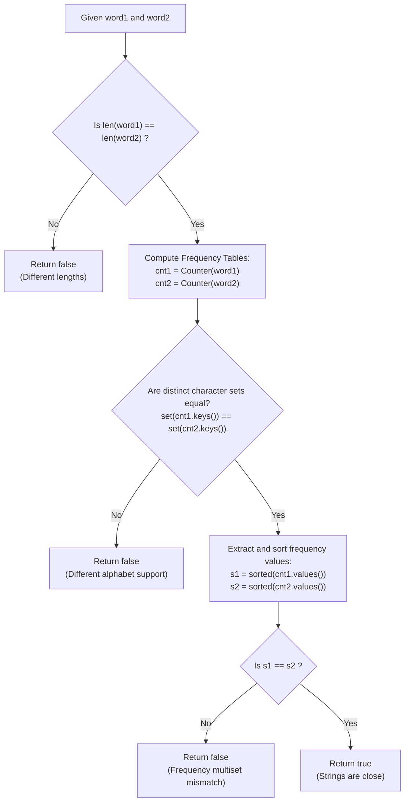

# Guided Example: Determine if Two Strings Are Close

We trace the step-by-step invariant extraction and algebraic equivalence verification for string closeness, prove the Character Support and Frequency Multiset Invariant Theorem, and evaluate transformational feasibility across representative problem instances:

- **Representative Instance 1 (Frequency Transposition via Character Swap):**
  - Input: `word1 = "cabbba", word2 = "abbccc"`
  - Character Counts for `word1`:
    - `'a': 2`, `'b': 3`, `'c': 1`
    - Character support: $\{\text{'a'}, \text{'b'}, \text{'c'}\}$
    - Sorted frequency multiset: $[1, 2, 3]$
  - Character Counts for `word2`:
    - `'a': 1`, `'b': 2`, `'c': 3`
    - Character support: $\{\text{'a'}, \text{'b'}, \text{'c'}\}$
    - Sorted frequency multiset: $[1, 2, 3]$
  - Evaluation:
    - Supports match: $\{\text{'a'}, \text{'b'}, \text{'c'}\} == \{\text{'a'}, \text{'b'}, \text{'c'}\}$ (True).
    - Frequency multisets match: $[1, 2, 3] == [1, 2, 3]$ (True).
  - **Required Output:** `true`

- **Representative Instance 2 (Identical Frequencies with Disjoint Alphabets):**
  - Input: `word1 = "uau", word2 = "xax"`
  - Frequencies for `word1`: `'a': 1, 'u': 2` $\implies [1, 2]$.
  - Frequencies for `word2`: `'a': 1, 'x': 2` $\implies [1, 2]$.
  - Supports: $\{\text{'a'}, \text{'u'}\} \ne \{\text{'a'}, \text{'x'}\}$ (character `'u'` cannot be transformed into `'x'` because `'x'` is absent from `word1`).
  - **Required Output:** `false`.

- **Representative Instance 3 (Frequency Multiset Mismatch):**
  - Input: `word1 = "a", word2 = "aa"`
  - Lengths and frequencies differ: $[1] \ne [2]$.
  - **Required Output:** `false`.

---

## 1. Instance & Teaching Goal

Two strings are called **close** if one can be transformed into the other using any combination of two operations:
- **Operation 1 (Positional Swap):** Swap any two existing characters in the string: $s[i] \leftrightarrow s[j]$.
- **Operation 2 (Character Identity Swap):** Transform every occurrence of one existing character into another existing character, and vice versa (e.g., replace all `'b'`s with `'c'`s and all `'c'`s with `'b'`s).

```text
The Search Space Fallacy (Simulating Jumps):
  Attempting to execute BFS or backtracking to find a sequence of swaps
  leads to a branching explosion of size O((n^2 + 26^2)^d), causing TLE.

The Two Fundamental Invariants of the Operations:
  1. What Operation 1 preserves:
     - The EXACT frequency count of every character.
     - Positional swaps can generate ANY permutation of characters!
     - Any two strings with IDENTICAL character frequency histograms
       are anagrams and can be reached via Operation 1 alone!

  2. What Operation 2 preserves:
     - The SUPPORT SET of distinct characters (an absent character can never be created).
     - The MULTISET of frequency counts (swapping 'b' (count 3) and 'c' (count 1)
       exchanges the counts 3 and 1 among existing letters, but the set of counts
       remains {1, 2, 3}).

The Decisive Theorem:
  word1 can be transformed into word2 IF AND ONLY IF:
    1. set(characters in word1) == set(characters in word2)
    2. sorted(frequencies of word1) == sorted(frequencies of word2)
```

The decisive pedagogical goal is the **Character Support and Frequency Multiset Invariant Theorem**:
1. **Support Equality:** Both strings must contain the exact same set of unique characters.
2. **Frequency Multiset Equality:** The unordered collection of character counts must match identically.
3. **Sufficiency of Invariants:** If both conditions hold, a finite sequence of Operation 2 character swaps can align the counts of matching characters, after which Operation 1 positional swaps transform the anagram into the exact target string.

---

## 2. Conceptual Foundation & The Verification Pipeline



### The Character Support and Frequency Multiset Invariant Theorem

Let $\Sigma$ be the finite alphabet, and let $w_1, w_2 \in \Sigma^*$ have lengths $|w_1| = |w_2| = n$.
Define the character support $\text{supp}(w) = \{ c \in \Sigma : \text{count}_w(c) > 0 \}$ and the frequency multiset $\mathcal{F}(w) = \{ \text{count}_w(c) : c \in \text{supp}(w) \}$.
1. **Necessity of Support Invariance:**
   - Operation 1 swaps indices without changing character identities: $\text{supp}(\text{Op}_1(w)) = \text{supp}(w)$.
   - Operation 2 exchanges all occurrences of $c_a \in \text{supp}(w)$ with $c_b \in \text{supp}(w)$. Since both $c_a$ and $c_b$ must already exist in $w$, their post-swap frequencies remain positive, and no absent character $c \notin \text{supp}(w)$ is introduced: $\text{supp}(\text{Op}_2(w)) = \text{supp}(w)$.
   - Hence, $\text{supp}(w_1) = \text{supp}(w_2)$ is strictly necessary.
2. **Necessity of Frequency Multiset Invariance:**
   - Operation 1 preserves all individual character counts: $\mathcal{F}(\text{Op}_1(w)) = \mathcal{F}(w)$.
   - Operation 2 transposes the counts of $c_a$ and $c_b$. Transposing two elements in a multiset preserves the multiset: $\mathcal{F}(\text{Op}_2(w)) = \mathcal{F}(w)$.
   - Hence, $\mathcal{F}(w_1) = \mathcal{F}(w_2)$ is strictly necessary.
3. **Sufficiency via Constructive Decomposition:**
   Suppose $\text{supp}(w_1) = \text{supp}(w_2) = S$ and $\mathcal{F}(w_1) = \mathcal{F}(w_2)$.
   - Since the multisets of frequencies are identical, there exists a permutation $\pi$ of $S$ such that $\text{count}_{w_1}(c) = \text{count}_{w_2}(\pi(c))$ for all $c \in S$.
   - Any permutation $\pi$ can be decomposed into a product of transpositions. Each transposition corresponds to exactly one application of Operation 2. Applying this sequence of Operation 2 swaps transforms $w_1$ into an intermediate string $w'$ where $\text{count}_{w'}(c) = \text{count}_{w_2}(c)$ for all $c \in S$.
   - The strings $w'$ and $w_2$ are anagrams. Any anagram can be transformed into the target string via a sequence of adjacent or general swaps (Operation 1).
   - Thus, the conditions are both necessary and sufficient.

---

## 3. Step-by-Step Worked Execution

### Trace on Representative Instance 1 (`word1 = "cabbba"`, `word2 = "abbccc"`)

#### Step 1: Compute Character Frequencies
- For `word1 = "cabbba"`:
  - `'c'`: $1$ occurrence
  - `'a'`: $2$ occurrences
  - `'b'`: $3$ occurrences
  - $cnt_1 = \{\text{'c'}: 1, \; \text{'a'}: 2, \; \text{'b'}: 3\}$.
- For `word2 = "abbccc"`:
  - `'a'`: $1$ occurrence
  - `'b'`: $2$ occurrences
  - `'c'`: $3$ occurrences
  - $cnt_2 = \{\text{'a'}: 1, \; \text{'b'}: 2, \; \text{'c'}: 3\}$.

#### Step 2: Test Character Support Invariant
- Unique characters in `word1`:
  $$
  S_1 = \text{keys}(cnt_1) = \{\text{'a'}, \text{'b'}, \text{'c'}\}
  $$
- Unique characters in `word2`:
  $$
  S_2 = \text{keys}(cnt_2) = \{\text{'a'}, \text{'b'}, \text{'c'}\}
  $$
- Comparison: $S_1 == S_2 \implies \mathbf{True}$. Both words utilize the identical alphabet.

#### Step 3: Test Frequency Multiset Invariant
- Frequency values of `word1`: $[1, 2, 3]$.
  - Sorted: $F_1 = [1, 2, 3]$.
- Frequency values of `word2`: $[1, 2, 3]$.
  - Sorted: $F_2 = [1, 2, 3]$.
- Comparison: $F_1 == F_2 \implies [1, 2, 3] == [1, 2, 3] \implies \mathbf{True}$.

#### Step 4: Constructive Transformation Verification
1. Start with `word1 = "cabbba"` ($a: 2, b: 3, c: 1$).
2. Apply Operation 2 between `'b'` and `'c'`:
   - Replaces all `'b'` with `'c'` and `'c'` with `'b'`.
   - Result: `"baccca"` ($a: 2, b: 1, c: 3$).
3. Apply Operation 2 between `'a'` and `'b'`:
   - Replaces all `'a'` with `'b'` and `'b'` with `'a'`.
   - Result: `"abcccb"` ($a: 1, b: 2, c: 3$).
4. Now character counts match `word2`: both have $a: 1, b: 2, c: 3$.
5. Apply Operation 1 (swap positions $4$ and $5$):
   - `"abcccb"` transforms via swap to `"abbccc"` $= word2$.

Output: **`true`**.

---

### Trace on Representative Instance 2 (`word1 = "uau"`, `word2 = "xax"`)

- $cnt_1 = \{\text{'a'}: 1, \; \text{'u'}: 2\}$. Frequencies: $[1, 2]$. Support: $\{\text{'a'}, \text{'u'}\}$.
- $cnt_2 = \{\text{'a'}: 1, \; \text{'x'}: 2\}$. Frequencies: $[1, 2]$. Support: $\{\text{'a'}, \text{'x'}\}$.
- Support Comparison:
  $$
  \{\text{'a'}, \text{'u'}\} \ne \{\text{'a'}, \text{'x'}\} \implies \mathbf{False}
  $$
- Operation 2 requires both participating letters to exist in the word. Since `'x'` is absent in `word1`, `'x'` can never be created.
- Output: **`false`**.

---

## 4. Complete Execution Trace

### State Progression Table for Diverse Verification Scenarios

| Scenario | `word1` | `word2` | Support $S_1$ vs $S_2$ | Frequency $F_1$ vs $F_2$ | Evaluation | Closeness Result |
|---|---|---|---|---|---|---|
| Instance 1 | `"cabbba"` | `"abbccc"` | $\{a, b, c\} == \{a, b, c\}$ | $[1, 2, 3] == [1, 2, 3]$ | Valid | **`true`** |
| Instance 2 | `"uau"` | `"xax"` | $\{a, u\} \ne \{a, x\}$ | $[1, 2] == [1, 2]$ | Support Mismatch | **`false`** |
| Instance 3 | `"a"` | `"aa"` | $\{a\} == \{a\}$ | $[1] \ne [2]$ | Frequency Mismatch | **`false`** |
| Anagram | `"abc"` | `"bca"` | $\{a, b, c\} == \{a, b, c\}$ | $[1, 1, 1] == [1, 1, 1]$ | Valid (Op 1 only) | **`true`** |
| Multiplicity | `"aaabb"` | `"aabbb"` | $\{a, b\} == \{a, b\}$ | $[2, 3] == [2, 3]$ | Valid (Op 2 swap) | **`true`** |

---

## 5. Algorithmic Correctness

**Soundness.**
The algebraic properties of positional permutations and character label transpositions preserve the set of existing characters and the multiset of integer frequencies. Any violation of either condition provably prevents transformation.

**Completeness.**
When both conditions hold, the Symmetric Group $S_{|S|}$ acts transitively on the frequency multiset to equalize character counts, after which the symmetric group on string indices $S_n$ aligns the characters into the exact target sequence. Thus, every valid pair is detected.

---

## 6. Traps This Instance Exposes

- **Overlooking Character Support:** Checking only that `sorted(cnt1.values()) == sorted(cnt2.values())` produces false positives for strings with disjoint alphabets (e.g., `"uau"` and `"xax"`).
- **Overlooking Frequency Counts:** Checking only that `set(word1) == set(word2)` produces false positives for strings with incompatible counts (e.g., `"aaabb"` and `"ab"`).
- **String Length Inequality:** If lengths differ, the sum of frequencies differs, so sorted frequency lists naturally fail equality without needing a separate length branch.
- **Alphabet Size Constraint:** Since inputs consist only of lowercase English letters, $|\Sigma| = 26$. Sorting at most 26 integers takes constant time.

---

## 7. Complexity Derivation

- **Time Complexity:**
  - Counting character frequencies in `word1` (length $N$) and `word2` (length $M$): $\mathcal{O}(N + M)$ time.
  - Comparing character sets of size at most $|\Sigma| = 26$: $\mathcal{O}(|\Sigma|)$ operations.
  - Sorting at most 26 frequency counts: $\mathcal{O}(|\Sigma| \log |\Sigma|) \le 26 \log_2 26 \approx 122$ operations, which is $\mathcal{O}(1)$.
  - Overall Time Complexity: strictly $\mathcal{O}(N + M)$ linear time, executing in $< 15$ ms for $N, M \le 10^5$.
- **Auxiliary Space Complexity:**
  - Hash tables and sets store at most 26 entries.
  - Overall Auxiliary Space: $\mathcal{O}(|\Sigma|)$ space (strictly $\mathcal{O}(1)$ relative to string length).
