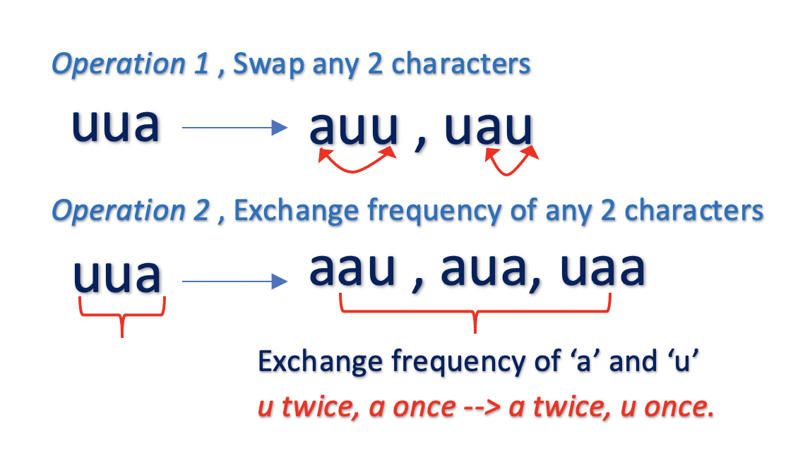
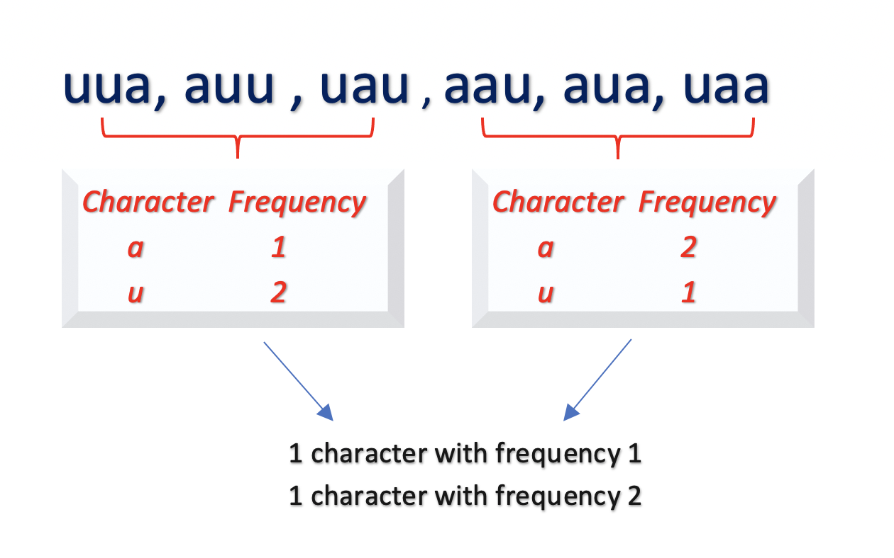
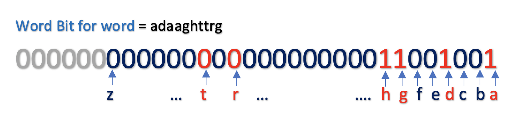

[TOC]

## Solution
---
#### Overview ####

Our aim is to determine if the given 2 strings are close. The problem states that the strings are _close_ if we could perform certain operations on either one string or both strings any number of times and make those strings equal.
We could perform the following transformations,

_Operation 1_ : Swapping any 2 characters (a**a**b**c** -> a**c**b**a**).

_Operation 2_ : Exchanging the occurrence of any 2 characters (**aa**b**cc** -> **cc**b**aa** OR **a**b**cc** -> **cc**b**a**).

Now, performing these 2 operations for every 2 characters in strings and determining the closeness after every operation would be costly. How can we optimize it?

From the given operations, we could observe that if any 2 strings are close, they always satisfy follow conditions,

**Condition 1**: Every character that exists in `word1` must exist in `word2` as well, irrespective of the frequency.

Let's understand this condition with an example. The following figure illustrates the valid transformations of a string `uua` on applying operations 1 and 2.



In all the transformations of string `uua`, the character `u` and `a` are always present. Thus, if any string is close to `uua` it must contain the characters `u` and `a`.

**Condition 2**: The frequency of all the characters is always the same. In the above example for string `uua`, regardless of the operation, following condition always holds :

There exists 1 character that occurs once $(frequency = 1)$ and 1 character that occurs twice $(frequency = 2)$

The following figure illustrates that all the transformations of `uua` follows this condition.



Based on these insights, let's implement the solution using different approaches.

---
#### Approach 1: Using HashMap

**Intuition**

As discussed above, we have to check for the following conditions to determine if given strings `word1` and `word1` are close:
- The strings `word1` and `word2` must have the same characters (_Condition 1_).

   We can build a set that contains the characters in word1 and word2 and check if both sets are equal.

- The occurrence or frequency of characters in `word1` and `word2` must be the same. (_Condition 2_).

    One way to get the frequency of each character in a string is to use a hashmap. We could build a hashmap with each character as a key and it's frequency as a value of hashmap. Now, we have to verify if there are equal number of characters with a particular frequency. For this, we can sort the frequency values in the hashmap and check for equality.

> Instead of building a separate set to check for _Condition 1_, we can only build one hashmap and check if the keys (that represent each character in the string) are present in both maps.

**Algorithm**
- Initialize hashmaps `word1Map` and `word2Map` for strings `word1` and `word2` respectively.
- Iterate over each word and build its hashmap where the key is the individual character of the word and value is the frequency of that character.
- To check if characters in `word1` and `word2` are the same, we must check if the key values of hashmaps `word1Map` and `word2Map` are the same.
- Now, to check the occurrence, we must sort the values of both hashmaps in increasing order and check for equality.

**Implementation**

```python
class Solution:
    def closeStrings(self, word1: str, word2: str) -> bool:
        if len(word1) != len(word2):
            return False

        word1_elem_freq = Counter(word1)
        word2_elem_freq = Counter(word2)

        return set(word1_elem_freq) == set(word2_elem_freq) and sorted(word1_elem_freq.values()) == sorted(word2_elem_freq.values())
```

**Complexity Analysis**

- Time Complexity: $\mathcal{O}(n)$. We iterate over each word to build the hashmap which would take $\mathcal{O}(n)$ time.
  Further, we sort the character keys and frequency values of each hashmap. The maximum size of hashmap would be $26$, as we store each character `a-z` only once. In the worst case, all the sort operations would take $\mathcal{O}(26 \log 26)$ time to sort those frequency values.
This gives us total time complexity as $\mathcal{O}(n)$.

- Space Complexity: $\mathcal{O}(1)$, as the maximum size of each hashmap would be $26$, we are using constant extra space.

---

#### Approach 2: Using Frequency Array Map

**Intuition**

We know that the string contains all the lowercase characters `(a-z)` only. So, instead of using a hashmap to track the frequency of characters, we could build an array of size $26$ as a frequency map, where each array element represents a character's frequency (0th index = `a`, 1st index = `b` and so on). In order to check if all characters exist in both words, we could simply iterate over the fixed size frequency map.

**Algorithm**
- Build arrays `word1Map` and `word2Map` of size $26$ to store the frequencies of each character `(a-z)`.
- For the first condition, we must check if the characters in `word1` and `word2` are the same. There could be multiple ways to implement this. One way is to iterate over each frequency map of size $26$ and ensure if a character does not exist in `word1Map`, then it must not exist in `word2Map` as well and vice versa.
If the condition is not satisfied for any of the characters, return false.

- For the second condition, we could simply sort the array in increasing order and return true if arrays are equal, otherwise return false.

**Implementation**

```cpp
class Solution {
public:
    bool closeStrings(string word1, string word2) {
        if (word1.size() != word2.size()) return false;
        vector<int> word1Map(26, 0);
        vector<int> word2Map(26, 0);
        for (auto c : word1) {
            word1Map[c - 'a']++;
        }
        for (auto c : word2) {
            word2Map[c - 'a']++;
        }
        for (int i = 0; i < 26; i++) {
            if ((word1Map[i] == 0 && word2Map[i] > 0) ||
                (word2Map[i] == 0 && word1Map[i] > 0)) {
                return false;
            }
        }
        sort(word1Map.begin(), word1Map.end());
        sort(word2Map.begin(), word2Map.end());
        return (word1Map == word2Map);
    }
};
```

**Complexity Analysis**

- Time Complexity : $\mathcal{O}(n)$, where $n$ is the length of word.

    We iterate over words of size $n$ to build the frequency map which takes $\mathcal{O}(n)$.
    To check if both words have the same characters and frequency, we iterate over a fixed-size array of size $26$ which takes constant time. The sort operation on the array also takes constant time, as the array is of size $26$.

   This gives us time complexity of  $\mathcal{O}(n) + \mathcal{O}(1) + \mathcal{O}(1) = \mathcal{O}(n)$

- Space Complexity: $\mathcal{O}(1)$, as we use constant extra space of size $26$ to store the frequency map.
---

#### Approach 3: Using Bitwise Operation and Frequency Array Map

**Intuition**

The previous approach iterates over the map of size $26$ to check if the `word1` and `word2` have the same characters (_Condition 1_). However, there is another efficient way to implement this.

We just want a way to know if a character exists in a word or not. Instead of iterating over a frequency map to check this condition, we could simply store this information in a single integer. This could be done by making use of Bitwise Operators.

We could use a integer $\text{wordBit}$, where each bit in the $\text{wordBit}$ stores the information about each of the 26 characters (`a-z`). The rightmost bit represents the character `a`, the next left bit would represent character `b` and so on.

A character exists in the word if it's a corresponding bit is set to $1$. The following figure illustrates this idea.



To set a bit represented by a character we must use the bitwise OR operator.
Example,

$\text{wordBit }  \| \text{ wordBit << 2}$, sets the $2^{nd}$ bit, $\text{wordBit} = 100$.

$\text{wordBit }  \| \text{ wordBit << 5}$, sets the $5^{th}$ bit, $\text{wordBit} = 100100$.

 > It must be noted that this approach works because the size of the integer is $32$ bits (In Java and C++) and we only need to $26$ bits to store our information.

**Algorithm**

- Build arrays `word1Map` and `word2Map` of size 26 to store the frequencies of each character `(a-z)` as in _Approach 2_.

- For the first condition, we must check if the characters in `word1` and `word2` are the same. We use `word1Bit` and `word2Bit` to store the bit information of `word1` and `word2` respectively. While building the frequency map, we update the word bits as well to mark the occurrence of a character.

- For the second condition, we could simply sort the array in increasing order and return true if arrays are equal, otherwise return false.

**Implementation**

```cpp
class Solution {
public:
    bool closeStrings(string word1, string word2) {
        if (word1.size() != word2.size()) return false;
        vector<int> word1Map(26, 0);
        vector<int> word2Map(26, 0);
        int word1Bit = 0;
        int word2Bit = 0;
        for (auto c : word1) {
            word1Map[c - 'a']++;
            word1Bit = word1Bit | (1 << (c - 'a'));
        }
        for (auto c : word2) {
            word2Map[c - 'a']++;
            word2Bit = word2Bit | (1 << (c - 'a'));
        }
        if (word1Bit != word2Bit) return false;

        sort(word1Map.begin(), word1Map.end());
        sort(word2Map.begin(), word2Map.end());

        for (int i = 0; i < 26; i++) {
            if (word1Map[i] != word2Map[i]) return false;
        }
        return true;
    }
};

```

**Complexity Analysis**

- Time Complexity : $\mathcal{O}(n)$, where $n$ is the length of the word. The complexity is similar to _Approach 2_.

- Space Complexity: $\mathcal{O}(1)$, as we use constant extra space, frequency map of size $26$ and word bits of type integer.