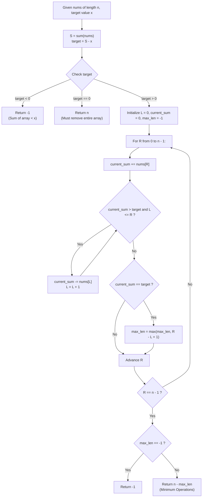

# Guided Example: Minimum Operations to Reduce X to Zero

We trace the step-by-step prefix-suffix reduction and interior subarray complement duality for target sum reduction, prove the Complementary Subarray Duality Theorem and the Two-Pointer Sliding Window Monotonicity Invariant, and evaluate minimum operations across representative problem instances:

- **Representative Instance 1 (Suffix-Only Optimal Removal):**
  - Input: `nums = [1, 1, 4, 2, 3], x = 5`
  - Array length: $n = 5$, total array sum: $S = 1 + 1 + 4 + 2 + 3 = 11$.
  - Target interior subarray sum: $target = S - x = 11 - 5 = 6$.
  - Candidates with interior sum $6$:
    - Subarray `[1, 1, 4]` (indices $0 \dots 2$, length $3$): leaves suffix `[2, 3]` (sum $5$, operations: $5 - 3 = 2$).
    - Subarray `[4, 2]` (indices $2 \dots 3$, length $2$): leaves prefix `[1, 1]` and suffix `[3]` (sum $5$, operations: $5 - 2 = 3$).
  - Maximum interior length: $mx = 3$.
  - **Required Output:** $n - mx = 5 - 3 = \mathbf{2}$.

- **Representative Instance 2 (Split Two-Sided Removal):**
  - Input: `nums = [3, 2, 20, 1, 1, 3], x = 10`
  - Total sum: $S = 30$, target interior sum: $target = 30 - 10 = 20$.
  - Interior subarray with sum $20$: `[20]` (index $2$, length $1$).
  - Elements removed: prefix `[3, 2]` (2 elements) and suffix `[1, 1, 3]` (3 elements).
  - Total operations: $2 + 3 = \mathbf{5}$ ($n - mx = 6 - 1 = 5$).
  - **Required Output:** `5`.

- **Representative Instance 3 (Insufficient Total Sum Failure):**
  - Input: `nums = [5, 6, 7, 8, 9], x = 4`
  - Target sum: $S - x = 35 - 4 = 31$.
  - All elements are $\ge 5$, so minimum possible single removal is $5 > 4$.
  - **Required Output:** `-1` (impossible to reduce $x$ to exactly $0$).

---

## 1. Instance & Teaching Goal

You are given an integer array `nums` of positive integers and an integer `x`. In each operation, you may remove either the leftmost or rightmost element of the array and subtract its value from `x`. Return the minimum number of operations required to reduce `x` to exactly $0$, or `-1` if it cannot be done.

```text
The Greedy Fallacy at the Ends:
  A natural intuition is to greedily pick whichever end is larger, or to run BFS
  over both ends.
  However, greedy choices fail because picking a large element might block access
  to a sequence of smaller elements that hit x exactly.
  Meanwhile, naive two-ended recursion branches into 2^k paths (exponential).

The Complementary Subarray Duality:
  Notice what remains when we remove p elements from the left and q elements from the right:
    Remaining elements form a CONTIGUOUS INTERIOR SUBARRAY nums[p ... n - q - 1]!
    - Sum of removed elements:  x
    - Total sum of array:       S = sum(nums)
    - Sum of remaining subarray: target = S - x

  Minimizing removed elements (p + q) is MATHEMATICALLY EQUIVALENT to
  MAXIMIZING the length of a contiguous subarray whose sum equals target!
    min(p + q)  <===>  max(length) such that sum(subarray) == S - x

  Because all elements are STRICTLY POSITIVE (nums[i] >= 1),
  subarray sums are strictly monotonic with respect to window expansion!
  This enables an O(n) Two-Pointer Sliding Window with O(1) auxiliary space!
```

The decisive pedagogical goal is the **Complementary Subarray Duality Theorem & Sliding Window Invariant**:
1. **Mathematical Inversion:** Reframe a two-ended elimination problem into a standard single-window interior subarray search.
2. **Boundary Validation:**
   - If $target < 0$ ($x > S$): impossible, return `-1`.
   - If $target == 0$ ($x == S$): must remove all $n$ elements, return $n$.
3. **Monotonic Sliding Window:** Maintain two pointers $L$ and $R$. Expand $R$ and contract $L$ while window sum $> target$.
4. **Optimal Inversion:** If maximum subarray length is $mx$, minimum operations is $n - mx$.

---

## 2. Conceptual Foundation & The Complement Pipeline



### The Complementary Subarray Duality Theorem

Let $nums = (a_0, a_1, \dots, a_{n-1})$ with $a_i \in \mathbb{Z}^+$ for all $i$.
Let $S = \sum_{i=0}^{n-1} a_i$.
1. **Bijective Mapping Between End Removals and Interior Subarrays:**
   Any valid removal of $p$ prefix elements and $q$ suffix elements with $p + q \le n$ leaves the contiguous subarray $nums[p \dots n - q - 1]$.
   The sum of removed elements equals $x$ if and only if:
   $$
   \sum_{i=p}^{n - q - 1} a_i = S - x
   $$
2. **Equivalence of Optima:**
   Let $\mathcal{P} = \{ (p, q) : p \ge 0, \; q \ge 0, \; p + q \le n, \; \sum_{i=0}^{p-1} a_i + \sum_{j=n-q}^{n-1} a_j = x \}$.
   Then:
   $$
   \min_{(p, q) \in \mathcal{P}} (p + q) = n - \max_{(p, q) \in \mathcal{P}} (n - p - q) = n - \max_{\substack{0 \le L \le R < n \\ \sum_{i=L}^R a_i = S - x}} (R - L + 1)
   $$
3. **Monotonicity and Sliding Window Correctness:**
   Because all $a_i \ge 1$:
   - For a fixed left bound $L$, $\sum_{i=L}^R a_i$ is strictly increasing with $R$.
   - For a fixed right bound $R$, $\sum_{i=L}^R a_i$ is strictly decreasing with $L$.
   Therefore, the two-pointer sliding window guarantees that both $L$ and $R$ advance monotonically from $0$ to $n$, evaluating all maximal candidate intervals in $\mathcal{O}(n)$ time.

---

## 3. Step-by-Step Worked Execution

### Trace on Representative Instance 1 (`nums = [1, 1, 4, 2, 3]`, `x = 5`)

Parameters: $n = 5, \; S = 11, \; target = 11 - 5 = 6$.
Initialize: $L = 0, \; \text{current\_sum} = 0, \; \text{max\_len} = -1$.

#### Step 0 ($R = 0$, $nums[0] = 1$)
- $\text{current\_sum} \leftarrow 0 + 1 = 1$.
- Is $1 > 6$? No. Is $1 == 6$? No.

#### Step 1 ($R = 1$, $nums[1] = 1$)
- $\text{current\_sum} \leftarrow 1 + 1 = 2$.
- Is $2 > 6$? No. Is $2 == 6$? No.

#### Step 2 ($R = 2$, $nums[2] = 4$)
- $\text{current\_sum} \leftarrow 2 + 4 = 6$.
- Match detected: $\text{current\_sum} == target \; (6)$.
- Window $[L, R] = [0, 2]$, length $R - L + 1 = 2 - 0 + 1 = 3$.
- Update: $\text{max\_len} = \max(-1, 3) = \mathbf{3}$ (Subarray `[1, 1, 4]`).

#### Step 3 ($R = 3$, $nums[3] = 2$)
- $\text{current\_sum} \leftarrow 6 + 2 = 8$.
- Excess detected: $8 > target \; (6)$. Contract from left:
  - Subtract $nums[L] = nums[0] = 1 \implies \text{current\_sum} = 7, \; L \leftarrow 1$.
  - Still $> 6$: Subtract $nums[L] = nums[1] = 1 \implies \text{current\_sum} = 6, \; L \leftarrow 2$.
- Match detected: $\text{current\_sum} == 6$.
- Window $[L, R] = [2, 3]$, length $3 - 2 + 1 = 2$.
- Update: $\text{max\_len} = \max(3, 2) = \mathbf{3}$ (Subarray `[4, 2]`).

#### Step 4 ($R = 4$, $nums[4] = 3$)
- $\text{current\_sum} \leftarrow 6 + 3 = 9$.
- Excess detected: $9 > 6$. Contract:
  - Subtract $nums[2] = 4 \implies \text{current\_sum} = 5, \; L \leftarrow 3$.
- No match ($5 < 6$).

#### Finalization
- Loop complete. $\text{max\_len} = 3$.
- Minimum operations: $n - \text{max\_len} = 5 - 3 = \mathbf{2}$.

---

## 4. Complete Execution Trace

### State Progression Table for Representative Instance 1

| Step $R$ | Element Added $nums[R]$ | Window Sum Before Check | Contraction Action on $L$ | Final $L$ | Final Window Sum | Window $[L, R]$ | Window Length | Max Length $mx$ |
|---|---|---|---|---|---|---|---|---|
| $0$ | $1$ | $1$ | None | $0$ | $1$ | `[1]` | $1$ | $-1$ |
| $1$ | $1$ | $2$ | None | $0$ | $2$ | `[1, 1]` | $2$ | $-1$ |
| $2$ | $4$ | $6$ | None | $0$ | $6$ | `[1, 1, 4]` | $3$ | **`3`** |
| $3$ | $2$ | $8$ | $L \leftarrow 1, 2$ (sub $1, 1$) | $2$ | $6$ | `[4, 2]` | $2$ | **`3`** |
| $4$ | $3$ | $9$ | $L \leftarrow 3$ (sub $4$) | $3$ | $5$ | `[2, 3]` | $2$ | **`3`** |

---

## 5. Algorithmic Correctness

**Soundness.**
Any interior subarray with sum $S - x$ leaves prefix and suffix elements whose combined sum is exactly $S - (S - x) = x$. Because the subarray elements are preserved intact, removing the complementary prefix and suffix leaves no extraneous items and achieves reduction to $0$.

**Completeness.**
Because all $nums[i] \ge 1$, the prefix sum array is strictly increasing. Any valid subarray with sum equal to $S - x$ will be detected when its right boundary is visited by $R$ and its left boundary is isolated by $L$. Choosing the maximal length guarantees the minimal number of removed operations.

---

## 6. Traps This Instance Exposes

- **Greedy End Elimination Fallacy:** Choosing whichever end has a larger value fails when a smaller end value opens up a large number in the next step.
- **Negative Target Value ($x > \text{total\_sum}$):** If $x$ exceeds the total sum of all elements, $target = S - x < 0$. It is impossible to reduce $x$ to $0$, and `-1` must be returned immediately.
- **Zero Target ($x == \text{total\_sum}$):** When $x$ equals the sum of the entire array, $target = 0$. The only valid interior subarray is empty (length $0$), so all $n$ elements must be removed, yielding $n - 0 = n$.
- **All Elements Must be Strictly Positive:** The sliding window approach relies on $nums[i] > 0$. If negative numbers were present, subarray sums would not be monotonic, requiring a prefix sum hash map instead.

---

## 7. Complexity Derivation

- **Time Complexity:**
  - Computing the total sum of array $nums$: $\mathcal{O}(n)$ operations.
  - The right pointer $R$ increments $n$ times from $0$ to $n - 1$.
  - The left pointer $L$ increments at most $n$ times across the entire traversal.
  - Total Time Complexity: strictly $\mathcal{O}(n)$ linear time, running in $< 20$ ms for $n \le 10^5$.
- **Auxiliary Space Complexity:**
  - Using two pointers $L$ and $R$, only a few scalar variables ($\text{current\_sum}, \text{max\_len}, target$) are maintained.
  - Overall Auxiliary Space: strictly $\mathcal{O}(1)$ memory.