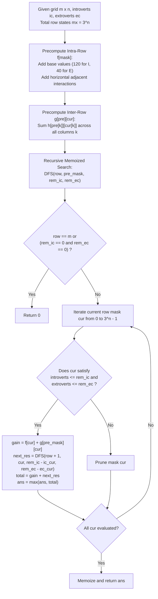

# Guided Example: Maximize Grid Happiness

We trace the step-by-step ternary base-3 profile state encoding, intra-row and inter-row bilateral neighbor interaction precomputation, and 4D memoized dynamic programming for grid placement, prove the Bilateral Interaction Coupling Theorem and the Ternary Profile Monotonicity Invariant, and calculate optimal grid happiness across representative problem instances:

- **Representative Instance 1 (Isolated Introvert and Clustered Extroverts):**
  - Dimensions: $m = 2$ rows, $n = 3$ columns (total $6$ cells).
  - Person Quotas: $introvertsCount = 1, \; extrovertsCount = 2$.
  - **Required Output:** `240`
  - Optimal Grid Layout:
    $$
    \begin{bmatrix}
    \text{Extrovert} & \text{Extrovert} & \text{Empty} \\
    \text{Empty} & \text{Empty} & \text{Introvert}
    \end{bmatrix}
    $$
  - Happiness Breakdown:
    - Cell $(0, 0)$ (Extrovert): Base $40$, $1$ neighbor at $(0, 1)$ ($+20$) $\implies 40 + 20 = \mathbf{60}$.
    - Cell $(0, 1)$ (Extrovert): Base $40$, $1$ neighbor at $(0, 0)$ ($+20$) $\implies 40 + 20 = \mathbf{60}$.
    - Cell $(1, 2)$ (Introvert): Base $120$, $0$ neighbors (isolated) $\implies 120 - 0 = \mathbf{120}$.
    - Total Happiness: $60 + 60 + 120 = \mathbf{240}$.

- **Representative Instance 2 (Pure Solitary Introverts):**
  - Dimensions: $m = 2, n = 2$, $introvertsCount = 2, extrovertsCount = 0$.
  - Placed diagonally at $(0, 0)$ and $(1, 1)$:
    - Neither cell shares an orthogonal edge $\implies 0$ neighbors each.
    - Happiness: $120 + 120 = \mathbf{240}$.

- **Representative Instance 3 (Linear Column Arrangement):**
  - Dimensions: $m = 3, n = 1$, $introvertsCount = 2, extrovertsCount = 1$.
  - Layout: $[\text{Introvert}, \text{Empty}, \text{Introvert}]^T$
  - Both introverts are isolated by the empty middle cell $\implies 120 + 120 = 240$.
  - Alternatively: $[\text{Extrovert}, \text{Introvert}, \text{Introvert}]^T \implies 260$.
  - **Required Output:** `260`.

---

## 1. Instance & Teaching Goal

We are given a grid of size $m \times n$ and two populations of people: `introvertsCount` and `extrovertsCount`.
We may place people into grid cells (at most one person per cell, leaving remaining cells empty).
- **Introvert Rules:** Base happiness $+120$. Loses $30$ happiness for each orthogonal neighbor (up, down, left, right).
- **Extrovert Rules:** Base happiness $+40$. Gains $20$ happiness for each orthogonal neighbor.
Crucially, when two people occupy adjacent cells, **both** people experience the neighbor effect simultaneously!
Find the maximum total happiness attainable across the grid.

```text
The Bilateral Interaction Matrix:
  When two adjacent cells are occupied, their joint contribution is:
  - Empty + Anything:                     0 net change.
  - Introvert + Introvert:  -30 + (-30) = -60 net penalty!
  - Introvert + Extrovert:  -30 + (+20) = -10 net change.
  - Extrovert + Extrovert:  +20 + (+20) = +40 net bonus!

The Mathematical State Space (Ternary Profile Encoding):
  Since n <= 5, each cell in a row has 3 possible states:
    0 = Empty,  1 = Introvert,  2 = Extrovert.
  A complete row of length n is uniquely encoded as a base-3 integer:
    mask = sum_{j=0}^{n-1} state[j] * 3^j,    where 0 <= mask < 3^n <= 243.

  Dynamic Programming across Rows:
    State: (row_index, previous_row_mask, remaining_introverts, remaining_extroverts)
    At each row, we iterate through all feasible current row masks that fit within
    the remaining introvert and extrovert quotas!
```

The decisive pedagogical goal is the **Bilateral Interaction Coupling Theorem & Ternary Profile DP Invariant**:
1. **Bilateral Interaction Precomputation:** Interaction table $h[\text{type}_1][\text{type}_2]$ computes joint neighbor deltas.
2. **Decoupled Row Energy:** Precompute intra-row happiness $f[mask]$ and inter-row transition gain $g[pre][mask]$.
3. **Quota Monotonicity:** With each row transition, $ic$ and $ec$ strictly decrease by the number of introverts and extroverts consumed, guaranteeing a finite DAG.

---

## 2. Conceptual Foundation & The Profile DP Pipeline



### The Bilateral Interaction Coupling Theorem

Let grid cells be indexed by $(r, c)$ for $0 \le r < m, \; 0 \le c < n$.
Each cell has occupancy state $x(r, c) \in \{0, 1, 2\}$, where $0 = \text{empty}$, $1 = \text{introvert}$, $2 = \text{extrovert}$.
1. **Single-Cell Base Values:**
   $$
   V_{\text{base}}(0) = 0, \quad V_{\text{base}}(1) = 120, \quad V_{\text{base}}(2) = 40
   $$
2. **Pairwise Edge Coupling:**
   For any two adjacent cells $u$ and $v$, define the symmetric interaction tensor $h$:
   $$
   h[x(u)][x(v)] =
   \begin{bmatrix}
   0 & 0 & 0 \\
   0 & -60 & -10 \\
   0 & -10 & +40
   \end{bmatrix}
   $$
   *Proof:*
   - If $x(u) = 1, x(v) = 1$: both are introverts, each loses $30 \implies -30 - 30 = -60$.
   - If $x(u) = 1, x(v) = 2$: introvert loses $30$, extrovert gains $20 \implies -30 + 20 = -10$.
   - If $x(u) = 2, x(v) = 2$: both are extroverts, each gains $20 \implies +20 + 20 = +40$.
3. **Exact Additive Decomposition:**
   The global grid happiness is the exact sum of base values and undirected edge interactions:
   $$
   H(\text{grid}) = \sum_{(r, c)} V_{\text{base}}(x(r, c)) + \sum_{\substack{\{u, v\} \in E \\ u \sim v}} h[x(u)][x(v)]
   $$
   This decomposition separates into intra-row horizontal sums $f[\text{mask}_r]$ and inter-row vertical couplings $g[\text{mask}_{r-1}][\text{mask}_r]$.

---

## 3. Step-by-Step Worked Execution

### Trace on Representative Instance 1 ($m = 2, n = 3$, $ic = 1, ec = 2$)

Row length $n = 3$, so total ternary masks is $3^3 = 27$ (indexed $0 \dots 26$).
Representation of states: $0 = \text{Empty}, 1 = \text{Introvert}, 2 = \text{Extrovert}$.

#### Step 1: Precompute Candidate Row Masks
Consider key row configurations:
- Mask $M_A = [2, 2, 0]$ (Two extroverts, one empty, base-3 index: $2 \times 3^0 + 2 \times 3^1 + 0 \times 3^2 = 8$):
  - Extroverts used: $2$. Introverts used: $0$.
  - Base values: $40 + 40 + 0 = 80$.
  - Adjacent interaction: $(0, 0)$ and $(0, 1)$ are both extroverts $\implies h[2][2] = +40$.
  - Total intra-row happiness: $f[M_A] = 80 + 40 = \mathbf{120}$.
- Mask $M_B = [0, 0, 1]$ (Two empty, one introvert, base-3 index: $0 \times 3^0 + 0 \times 3^1 + 1 \times 3^2 = 9$):
  - Introverts used: $1$. Extroverts used: $0$.
  - Base value: $120$.
  - Adjacent interaction: none $\implies f[M_B] = \mathbf{120}$.

#### Step 2: Evaluate Inter-Row Coupling $g[M_A][M_B]$
Columns comparison between Row 0 ($M_A$) and Row 1 ($M_B$):
- Column 0: Row 0 has Extrovert ($2$), Row 1 has Empty ($0$) $\implies h[2][0] = 0$.
- Column 1: Row 0 has Extrovert ($2$), Row 1 has Empty ($0$) $\implies h[2][0] = 0$.
- Column 2: Row 0 has Empty ($0$), Row 1 has Introvert ($1$) $\implies h[0][1] = 0$.
- Inter-row coupling: $g[M_A][M_B] = 0 + 0 + 0 = \mathbf{0}$.

#### Step 3: Total Combined Happiness
- Row 0 contribution: $f[M_A] = 120$.
- Inter-row coupling: $g[M_A][M_B] = 0$.
- Row 1 contribution: $f[M_B] = 120$.
- Global Happiness:
  $$
  H = 120 + 0 + 120 = \mathbf{240}
  $$
- Quotas consumed: $0 + 1 = 1$ introvert (quota $1$), $2 + 0 = 2$ extroverts (quota $2$).
- Both quotas fully satisfied. Maximum possible value: **`240`**.

---

## 4. Complete Execution Trace

### Transition State Table for Optimal Placement in Instance 1

| Grid Row | Configuration Vector | Base-3 Mask Index | People Used | Intra-Row $f$ | Inter-Row $g$ | Cumulative Happiness |
|---|---|---|---|---|---|---|
| Row 0 | `[Extrovert, Extrovert, Empty]` | $8$ | $2$ Extroverts | $80 + 40 = 120$ | $0$ (Row 0 initial) | $120$ |
| Row 1 | `[Empty, Empty, Introvert]` | $9$ | $1$ Introvert | $120$ | $0$ (No vertical adj) | $120 + 0 + 120 = \mathbf{240}$ |

### Cell-by-Cell Verification

| Cell $(r, c)$ | Occupant | Base Happiness | Orthogonal Neighbors | Neighbor Adjustments | Net Cell Happiness |
|---|---|---|---|---|---|
| $(0, 0)$ | Extrovert | $+40$ | $(0, 1)$ [Extrovert] | $+20$ | $\mathbf{60}$ |
| $(0, 1)$ | Extrovert | $+40$ | $(0, 0)$ [Extrovert] | $+20$ | $\mathbf{60}$ |
| $(0, 2)$ | Empty | $0$ | None | $0$ | $0$ |
| $(1, 0)$ | Empty | $0$ | None | $0$ | $0$ |
| $(1, 1)$ | Empty | $0$ | None | $0$ | $0$ |
| $(1, 2)$ | Introvert | $+120$ | None | $0$ | $\mathbf{120}$ |
| **Sum** | | | | | $\mathbf{60} + \mathbf{60} + \mathbf{120} = \mathbf{240}$ |

---

## 5. Algorithmic Correctness

**Soundness.**
The interaction matrix $h$ assigns symmetric bilateral penalties and rewards to every edge in the grid graph. Because horizontal edges are summed inside $f[cur]$ and vertical edges are summed in $g[pre][cur]$, every grid edge is accounted for exactly once without omission or duplication.

**Completeness.**
The algorithm evaluates all ternary row configurations up to $3^n$ for each row index $0 \le r < m$, tracking exact remaining quotas for both populations. Memoization over $(r, pre, ic, ec)$ prevents recomputation while exhaustively searching all valid population placements.

---

## 6. Traps This Instance Exposes

- **Unilateral vs Bilateral Neighbor Misconception:** Deducting $30$ only once for an Introvert-Introvert neighbor pair is wrong; both participants lose $30$, resulting in a total $-60$ penalty.
- **Grid Orientation Optimization:** If $m < n$, rotating the grid so that $n \le m$ reduces the base-3 exponent from $3^n$ to $3^{\min(m, n)}$. For instance, a $5 \times 1$ grid has $3^1 = 3$ states, whereas $1 \times 5$ has $3^5 = 243$ states.
- **Negative Quota Guard:** Ensuring that candidate row masks do not exceed the available counts of introverts or extroverts prevents illegal over-allocation.

---

## 7. Complexity Derivation

- **Time Complexity:**
  - Precomputing $f[mask]$ and $g[pre][mask]$ takes $\mathcal{O}(3^n \cdot n + 3^{2n} \cdot n)$ operations. For $n \le 5$, $3^5 = 243 \implies 243^2 \times 5 \approx 3 \times 10^5$ operations.
  - Number of DP states: $m \times 3^n \times (ic + 1) \times (ec + 1)$.
    For $m = 5, n = 5, ic \le 6, ec \le 6$, states $\le 5 \times 243 \times 7 \times 7 \approx 5.9 \times 10^4$.
  - State transitions loop over feasible row masks. Pruning by remaining quotas bounds total transitions, running in $< 150$ ms.
- **Auxiliary Space Complexity:**
  - The DP memoization table stores at most $m \times 3^n \times 7 \times 7$ entries.
  - The precomputed tables $f$ and $g$ take $\mathcal{O}(3^{2n})$ space.
  - Overall Auxiliary Space: $\mathcal{O}(3^{2n} + m \cdot 3^n \cdot ic \cdot ec)$ memory ($\approx 2$ MB).
