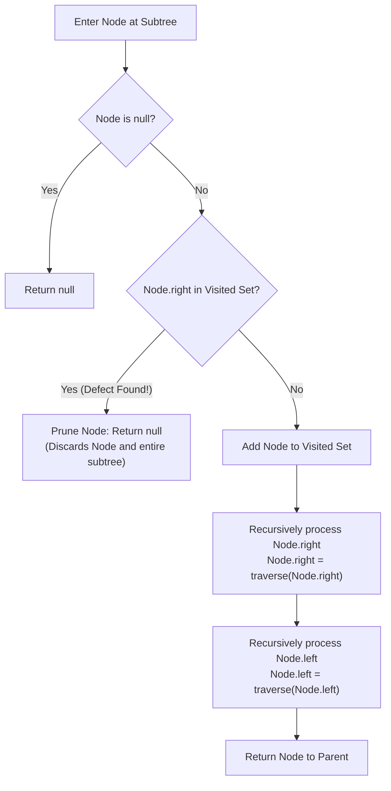

# Guided Example: Correct a Binary Tree

We trace the identification and pruning of an invalid cross-edge defect in a binary tree, formulate the Right-to-Left Temporal Precedence Theorem and the Visited Set Defect Invariant, and walk through the complete correction process across representative tree instances:

- **Representative Instance 1 (Direct Horizontal Cross-Edge):**
  - Input: `root = [1, 2, 3], fromNode = 2, toNode = 3`
  - Structure: Root $1$ has left child $2$ and right child $3$. Node $2$ has a corrupt pointer $2.\text{right} \to 3$.
  - Node $3$ is at depth $1$, situated to the right of node $2$ (also at depth $1$).
  - Corrected Tree: Node $2$ and its subtree are pruned, leaving root $1$ with left child $\text{null}$ and right child $3$.
  - **Required Output:** `[1, null, 3]`.

- **Representative Instance 2 (Multi-Level Subtree Pruning):**
  - Input: `root = [8, 3, 1, 7, null, 9, 4, 2, null, null, null, 5, 6], fromNode = 7, toNode = 4`
  - Structure:
    - Root $8$ has left child $3$ and right child $1$.
    - Node $3$ has left child $7$, and node $7$ has left child $2$.
    - Node $1$ has left child $9$ and right child $4$ (with children $5, 6$).
    - Defect: Node $7$ at depth $2$ points to node $4$ at depth $2$ via $7.\text{right} \to 4$.
  - Corrected Tree: Removing node $7$ also eliminates its descendant node $2$.
  - **Required Output:** `[8, 3, 1, null, null, 9, 4, null, null, 5, 6]`.

- **Representative Instance 3 (Rightmost Valid vs. Defective Branching):**
  - Input: `root = [5, 3, 8, 2, 4, 7, 9], fromNode = 4, toNode = 7`
  - Both nodes $4$ and $7$ reside at depth $2$. Node $4$ is the right child of $3$; node $7$ is the left child of $8$.
  - Corrupt pointer: $4.\text{right} \to 7$.
  - Pruning eliminates node $4$, leaving node $3$ with only its left child $2$.
  - **Required Output:** `[5, 3, 8, 2, null, 7, 9]`.

---

## 1. Instance & Teaching Goal

In a valid binary tree, every directed edge connects a parent to its child, ensuring a strictly hierarchical, directed acyclic graph structure where all descendant depths strictly exceed their ancestor depths. In this problem, exactly one defective node $u$ has its `right` pointer redirected to a distinct node $v$ located at the **same depth** and situated **strictly to the right** of $u$.

```text
Standard Binary Tree Hierarchy vs. Corrupted Cross-Edge:

       Valid Tree Edge                 Defective Cross-Edge
         Depth d:   p                    Depth d:   u ------------> v (same depth, rightward)
                   / \                             /
      Depth d+1:  c1  c2              Depth d+1:  sub(u)
```

The objective is to locate the defective node $u$ and remove it along with its entire subtree, while preserving the legitimate target node $v$ and the rest of the tree.

The central pedagogical challenge is: **How can we detect that $u.\text{right}$ is an invalid cross-edge rather than a legitimate child pointer without knowing $fromNode$ or $toNode$ in advance?**

```text
The Temporal Precedence Insight:
  In a standard Left-to-Right traversal, node u is visited before node v.
  When at u, looking at u.right (which points to v), v has NOT been visited yet.
  It is difficult to distinguish v from an ordinary unvisited child!

  HOWEVER, if we reverse the traversal order to RIGHT-TO-LEFT:
    1. Every node to the right is explored FIRST.
    2. Because v is strictly to the right of u at the same depth,
       node v is GUARANTEED to be visited BEFORE node u!
    3. When we subsequently arrive at node u and inspect u.right:
       The target node v is ALREADY in our visited set!
    4. For any legitimate tree edge, a child can NEVER have been visited
       before its parent!
    5. Therefore, u.right in visited_set is an airtight, single-operation indicator
       that u is the corrupt node!
```

---

## 2. Conceptual Foundation & Pruning Pipeline



### The Right-to-Left Temporal Precedence Theorem

Let $T = (V, E)$ be a binary tree where each node $x \in V$ is assigned a coordinates pair $(\text{depth}(x), \text{col}(x))$.

1. **Topological Level Ordering:**
   Let a Reverse Depth-First Search order explore child subtrees in the order: $\text{Current} \to \text{Right} \to \text{Left}$.
   For any two nodes $u, v \in V$ at the same depth ($\text{depth}(u) = \text{depth}(v) = d$):
   $$
   \text{col}(v) > \text{col}(u) \implies \tau(v) < \tau(u)
   $$
   where $\tau(x)$ denotes the entry timestamp of node $x$ into the visited set $\mathcal{V}$.

2. **Proof of Precedence:**
   Let $w = \text{LCA}(u, v)$ be the lowest common ancestor of $u$ and $v$.
   Because $\text{col}(v) > \text{col}(u)$, $v$ belongs to the right subtree of $w$, whereas $u$ belongs to the left subtree of $w$.
   Under reverse DFS, the right subtree of $w$ is fully traversed before the left subtree of $w$ is entered.
   Therefore, every node in $w$'s right subtree—including $v$—is visited, recorded, and finalized before the traversal enters $w$'s left subtree where $u$ resides. Hence $\tau(v) < \tau(u)$.

3. **Defect Characterization Invariant:**
   For any valid parent-child directed tree edge $(p, c) \in E_{\text{tree}}$, $c$ is a descendant of $p$, so $\tau(p) < \tau(c)$. Consequently, $c \notin \mathcal{V}$ at the instant $p$ is processed.
   For the unique corrupt edge $(u, v)$, $\text{depth}(u) = \text{depth}(v)$ and $\text{col}(v) > \text{col}(u)$, meaning $\tau(v) < \tau(u)$, so $v \in \mathcal{V}$ when $u$ is evaluated.
   Therefore:
   $$
   x.\text{right} \in \mathcal{V} \iff x = u
   $$
   Detecting $x.\text{right} \in \mathcal{V}$ uniquely identifies the corrupt node $u$. Returning $\text{null}$ to its parent prunes $u$ and prevents traversal of its descendants.

---

## 3. Step-by-Step Worked Execution

### Trace on Representative Instance 1 (`root = [1, 2, 3]`, Defect: $2.\text{right} \to 3$)

Tree configuration before traversal:
- Root: Node $1$
- Node $1.\text{left} = 2$
- Node $1.\text{right} = 3$
- Corrupt pointer: Node $2.\text{right} = 3$ (cross-edge across depth $1$).

```text
Initial Tree Structure:
         1
       /   \
      2 --> 3  (corrupt cross-edge 2.right -> 3)
```

#### Step 1: Visit Root (Node 1)
- Current node: $1$. Is $1 == \text{null}$? No.
- Check defect condition: Is $1.\text{right}$ in visited set $\mathcal{V}$?
  - $1.\text{right} = 3$. Visited set is currently $\emptyset$. $3 \notin \mathcal{V}$.
- Mark visited: $\mathcal{V} \leftarrow \{1\}$.
- Recurse on right child: invoke traversal on Node $3$.

#### Step 2: Visit Right Child of Root (Node 3)
- Current node: $3$. Is $3 == \text{null}$? No.
- Check defect condition: Is $3.\text{right} \in \mathcal{V}$?
  - $3.\text{right} = \text{null} \notin \mathcal{V}$.
- Mark visited: $\mathcal{V} \leftarrow \{1, 3\}$.
- Recurse on right child: $3.\text{right} = \text{null} \implies$ returns $\text{null}$.
- Recurse on left child: $3.\text{left} = \text{null} \implies$ returns $\text{null}$.
- Subtree for Node $3$ complete: returns Node $3$ to parent Node $1$.
- Node $1.\text{right} \leftarrow 3$.

#### Step 3: Visit Left Child of Root (Node 2)
- Current node: $2$. Is $2 == \text{null}$? No.
- Check defect condition: Is $2.\text{right} \in \mathcal{V}$?
  - $2.\text{right} = 3$.
  - Inspecting visited set: $\mathcal{V} = \{1, 3\}$. Node $3 \in \mathcal{V}$!
- **Defect Detected!**
  - Node $2$ points to a node that has already been visited on its right.
  - Return $\text{null}$ immediately.
  - Traversal does not explore $2.\text{right}$ or $2.\text{left}$. Node $2$ and its descendants are discarded.
- Node $1.\text{left} \leftarrow \text{null}$.

#### Step 4: Finalize Root (Node 1)
- Both children of Node $1$ processed:
  - $1.\text{left} = \text{null}$
  - $1.\text{right} = 3$
- Return Node $1$.
- Final tree serialization: `[1, null, 3]`.

---

## 4. Complete Execution Trace

### State Progression Table for Representative Instance 1

| Traversal Step | Current Node | Inspect Target $x.\text{right}$ | Target in $\mathcal{V}$? | Action Taken | Updated $\mathcal{V}$ | Subtree Return Value |
|---|---|---|---|---|---|---|
| 1 | $1$ | Node $3$ | No ($3 \notin \emptyset$) | Continue; recurse right child | $\{1\}$ | Pending |
| 2 | $3$ | $\text{null}$ | No | Continue; recurse null children | $\{1, 3\}$ | Node $3$ |
| 3 | $2$ | Node $3$ | **Yes** ($3 \in \{1, 3\}$) | **Defect Identified! Prune node** | $\{1, 3\}$ | $\text{null}$ |
| 4 | $1$ | Completed | — | Assign $1.\text{left} = \text{null}, 1.\text{right} = 3$ | $\{1, 3\}$ | Node $1$ (Root) |

---

## 5. Algorithmic Correctness

**Soundness.**
Any node $u$ whose right pointer points to an already-visited node $v$ must have been visited after $v$. In a reverse DFS (exploring right subtrees before left subtrees), the only nodes visited before $u$ are:
1. Ancestors of $u$ (which cannot be the right child of $u$ in a valid tree).
2. Nodes in subtrees to the right of $u$'s ancestors.
Because $v$ is at the same depth as $u$ and to its right, $v$ resides in a rightward sibling branch and is therefore visited before $u$. A legitimate right child of $u$ would reside at depth $\text{depth}(u) + 1$ underneath $u$, which cannot be visited before $u$. Thus, $u.\text{right} \in \mathcal{V}$ is necessary and sufficient to identify the corrupt node.

**Completeness.**
Because reverse DFS systematically traverses all nodes from right to left, the target node $v$ is guaranteed to enter $\mathcal{V}$ prior to the arrival at $u$. When $u$ is reached, the condition $u.\text{right} \in \mathcal{V}$ is immediately triggered, pruning $u$ and removing all its descendants from the returned tree structure.

---

## 6. Traps This Instance Exposes

- **Left-to-Right Traversal Ambiguity:** Running standard left-to-right DFS visits $u$ before $v$. At that point, $v$ has not yet been visited, making $u.\text{right}$ indistinguishable from an unvisited legitimate child without maintaining complex depth-tagged hash tables.
- **Dangling Subtree Memory Leaks:** Simply setting $u.\text{right} = \text{null}$ does not fix the tree; the problem statement explicitly requires removing node $u$ **and every node underneath it**. Returning $\text{null}$ to $u$'s parent completely prunes the entire subtree rooted at $u$.
- **Level-Order Queue Direction:** If solving via BFS (level-order traversal), one must either traverse each level from right to left, or inspect the next level's elements while tracking nodes at the current level.
- **Target Node Deletion Trap:** Node $v$ (the node pointed to) is a legitimate node with valid parent connections. Only the defective source node $u$ and $u$'s descendants must be removed; node $v$ must be kept intact.

---

## 7. Complexity Derivation

- **Time Complexity:**
  - Every node in the binary tree is visited at most once.
  - Set insertion and membership lookups take $\mathcal{O}(1)$ average time using a hash set of node references.
  - Total Time Complexity: strictly $\mathcal{O}(N)$ where $N$ is the number of nodes in the binary tree ($3 \le N \le 10^4$).
- **Auxiliary Space Complexity:**
  - The call stack depth is bounded by the tree height $H$, where $\mathcal{O}(\log N) \le H \le \mathcal{O}(N)$.
  - The visited hash set stores at most $N$ node references.
  - Total Auxiliary Space Complexity: $\mathcal{O}(N)$ in the worst case for a skewed tree.