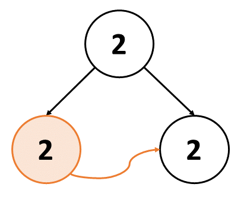
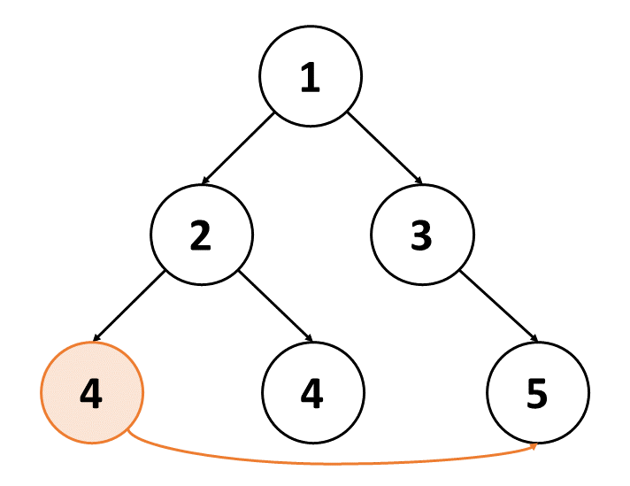
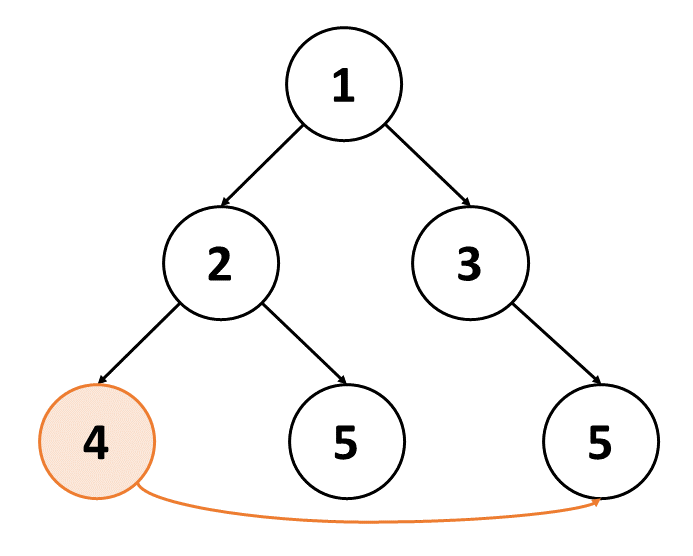
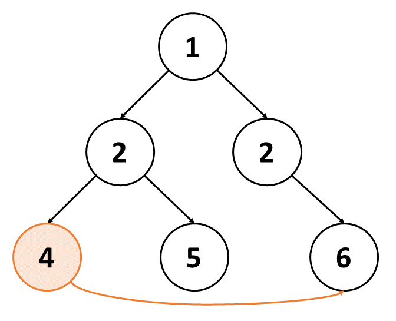
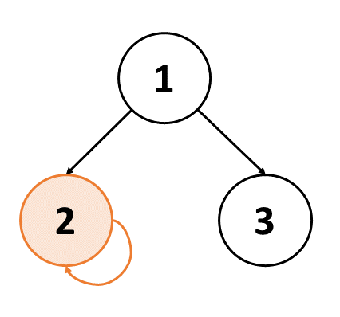
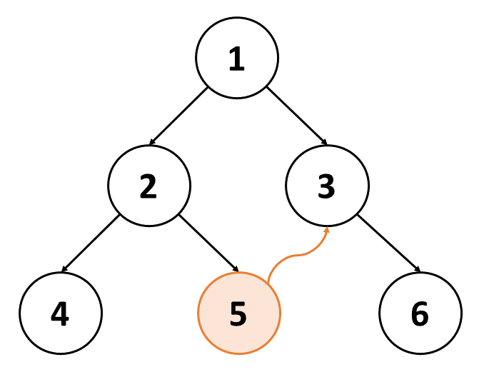
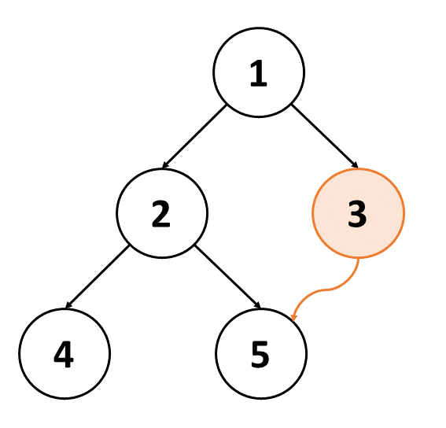
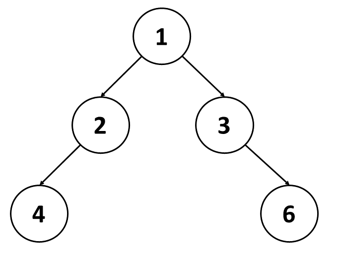
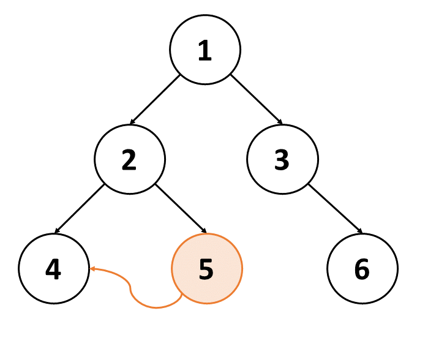
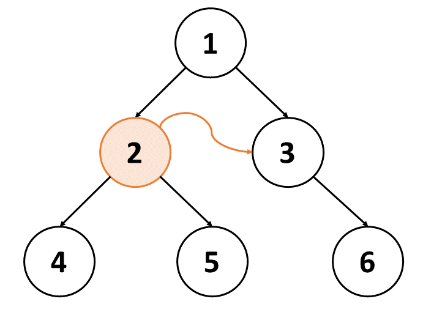

[TOC]

## Solution

---

### Overview

In this problem, there is a defective node `fromNode` and it incorrectly points to another node, `toNode`. The `toNode` is at the **same depth** and is on the **right-hand side** of the `fromNode`.

We need to remove `fromNode` and all of its descendants from the tree. By removing the node, we mean that we need to replace it with the `null` value. It can be done by removing the reference of `fromNode` from its parent node.

> Keeping the reference of the parent node may be helpful.

Let's number the few constraints given in the problem statement, they will be referred by the number in subsequent sections.

1. All `node.val` are unique.

    It certainly means that we can use `node.val` as a key to identify a node if the structure (information of children) of the node is not required for some purpose.

2. $fromNode \neq toNode$

3. `fromNode` and `toNode` will exist in the tree and will be on the same depth.

4. `toNode` is to the **right** of `fromNode`.

5. `fromNode.right` is `null` in the initial tree from the test data.

<details> <summary> Now, let's understand the <b>input</b> and <b>output</b> structure. If readers are already familiar with the same, they can skip this section. If not, they are strongly encouraged to read the same by clicking on the arrow on the left. </summary>

<p>

- **Input:** `root` = `[8,3,1,7,null,9,4,2,null,null,null,5,6]`, `fromNode` = `7`, `toNode` = `4`

   - The `root` looks like an array, however, it is a way to represent the binary tree in the Leetcode Test case. If readers are not familiar with the same, they are strongly encouraged to read from [here](https://support.leetcode.com/hc/en-us/articles/360011883654-What-does-1-null-2-3-mean-in-binary-tree-representation-)

   - `fromNode` represents the problematic node. Since `node.val` is unique, the value is sufficient to uniquely represent the entire Node.

      Note that because of constraint 5, we must be sure that the `root` is constructed in such a way so that the right children of `7` in `[8,3,1,7,null,9,4,2,null,null,null,5,6]` is `null`

      It's worth noting that `fromNode` won't be given to us as the function argument. Otherwise, the problem would be trivial. **The `fromNode` is only to create the test case.** We need to do sufficient work to find the `fromNode` and replace it with `null`, perhaps by taking the help of its parent node.

- `toNode` represents the node to which the defective node `fromNode`'s `right` attribute is pointing to. Since `node.val` is unique, the value is sufficient to uniquely represent the entire Node.

        Now, because of constraint 2, `toNode` cannot be equal to `7`, and because of constraints 3 and 4, the only candidates for `toNode` are `9` and `4`. The node `2` will fall in the next depth, and hence is not a candidate.

        It's worth noting that `toNode` won't be given to us as the function argument. **The `toNode` is only to create the test case.**

- **Output:** `[8,3,1,null,null,9,4,null,null,5,6]`

    It looks like an array, however, it is a Binary Tree. This is a way to represent a binary tree in the Leetcode Test case. More about it can be read [here](https://support.leetcode.com/hc/en-us/articles/360011883654-What-does-1-null-2-3-mean-in-binary-tree-representation-)

    We thus have to return the root of the binary tree, and not any array.

    The output is the binary tree which is the same as the input, except that the `fromNode` is replaced with `null`.

</p>
</details>
<br/>

$\downarrow_{\text{Section after understanding the input and output structure}}$

Thus, after analyzing the structure of **input** and **output**, we need to convince ourselves that there might be invalid test cases, for which, we need not worry.

<details><summary> This section tries to discuss some invalid test cases. The section is overlong, thus if readers feel that they have understood the problem statement, they can skip this section. Otherwise, they are strongly encouraged to read the same by clicking on the arrow on the left. </summary>

<p>

We will see a few examples which are cases that we need not worry about because of constraints provided in the problem statement.

- `root` = `[2, 2, 2]`
  `fromNode` = `2`
  `toNode` = `2`

  {:height="200px"}

  Node values are not unique. Moreover, `fromNode` and `toNode` are the same. Since the tree is small, we can locate that only one `2` satisfies the remaining constraint. However, if there were three or more nodes at the same depth with value `2`, we then don't know which is `fromNode`, and which is `toNode`. Thus, we can assume that such test cases won't be given to us.

- `root` = `[1, 2, 3, 4, 4, null, 5]`
  `fromNode` = `4`
  `toNode` = `5`

  {:height="200px"}

  Node values are not unique. Moreover, there are multiple `4` in the tree. In the diagram, we have assumed that it's the first `4` which is `fromNode`. However, it could be the second `4` which is `fromNode`. Thus, we can assume that such test cases won't be given to us.

- `root` = `[1, 2, 3, 4, 5, null, 5]`
  `fromNode` = `4`
  `toNode` = `5`

  {:height="200px"}

  Node values are not unique. Moreover, there are multiple `5` in the tree. In the diagram, we assume that it's the second `5` which is `toNode`. However, it could be the first `5` which is `toNode`. Thus, we can assume that such test cases won't be given to us.

- `root` = `[1, 2, 2, 4, 5, null, 6]`
  `fromNode` = `4`
  `toNode` = `6`

  {:height="200px"}

  There is no ambiguity in identifying `fromNode` and `toNode`. However node's values are not unique, and thus such test cases won't be given to us.

- `root` = `[1, 2, 3]`
  `fromNode` = `2`
  `toNode` = `2`

  {:height="200px"}

   `fromNode` and `toNode` cannot be the same.

- `root` = `[1, 2, 3, 4, 5, null, 6]`
  `fromNode` = `5`
  `toNode` = `3`

  {:height="200px"}

   `fromNode` and `toNode` are not on the same depth.

- `root` = `[1, 2, 3, 4, 5]`
  `fromNode` = `3`
  `toNode` = `5`

  {:height="200px"}

   `fromNode` and `toNode` are not on the same depth.

- `root` = `[1, 2, 3, 4, null, null, 6]`
  `fromNode` = `5`
  `toNode` = `8`

  {:height="200px"}

   Both `fromNode` and `toNode` are missing from the tree. If any one of them was also missing, then also the test case would have been invalid.

- `root` = `[1, 2, 3, 4, 5, null, 6]`
  `fromNode` = `5`
  `toNode` = `4`

  {:height="200px"}

  The `toNode` is on the left of the `fromNode`. Thus, such test cases won't be given to us.

- `root` = `[1, 2, 3, 4, 5, null, 6]`
  `fromNode` = `2`
  `toNode` = `3`

  {:height="200px"}

  The `2` has a right child `5` because of the given `root`. Thus, it cannot be `fromNode`. Thus, such test cases won't be given to us.

</p>
</details>
<br/>

$\downarrow_{\text{Section after observing the invalid test cases}}$

Hence, now we can solve the problem for all the valid test cases.

---

### Approach 1: Breadth-First Search

#### Intuition

The problem constraints hint to us enough that our interest of nodes lies in the same depth. Thus, we can explore the tree level by level to analyze nodes at a particular depth.

Breadth First Search (BFS) is a natural choice to explore the tree level by level, usually implemented with the help of the queue. However, since we need to replace the `fromNode` with `null`, we also need to keep track of the parent of each node.

> **Breadth-First Search** is a graph traversal algorithm that explores the neighbor nodes first, before moving to the next level neighbors. If readers are not familiar with the BFS, they are strongly encouraged to dive into our [**Queue Explore Card**](https://leetcode.com/explore/learn/card/queue-stack/231/practical-application-queue/).
>
> In the context of Binary Tree, the BFS is also known as [**Level Order Traversal**](https://leetcode.com/explore/learn/card/data-structure-tree/134/traverse-a-tree/990/).

As of now, the approach looks like

- Do Standard BFS
- If for any node, `node.right` is also in the same level, then it is the hidden `fromNode`. We can find its parent from the Hash Map (or any other technique) and replace one of its children *(the child which is `fromNode`)* with `null`.

Now, for every `node`, we can save `node.right` temporarily. Then traverse all the nodes on the right of this `node` at the same level. This will take $O(d)$ time, where $d$ is the number of nodes at the same depth as the `node`. In the worst case, $d$ can be $N/2$, where $N$ is the total number of nodes in the tree. Thus, for one `node`, it takes $O(N)$ time. Since we are doing this for every node, the overall time complexity will be $O(N^2)$.

**Can we do better?**
As given in Hints, if we explore the level from right to left, the defective node will point to a node that has already been visited.

Thus, we can do level-by-level traversal, but from right to left, and save visited nodes of this level in a Hash Set. If for any node, its `node.right` is already in the Hash Set, then `node` is the defective `fromNode`. We can replace the child *(the child which is `fromNode`)* of its parent with `null`.

The implementation may have multiple variants.

- One may keep track of parent using Hash Map, **or** one can perhaps keep track of parent in Queue with the node.

- We can do traversal from right-to-left in each level and save visited nodes in the Hash Set. **However**, left-to-right traversal is also right if we save all nodes of this level in the Hash Set. This can be done by hashing the elements of the current level present in the Queue.

    In brief, for left-to-right traversal, for efficient implementation, we need to hash all elements of the queue beforehand. However, for right-to-left traversal, we can hash as we traverse the level.

    Note that we are doing level traversal to save nodes of the next level in the (new) Queue.

- Use a new queue for the next level, and set the current queue equal to the new queue when all nodes of the current level are visited, **or** append nodes of the next level in the same queue and record the total number of nodes in this level, so that we don't end up popping nodes of the next level.

Readers are encouraged to implement the solution using any of the above variants.

#### Algorithm

1. Prepare a queue called `queue` for BFS traversal. Every element of the queue will store a pair of the node and its parent. Add `[root, null]` in the queue as `root` doesn't have any parent.

2. Traverse level-by-level. The current state of the queue will have all nodes of the current level. While we have at least one level to explore (`queue` is not empty), do the following

1. Save the size of the queue in a variable `n`. This is the number of nodes in the current level. We will pop this many nodes from the queue. Initialize a Hash Set `visited` to store nodes of the current level.

2. Iterate `n` times.

       - Pop the node and its parent from the queue. Let's call them `node` and `parent` respectively.

       - If `node.right` is already visited, then `node` is the defective node. Replace the correct child of `parent` with `null` and return `root`.

       - Add `node` in the visited set.

       - Add `node.right` and `node.left` in the queue for traversal in the next level. They won't get popped in this level because we've limited the number of traversal steps to `n`. Add `node.right` first, so that we can explore nodes of the next level from right to left.

3. If things work fine, the correct `root` will be returned in the level-by-level traversal itself. However, for the sake of compilation, return `root` at the end of the function.

Here is the animation explaining the algorithm
!?!../Documents/1660/1660_bfs.json:960,540!?!
<br/>

#### Implementation

```python
class Solution:
    def correctBinaryTree(self, root: TreeNode) -> TreeNode:
        # Queue for BFS. Every element stores [node, parent]
        queue = deque([[root, None]])

        # Traverse Level by Level
        while queue:
            # Nodes in the current level
            n = len(queue)

            # Hash Set to store nodes of the current level
            visited = set()

            # Traverse all nodes in the current level
            for _ in range(n):
                # Pop the node from the queue
                node, parent = queue.popleft()

                # If node.right is already visited, then the node is defective
                if node.right in visited:
                    # Replace the child of the node's parent with null and return the root
                    if parent.left == node:
                        parent.left = None
                    else:
                        parent.right = None
                    return root

                # Add node to visited
                visited.add(node)

                # Add child in queue for traversal in next level
                # They won't get popped in this level because of "n"
                # Add the right child first, so that we can explore right to left
                if node.right:
                    queue.append([node.right, node])
                if node.left:
                    queue.append([node.left, node])
```

**Implementation Note:** We certainly need not save the `node` in the visited set. We can save the `node.val` only. Readers can appreciate that the `node.val` is sufficient to uniquely identify the node. We don't need to know about the structure of the `toNode` to solve the problem.

#### Complexity Analysis

Let $N$ be the number of nodes in the tree.

* Time complexity: $O(N)$

    The queue processes every node at most once.

    Now processing includes
- popping the node from the queue

- checking if `node.right` is already visited
- adding `node` in the visited set
- adding `node.right` and `node.left` in the queue for traversal in the next level

    Thus, processing one node takes $O(1)$ time. Thus, processing all nodes takes $O(N)$ time.

* Space complexity: $O(N)$

    The queue can have at most $N$ nodes. The visited set can have at most $N$ nodes. Thus, the overall space complexity is $O(N)$.

---

### Approach 2: Depth First Search

#### Intuition

Let's construct the required new binary tree. To do so, we make the following guarantees

> We will add this `node` in the new binary tree only if `node.right` is not seen before, provided that we will traverse the unvisited rightmost branch of the tree first.

Now, for this, we will traverse the rightmost branch of the binary tree and save the `node` *(or only `node.val`, as discussed in the [implementation note of BFS approach](#implementation))* in a Hash Set. At every step, we will construct the correct binary tree rooted at this `node` and add it to the new binary tree.

- If we encounter a node whose `node.right` is already in the Hash Set, then we can confirm that this is the defective node we're looking for, and we will not add this `node` in the new binary tree.

- Otherwise, we will recursively build the correct binary tree rooted at this `node`, and add it in the new binary tree.

Now, to traverse the rightmost branch of the binary tree, we can use Depth First Search (DFS).

> **Depth First Search** is a graph traversal algorithm that explores as far as possible along each branch before backtracking. If readers are not familiar with the DFS, they are strongly encouraged to dive into our [**Stack Explore Card**](https://leetcode.com/explore/learn/card/queue-stack/232/practical-application-stack/1389/).
>
> In the context of Binary Tree, and specifically in the context of this problem, we need to add `node` first, then `node.right`, and then `node.left` in the stack. This is because we need to traverse the rightmost branch first. The terminolgy for this is **Reverse** [**Postorder Traversal**](https://leetcode.com/explore/learn/card/data-structure-tree/134/traverse-a-tree/930/).

Thus, our approach is to keep adding the unvisited rightmost branch nodes in the new binary tree, and dive deeper into the subtree of this `node`. We will stop when we encounter a node whose `node.right` is already visited.

It is worth noting that this approach will work correctly for a superset of all valid test cases. Specifically, this approach may also work when `toNode` is not at the same depth as `fromNode`. However, we need not worry about the same as it will work for all valid test cases as well, the cases when both are on the same depth.

#### Algorithm

1. Initialize a Hash Set `visited` to store the node value of the rightmost branch. Initially, it will be empty.

2. Define a function `build_correct_tree` which will do the recursive work. It takes the parameter `node` and builds and returns the non-defective binary tree rooted at `node`.

1. If `node` is `null`, then return `null`.

2. If `node.right` is already visited, then this `node` is the defective node. No need to build the tree rooted at `node`. Replace it with `null`.

3. Add `node.val` in the `visited`.

4. Recursively build the tree rooted at `node`. Build the right subtree first, so that we can explore right to left. Then build the left subtree.

5. Return the root of the built tree, `node`.

3. Return the output of the function call `build_correct_tree` with `root` as the parameter.

#### Implementation

```python
class Solution:
    def correctBinaryTree(self, root: TreeNode) -> TreeNode:
        # Hash Set to store node value of the rightmost branch
        visited = set()

        # Do Reverse Postorder Traversal
        def build_correct_tree(node):
            # If Empty Node, return
            if node is None:
                return None

            # If node.right is already visited, then the node is defective
            # No need to build tree rooted at "node". Replace it with None
            if node.right and node.right.val in visited:
                return None

            # Add this node's value to the visited
            visited.add(node.val)

            # Recursively build tree rooted at "node"
            # Build the right subtree first, so that we can explore the right to left
            node.right = build_correct_tree(node.right)
            node.left = build_correct_tree(node.left)

            # Return the root of the built tree
            return node

        # Build entire tree
        return build_correct_tree(root)
```

**Implementation Note:** Readers can appreciate the difference in implementation of Python3 (and JavaScript) concerning C++ (and Java/C#).

- In Python3, we are defining a new function `build_correct_tree` to do the recursive work.

- However, in C++, we are doing the recursive work in the same function `correctBinaryTree`.

The Python3 implementation similar to that of C++ implementation is as follows

```python
class Solution:
    def __init__(self):
        # Hash Set to store node value of rightmost branch
        self.visited = set()

    # Do Reverse Postorder Traversal. Assume input "root" as "node"
    def correctBinaryTree(self, root: TreeNode) -> TreeNode:
        # If Empty Node, return
        if root is None:
            return None

        # If node.right is already visited, then the node is defective
        # No need to build tree rooted at "node". Replace it with None
        if root.right and root.right.val in self.visited:
            return None

        # Add this node's value to the visited
        self.visited.add(root.val)

        # Recursively build tree rooted at "node"
        # Build the right subtree first, so that we can explore right to left
        root.right = self.correctBinaryTree(root.right)
        root.left = self.correctBinaryTree(root.left)

        # Return node of the built tree
        return root
```

#### Complexity Analysis

Let $N$ be the number of nodes in the tree.

* Time complexity: $O(N)$

    We are doing DFS traversal. Thus, every node is processed at most once.

    Now processing includes
- checking if `node.right` is already visited

- adding `node.val` in the `visited`
- recursive calls to build the tree rooted at `node`
- returning `node`

    Thus, processing one node takes $O(1)$ time. Thus, processing all nodes takes $O(N)$ time.

* Space complexity: $O(N)$

    We are using Hash Set to store the node value of the rightmost unvisited branch. There will be at most $N$ nodes in the Hash Set. Moreover, the recursion stack will have at most $N$ nodes. Thus, the overall space complexity is $O(N)$.

---