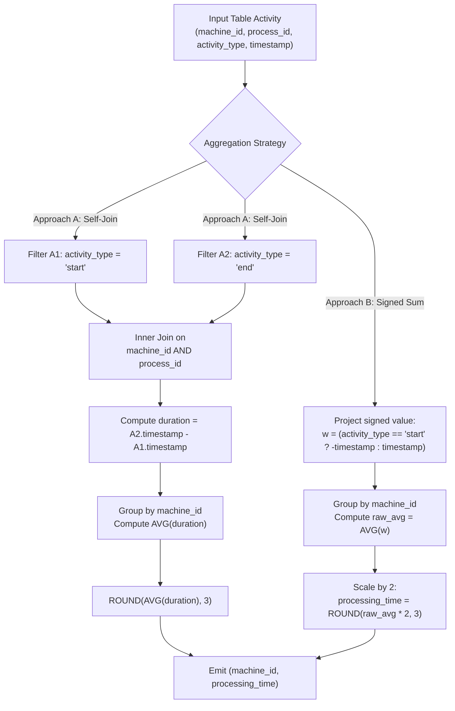

# Guided Example: Average Time of Process per Machine

We trace the relational aggregation and mathematical equivalence of process execution intervals, prove the Signed Sum Aggregation Theorem and the Process Cohort Mean Invariant, and walk through the evaluation across representative relational instances:

- **Representative Instance 1 (Three Machines with Parallel Processes):**
  - Input Table `Activity`:
    - Machine $0$:
      - Process $0$: `start` at $0.712$, `end` at $1.520$ $\implies$ duration: $1.520 - 0.712 = 0.808$.
      - Process $1$: `start` at $3.140$, `end` at $4.120$ $\implies$ duration: $4.120 - 3.140 = 0.980$.
      - Mean duration: $\frac{0.808 + 0.980}{2} = \frac{1.788}{2} = \mathbf{0.894}$.
    - Machine $1$:
      - Process $0$: `start` at $0.550$, `end` at $1.550$ $\implies$ duration: $1.550 - 0.550 = 1.000$.
      - Process $1$: `start` at $0.430$, `end` at $1.420$ $\implies$ duration: $1.420 - 0.430 = 0.990$.
      - Mean duration: $\frac{1.000 + 0.990}{2} = \frac{1.990}{2} = \mathbf{0.995}$.
    - Machine $2$:
      - Process $0$: `start` at $4.100$, `end` at $4.512$ $\implies$ duration: $4.512 - 4.100 = 0.412$.
      - Process $1$: `start` at $2.500$, `end` at $5.000$ $\implies$ duration: $5.000 - 2.500 = 2.500$.
      - Mean duration: $\frac{0.412 + 2.500}{2} = \frac{2.912}{2} = \mathbf{1.456}$.
  - **Required Output:**
    - `(0, 0.894)`
    - `(1, 0.995)`
    - `(2, 1.456)`

- **Representative Instance 2 (Single Process Machine):**
  - Input: Machine $7$ runs Process $4$ (`start` at $1.250$, `end` at $3.750$).
  - Elapsed duration: $3.750 - 1.250 = 2.500$.
  - Mean duration: $\frac{2.500}{1} = \mathbf{2.500}$.
  - **Required Output:** `(7, 2.5)`.

- **Representative Instance 3 (Three-Decimal Precision Rounding):**
  - Input: Machine $3$ runs Process $1$ ($0.000 \to 1.002$, duration $1.002$) and Process $2$ ($2.000 \to 3.006$, duration $1.006$).
  - Total process duration: $1.002 + 1.006 = 2.008$.
  - Mean duration: $\frac{2.008}{2} = \mathbf{1.004}$.
  - **Required Output:** `(3, 1.004)`.

---

## 1. Instance & Teaching Goal

The `Activity` relation records lifecycle events of processes executed across distinct machines. Each record specifies a `machine_id`, a `process_id`, an `activity_type` in $\{\text{'start'}, \text{'end'}\}$, and a continuous `timestamp`. The primary key is the composite tuple `(machine_id, process_id, activity_type)`.

```text
Table Schema:
  Activity (machine_id, process_id, activity_type, timestamp)

Problem Objective:
  Compute the average duration of a process for each machine_id:
    processing_time = (Total time across all processes on machine) / (Number of processes on machine)
  Round the resulting float to exactly 3 decimal places.
```

The pedagogical focus centers on two equivalent relational formulation paradigms:
1. **The Pair-Matching Self-Join Paradigm:**
   Match each `start` record with its corresponding `end` record sharing the same `(machine_id, process_id)`, compute row-level differences $t_{\text{end}} - t_{\text{start}}$, and group by `machine_id` to aggregate via the arithmetic mean.
2. **The Signed Single-Pass Aggregation Paradigm:**
   Avoid table self-joins altogether by observing that subtraction distributes over summation. Each `start` timestamp contributes $-t$, and each `end` timestamp contributes $+t$. Because each process generates exactly two records, the average of signed timestamps across all $2K$ rows equals half the mean process duration. Multiplying by $2$ recovers the exact mean in a single scan.

---

## 2. Conceptual Foundation & Aggregation Pipeline



### The Signed Sum Aggregation Theorem

Let machine $m$ execute a set of $K_m$ distinct processes $\mathcal{P}_m = \{p_1, p_2, \dots, p_{K_m}\}$.
For each process $p \in \mathcal{P}_m$, the table contains exactly one record with $\text{activity\_type} = \text{'start'}$ at timestamp $t_{\text{start}}(m, p)$ and one record with $\text{activity\_type} = \text{'end'}$ at timestamp $t_{\text{end}}(m, p)$, where $t_{\text{end}}(m, p) > t_{\text{start}}(m, p)$.

1. **Definition of Machine Mean Duration:**
   The true mean duration $\overline{D}_m$ per process on machine $m$ is:
   $$
   \overline{D}_m = \frac{1}{K_m} \sum_{p \in \mathcal{P}_m} \left( t_{\text{end}}(m, p) - t_{\text{start}}(m, p) \right)
   $$

2. **Equivalence of Signed Relational Average:**
   Define the signed value function for any row $r$:
   $$
   w(r) = \begin{cases} -r.\text{timestamp} & \text{if } r.\text{activity\_type} = \text{'start'} \\ +r.\text{timestamp} & \text{if } r.\text{activity\_type} = \text{'end'} \end{cases}
   $$
   The total number of rows belonging to machine $m$ in `Activity` is $N_m = 2 K_m$.
   The relational average of $w(r)$ over all records belonging to machine $m$ is:
   $$
   \text{AVG}_{r \in \text{Activity}_m} [w(r)] = \frac{1}{2 K_m} \sum_{r \in \text{Activity}_m} w(r) = \frac{1}{2 K_m} \left( \sum_{p \in \mathcal{P}_m} t_{\text{end}}(m, p) - \sum_{p \in \mathcal{P}_m} t_{\text{start}}(m, p) \right)
   $$
   Factoring out $\frac{1}{2}$:
   $$
   \text{AVG}_{r \in \text{Activity}_m} [w(r)] = \frac{1}{2} \cdot \left[ \frac{1}{K_m} \sum_{p \in \mathcal{P}_m} (t_{\text{end}}(m, p) - t_{\text{start}}(m, p)) \right] = \frac{1}{2} \overline{D}_m
   $$
   Therefore:
   $$
   \overline{D}_m = 2 \times \text{AVG}_{r \in \text{Activity}_m} [w(r)]
   $$

3. **Invariance to Row Ordering:**
   Because the relational operators `SUM` and `AVG` are commutative and associative multisets over finite sets of real numbers, the computation produces identical results regardless of physical table order, arrival interleaving, or process ID sequence.

---

## 3. Step-by-Step Worked Execution

### Trace on Representative Instance 1 (Machine 0 Partition)

Rows for `machine_id = 0`:
- Row 1: `process_id = 0, activity_type = 'start', timestamp = 0.712`
- Row 2: `process_id = 0, activity_type = 'end', timestamp = 1.520`
- Row 3: `process_id = 1, activity_type = 'start', timestamp = 3.140`
- Row 4: `process_id = 1, activity_type = 'end', timestamp = 4.120`

#### Step 1: Mapping Signed Values $w(r)$
- Row 1: `'start'` $\implies w_1 = -0.712$
- Row 2: `'end'` $\implies w_2 = +1.520$
- Row 3: `'start'` $\implies w_3 = -3.140$
- Row 4: `'end'` $\implies w_4 = +4.120$

#### Step 2: Summing Signed Values
- Sum of signed contributions:
  $$
  \Sigma_0 = (-0.712) + 1.520 + (-3.140) + 4.120
  $$
  $$
  \Sigma_0 = (1.520 - 0.712) + (4.120 - 3.140) = 0.808 + 0.980 = 1.788
  $$

#### Step 3: Computing the Arithmetic Mean Across Rows
- Total row count: $N_0 = 4$.
- Raw row average:
  $$
  \text{raw\_avg}_0 = \frac{1.788}{4} = 0.447
  $$

#### Step 4: Scaling to Process Duration
- Each process comprises $2$ rows. Multiply by $2$:
  $$
  \overline{D}_0 = 0.447 \times 2 = 0.894
  $$
- Round to $3$ decimal places:
  $$
  \text{ROUND}(0.894, 3) = \mathbf{0.894}
  $$

---

## 4. Complete Execution Trace

### Multi-Machine Aggregation Summary Table

| Machine ID | Total Rows $N_m$ | Process Count $K_m$ | Sum of Start Timestamps $\Sigma t_{\text{start}}$ | Sum of End Timestamps $\Sigma t_{\text{end}}$ | Net Duration $\Sigma t_{\text{end}} - \Sigma t_{\text{start}}$ | Mean Duration $\overline{D}_m = \frac{\text{Net}}{K_m}$ | Rounded Result |
|---|---|---|---|---|---|---|---|
| $0$ | $4$ | $2$ | $0.712 + 3.140 = 3.852$ | $1.520 + 4.120 = 5.640$ | $5.640 - 3.852 = 1.788$ | $\frac{1.788}{2} = 0.894$ | **`0.894`** |
| $1$ | $4$ | $2$ | $0.550 + 0.430 = 0.980$ | $1.550 + 1.420 = 2.970$ | $2.970 - 0.980 = 1.990$ | $\frac{1.990}{2} = 0.995$ | **`0.995`** |
| $2$ | $4$ | $2$ | $4.100 + 2.500 = 6.600$ | $4.512 + 5.000 = 9.512$ | $9.512 - 6.600 = 2.912$ | $\frac{2.912}{2} = 1.456$ | **`1.456`** |

---

## 5. Algorithmic Correctness

**Soundness.**
The problem guarantees that every process has exactly one `start` and one `end` event with $t_{\text{end}} > t_{\text{start}}$. The total elapsed operational time for machine $m$ across all processes is mathematically identical to the difference between the sum of its end timestamps and the sum of its start timestamps:
$$
\sum_{p} (t_{\text{end}, p} - t_{\text{start}, p}) = \sum_{p} t_{\text{end}, p} - \sum_{p} t_{\text{start}, p}
$$
Dividing by the count of processes $K_m$ yields the exact arithmetic mean of process durations. Applying standard floating-point rounding to $3$ decimals guarantees adherence to the required precision specification.

**Completeness.**
Grouping by `machine_id` ensures that every distinct machine present in the `Activity` table forms an independent aggregation bucket. No machine is dropped, and no events belonging to one machine leak into another.

---

## 6. Traps This Instance Exposes

- **Premature Intermediate Rounding:** Rounding individual process durations prior to averaging introduces cumulative precision bias. Rounding must be applied strictly once to the final machine-level average.
- **Process ID Reuse Across Machines:** Different machines can reuse identical `process_id` values (e.g., both machine $1$ and machine $2$ run `process_id = 0`). If using a self-join approach, the join predicate must combine both keys: `ON a1.machine_id = a2.machine_id AND a1.process_id = a2.process_id`.
- **Assuming Physical Row Adjacency:** A `start` record is not guaranteed to immediately precede its corresponding `end` record in physical disk order. Relational operations must not rely on row sequence or consecutive offsets.
- **Denominator Miscount:** When using signed sums, the number of records is $2K$, whereas the number of processes is $K$. Failing to scale the raw average by $2$ yields half the true duration.

---

## 7. Complexity Derivation

- **Time Complexity:**
  - **Signed Sum Single-Pass Approach:** Reads the table of $N$ rows once, maps values in $\mathcal{O}(1)$, and inserts into an in-memory hash aggregation table keyed by `machine_id`. Total time: strictly $\mathcal{O}(N)$ linear scan time.
  - **Self-Join Approach:** Filtering into two partitions takes $\mathcal{O}(N)$. Joining on `(machine_id, process_id)` takes $\mathcal{O}(N)$ using hash join. Grouping by `machine_id` takes $\mathcal{O}(N)$. Total time: $\mathcal{O}(N)$.
- **Auxiliary Space Complexity:**
  - **Signed Sum Approach:** The hash aggregation table maintains running sum and count accumulators for each distinct `machine_id`. For $M$ machines, space is $\mathcal{O}(M)$, which is bounded by $\mathcal{O}(N)$ and typically $\ll N$.
  - **Self-Join Approach:** Requires materialized hash tables for the join buffer of size $\mathcal{O}(N / 2) = \mathcal{O}(N)$.
