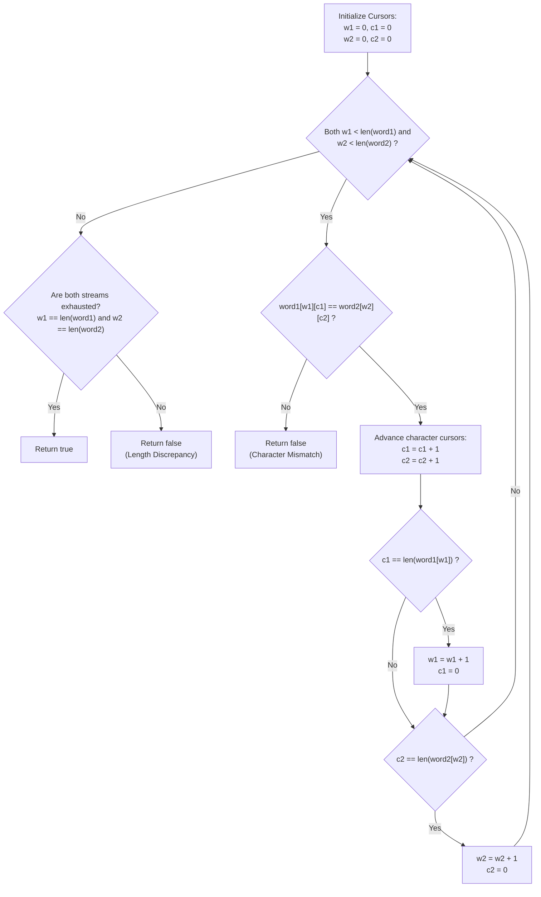

# Guided Example: Check If Two String Arrays are Equivalent

We trace the sequential character stream comparison across chunked string arrays, prove the Character Stream Duality Theorem and the Two-Pointer Stream Transition Invariant, and analyze equivalence across representative problem instances:

- **Representative Instance 1 (Equal Concatenation with Asymmetric Chunks):**
  - Input: `word1 = ["ab", "c"], word2 = ["a", "bc"]`
  - Concatenated streams:
    - Array 1: `"ab"` $+$ `"c"` $\implies$ `"abc"` (length $3$).
    - Array 2: `"a"` $+$ `"bc"` $\implies$ `"abc"` (length $3$).
  - Character comparisons:
    - Index $0$: `'a'` vs. `'a'` $\implies$ match.
    - Index $1$: `'b'` vs. `'b'` $\implies$ match.
    - Index $2$: `'c'` vs. `'c'` $\implies$ match.
  - Both streams exhausted simultaneously at length $3$.
  - **Required Output:** `true`.

- **Representative Instance 2 (Early Character Mismatch):**
  - Input: `word1 = ["a", "cb"], word2 = ["ab", "c"]`
  - Concatenated streams:
    - Array 1: `"acb"`.
    - Array 2: `"abc"`.
  - Character comparisons:
    - Index $0$: `'a'` vs. `'a'` $\implies$ match.
    - Index $1$: `'c'` vs. `'b'` $\implies$ mismatch!
  - Early exit at character position $1$.
  - **Required Output:** `false`.

- **Representative Instance 3 (Prefix Match with Length Discrepancy):**
  - Input: `word1 = ["abc", "d", "defg"], word2 = ["abcddef"]`
  - Concatenated streams:
    - Array 1: `"abcddefg"` (length $8$).
    - Array 2: `"abcddef"` (length $7$).
  - First $7$ characters match identically. At step $7$, `word2` is exhausted while `word1` still has character `'g'`.
  - Asymmetric stream exhaustion.
  - **Required Output:** `false`.

---

## 1. Instance & Teaching Goal

Given two arrays of strings, `word1` and `word2`, determine whether the concatenated sequence of characters from `word1` is identical to that of `word2`.

```text
The Structural Chunking Representation:
  word1: [  "ab"  ,   "c"  ]  --> Stream 1: 'a' -> 'b' -> 'c'
  word2: [  "a"   ,  "bc"  ]  --> Stream 2: 'a' -> 'b' -> 'c'
```

While high-level runtime environments offer direct string concatenation operations (e.g., joining all elements and performing an equality check), allocating full concatenated strings incurs an unnecessary $\mathcal{O}(N)$ memory footprint and requires redundant allocation of auxiliary buffers.

The pedagogical focus is the **Two-Pointer Character Stream Traversal**:
1. **Streaming Abstraction:** Treat each array of string chunks as an infinite character iterator without materializing the joined string.
2. **Chunk Transition Invariants:** Track a 2D coordinate $(w, c)$ for each array, representing the current word chunk index $w$ and the character offset $c$ within that word.
3. **Simultaneous Boundary Verification:** A valid match requires that every pair of corresponding characters matches, and that both chunk streams exhaust simultaneously.

---

## 2. Conceptual Foundation & Stream Pipeline



### The Character Stream Duality Theorem

Let $W_1 = (u_0, u_1, \dots, u_{p-1})$ and $W_2 = (v_0, v_1, \dots, v_{q-1})$ be sequences of strings over an alphabet $\Sigma$.
Define the concatenation operator $\phi(W) = u_0 \circ u_1 \circ \dots \circ u_{p-1}$, where $\circ$ represents string concatenation.

1. **Coordinate Mapping:**
   For any stream coordinate $(w, c)$ where $0 \le w < |W|$ and $0 \le c < |W[w]|$, the global 1D character offset is given by the bijection:
   $$
   k(w, c) = \left( \sum_{m=0}^{w-1} |W[m]| \right) + c
   $$
   The character at global index $k$ in $\phi(W)$ is $W[w][c]$.

2. **Equivalence Invariant:**
   $\phi(W_1) = \phi(W_2)$ if and only if:
   - $|\phi(W_1)| = |\phi(W_2)| = N$, and
   - For every global position $k \in \{0, 1, \dots, N-1\}$, $W_1[w_1(k)][c_1(k)] = W_2[w_2(k)][c_2(k)]$.

3. **Space Minimization Principle:**
   Instead of computing $\phi(W_1)$ and $\phi(W_2)$ in $\mathcal{O}(N)$ memory, the 2D coordinates $(w_1, c_1)$ and $(w_2, c_2)$ advance across the discrete chunks in $\mathcal{O}(1)$ space:
   $$
   (w, c) \leftarrow \begin{cases} (w, c + 1) & \text{if } c + 1 < |W[w]| \\ (w + 1, 0) & \text{if } c + 1 = |W[w]| \end{cases}
   $$

---

## 3. Step-by-Step Worked Execution

### Trace on Representative Instance 1 (`word1 = ["ab", "c"]`, `word2 = ["a", "bc"]`)

Initial State:
- Stream 1: $w_1 = 0, c_1 = 0$ ($word1[0] = \text{"ab"}$)
- Stream 2: $w_2 = 0, c_2 = 0$ ($word2[0] = \text{"a"}$)

#### Step 1: Compare Global Offset $k = 0$
- Current characters:
  - $word1[w_1][c_1] = word1[0][0] = \text{'a'}$
  - $word2[w_2][c_2] = word2[0][0] = \text{'a'}$
- Check equality: `'a' == 'a'` $\implies$ Match!
- Advance cursors:
  - $c_1 \leftarrow 0 + 1 = 1$. Since $c_1 < |word1[0]| \; (1 < 2)$, maintain $w_1 = 0, c_1 = 1$.
  - $c_2 \leftarrow 0 + 1 = 1$. Since $c_2 == |word2[0]| \; (1 == 1)$, chunk $0$ of $word2$ is exhausted:
    $$w_2 \leftarrow 0 + 1 = 1, \quad c_2 \leftarrow 0$$

#### Step 2: Compare Global Offset $k = 1$
- Current characters:
  - $word1[w_1][c_1] = word1[0][1] = \text{'b'}$
  - $word2[w_2][c_2] = word2[1][0] = \text{'b'}$
- Check equality: `'b' == 'b'` $\implies$ Match!
- Advance cursors:
  - $c_1 \leftarrow 1 + 1 = 2$. Since $c_1 == |word1[0]| \; (2 == 2)$, chunk $0$ of $word1$ is exhausted:
    $$w_1 \leftarrow 0 + 1 = 1, \quad c_1 \leftarrow 0$$
  - $c_2 \leftarrow 0 + 1 = 1$. Since $c_2 < |word2[1]| \; (1 < 2)$, maintain $w_2 = 1, c_2 = 1$.

#### Step 3: Compare Global Offset $k = 2$
- Current characters:
  - $word1[w_1][c_1] = word1[1][0] = \text{'c'}$
  - $word2[w_2][c_2] = word2[1][1] = \text{'c'}$
- Check equality: `'c' == 'c'` $\implies$ Match!
- Advance cursors:
  - $c_1 \leftarrow 0 + 1 = 1$. Since $c_1 == |word1[1]| \; (1 == 1)$, chunk $1$ is exhausted:
    $$w_1 \leftarrow 1 + 1 = 2, \quad c_1 \leftarrow 0$$
  - $c_2 \leftarrow 1 + 1 = 2$. Since $c_2 == |word2[1]| \; (2 == 2)$, chunk $1$ is exhausted:
    $$w_2 \leftarrow 1 + 1 = 2, \quad c_2 \leftarrow 0$$

#### Step 4: Stream Termination Check
- Both stream word indices have reached array limits:
  - $w_1 = 2 == |word1|$
  - $w_2 = 2 == |word2|$
- Both streams completed simultaneously without any mismatch.
- Return **`true`**.

---

## 4. Complete Execution Trace

### Pointer State Progression Table for Representative Instance 1

| Global Step $k$ | Cursor 1 $(w_1, c_1)$ | Character 1 | Cursor 2 $(w_2, c_2)$ | Character 2 | Comparison | Next Cursor 1 $(w_1, c_1)$ | Next Cursor 2 $(w_2, c_2)$ |
|---|---|---|---|---|---|---|---|
| $0$ | $(0, 0)$ | `'a'` | $(0, 0)$ | `'a'` | `'a' == 'a'` (Valid) | $(0, 1)$ | $(1, 0)$ [Word 0 ended] |
| $1$ | $(0, 1)$ | `'b'` | $(1, 0)$ | `'b'` | `'b' == 'b'` (Valid) | $(1, 0)$ [Word 0 ended] | $(1, 1)$ |
| $2$ | $(1, 0)$ | `'c'` | $(1, 1)$ | `'c'` | `'c' == 'c'` (Valid) | $(2, 0)$ [All words done] | $(2, 0)$ [All words done] |
| **End** | $(2, 0)$ | Done | $(2, 0)$ | Done | $w_1 == 2 \land w_2 == 2$ | **Streams Equivalent** | **Output: `true`** |

---

## 5. Algorithmic Correctness

**Soundness.**
If the algorithm terminates and returns `true`, every character at global index $k$ in $W_1$ was directly compared against the character at global index $k$ in $W_2$ and confirmed equal. Furthermore, both cursors reached the ends of their respective word lists at the exact same step, proving that $|\phi(W_1)| = |\phi(W_2)|$. By definition of string equality, $\phi(W_1) = \phi(W_2)$.

**Completeness.**
If the strings are not equivalent, there must exist either:
1. A minimal character position $k$ where $\phi(W_1)[k] \neq \phi(W_2)[k]$, which triggers an immediate equality check failure returning `false`.
2. A length discrepancy where one string is a strict prefix of the other. In this case, the shorter stream exhausts while the longer stream still has characters remaining, causing the boundary check $w_1 == |word1| \land w_2 == |word2|$ to evaluate to `false`.

---

## 6. Traps This Instance Exposes

- **Unequal Word Chunk Lengths:** Word arrays can segment the same logical string into wildly different chunk lengths (e.g., `["a", "b", "c"]` vs `["abc"]`). The logic must handle chunk transitions independently for both pointers.
- **Prefix Trap (Asymmetric Exhaustion):** If `word1` produces `"abc"` and `word2` produces `"abcd"`, all characters compared during the loop match. Failing to verify that **both** streams are exhausted simultaneously causes false positives.
- **Memory Overhead of Concatenation:** Using string join operations allocates new strings of length $N$ on the heap. While asymptotically acceptable for small constraints, this incurs unnecessary $\mathcal{O}(N)$ memory allocations.
- **Empty Word Elements:** If inputs contain empty strings `""`, a cursor arriving at `""` must immediately roll over to the next chunk without evaluating a character.

---

## 7. Complexity Derivation

- **Time Complexity:**
  - Let $N = \sum |word1[i]|$.
  - In each iteration, exactly one character from each stream is compared, advancing at least one index.
  - The loop executes at most $\min(N_1, N_2) \le N$ times.
  - If strings mismatch early, execution halts immediately in $\mathcal{O}(1)$ to $\mathcal{O}(k)$ time.
  - Worst-case Time Complexity: strictly $\mathcal{O}(N)$ linear time.
- **Auxiliary Space Complexity:**
  - **Two-Pointer Approach:** Only four integer indices ($w_1, c_1, w_2, c_2$) are maintained.
  - Total Auxiliary Space: strictly $\mathcal{O}(1)$ constant space.
  - **Concatenation Approach:** Requires allocating two strings of length $N$, requiring $\mathcal{O}(N)$ auxiliary heap memory.
