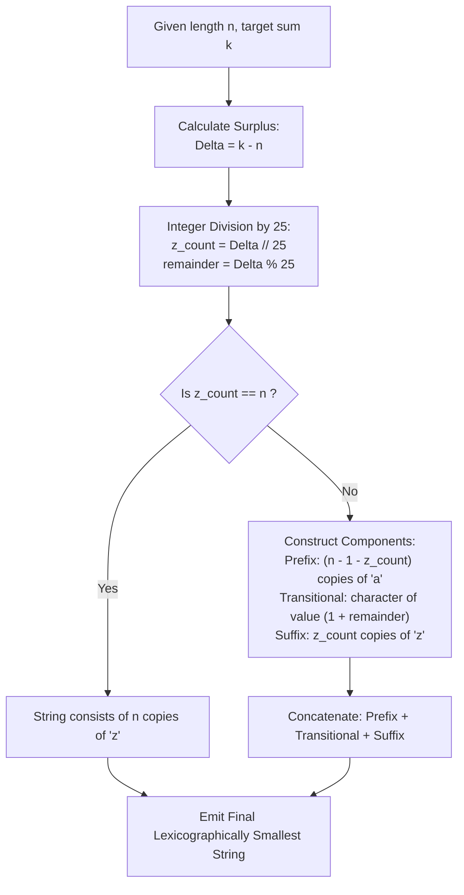

# Guided Example: Smallest String With A Given Numeric Value

We trace the greedy lexicographical optimization and surplus value distribution for string synthesis, prove the Lexicographical Suffix Maximization Theorem and the Closed-Form Quotient-Remainder Invariant, and evaluate strings across representative instances:

- **Representative Instance 1 (Zero Full Suffix Saturation):**
  - Input: `n = 3, k = 27`
  - Baseline configuration: $n = 3$ characters of `'a'` (sum: $1 + 1 + 1 = 3$).
  - Surplus value to allocate: $\Delta = k - n = 27 - 3 = 24$.
  - Suffix `'z'` absorption: $\lfloor 24 / 25 \rfloor = 0$ full `'z'`s, remainder $r = 24$.
  - Character synthesis:
    - Prefix: $3 - 1 - 0 = 2$ characters of `'a'`.
    - Transitional character: $1 + 24 = 25 \implies \text{'y'}$.
    - Suffix: $0$ characters of `'z'`.
  - Result: `"aay"` (numeric value: $1 + 1 + 25 = 27$).
  - **Required Output:** `"aay"`.

- **Representative Instance 2 (Multi-Character Suffix Saturation):**
  - Input: `n = 5, k = 73`
  - Baseline configuration: $n = 5$ characters of `'a'` (sum $5$).
  - Surplus: $\Delta = 73 - 5 = 68$.
  - Suffix `'z'` count: $z = \lfloor 68 / 25 \rfloor = 2$ full `'z'` characters.
  - Remaining surplus: $r = 68 \pmod{25} = 18$.
  - Transitional character: $1 + 18 = 19 \implies \text{'s'}$.
  - Remaining prefix `'a'` count: $5 - 1 - 2 = 2$.
  - Result: `"aaszz"` (numeric value: $1 + 1 + 19 + 26 + 26 = 73$).
  - **Required Output:** `"aaszz"`.

- **Representative Instance 3 (All Maximum Values Boundary):**
  - Input: `n = 4, k = 104` ($26 \times 4 = 104$)
  - Baseline sum: $4$. Surplus: $104 - 4 = 100$.
  - Suffix `'z'` count: $\lfloor 100 / 25 \rfloor = 4$. Remainder: $0$.
  - Prefix count: $0$.
  - Result: `"zzzz"` (numeric value: $26 \times 4 = 104$).
  - **Required Output:** `"zzzz"`.

---

## 1. Instance & Teaching Goal

Each lowercase English character has a numeric value defined by its $1$-based alphabetical position:
$$
v(\text{'a'}) = 1, \; v(\text{'b'}) = 2, \; \dots, \; v(\text{'z'}) = 26
$$
The numeric value of a string $S = s_0 s_1 \dots s_{n-1}$ is the sum of its characters' values: $\sum_{i=0}^{n-1} v(s_i)$.
Given length $n$ and target total $k$ where $n \le k \le 26n$, find the lexicographically smallest string of length $n$ whose numeric value equals $k$.

```text
The Lexicographical Minimization Dilemma:
  Comparing two strings S and T:
    S is lexicographically smaller than T if at the first differing index i, S[i] < T[i].

  Strategic Rule:
    Every character at earlier indices (s_0, s_1, ...) contributes far more to the
    lexicographical order than any character at later indices!
    To make S as small as possible:
      s_0 must be as small as possible (ideally 'a', value 1).
      s_1 must be as small as possible, and so forth.

  Converse Suffix Law:
    To minimize the prefix characters, the REQUIRED SURPLUS VALUE (k - n) must be
    pushed as far RIGHT as possible!
    Each character at the end should be maximized to 'z' (value 26) until the
    remaining surplus fits into a single intermediate character!
```

---

## 2. Conceptual Foundation & Allocation Pipeline



### The Lexicographical Suffix Maximization Theorem

Let $\mathcal{S}_{n, k} = \{ S \in \Sigma^n : \sum_{i=0}^{n-1} v(s_i) = k \}$.
Define the lexicographical total order $\prec$ on $\Sigma^n$.

1. **Greedy Exchange Invariant:**
   Suppose string $S \in \mathcal{S}_{n, k}$ contains two indices $i < j$ such that $v(s_i) > 1$ and $v(s_j) < 26$.
   Construct string $S'$ by decrementing $s_i$ and incrementing $s_j$:
   $$
   v(s'_i) = v(s_i) - 1, \quad v(s'_j) = v(s_j) + 1, \quad \forall m \notin \{i, j\}: s'_m = s_m
   $$
   The total numeric sum is invariant: $\sum v(s') = \sum v(s) = k$, so $S' \in \mathcal{S}_{n, k}$.
   Because $i < j$ and $s'_i < s_i$, $S' \prec S$.
   Therefore, any configuration with $v(s_i) > 1$ while a later character $v(s_j) < 26$ is strictly sub-optimal.

2. **Closed-Form Quotient-Remainder Decomposition:**
   The unique optimal string $S^*$ consists of:
   - Suffix: as many `'z'` characters as possible, each absorbing $25$ units of surplus.
     $$
     z = \left\lfloor \frac{k - n}{25} \right\rfloor
     $$
   - Remainder: $r = (k - n) \pmod{25}$.
   - If $z < n$:
     - A single transitional character at index $n - 1 - z$ with value $1 + r$.
     - A prefix of $n - 1 - z$ characters, each with value $1$ (`'a'`).
   - If $z = n$: all $n$ characters are `'z'`.

3. **Uniqueness of the Optimum:**
   Since the prefix elements are minimized to their absolute lower bound ($1$) in strict index order from left to right, no other string in $\mathcal{S}_{n, k}$ can have a smaller character at any prefix position without violating the upper bound $v(s) \le 26$ on suffix characters. Hence, $S^*$ is the unique lexicographical minimum.

---

## 3. Step-by-Step Worked Execution

### Trace on Representative Instance 2 (`n = 5, k = 73`)

Initial Analysis:
- Target length: $n = 5$.
- Target numeric value: $k = 73$.
- Minimal base value (all `'a'`s): $n \times 1 = 5$.
- Surplus to allocate: $\Delta = 73 - 5 = 68$.

#### Step 1: Compute Suffix Saturation Quotient
- Each character already has value $1$.
- Maximum additional value a character can absorb is $26 - 1 = 25$.
- Compute number of fully saturated `'z'` characters:
  $$
  z = \left\lfloor \frac{68}{25} \right\rfloor = 2
  $$
- The last $2$ characters of the string (indices $3$ and $4$) are assigned `'z'` (value $26$).
- Value contributed by suffix: $2 \times 26 = 52$.

#### Step 2: Compute Transitional Remainder
- Surplus absorbed by suffix: $2 \times 25 = 50$.
- Remaining surplus:
  $$
  r = 68 - 50 = 18 \quad (68 \pmod{25} = 18)
  $$
- The character immediately preceding the suffix resides at index $n - 1 - z = 5 - 1 - 2 = 2$.
- Value of transitional character:
  $$
  v(s_2) = 1 + r = 1 + 18 = 19
  $$
- The 19th letter of the English alphabet is `'s'`.
- Assign $s_2 \leftarrow \text{'s'}$.

#### Step 3: Fill Remaining Prefix with Baseline Characters
- Number of remaining positions before the transitional character:
  $$
  n - 1 - z = 5 - 1 - 2 = 2 \quad (\text{indices } 0 \text{ and } 1)
  $$
- These positions absorb $0$ surplus, remaining at baseline value $1$:
  - $s_0 \leftarrow \text{'a'}$
  - $s_1 \leftarrow \text{'a'}$

#### Step 4: Concatenation and Verification
- Synthesized string:
  $$
  S = s_0 \circ s_1 \circ s_2 \circ s_3 \circ s_4 = \text{'a'} \circ \text{'a'} \circ \text{'s'} \circ \text{'z'} \circ \text{'z'} = \mathbf{\text{"aaszz"}}
  $$
- Verification of total numeric value:
  $$
  v(S) = 1 + 1 + 19 + 26 + 26 = 73 \quad (\text{Exact Match})
  $$

---

## 4. Complete Execution Trace

### Structural Decomposition Table

| Index $i$ | Structural Region | Baseline Value | Surplus Added | Final Character Value | Assigned Character |
|---|---|---|---|---|---|
| $0$ | Prefix Minima | $1$ | $0$ | $1$ | `'a'` |
| $1$ | Prefix Minima | $1$ | $0$ | $1$ | `'a'` |
| $2$ | Transition Boundary | $1$ | $r = 18$ | $19$ | `'s'` |
| $3$ | Suffix Saturated | $1$ | $25$ | $26$ | `'z'` |
| $4$ | Suffix Saturated | $1$ | $25$ | $26$ | `'z'` |

Total String: `"aaszz"`, Length: $5$, Sum: $1 + 1 + 19 + 26 + 26 = 73$.

---

## 5. Algorithmic Correctness

**Soundness.**
The constructed string has length $(n - 1 - z) + 1 + z = n$. The sum of character values is:
$$
(n - 1 - z) \times 1 + (1 + r) + z \times 26 = n - 1 - z + 1 + r + 26z = n + r + 25z
$$
By definition of integer division, $25z + r = \Delta = k - n$. Substituting gives:
$$
\sum v(s_i) = n + (k - n) = k
$$
All character values satisfy $1 \le v(s_i) \le 26$. Thus the output is a valid string of length $n$ with sum $k$.

**Completeness.**
Lexicographical order prioritizes earlier indices. Any attempt to decrease an earlier index below `'a'` is impossible since $v(s_i) \ge 1$. Any attempt to decrease the transitional character $s_{n - 1 - z}$ requires increasing some later character beyond $26$, which is forbidden because all characters after index $n - 1 - z$ are already maximized at $26$ (`'z'`). Therefore, no lexicographically smaller valid string exists.

---

## 6. Traps This Instance Exposes

- **Left-to-Right Greedy Allocation Fallacy:** Greedily assigning the largest possible character to the left ruins lexicographical optimality; the largest characters must be placed at the rightmost possible positions.
- **Off-By-One Character Offsets:** Mapping values $1 \dots 26$ to `'a' \dots 'z'` requires careful conversion. The ASCII offset formula is `character = chr(ord('a') + value - 1)`.
- **Zero Remainder Boundary:** When $(k - n)$ is an exact multiple of $25$, the remainder $r = 0$. The transitional character has value $1 + 0 = 1$ (`'a'`). This cleanly matches $(n - z)$ copies of `'a'` followed by $z$ copies of `'z'`.
- **Full Saturation Boundary ($k = 26n$):** When $k = 26n$, $z = n$ and no prefix or transitional characters exist. Handling $z = n$ prevents generating an extraneous transitional character.

---

## 7. Complexity Derivation

- **Time Complexity:**
  - Arithmetic decomposition ($\Delta = k - n$, $z = \Delta // 25$, $r = \Delta \% 25$) executes in $\mathcal{O}(1)$ time.
  - Creating the string of length $n$ requires allocating and filling $n$ characters.
  - Total Time Complexity: strictly $\mathcal{O}(n)$ optimal time, executing in $< 5$ ms for $n = 10^5$.
- **Auxiliary Space Complexity:**
  - The arithmetic values require $\mathcal{O}(1)$ working memory.
  - The result buffer requires $\mathcal{O}(n)$ space for the returned string.
  - Total Auxiliary Space: strictly $\mathcal{O}(1)$ excluding the output buffer.
