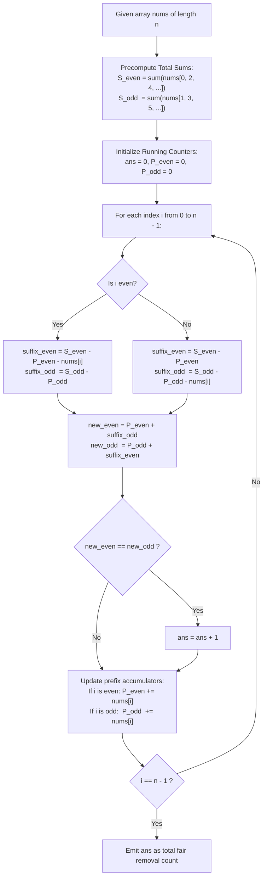

# Guided Example: Ways to Make a Fair Array

We trace the dynamic index parity shifts caused by single-element array removal, prove the Parity Inversion Duality Theorem and the Online Prefix-Suffix Accounting Invariant, and evaluate candidate pivot removals across representative instances:

- **Representative Instance 1 (Single Valid Pivot):**
  - Input: `nums = [2, 1, 6, 4]`
  - Total sums by parity:
    - Even indices ($0, 2$): $nums[0] + nums[2] = 2 + 6 = 8$.
    - Odd indices ($1, 3$): $nums[1] + nums[3] = 1 + 4 = 5$.
  - Evaluating pivot removals:
    - Remove index $0$ (`nums[0] = 2`): Remaining `[1, 6, 4]`.
      - Even sum: $nums'[0] + nums'[2] = 1 + 4 = 5$.
      - Odd sum: $nums'[1] = 6$.
      - $5 \neq 6 \implies$ Not fair.
    - Remove index $1$ (`nums[1] = 1`): Remaining `[2, 6, 4]`.
      - Even sum: $nums'[0] + nums'[2] = 2 + 4 = 6$.
      - Odd sum: $nums'[1] = 6$.
      - $6 == 6 \implies$ **Fair Array!**
    - Remove index $2$ (`nums[2] = 6`): Remaining `[2, 1, 4]`.
      - Even sum: $2 + 4 = 6$. Odd sum: $1$. ($6 \neq 1$) $\implies$ Not fair.
    - Remove index $3$ (`nums[3] = 4`): Remaining `[2, 1, 6]`.
      - Even sum: $2 + 6 = 8$. Odd sum: $1$. ($8 \neq 1$) $\implies$ Not fair.
  - Total fair pivot count: **`1`**.
  - **Required Output:** `1`.

- **Representative Instance 2 (All Pivots Valid Boundary):**
  - Input: `nums = [1, 1, 1]`
  - Removing any index leaves `[1, 1]`.
  - For `[1, 1]`, even sum is $1$ and odd sum is $1$, satisfying fairness for every index $i \in \{0, 1, 2\}$.
  - **Required Output:** `3`.

- **Representative Instance 3 (Zero Valid Pivots):**
  - Input: `nums = [1, 2, 3]`
  - Total even: $1 + 3 = 4$, odd: $2$.
  - Removing $0$: `[2, 3]` $\implies$ even $2 \neq$ odd $3$.
  - Removing $1$: `[1, 3]` $\implies$ even $1 \neq$ odd $3$.
  - Removing $2$: `[1, 2]` $\implies$ even $1 \neq$ odd $2$.
  - **Required Output:** `0`.

---

## 1. Instance & Teaching Goal

An integer array is defined as **fair** if the sum of the elements at odd indices equals the sum of the elements at even indices. We are tasked with counting how many distinct indices $i$ can be removed such that the resulting array of length $n - 1$ is fair.

```text
The Naive Re-indexing Trap:
  If for each candidate index i, we physically construct the array of length n - 1
  and compute the odd and even sums from scratch:
    - Array construction: O(n)
    - Summation:          O(n)
  Testing all n indices produces an O(n^2) algorithm, which times out for n = 10^5!

The Pivot Parity Shift Duality:
  Notice what happens to the indices of elements when element nums[i] is removed:
    - Before pivot (j < i): index in new array is j. PARITY IS UNCHANGED!
        Even elements remain even; odd elements remain odd.
    - After pivot (j > i):  index in new array is j - 1. PARITY IS INVERTED!
        Elements that were even become odd!
        Elements that were odd become even!

  Therefore, the new parity sums after removing nums[i] can be computed in O(1):
    New Even Sum = (Even elements strictly before i) + (Odd elements strictly after i)
    New Odd Sum  = (Odd elements strictly before i)  + (Even elements strictly after i)
```

---

## 2. Conceptual Foundation & Accounting Pipeline



### The Parity Inversion Duality Theorem

Let $A = (a_0, a_1, \dots, a_{n-1})$. Let $A^{(i)} = (a'_0, a'_1, \dots, a'_{n-2})$ be the sequence obtained by deleting element $a_i$.

1. **Mapping of Relative Coordinates:**
   The index $j'$ in $A^{(i)}$ of an element originating from position $j$ in $A$ is:
   $$
   j' = \begin{cases} j & \text{if } j < i \\ j - 1 & \text{if } j > i \end{cases}
   $$

2. **Parity Partitioning:**
   - For $j < i$, $j' \equiv j \pmod 2$.
   - For $j > i$, $j' \equiv j - 1 \equiv j + 1 \pmod 2$.
   Consequently, the sum of even-indexed elements in $A^{(i)}$ decomposes into two disjoint sums over $A$:
   $$
   \mathcal{E}(i) = \sum_{\substack{j < i \\ j \text{ even}}} a_j + \sum_{\substack{j > i \\ j \text{ odd}}} a_j
   $$
   Similarly, the sum of odd-indexed elements in $A^{(i)}$ decomposes as:
   $$
   \mathcal{O}(i) = \sum_{\substack{j < i \\ j \text{ odd}}} a_j + \sum_{\substack{j > i \\ j \text{ even}}} a_j
   $$

3. **$\mathcal{O}(1)$ Closed-Form Evaluation Invariant:**
   Let $S_{\text{even}} = \sum_{j \text{ even}} a_j$ and $S_{\text{odd}} = \sum_{j \text{ odd}} a_j$.
   Let $P_{\text{even}}(i)$ and $P_{\text{odd}}(i)$ denote the cumulative prefix sums of elements at even and odd indices strictly preceding $i$.
   Then the suffix sums strictly succeeding $i$ are:
   $$
   \text{suf}_{\text{even}}(i) = S_{\text{even}} - P_{\text{even}}(i) - (a_i \text{ if } i \text{ is even else } 0)
   $$
   $$
   \text{suf}_{\text{odd}}(i) = S_{\text{odd}} - P_{\text{odd}}(i) - (a_i \text{ if } i \text{ is odd else } 0)
   $$
   The post-deletion sums are evaluated in $\mathcal{O}(1)$ time:
   $$
   \mathcal{E}(i) = P_{\text{even}}(i) + \text{suf}_{\text{odd}}(i)
   $$
   $$
   \mathcal{O}(i) = P_{\text{odd}}(i) + \text{suf}_{\text{even}}(i)
   $$
   The removal of index $i$ yields a fair array if and only if $\mathcal{E}(i) = \mathcal{O}(i)$.

---

## 3. Step-by-Step Worked Execution

### Trace on Representative Instance 1 (`nums = [2, 1, 6, 4]`)

Precomputation:
- Indices: $0$ (even), $1$ (odd), $2$ (even), $3$ (odd).
- $S_{\text{even}} = nums[0] + nums[2] = 2 + 6 = 8$.
- $S_{\text{odd}} = nums[1] + nums[3] = 1 + 4 = 5$.
- Initialize: $\text{ans} = 0, \; P_{\text{even}} = 0, \; P_{\text{odd}} = 0$.

#### Step 0: Evaluate Pivot $i = 0$ ($nums[0] = 2$, even index)
- Suffixes after $0$:
  - $\text{suf}_{\text{even}} = S_{\text{even}} - P_{\text{even}} - nums[0] = 8 - 0 - 2 = 6$.
  - $\text{suf}_{\text{odd}} = S_{\text{odd}} - P_{\text{odd}} = 5 - 0 = 5$.
- Compute post-deletion sums:
  - $\mathcal{E}(0) = P_{\text{even}} + \text{suf}_{\text{odd}} = 0 + 5 = 5$.
  - $\mathcal{O}(0) = P_{\text{odd}} + \text{suf}_{\text{even}} = 0 + 6 = 6$.
- Compare: $5 \neq 6 \implies$ Not fair.
- Update prefix accumulators:
  - $i = 0$ is even $\implies P_{\text{even}} \leftarrow 0 + 2 = 2$. ($P_{\text{odd}} = 0$).

#### Step 1: Evaluate Pivot $i = 1$ ($nums[1] = 1$, odd index)
- Suffixes after $1$:
  - $\text{suf}_{\text{even}} = S_{\text{even}} - P_{\text{even}} = 8 - 2 = 6$.
  - $\text{suf}_{\text{odd}} = S_{\text{odd}} - P_{\text{odd}} - nums[1] = 5 - 0 - 1 = 4$.
- Compute post-deletion sums:
  - $\mathcal{E}(1) = P_{\text{even}} + \text{suf}_{\text{odd}} = 2 + 4 = \mathbf{6}$.
  - $\mathcal{O}(1) = P_{\text{odd}} + \text{suf}_{\text{even}} = 0 + 6 = \mathbf{6}$.
- Compare: $\mathcal{E}(1) == \mathcal{O}(1) \; (6 == 6) \implies$ **Fair Array Found!**
- Increment count: $\text{ans} \leftarrow 0 + 1 = 1$.
- Update prefix accumulators:
  - $i = 1$ is odd $\implies P_{\text{odd}} \leftarrow 0 + 1 = 1$. ($P_{\text{even}} = 2$).

#### Step 2: Evaluate Pivot $i = 2$ ($nums[2] = 6$, even index)
- Suffixes after $2$:
  - $\text{suf}_{\text{even}} = 8 - 2 - 6 = 0$.
  - $\text{suf}_{\text{odd}} = 5 - 1 = 4$.
- Compute post-deletion sums:
  - $\mathcal{E}(2) = P_{\text{even}} + \text{suf}_{\text{odd}} = 2 + 4 = 6$.
  - $\mathcal{O}(2) = P_{\text{odd}} + \text{suf}_{\text{even}} = 1 + 0 = 1$.
- Compare: $6 \neq 1 \implies$ Not fair.
- Update prefix accumulators:
  - $i = 2$ is even $\implies P_{\text{even}} \leftarrow 2 + 6 = 8$. ($P_{\text{odd}} = 1$).

#### Step 3: Evaluate Pivot $i = 3$ ($nums[3] = 4$, odd index)
- Suffixes after $3$:
  - $\text{suf}_{\text{even}} = 8 - 8 = 0$.
  - $\text{suf}_{\text{odd}} = 5 - 1 - 4 = 0$.
- Compute post-deletion sums:
  - $\mathcal{E}(3) = 8 + 0 = 8$.
  - $\mathcal{O}(3) = 1 + 0 = 1$.
- Compare: $8 \neq 1 \implies$ Not fair.
- Update prefix accumulators:
  - $P_{\text{odd}} \leftarrow 1 + 4 = 5$.

#### Finalization
- All $4$ indices evaluated.
- Total fair array count: $\text{ans} = \mathbf{1}$.

---

## 4. Complete Execution Trace

### Pivot Evaluation State Table for Representative Instance 1

| Pivot $i$ | $nums[i]$ | Parity | $P_{\text{even}}$ | $P_{\text{odd}}$ | $\text{suf}_{\text{even}}$ | $\text{suf}_{\text{odd}}$ | New Even $\mathcal{E}(i)$ | New Odd $\mathcal{O}(i)$ | $\mathcal{E} == \mathcal{O}$? | Cumulative Fair Count |
|---|---|---|---|---|---|---|---|---|---|---|
| $0$ | $2$ | Even | $0$ | $0$ | $6$ | $5$ | $0 + 5 = 5$ | $0 + 6 = 6$ | No | $0$ |
| $1$ | $1$ | Odd | $2$ | $0$ | $6$ | $4$ | $2 + 4 = 6$ | $0 + 6 = 6$ | **Yes** | **`1`** |
| $2$ | $6$ | Even | $2$ | $1$ | $0$ | $4$ | $2 + 4 = 6$ | $1 + 0 = 1$ | No | $1$ |
| $3$ | $4$ | Odd | $8$ | $1$ | $0$ | $0$ | $8 + 0 = 8$ | $1 + 0 = 1$ | No | $1$ |

---

## 5. Algorithmic Correctness

**Soundness.**
By construction, the decomposition $\mathcal{E}(i) = P_{\text{even}} + \text{suf}_{\text{odd}}$ and $\mathcal{O}(i) = P_{\text{odd}} + \text{suf}_{\text{even}}$ accounts for all $n - 1$ remaining elements in the array without omission or double counting. Each element before index $i$ contributes to the same parity sum as in the original array, while every element after index $i$ is shifted left by 1 position and therefore contributes to the opposite parity sum. Thus, $\mathcal{E}(i) == \mathcal{O}(i)$ holds if and only if the post-deletion array satisfies the fairness invariant.

**Completeness.**
The linear loop evaluates every possible pivot index $i \in \{0, 1, \dots, n - 1\}$ exactly once. Since every legal single-element removal corresponds to one of these indices, no valid pivot can be overlooked.

---

## 6. Traps This Instance Exposes

- **Physical Array Re-allocation:** Slicing or copying the array for each index produces an $\mathcal{O}(n^2)$ time explosion. The prefix-suffix running sum reduces the check to $\mathcal{O}(1)$ per pivot.
- **Off-By-One Pivot Inclusion:** When calculating suffix sums, the removed pivot element $nums[i]$ must be excluded from its respective parity sum. Forgetting to deduct $nums[i]$ corrupts both post-deletion sums.
- **Single Element Input ($n = 1$):** Removing the only element yields an empty array, where both even and odd sums are vacuously $0$. The formula evaluates $P = \text{suf} = 0 \implies 0 == 0$, correctly returning $1$.
- **Alternating Sign / Overflow Misconceptions:** Constraints specify $1 \le nums[i] \le 10^4$ with $n \le 10^5$. Total sums can reach $10^9$, comfortably fitting within standard 32-bit and 64-bit signed integer types without arithmetic overflow.

---

## 7. Complexity Derivation

- **Time Complexity:**
  - Initial pass to compute total even and odd sums: $\mathcal{O}(n)$ operations.
  - Second pass evaluating each index $i \in \{0, \dots, n-1\}$: performs $\mathcal{O}(1)$ additions and subtractions per step.
  - Total Time Complexity: strictly $\mathcal{O}(n)$ linear time, processing $10^5$ elements in $< 15$ ms.
- **Auxiliary Space Complexity:**
  - The algorithm maintains only a few integer accumulators ($S_{\text{even}}, S_{\text{odd}}, P_{\text{even}}, P_{\text{odd}}, \text{ans}$).
  - No prefix arrays or additional buffers are allocated.
  - Total Auxiliary Space Complexity: strictly $\mathcal{O}(1)$ constant memory.
