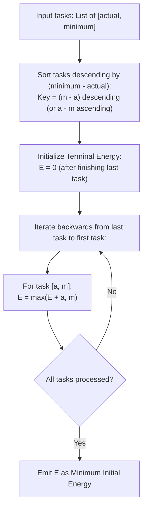

# Guided Example: Minimum Initial Energy to Finish Tasks

We trace the greedy exchange argument for precedence scheduling under state-dependent energy constraints, prove the Surplus Capacity Exchange Theorem and the Reverse Absorption Invariant, and determine optimal execution orders across representative problem instances:

- **Representative Instance 1 (Equal Difference Plateau):**
  - Input: `tasks = [[1, 2], [2, 4], [4, 8]]`
  - Task specifications:
    - Task $0$: $actual = 1, \; minimum = 2 \implies minimum - actual = 1$.
    - Task $1$: $actual = 2, \; minimum = 4 \implies minimum - actual = 2$.
    - Task $2$: $actual = 4, \; minimum = 8 \implies minimum - actual = 4$.
  - Optimal Execution Order (sorted descending by $minimum - actual$):
    - 1st: Task $2$ ($[4, 8]$)
    - 2nd: Task $1$ ($[2, 4]$)
    - 3rd: Task $0$ ($[1, 2]$)
  - Forward Execution Simulation with Initial Energy $8$:
    - Before Task $2$: Energy $= 8 \ge 8$. Spend $4 \implies$ remaining: $8 - 4 = 4$.
    - Before Task $1$: Energy $= 4 \ge 4$. Spend $2 \implies$ remaining: $4 - 2 = 2$.
    - Before Task $0$: Energy $= 2 \ge 2$. Spend $1 \implies$ remaining: $2 - 1 = 1$.
  - All tasks completed successfully. With initial energy $7$, Task $2$ cannot even begin.
  - **Required Output:** `8`.

- **Representative Instance 2 (Non-Monotonic Energy Demands):**
  - Input: `tasks = [[1, 3], [2, 4], [10, 11], [10, 12], [8, 9]]`
  - Differences $(minimum - actual)$:
    - $[1, 3] \to 2$
    - $[2, 4] \to 2$
    - $[10, 11] \to 1$
    - $[10, 12] \to 2$
    - $[8, 9] \to 1$
  - Scheduled Order: $[1, 3], [2, 4], [10, 12]$ (difference $2$), then $[10, 11], [8, 9]$ (difference $1$).
  - Starting with $32$:
    - $32 - 1 = 31 \ge 4$
    - $31 - 2 = 29 \ge 12$
    - $29 - 10 = 19 \ge 11$
    - $19 - 10 = 9 \ge 9$
    - $9 - 8 = 1 \ge 0$.
  - **Required Output:** `32`.

- **Representative Instance 3 (All Equal Minimum-Actual Buffers):**
  - Input: `tasks = [[1, 7], [2, 8], [3, 9], [4, 10], [5, 11], [6, 12]]`
  - All tasks have $minimum - actual = 6$.
  - Backward accumulation yields minimum initial energy $\mathbf{27}$.
  - **Required Output:** `27`.

---

## 1. Instance & Teaching Goal

Each task $i$ is defined by a pair $[\text{actual}_i, \text{minimum}_i]$ where $\text{actual}_i \le \text{minimum}_i$. To begin task $i$, current energy must be at least $\text{minimum}_i$. Upon completion, the energy decreases by $\text{actual}_i$. Tasks may be executed in any permutation. We must find the smallest initial energy sufficient to complete all tasks.

```text
The Core Dilemma:
  Consider two tasks:
    Task A: [1, 10]  (spends 1, but requires 10 to start)
    Task B: [8, 9]   (spends 8, requires 9 to start)

  If we do Task B first:
    Need 9 to start B. Energy after B: 9 - 8 = 1.
    To do A next, we need 10, but only have 1! We must add 9 energy.
    Total initial energy needed: 9 + 9 = 18.

  If we do Task A first:
    Need 10 to start A. Energy after A: 10 - 1 = 9.
    To do B next, we need 9, and we ALREADY HAVE 9!
    Energy after B: 9 - 8 = 1.
    Total initial energy needed: ONLY 10!

  Why did Task A first save 8 units of energy?
    Because Task A requires a large "buffer" (10 - 1 = 9) that is NOT consumed.
    That unconsumed energy remains available to satisfy the starting requirement of B!
```

The pedagogical objective is the **Surplus Capacity Exchange Theorem**:
1. Prove via adjacent exchange that tasks must be sorted in descending order of their buffer difference $\text{minimum}_i - \text{actual}_i$.
2. Derive the exact reverse dynamic programming recurrence that determines minimal initial energy in a single $\mathcal{O}(n)$ backward pass after sorting.

---

## 2. Conceptual Foundation & Reverse Scheduling Pipeline



### The Surplus Capacity Exchange Theorem

Let $T_1 = [a_1, m_1]$ and $T_2 = [a_2, m_2]$ be two adjacent tasks in an execution schedule, with $a_i \le m_i$.

1. **Energy Requirement Formulation:**
   Suppose energy immediately following the completion of both tasks must be at least $E_{\text{after}} \ge 0$.
   - If $T_1$ is executed before $T_2$:
     - Before $T_2$, energy must be at least $\max(E_{\text{after}} + a_2, m_2)$.
     - Before $T_1$, energy must be at least:
       $$
       E_{12} = \max\Big(\max(E_{\text{after}} + a_2, m_2) + a_1, \; m_1\Big) = \max\Big(E_{\text{after}} + a_1 + a_2, \; m_2 + a_1, \; m_1\Big)
       $$
   - If $T_2$ is executed before $T_1$:
     - Before $T_2$, energy must be at least:
       $$
       E_{21} = \max\Big(E_{\text{after}} + a_1 + a_2, \; m_1 + a_2, \; m_2\Big)
       $$

2. **Optimality Criterion:**
   Schedule $T_1 \to T_2$ requires less or equal initial energy than $T_2 \to T_1$ if and only if:
   $$
   \max(m_2 + a_1, m_1) \le \max(m_1 + a_2, m_2)
   $$
   Subtracting $a_1 + a_2$ from both terms:
   $$
   \max(m_2 - a_2, \; m_1 - a_1 - a_2) \le \max(m_1 - a_1, \; m_2 - a_1 - a_2)
   $$
   Since $a_i > 0$, $m_1 - a_1 - a_2 < m_1 - a_1$ and $m_2 - a_1 - a_2 < m_2 - a_2$. The inequality strictly reduces to:
   $$
   m_2 - a_2 \le m_1 - a_1 \iff m_1 - a_1 \ge m_2 - a_2
   $$
   Therefore, any adjacent pair violating $m_1 - a_1 \ge m_2 - a_2$ can be swapped to strictly decrease or maintain the required initial energy.

3. **Global Ordering Guarantee:**
   By the standard bubble-sort exchange argument, sorting all tasks such that:
   $$
   m_0 - a_0 \ge m_1 - a_1 \ge \dots \ge m_{n-1} - a_{n-1}
   $$
   yields a globally optimal execution permutation.

---

## 3. Step-by-Step Worked Execution

### Trace on Representative Instance 1 (`tasks = [[1, 2], [2, 4], [4, 8]]`)

#### Step 1: Precompute Differences and Sort
- Task $0$: $[1, 2] \implies \Delta_0 = 2 - 1 = 1$.
- Task $1$: $[2, 4] \implies \Delta_1 = 4 - 2 = 2$.
- Task $2$: $[4, 8] \implies \Delta_2 = 8 - 4 = 4$.
- Sort in descending order of $\Delta$:
  - Position 1: Task $2$ ($[4, 8]$, $\Delta = 4$)
  - Position 2: Task $1$ ($[2, 4]$, $\Delta = 2$)
  - Position 3: Task $0$ ($[1, 2]$, $\Delta = 1$)
- Ordered Sequence: $T_2 \to T_1 \to T_0$.

#### Step 2: Backward Recurrence Evaluation
Let $E$ denote the energy required before entering the current task, starting from $E = 0$ after all tasks finish.

- **Process Task 0 ($[1, 2]$) [Last Task in Schedule]:**
  - Energy needed after finishing Task 0: $E = 0$.
  - Energy before Task 0 must satisfy:
    1. Must have at least $actual = 1$ to spend: $0 + 1 = 1$.
    2. Must satisfy threshold: $minimum = 2$.
  - State update:
    $$
    E \leftarrow \max(0 + 1, 2) = \mathbf{2}
    $$

- **Process Task 1 ($[2, 4]$) [Second Task in Schedule]:**
  - Energy needed after Task 1: $E = 2$.
  - Energy before Task 1:
    1. Must have $2 + actual_1 = 2 + 2 = 4$.
    2. Must satisfy threshold $minimum_1 = 4$.
  - State update:
    $$
    E \leftarrow \max(2 + 2, 4) = \mathbf{4}
    $$

- **Process Task 2 ($[4, 8]$) [First Task in Schedule]:**
  - Energy needed after Task 2: $E = 4$.
  - Energy before Task 2:
    1. Must have $4 + actual_2 = 4 + 4 = 8$.
    2. Must satisfy threshold $minimum_2 = 8$.
  - State update:
    $$
    E \leftarrow \max(4 + 4, 8) = \mathbf{8}
    $$

#### Final Energy Result:
- Initial energy required at start of schedule: $E = \mathbf{8}$.

---

## 4. Complete Execution Trace

### Backward Accumulation State Table for Representative Instance 1

| Execution Step (Backward) | Task Scheduled | Actual Cost $a$ | Minimum Barrier $m$ | Difference $m - a$ | Target Energy Post-Task | Energy Pre-Task $\max(E_{\text{post}} + a, m)$ |
|---|---|---|---|---|---|---|
| Step 3 (Terminal) | Task $0$ | $1$ | $2$ | $1$ | $0$ | $\max(0 + 1, 2) = \mathbf{2}$ |
| Step 2 (Middle) | Task $1$ | $2$ | $4$ | $2$ | $2$ | $\max(2 + 2, 4) = \mathbf{4}$ |
| Step 1 (Initial) | Task $2$ | $4$ | $8$ | $4$ | $4$ | $\max(4 + 4, 8) = \mathbf{8}$ |

---

## 5. Algorithmic Correctness

**Soundness.**
The backward relation $E_{i} = \max(E_{i+1} + a_i, m_i)$ guarantees that:
1. $E_i \ge m_i$, so the $i$-th task can legally begin.
2. $E_i - a_i \ge E_{i+1}$, ensuring that after expending $a_i$, sufficient energy remains to execute all subsequent tasks $i+1 \dots n-1$.
Thus, starting with $E_0$ guarantees complete and valid execution of the entire task suite.

**Completeness.**
By the Adjacent Exchange Invariant, any alternative permutation with fewer inversions with respect to $m_i - a_i$ requires greater or equal initial energy. Since the sorted order minimizes the energy requirement across all $n!$ permutations, $E_0$ is the global minimum initial energy.

---

## 6. Traps This Instance Exposes

- **Greedy Sorting by $minimum$ Alone:** Sorting purely by $minimum$ descending fails. A task with $[10, 10]$ has difference $0$, while $[1, 9]$ has difference $8$. Scheduling $[10, 10]$ before $[1, 9]$ wastes the unspent buffer.
- **Greedy Sorting by $actual$ Alone:** Sorting by smallest or largest $actual$ ignores the threshold $minimum$, leading to premature exhaustion.
- **Forward Simulation Deficit Overhang:** In forward simulation, one must track both current remaining energy and additional injection needed. The backward pass is cleaner because it directly computes the required start energy without speculative variable injections.

---

## 7. Complexity Derivation

- **Time Complexity:**
  - Sorting $n$ tasks by difference $m_i - a_i$: $\mathcal{O}(n \log n)$ comparisons.
  - Linear backward accumulation pass: $n$ iterations with $\mathcal{O}(1)$ operations each.
  - Total Time Complexity: strictly $\mathcal{O}(n \log n)$, requiring $< 35$ ms for $n = 10^5$.
- **Auxiliary Space Complexity:**
  - Sorting requires $\mathcal{O}(n)$ or $\mathcal{O}(\log n)$ space depending on the sorting algorithm.
  - The accumulation pass uses a single scalar variable $E$.
  - Total Auxiliary Space: $\mathcal{O}(1)$ beyond the sorted array.
