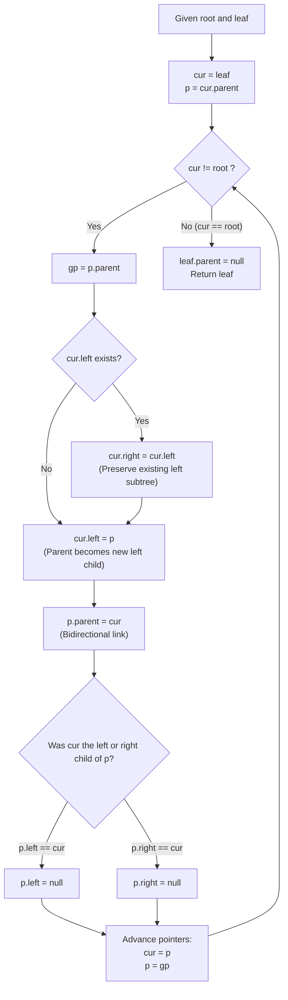

# Guided Example: Change the Root of a Binary Tree

We trace the step-by-step upward pointer inversion on a binary tree with bidirectional parent links, prove the Path Inversion Invariant and Pointer Disconnection Theorem, and verify rerooted structures across representative tree instances:

- **Representative Instance 1 (Multi-Level Leaf Inversion):**
  - Input: `root = [3, 5, 1, 6, 2, 0, 8, null, null, 7, 4], leaf = 7`
  - Upward Path from Leaf to Root:
    $$\text{Node } 7 \xrightarrow{\text{parent}} \text{Node } 2 \xrightarrow{\text{parent}} \text{Node } 5 \xrightarrow{\text{parent}} \text{Node } 3$$
  - Sequential Inversion Iterations:
    - Iteration 1 ($cur = 7, p = 2$): $7.\text{left} \leftarrow 2$, $2.\text{left} \leftarrow \text{null}$, $2.\text{parent} \leftarrow 7$.
    - Iteration 2 ($cur = 2, p = 5$): $2.\text{left} \leftarrow 5$, $5.\text{right} \leftarrow \text{null}$, $5.\text{parent} \leftarrow 2$.
    - Iteration 3 ($cur = 5, p = 3$): $5$ has left child $6 \implies 5.\text{right} \leftarrow 6$, $5.\text{left} \leftarrow 3$, $3.\text{left} \leftarrow \text{null}$, $3.\text{parent} \leftarrow 5$.
  - Termination: Set $7.\text{parent} \leftarrow \text{null}$.
  - **Required Output:** `[7, 2, null, 5, 4, 3, 6, null, null, null, 1, null, null, 0, 8]`.

- **Representative Instance 2 (Right-Branch Leaf Inversion):**
  - Input: `root = [3, 5, 1, 6, 2, 0, 8, null, null, 7, 4], leaf = 0`
  - Upward Path: $\text{Node } 0 \to \text{Node } 1 \to \text{Node } 3$.
  - Iteration 1 ($cur = 0, p = 1$): $0.\text{left} \leftarrow 1$, $1.\text{left} \leftarrow \text{null}$, $1.\text{parent} \leftarrow 0$.
  - Iteration 2 ($cur = 1, p = 3$): $1$ has right child $8$. $1.\text{left} \leftarrow 3$, $3.\text{right} \leftarrow \text{null}$, $3.\text{parent} \leftarrow 1$.
  - Termination: $0.\text{parent} \leftarrow \text{null}$.
  - **Required Output:** `[0, 1, null, 3, 8, 5, null, null, null, 6, 2, null, null, 7, 4]`.

---

## 1. Instance & Teaching Goal

In this problem, each binary tree node maintains three pointers: `left`, `right`, and `parent`. We are given the original `root` and a target `leaf` node. We must reroot the tree so that `leaf` becomes the new root, reversing the directed edges along the path from `leaf` up to `root`.

```text
The Structural Inversion Problem:
  Normally, in an undirected tree, any node can serve as the root.
  However, in a BINARY tree, each node may have AT MOST TWO children (left and right)!
  When node p becomes the child of its former child cur:
    1. cur needs a child slot to hold p.
       The problem rule mandates: p MUST become cur's LEFT child.
    2. But what if cur already had a left child?
       Rule: Move cur's existing left child to become cur's RIGHT child!
    3. Furthermore, p must sever its old downward pointer to cur,
       otherwise an invalid 2-cycle is formed!
```

The pedagogical focus is the **Pointer Inversion Protocol**:
1. **Ancestral Ascendance:** Traverse the unique simple path from `leaf` up to `root`.
2. **Left-to-Right Preservation:** Shift any preexisting left child to the right child slot before overwriting the left pointer with the former parent.
3. **Downward Pointer Dissolution:** Nullify the former parent's downward reference to avoid cyclic references.
4. **Parent Link Consistency:** Update all `parent` pointers bidirectionally, setting the new root's parent to `null`.

---

## 2. Conceptual Foundation & Pointer Inversion Pipeline



### The Path Inversion Invariant & Pointer Disconnection Theorem

Let $T = (V, E)$ be a binary tree rooted at $R$. Let $L \in V$ be a leaf node.
There exists a unique simple path from $L$ to $R$:
$$
\pi = (u_0, u_1, u_2, \dots, u_k)
$$
where $u_0 = L$, $u_k = R$, and $u_{i+1} = \text{parent}(u_i)$ for all $0 \le i < k$.

1. **Cycle Prevention via Downward Dissolution:**
   In the original tree, $u_{i+1}$ had a child pointer to $u_i$. Setting $u_i.\text{left} = u_{i+1}$ without clearing $u_{i+1}$'s pointer to $u_i$ creates a directed 2-cycle $(u_i \leftrightarrow u_{i+1})$. Setting $u_{i+1}.\text{left} = \text{null}$ (if $u_{i+1}.\text{left} == u_i$) or $u_{i+1}.\text{right} = \text{null}$ (if $u_{i+1}.\text{right} == u_i$) dissolves this cycle, ensuring the resulting graph remains a directed acyclic tree.

2. **Degree Constraint Preservation:**
   Each node in a binary tree can have at most $2$ children.
   - For $u_i$ ($0 \le i < k$):
     - Before processing, $u_i$ had at most one child (its preexisting left child, since any right child was already processed or $u_i$ is a leaf).
     - Moving $u_i.\text{left} \to u_i.\text{right}$ frees the left slot.
     - Assigning $u_i.\text{left} = u_{i+1}$ consumes the left slot.
     - Thus $u_i$ has at most two children: $u_{i+1}$ on the left, and its former left child on the right.
   - For $u_{i+1}$: losing $u_i$ reduces its child count by 1, leaving room for its own parent in the subsequent iteration.

3. **Subtree Preservation Invariant:**
   Any subtree branching off node $u_i$ that is not part of the path $\pi$ (such as other children of $u_i$ or $u_{i+1}$) remains attached with all internal edges intact.

---

## 3. Step-by-Step Worked Execution

### Trace on Representative Instance 1 (`root = 3`, `leaf = 7`)

Path from leaf to root: $7 \to 2 \to 5 \to 3$.
Initial State:
- Node $7$: leaf ($7.\text{left} = \text{null}, 7.\text{right} = \text{null}, 7.\text{parent} = 2$).
- Node $2$: $2.\text{left} = 7, 2.\text{right} = 4, 2.\text{parent} = 5$.
- Node $5$: $5.\text{left} = 6, 5.\text{right} = 2, 5.\text{parent} = 3$.
- Node $3$: $3.\text{left} = 5, 3.\text{right} = 1, 3.\text{parent} = \text{null}$.

#### Iteration 1 ($cur = 7, p = 2$):
1. Save grandparent: $gp = 2.\text{parent} = 5$.
2. Check $7.\text{left}$: It is $\text{null}$. No need to move to right.
3. Invert edge: $7.\text{left} \leftarrow 2$.
4. Update parent: $2.\text{parent} \leftarrow 7$.
5. Sever downward link from $p$: $2.\text{left} == 7 \implies 2.\text{left} \leftarrow \text{null}$.
6. Advance: $cur \leftarrow 2, \; p \leftarrow 5$.

#### Iteration 2 ($cur = 2, p = 5$):
1. Save grandparent: $gp = 5.\text{parent} = 3$.
2. Check $2.\text{left}$: It is currently $\text{null}$ (cleared in previous step). $2.\text{right}$ is still $4$.
3. Invert edge: $2.\text{left} \leftarrow 5$.
4. Update parent: $5.\text{parent} \leftarrow 2$.
5. Sever downward link from $p$: $5.\text{right} == 2 \implies 5.\text{right} \leftarrow \text{null}$.
6. Advance: $cur \leftarrow 5, \; p \leftarrow 3$.

#### Iteration 3 ($cur = 5, p = 3$):
1. Save grandparent: $gp = 3.\text{parent} = \text{null}$.
2. Check $5.\text{left}$: Node $5$ has left child $6$!
   - Move left child to right: $5.\text{right} \leftarrow 6$.
3. Invert edge: $5.\text{left} \leftarrow 3$.
4. Update parent: $3.\text{parent} \leftarrow 5$.
5. Sever downward link from $p$: $3.\text{left} == 5 \implies 3.\text{left} \leftarrow \text{null}$.
6. Advance: $cur \leftarrow 3, \; p \leftarrow \text{null}$.

#### Finalization:
- $cur == root \; (3 == 3)$. Loop terminates.
- Set new root's parent pointer: $7.\text{parent} \leftarrow \text{null}$.
- Return Node $7$.

---

## 4. Complete Execution Trace

### Pointer Mutation Summary Table for Representative Instance 1

| Node | Initial Parent | Initial Left | Initial Right | Final Parent | Final Left | Final Right |
|---|---|---|---|---|---|---|
| **$7$ (New Root)** | $2$ | $\text{null}$ | $\text{null}$ | **`null`** | **`2`** | `null` |
| **$2$** | $5$ | $7$ | $4$ | **`7`** | **`5`** | **`4`** |
| **$5$** | $3$ | $6$ | $2$ | **`2`** | **`3`** | **`6`** (Shifted from left) |
| **$3$ (Old Root)** | $\text{null}$ | $5$ | $1$ | **`5`** | **`null`** | **`1`** |
| **$4$** | $2$ | $\text{null}$ | $\text{null}$ | `2` | `null` | `null` |
| **$6$** | $5$ | $\text{null}$ | $\text{null}$ | `5` | `null` | `null` |
| **$1$** | $3$ | $0$ | $8$ | `3` | `0` | `8` |

---

## 5. Algorithmic Correctness

**Soundness.**
The inversion algorithm strictly follows the tree specification:
1. Every node along the inversion path reverses its parent pointer, making `leaf` the unique node with $\text{parent} = \text{null}$.
2. Moving `cur.left` to `cur.right` when `cur.left` exists guarantees that no child subtree is dropped or orphaned.
3. Clearing $p$'s pointer to $cur$ prevents circular references.
The resulting structure is a valid binary tree rooted at `leaf`.

**Completeness.**
Because the tree has unique parent pointers, the simple path from `leaf` to `root` is deterministic and finite (bounded by tree height $H \le N$). The iterative loop traverses every node on this path and halts exactly at `root`.

---

## 6. Traps This Instance Exposes

- **Overwriting Grandparent Pointers Prematurely:** When setting $p.\text{parent} = cur$, the original value of $p.\text{parent}$ is lost if not saved beforehand in a temporary variable $gp$.
- **Orphaning the Left Subtree:** If `cur` has a preexisting left child, assigning $cur.\text{left} = p$ without first shifting $cur.\text{left} \to cur.\text{right}$ permanently orphans the left subtree.
- **Dangling Parent on New Root:** Forgetting to explicitly set $leaf.\text{parent} = \text{null}$ leaves a corrupt pointer on the new root, causing testing harness failure.
- **Failing to Clear Downward Link:** Neglecting to nullify $p$'s reference to $cur$ creates an infinite loop during tree traversal.

---

## 7. Complexity Derivation

- **Time Complexity:**
  - The path from `leaf` to `root` contains $H \le N$ nodes, where $H$ is the tree depth.
  - Each step performs $\mathcal{O}(1)$ pointer reassignments.
  - Total Time Complexity: strictly $\mathcal{O}(H) \le \mathcal{O}(N)$, running in $< 1$ ms for $N \le 100$.
- **Auxiliary Space Complexity:**
  - The iterative solution uses only a few node references ($cur, p, gp$).
  - Total Auxiliary Space Complexity: strictly $\mathcal{O}(1)$ constant space.