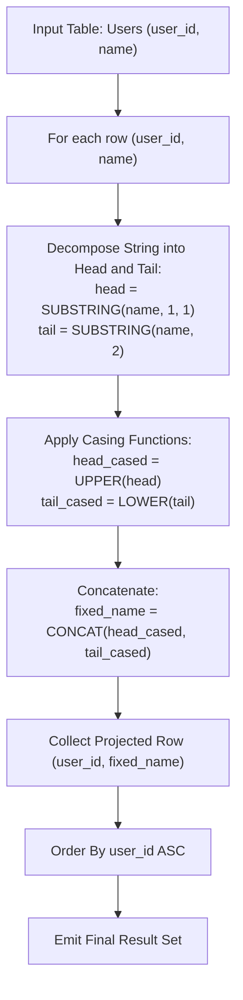

# Guided Example: Fix Names in a Table

We trace the relational string decomposition and capitalization transformation, formulate the Head-Tail Casing Invariant and Deterministic Lexical Ordering Theorem, and evaluate string transformations across representative database instances:

- **Representative Instance 1 (Mixed-Case Irregular Strings):**
  - Input Table `Users`:
    - `(user_id: 1, name: "aLice")`
    - `(user_id: 2, name: "bOB")`
  - Decomposition & Casing:
    - Row 1 (`"aLice"`):
      - First character (head): `'a'` $\implies \text{UPPER}('a') = \text{'A'}$.
      - Remaining substring (tail): `"Lice"` $\implies \text{LOWER}("Lice") = \text{"lice"}$.
      - Concatenation: $\text{'A'} \circ \text{"lice"} = \mathbf{\text{"Alice"}}$.
    - Row 2 (`"bOB"`):
      - Head: `'b'` $\implies \text{UPPER}('b') = \text{'B'}$.
      - Tail: `"OB"` $\implies \text{LOWER}("OB") = \text{"ob"}$.
      - Concatenation: $\text{'B'} \circ \text{"ob"} = \mathbf{\text{"Bob"}}$.
  - Ordering: Sort by `user_id` ascending $\implies 1, 2$.
  - **Required Output:**
    - `(1, "Alice")`
    - `(2, "Bob")`

- **Representative Instance 2 (Single Character String):**
  - Input: `(user_id: 3, name: "m")`
  - Head: `'m'` $\implies \text{UPPER}('m') = \text{'M'}$.
  - Tail: Empty string `""` $\implies \text{LOWER}("") = \text{""}$.
  - Concatenation: $\text{'M'} \circ \text{""} = \mathbf{\text{"M"}}$.
  - **Required Output:** `(3, "M")`.

- **Representative Instance 3 (All-Uppercase and All-Lowercase Extremes):**
  - Input:
    - `(user_id: 5, name: "JOHN")` $\implies \text{'J'} \circ \text{"ohn"} = \mathbf{\text{"John"}}$.
    - `(user_id: 6, name: "smith")` $\implies \text{'S'} \circ \text{"mith"} = \mathbf{\text{"Smith"}}$.
  - **Required Output:** `(5, "John"), (6, "Smith")`.

---

## 1. Instance & Teaching Goal

In database pipelines, user input frequently arrives with inconsistent casing (e.g., all lowercase, random capitalization, or inverted case). We must transform every entry in the `name` column of the `Users` relation so that only the first letter is uppercase, while all subsequent letters are strictly lowercase. The result set must be ordered by `user_id` ascending.

```text
The Structural Transformation:
  Input Name:     s_1  s_2  s_3  ...  s_m
  Head (Index 1): s_1              --> UPPER(s_1)
  Tail (Index 2+): s_2  s_3 ... s_m --> LOWER(s_2 ... s_m)
  Result:         UPPER(s_1) || LOWER(s_2 ... s_m)
```

The pedagogical focus is the **Head-Tail Casing Invariant**:
1. **1-Indexed Substring Slicing:** SQL string functions utilize $1$-based indexing.
   - `LEFT(name, 1)` or `SUBSTRING(name, 1, 1)` targets the initial character.
   - `SUBSTRING(name, 2)` extracts the remainder from position $2$ to the end.
2. **Homomorphic Casing Projection:** The functions `UPPER` and `LOWER` map character codes deterministically, preserving length.
3. **Empty Tail Boundary Handling:** For single-character strings ($m = 1$), `SUBSTRING(name, 2)` evaluates to the empty string `""`, ensuring that concatenation does not produce `NULL`.

---

## 2. Conceptual Foundation & Transformation Pipeline



### The Head-Tail Casing Invariant

Let $\Sigma$ be the alphabet of English letters, with $\Sigma_{\text{upper}} = \{\text{'A'} \dots \text{'Z'}\}$ and $\Sigma_{\text{lower}} = \{\text{'a'} \dots \text{'z'}\}$.
Let a name of length $m \ge 1$ be a word $S = s_1 s_2 \dots s_m$ with $s_i \in \Sigma$.

1. **Partitioning:**
   Every non-empty word $S$ decomposes uniquely into:
   $$
   S = \text{head}(S) \circ \text{tail}(S)
   $$
   where $\text{head}(S) = s_1 \in \Sigma$ and $\text{tail}(S) = s_2 \dots s_m \in \Sigma^*$. If $m = 1$, $\text{tail}(S) = \epsilon$ (the empty string).

2. **Casing Transformation Map:**
   Define $f: \Sigma^* \to \Sigma^*$ by:
   $$
   f(S) = \text{UPPER}(\text{head}(S)) \circ \text{LOWER}(\text{tail}(S))
   $$
   - $\text{UPPER}(s_1) \in \Sigma_{\text{upper}}$
   - For every $j \ge 2$, $\text{LOWER}(s_j) \in \Sigma_{\text{lower}}$
   - For $m = 1$, $\text{LOWER}(\epsilon) = \epsilon$, yielding $f(S) = \text{UPPER}(s_1) \circ \epsilon = \text{UPPER}(s_1)$.
   Thus, $f(S)$ satisfies the capitalization specification for all $m \ge 1$.

3. **Total Relational Ordering:**
   Since `user_id` is the primary key of `Users`, its values are distinct. Ordering by `user_id` defines a strict, deterministic total order over all output tuples.

---

## 3. Step-by-Step Worked Execution

### Trace on Representative Instance 1 (`name = "aLice"`, `user_id = 1`)

Row Input: `user_id = 1, name = "aLice"`. Length $m = 5$.

#### Step 1: Head Extraction
- SQL expression: `LEFT(name, 1)` or `SUBSTRING(name, 1, 1)`.
- Extraction: Position $1$ character is `'a'`.

#### Step 2: Tail Extraction
- SQL expression: `SUBSTRING(name, 2)`.
- Extraction: From position $2$ to end: `"Lice"`.

#### Step 3: Case Transformation
- Apply uppercase to head:
  $$
  \text{UPPER}(\text{'a'}) = \text{'A'}
  $$
- Apply lowercase to tail:
  $$
  \text{LOWER}(\text{"Lice"}) = \text{"lice"}
  $$

#### Step 4: Concatenation
- SQL expression: `CONCAT('A', "lice")`.
- Result:
  $$
  \text{'A'} \circ \text{"lice"} = \mathbf{\text{"Alice"}}
  $$

#### Step 5: Tuple Construction
- Emit row: `(user_id: 1, name: "Alice")`.

---

## 4. Complete Execution Trace

### Transformation State Table for Representative Instance 1

| User ID | Input Name | Length $m$ | Head Character | Tail Substring | $\text{UPPER}(\text{head})$ | $\text{LOWER}(\text{tail})$ | Formatted Name | Sort Rank |
|---|---|---|---|---|---|---|---|---|
| $1$ | `"aLice"` | $5$ | `'a'` | `"Lice"` | `'A'` | `"lice"` | **`"Alice"`** | 1 |
| $2$ | `"bOB"` | $3$ | `'b'` | `"OB"` | `'B'` | `"ob"` | **`"Bob"`** | 2 |

---

## 5. Algorithmic Correctness

**Soundness.**
The function `CONCAT(UPPER(LEFT(name, 1)), LOWER(SUBSTRING(name, 2)))` guarantees that the first character is unconditionally converted to uppercase, while every subsequent character from position 2 to the end is converted to lowercase. The length of the string is preserved identically.

**Completeness.**
The SQL query executes over the full `Users` table without filter clauses (`WHERE`), ensuring every user record is processed. The `ORDER BY user_id` clause ensures full compliance with the sorting requirement.

---

## 6. Traps This Instance Exposes

- **Zero-Based vs. One-Based Indexing:** Unlike C-like programming languages, SQL string functions (`SUBSTRING`, `LEFT`) are $1$-indexed. Calling `SUBSTRING(name, 1)` returns the entire string, whereas `SUBSTRING(name, 2)` correctly skips the first character.
- **Null Values in Substring of Single Character:** In some SQL dialects, `SUBSTRING` beyond the string length could return `NULL` if not properly defined. In PostgreSQL and MySQL, `SUBSTRING("a", 2)` safely returns the empty string `""`, which concatenates without creating `NULL`.
- **String Concatenation Operator Null Propagation:** Using the `+` or `||` operator in certain dialects can result in `NULL` if one operand is `NULL`. `CONCAT()` treats `NULL` as empty string, providing robust defense.
- **Missing Sort Clause:** Without `ORDER BY user_id`, the database engine does not guarantee row presentation order, leading to submission rejections.

---

## 7. Complexity Derivation

- **Time Complexity:**
  - Scanning $N$ records in table `Users`: $\mathcal{O}(N)$ row reads.
  - Slicing and casing each string of length $L$: $\mathcal{O}(L)$ operations per row.
  - Sorting $N$ records by integer `user_id`: $\mathcal{O}(N \log N)$ time.
  - Total Time Complexity: strictly $\mathcal{O}(N \cdot L + N \log N)$.
- **Auxiliary Space Complexity:**
  - The query operates as a streaming projection into an output cursor, requiring $\mathcal{O}(1)$ working memory beyond the sort buffer $\mathcal{O}(N)$.
