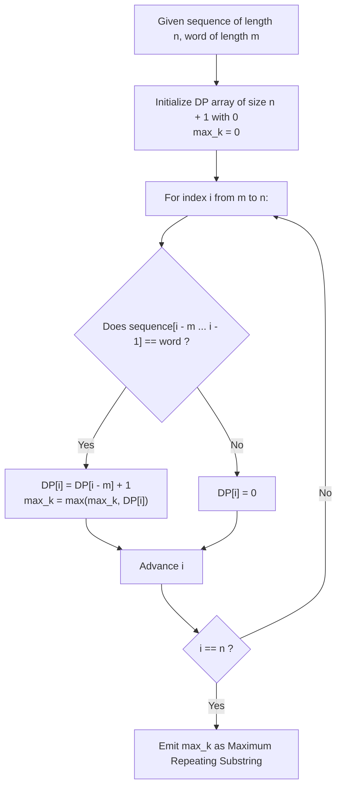

# Guided Example: Maximum Repeating Substring

We trace the contiguous string pattern matching and consecutive repetition chaining algorithms, prove the Repetition Chaining Recurrence Theorem and the Monotonic Suffix DP Invariant, and evaluate maximum repetition factors across representative string instances:

- **Representative Instance 1 (Consecutive Doubling Pattern):**
  - Input: `sequence = "ababc", word = "ab"`
  - String lengths: $|sequence| = 5, \; |word| = 2$.
  - Maximum theoretical repetition: $k_{\max} = \lfloor 5 / 2 \rfloor = 2$.
  - Evaluating candidate powers:
    - $k = 1$: $word^1 = \text{"ab"}$. Found at indices $[0 \dots 1]$ and $[2 \dots 3]$. Valid!
    - $k = 2$: $word^2 = \text{"abab"}$. Found at indices $[0 \dots 3]$ in `"ababc"`. Valid!
    - $k = 3$: $word^3 = \text{"ababab"}$. Length $6 > 5$, cannot occur.
  - Maximum valid repeating factor: **`2`**.
  - **Required Output:** `2`.

- **Representative Instance 2 (Isolated Match without Chaining):**
  - Input: `sequence = "ababc", word = "ba"`
  - Candidate powers:
    - $k = 1$: $word^1 = \text{"ba"}$. Found at indices $[1 \dots 2]$ (`"a[ba]bc"`). Valid!
    - $k = 2$: $word^2 = \text{"baba"}$. Substring `"baba"` does not appear anywhere in `"ababc"`.
  - Maximum valid repeating factor: **`1`**.
  - **Required Output:** `1`.

- **Representative Instance 3 (Zero Occurrence Baseline):**
  - Input: `sequence = "ababc", word = "ac"`
  - Candidate powers:
    - $k = 1$: $word^1 = \text{"ac"}$. Does not appear in `"ababc"`.
  - Maximum valid repeating factor: **`0`**.
  - **Required Output:** `0`.

---

## 1. Instance & Teaching Goal

Given two strings, `sequence` and `word`, an integer $k$ is called $k$-repeating if the concatenated string $word^k$ (i.e., `word` repeated $k$ times consecutively) is a contiguous substring of `sequence`. The objective is to determine the maximum value of $k$, where $k = 0$ if `word` is not a substring of `sequence`.

```text
Contiguous Repetition vs. Disjoint Occurrences:
  Notice that sequence = "ababc" contains TWO occurrences of "ab":
    - Occurrence 1: indices 0..1 ("ab"abc)
    - Occurrence 2: indices 2..3 (ab"ab"c)

  Because these two occurrences are DIRECTLY ADJACENT without any gap,
  they form a valid k = 2 repeating substring "abab" spanning indices 0..3!

  In contrast, for sequence = "abxab" with word = "ab":
    - Both occurrences exist, but they are separated by 'x'.
    - "abab" is NOT a contiguous substring!
    - Hence k = 1, not 2.
```

The central pedagogical challenge is the **Repetition Chaining Recurrence**:
1. **Bounded Search Horizon:** The repetition factor cannot exceed $\lfloor |sequence| / |word| \rfloor$.
2. **Optimal Substructure:** A repetition of length $k$ ending at index $i$ requires an exact match of `word` ending at $i$, directly preceded by a repetition of length $k - 1$ ending at index $i - |word|$.
3. **Dual Algorithmic Realization:** Solve via either descending binary string verification or an $\mathcal{O}(|sequence| \cdot |word|)$ 1D dynamic programming table.

---

## 2. Conceptual Foundation & DP Recurrence Pipeline



### The Repetition Chaining Recurrence Theorem

Let $S$ be the sequence of length $n$ and $W$ be the word of length $m$.
Define $S[a \dots b]$ as the substring from index $a$ to $b$ inclusive.

1. **State Definition:**
   For each index $i \in \{0, 1, \dots, n\}$, let $DP[i]$ denote the maximum number of consecutive repetitions of $W$ ending exactly at prefix length $i$ in $S$ (i.e., ending at index $i - 1$).

2. **Transition Equation:**
   - Base Case: For $i < m$, $DP[i] = 0$ (a word of length $m$ cannot fit in length $< m$).
   - Inductive Step: For $i \ge m$:
     $$
     DP[i] = \begin{cases} DP[i - m] + 1 & \text{if } S[i - m \dots i - 1] = W \\ 0 & \text{otherwise} \end{cases}
     $$

3. **Proof of Optimality:**
   - **Case 1 ($S[i - m \dots i - 1] \neq W$):** The characters immediately preceding index $i$ do not match $W$. No sequence of consecutive copies of $W$ can terminate at $i$. Thus $DP[i] = 0$.
   - **Case 2 ($S[i - m \dots i - 1] = W$):** The suffix of length $m$ matches $W$ exactly. Any chain of $k$ consecutive repetitions of $W$ ending at $i$ decomposes into a chain of $k - 1$ consecutive repetitions ending at $i - m$, followed by the final copy of $W$. By induction, the maximum chain length ending at $i - m$ is $DP[i - m]$. Adding the final copy yields exactly $DP[i - m] + 1$.

4. **Global Maximum:**
   Because a maximal repeating substring may terminate at any index $i \in \{m, \dots, n\}$:
   $$
   k^* = \max_{m \le i \le n} DP[i]
   $$

---

## 3. Step-by-Step Worked Execution

### Trace on Representative Instance 1 (`sequence = "ababc"`, `word = "ab"`)

Lengths: $n = 5$, $m = 2$.
Initialize: $DP[0 \dots 5] = [0, 0, 0, 0, 0, 0], \; \text{max\_k} = 0$.

#### Step 1: Evaluate $i = 1$
- Prefix length $1 < m \; (1 < 2)$. $DP[1] = 0$.

#### Step 2: Evaluate $i = 2$ (Substring $S[0 \dots 1] = \text{"ab"}$)
- Compare $S[0 \dots 1]$ with $W$: `"ab" == "ab"` $\implies$ Match!
- Transition:
  $$
  DP[2] = DP[2 - 2] + 1 = DP[0] + 1 = 0 + 1 = \mathbf{1}
  $$
- Update: $\text{max\_k} = \max(0, 1) = \mathbf{1}$.

#### Step 3: Evaluate $i = 3$ (Substring $S[1 \dots 2] = \text{"ba"}$)
- Compare $S[1 \dots 2]$ with $W$: `"ba" \neq "ab"` $\implies$ Mismatch!
- Transition:
  $$
  DP[3] = 0
  $$

#### Step 4: Evaluate $i = 4$ (Substring $S[2 \dots 3] = \text{"ab"}$)
- Compare $S[2 \dots 3]$ with $W$: `"ab" == "ab"` $\implies$ Match!
- Look back by $m = 2$ positions to state $DP[4 - 2] = DP[2]$:
  $$
  DP[4] = DP[2] + 1 = 1 + 1 = \mathbf{2}
  $$
- Update: $\text{max\_k} = \max(1, 2) = \mathbf{2}$.
- Physical meaning: The copy of `"ab"` ending at index $3$ extends the copy of `"ab"` ending at index $1$, forming `"abab"`.

#### Step 5: Evaluate $i = 5$ (Substring $S[3 \dots 4] = \text{"bc"}$)
- Compare $S[3 \dots 4]$ with $W$: `"bc" \neq "ab"` $\implies$ Mismatch!
- Transition:
  $$
  DP[5] = 0
  $$

#### Finalization:
- The maximum value observed across the table is $\text{max\_k} = \mathbf{2}$.

---

## 4. Complete Execution Trace

### DP State Table for Representative Instance 1

| Index $i$ (Prefix Length) | Substring $S[i - 2 \dots i - 1]$ | Equals $W$ (`"ab"`)? | Preceding State $DP[i - 2]$ | Computed State $DP[i]$ | Running Maximum $\text{max\_k}$ |
|---|---|---|---|---|---|
| $0$ | — | — | — | $0$ | $0$ |
| $1$ | — ($i < 2$) | — | — | $0$ | $0$ |
| $2$ | $S[0 \dots 1] = \text{"ab"}$ | **Yes** | $DP[0] = 0$ | $0 + 1 = \mathbf{1}$ | $1$ |
| $3$ | $S[1 \dots 2] = \text{"ba"}$ | No | — | $0$ | $1$ |
| $4$ | $S[2 \dots 3] = \text{"ab"}$ | **Yes** | $DP[2] = 1$ | $1 + 1 = \mathbf{2}$ | **`2`** |
| $5$ | $S[3 \dots 4] = \text{"bc"}$ | No | — | $0$ | **`2`** |

---

## 5. Algorithmic Correctness

**Soundness.**
Whenever $DP[i] = k > 0$, there exists a chain of $k$ consecutive segments of length $m$ immediately preceding $i$ such that every segment equals $W$. Since each segment is contiguous with the next, the concatenated span of length $k \cdot m$ is a substring of $S$ equal to $W^k$. Thus any reported $k$ is guaranteed to be a valid repeating factor.

**Completeness.**
Suppose there exists a valid $k$-repeating occurrence of $W$ ending at position $j$. By mathematical induction on $k$, the DP table at index $j + 1$ will record at least $k$, because each step looks back exactly $m$ positions to the prior occurrence. Maximizing over all $i \in \{m, \dots, n\}$ guarantees that the global maximum repeating factor is captured.

---

## 6. Traps This Instance Exposes

- **Non-Contiguous False Merging:** Simply counting total occurrences of `word` in `sequence` fails because occurrences may be separated by other characters (e.g. `word` appears 3 times with gaps, yielding $k = 1$).
- **Overlapping vs. Disjoint Alignment:** Words can overlap (e.g., $W = \text{"aa"}$ in $S = \text{"aaa"}$). Here $\lfloor 3 / 2 \rfloor = 1$, so $k = 1$, whereas in $S = \text{"aaaa"}$, $k = 2$. Looking back by exactly $m$ ensures strict adjacency without fractional overlaps.
- **Off-By-One Search Ceiling:** In a descending search approach (`for k in range(n // m, -1, -1)`), starting the test at $n // m$ covers the maximum possible physical bound. Forgetting to test $k = 0$ leads to missing the zero-match base case.

---

## 7. Complexity Derivation

- **Time Complexity:**
  - **Dynamic Programming Approach:** The loop iterates $n - m + 1 \le n$ times. Each step compares a slice of length $m$, taking $\mathcal{O}(m)$ time. Total Time: $\mathcal{O}(n \cdot m)$. For $n, m \le 100$, operations total $\le 10^4$ (executing in $< 1$ ms).
  - **Descending Search Approach:** Tests at most $n / m$ candidate values of $k$. Checking if $W^k$ is in $S$ takes $\mathcal{O}(n \cdot k \cdot m)$. Summing over $k$ yields $\mathcal{O}(n^2 / m)$.
- **Auxiliary Space Complexity:**
  - The DP array requires $n + 1$ integers, taking $\mathcal{O}(n)$ auxiliary space.
  - The descending search approach constructs temporary strings of length $k \cdot m \le n$, using $\mathcal{O}(n)$ memory.