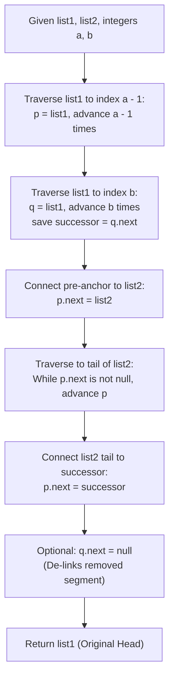

# Guided Example: Merge In Between Linked Lists

We trace the pointer redirection surgery for sublist excision and replacement in singly-linked lists, prove the Sublist Splicing Invariant and Tail Stitching Theorem, and evaluate list modifications across representative instances:

- **Representative Instance 1 (Interior Segment Excision):**
  - Input: `list1 = [10, 1, 13, 6, 9, 5], a = 3, b = 4, list2 = [1000000, 1000001, 1000002]`
  - Node Indexing in `list1`:
    - Index $0$: $10$
    - Index $1$: $1$
    - Index $2$: $13$ (Anchor $a - 1$)
    - Index $3$: $6$ (Start of deleted sublist $a$)
    - Index $4$: $9$ (End of deleted sublist $b$)
    - Index $5$: $5$ (Post-deletion anchor $b + 1$)
  - Splicing Operations:
    - Node $13.\text{next}$ redirected to head of `list2` ($1000000$).
    - Tail of `list2` ($1000002$) redirected to node $5$.
  - Resulting Linked List: `[10, 1, 13, 1000000, 1000001, 1000002, 5]`.
  - **Required Output:** `[10, 1, 13, 1000000, 1000001, 1000002, 5]`.

- **Representative Instance 2 (Multi-Node Sublist Replacement):**
  - Input: `list1 = [0, 1, 2, 3, 4, 5, 6], a = 2, b = 5, list2 = [100, 101, 102]`
  - Excision interval: indices $2 \dots 5$ (nodes $2, 3, 4, 5$).
  - Anchor $a - 1$: Node $1$ at index $1$.
  - Anchor $b + 1$: Node $6$ at index $6$.
  - Splicing: Node $1.\text{next} \to 100$, and Node $102.\text{next} \to 6$.
  - Resulting Linked List: `[0, 1, 100, 101, 102, 6]`.
  - **Required Output:** `[0, 1, 100, 101, 102, 6]`.

- **Representative Instance 3 (Single-Node Excision Boundary):**
  - Input: `list1 = [1, 2, 3, 4], a = 2, b = 2, list2 = [99]`
  - Deleted segment: single node $3$ at index $2$.
  - Anchor $a - 1$: Node $2$. Anchor $b + 1$: Node $4$.
  - Splicing: $2.\text{next} \to 99 \to 4$.
  - Result: `[1, 2, 99, 4]`.
  - **Required Output:** `[1, 2, 99, 4]`.

---

## 1. Instance & Teaching Goal

Given two singly-linked lists `list1` and `list2`, remove all nodes from index $a$ to index $b$ (inclusive) from `list1`, and insert the entire contents of `list2` into that exact position. Return the head of the modified `list1`.

```text
The Linked List Surgery Diagram:

  Original list1:
    [0] -> ... -> [a - 1] ----> [a] -> ... -> [b] ----> [b + 1] -> ... -> [n - 1]
                     |                                       ^
                     |                                       |
  Incoming list2:    |                                       |
                     +-----> [head2] -> ... -> [tail2] ------+
```

The pedagogical objective is the **Sublist Splicing Invariant**:
1. **Pre-Boundary Anchor Locating:** Advance $a - 1$ steps from `list1`'s head to identify pointer $p$, the predecessor of the excised range.
2. **Post-Boundary Anchor Locating:** Advance $b$ steps from `list1`'s head to identify pointer $q$, the last node of the excised range. The successor anchor is $q.\text{next}$.
3. **Linear Splice Execution:** Attach $p.\text{next} \leftarrow \text{head}(list2)$, locate the tail of `list2`, and attach $\text{tail}(list2).\text{next} \leftarrow q.\text{next}$.
4. **Memory Decoupling:** Nullify $q.\text{next}$ to isolate the discarded subsegment.

---

## 2. Conceptual Foundation & Splicing Pipeline



### The Sublist Splicing Invariant & Tail Stitching Theorem

Let $L_1 = (u_0, u_1, \dots, u_{n-1})$ and $L_2 = (v_0, v_1, \dots, v_{m-1})$ be singly-linked lists.
Let $1 \le a \le b < n - 1$.

1. **Existence of Boundary Anchors:**
   Because $a \ge 1$, the predecessor index $a - 1 \ge 0$ always corresponds to a valid node in $L_1$.
   Because $b < n - 1$, the successor index $b + 1 \le n - 1$ always corresponds to a valid non-null node in $L_1$.
   Thus, both boundary anchors $u_{a-1}$ and $u_{b+1}$ are strictly well-defined, eliminating any need for dummy sentinel nodes at the head or tail.

2. **Pointer Conservation Invariant:**
   To replace sublist $(u_a, \dots, u_b)$ with $(v_0, \dots, v_{m-1})$:
   - Exactly two pointer reassignments are necessary and sufficient:
     $$
     u_{a-1}.\text{next} \leftarrow v_0
     $$
     $$
     v_{m-1}.\text{next} \leftarrow u_{b+1}
     $$
   - All internal pointers within $L_2$ ($v_i.\text{next} = v_{i+1}$) remain unchanged.
   - All internal pointers in $L_1$ preceding $a - 1$ and succeeding $b + 1$ remain unchanged.

3. **Topology of the Spliced Sequence:**
   The traversed node sequence starting from $u_0$ follows:
   $$
   u_0 \to \dots \to u_{a-1} \to v_0 \to \dots \to v_{m-1} \to u_{b+1} \to \dots \to u_{n-1} \to \text{null}
   $$
   The resulting list has length $(a) + m + (n - 1 - b) = n - (b - a + 1) + m$, matching the exact specification.

---

## 3. Step-by-Step Worked Execution

### Trace on Representative Instance 1 (`list1 = [10, 1, 13, 6, 9, 5]`, $a = 3, b = 4$)

Initial State:
- `list1`: $10 \to 1 \to 13 \to 6 \to 9 \to 5 \to \text{null}$.
- `list2`: $1000000 \to 1000001 \to 1000002 \to \text{null}$.
- $a = 3$, $b = 4$.

#### Step 1: Locate Predecessor Anchor $p$ (Index $a - 1 = 2$)
- Initialize $p \leftarrow \text{head}(list1)$ (Node $10$).
- Loop $a - 1 = 2$ times:
  - Iteration 1: $p \leftarrow p.\text{next}$ (Node $1$).
  - Iteration 2: $p \leftarrow p.\text{next}$ (Node $13$).
- Anchor $p$ is at Node $13$.

#### Step 2: Locate End of Excision $q$ (Index $b = 4$)
- Initialize $q \leftarrow \text{head}(list1)$ (Node $10$).
- Loop $b = 4$ times:
  - Iteration 1: $q \leftarrow$ Node $1$.
  - Iteration 2: $q \leftarrow$ Node $13$.
  - Iteration 3: $q \leftarrow$ Node $6$.
  - Iteration 4: $q \leftarrow$ Node $9$.
- Anchor $q$ is at Node $9$.
- Successor anchor: $q.\text{next} = \text{Node } 5$.

#### Step 3: Stitch Head of `list2`
- Set $p.\text{next} \leftarrow list2$:
  - Node $13.\text{next} \leftarrow \text{Node } 1000000$.
- Path now leads: $10 \to 1 \to 13 \to 1000000 \dots$

#### Step 4: Advance to Tail of `list2`
- Advance pointer $p$ across `list2` until $p.\text{next} == \text{null}$:
  - $p$ advances to Node $1000001$.
  - $p$ advances to Node $1000002$.
  - Node $1000002.\text{next}$ is $\text{null}$.
- Tail located at Node $1000002$.

#### Step 5: Stitch Tail of `list2` to Successor Anchor
- Set $p.\text{next} \leftarrow q.\text{next}$:
  - Node $1000002.\text{next} \leftarrow \text{Node } 5$.
- Disconnect discarded segment: $q.\text{next} \leftarrow \text{null}$.

#### Finalization:
- Head of `list1` is still Node $10$.
- Serialized output: `[10, 1, 13, 1000000, 1000001, 1000002, 5]`.

---

## 4. Complete Execution Trace

### Pointer State Progression Table

| Pointer Variable | Starting Node | Navigation Target | Loop Iterations | Final Pointed Node | Operation Performed |
|---|---|---|---|---|---|
| $p$ | Node $10$ (Index $0$) | Index $a - 1 = 2$ | $2$ | **Node $13$** | Pre-anchor identified |
| $q$ | Node $10$ (Index $0$) | Index $b = 4$ | $4$ | **Node $9$** | Post-anchor identified ($q.\text{next} = 5$) |
| Splicing 1 | Node $13$ | Head of `list2` | $0$ | Node $1000000$ | $p.\text{next} = list2$ |
| Tail Scan | Node $1000000$ | End of `list2` | $2$ | **Node $1000002$** | Tail identified |
| Splicing 2 | Node $1000002$ | Successor $q.\text{next}$ | $0$ | Node $5$ | $tail.\text{next} = 5$ |

---

## 5. Algorithmic Correctness

**Soundness.**
The splicing procedure modifies exactly two edges: $u_{a-1}.\text{next}$ and $v_{m-1}.\text{next}$. Because $u_{a-1}$ points to $v_0$ and $v_{m-1}$ points to $u_{b+1}$, traversing from $u_0$ visits the prefix $0 \dots a-1$, immediately follows the entirety of `list2`, and continues into suffix $b+1 \dots n-1$. Nodes $u_a \dots u_b$ are completely bypassed and unreachable from the head.

**Completeness.**
Constraints state that $1 \le a \le b < n - 1$. This guarantees that $a - 1 \ge 0$ (the head is never removed, so the returned head pointer remains valid) and $b + 1 < n$ (a non-null tail segment always exists). Thus no boundary cases require null pointer guards.

---

## 6. Traps This Instance Exposes

- **Overwriting Successor Reference Before Tail Traversal:** If $p.\text{next}$ is connected to $list2$, pointer $p$ advances to the end of $list2$. If the successor reference $q.\text{next}$ was not saved or $q$ was moved prematurely, the link to $u_{b+1}$ is permanently lost.
- **Off-By-One Navigation Steps:** Reaching index $k$ from index $0$ requires taking exactly $k$ steps of `next`. To reach index $a - 1$, take $a - 1$ steps. To reach index $b$, take $b$ steps.
- **Modifying the Input Head:** Since $a \ge 1$, `list1`'s head is never changed. Returning `list1` directly returns the valid root of the modified linked list.

---

## 7. Complexity Derivation

- **Time Complexity:**
  - Finding index $a - 1$: $a - 1 \le n$ steps.
  - Finding index $b$: $b \le n$ steps.
  - Traversing `list2` to find its tail: $m$ steps.
  - Total pointer assignments: $\mathcal{O}(1)$.
  - Total Time Complexity: strictly $\mathcal{O}(n + m)$ linear time, executing in $< 5$ ms for $n, m \le 10^4$.
- **Auxiliary Space Complexity:**
  - Only two node pointers ($p$ and $q$) are allocated.
  - All modifications are performed in-place.
  - Total Auxiliary Space Complexity: strictly $\mathcal{O}(1)$ constant memory.
