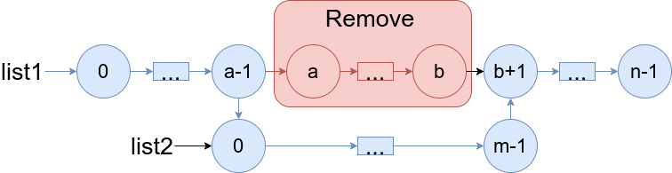
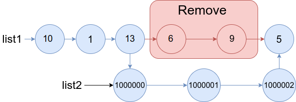
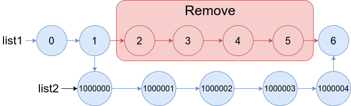

### 1. Description

You are given two linked lists: `list1` and `list2` of sizes `n` and `m` respectively.

Remove `list1`'s nodes from the $$a^{\text{th}}$$ node to the $$b^{\text{th}}$$ node, and put `list2` in their place.

The blue edges and nodes in the following figure indicate the result:

*Build the result list and return its head.*

### 2. Function Contract

- `n`: Input parameter.
- Returns expected result.

### 3. Examples

#### Example 1

- **Input:** $list1 = [10,1,13,6,9,5], a = 3, b = 4, list2 = [1000000,1000001,1000002]$
- **Output:** `[10,1,13,1000000,1000001,1000002,5]`
- **Explanation:** We remove the nodes 3 and 4 and put the entire list2 in their place. The blue edges and nodes in the above figure indicate the result.
#### Example 2

- **Input:** $list1 = [0,1,2,3,4,5,6], a = 2, b = 5, list2 = [1000000,1000001,1000002,1000003,1000004]$
- **Output:** `[0,1,1000000,1000001,1000002,1000003,1000004,6]`
- **Explanation:** The blue edges and nodes in the above figure indicate the result.

### 4. Constraints

- $3 \le \text{list1.length} \le 10^{4}$

- $1 \le a \le b < \text{list1.length} - 1$

- $1 \le \text{list2.length} \le 10^{4}$