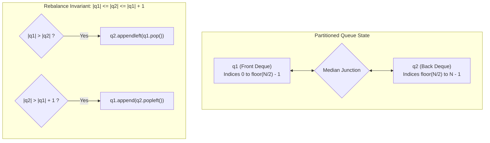

# Guided Example: Design Front Middle Back Queue

We trace the partitioned dual-deque state balancing for six-directional queue access, prove the Dual-Deque Size Invariant and Constant-Time Median Access Theorem, and evaluate complete operation sequences across representative problem instances:

- **Representative Instance 1 (Comprehensive Sequence):**
  - Operations:
    1. `pushFront(1)`
    2. `pushBack(2)`
    3. `pushMiddle(3)`
    4. `pushMiddle(4)`
    5. `popFront()`
    6. `popMiddle()`
    7. `popMiddle()`
    8. `popBack()`
    9. `popFront()`
  - Partition Progression (Front Deque $q_1$, Back Deque $q_2$):
    - Initial: $q_1 = [], \; q_2 = []$ (Empty)
    - After `pushFront(1)`: $q_1 = [], \; q_2 = [1]$
    - After `pushBack(2)`: $q_1 = [1], \; q_2 = [2]$
    - After `pushMiddle(3)`: $q_1 = [1], \; q_2 = [3, 2]$
    - After `pushMiddle(4)`: $q_1 = [1, 4], \; q_2 = [3, 2]$
    - `popFront()`: Removes $1$ from $q_1$. Returns **`1`**. State becomes $q_1 = [4], \; q_2 = [3, 2]$.
    - `popMiddle()`: Length $3$ (odd) $\implies$ Removes $3$ from head of $q_2$. Returns **`3`**. State: $q_1 = [4], \; q_2 = [2]$.
    - `popMiddle()`: Length $2$ (even) $\implies$ Removes $4$ from tail of $q_1$. Returns **`4`**. State: $q_1 = [], \; q_2 = [2]$.
    - `popBack()`: Removes $2$ from $q_2$. Returns **`2`**. State: $q_1 = [], \; q_2 = []$.
    - `popFront()`: Queue is empty. Returns **`-1`**.
  - **Required Outputs:** `[null, null, null, null, 1, 3, 4, 2, -1]`.

---

## 1. Instance & Teaching Goal

Standard double-ended queues (deques) allow inserting and removing elements at the front and back in $\mathcal{O}(1)$ time. However, inserting or removing at the **middle** of a contiguous vector or standard linked list requires $\mathcal{O}(N)$ time to shift elements or traverse to the median.

```text
The Index Specification:
  Let current queue size be N:
    - pushMiddle(val):
        Inserted at index floor(N / 2).
    - popMiddle():
        Removed from index floor((N - 1) / 2).

The Dual-Deque Architecture:
  Split the logical queue into two contiguous deques:
    q1 (Front Half)  <=======>  q2 (Back Half)

  By maintaining the size invariant:
    |q1| <= |q2| <= |q1| + 1

  The middle boundary is ALWAYS located at the junction between q1 and q2:
    - If N is even (N = 2k):
        |q1| = k, |q2| = k.
        The middle for popping (index k - 1) is q1.tail!
    - If N is odd (N = 2k + 1):
        |q1| = k, |q2| = k + 1.
        The middle for popping (index k) is q2.head!
```

The pedagogical focus is the **Dual-Deque Size Invariant**:
1. **Structural Slicing:** Map indices $0 \dots \lfloor N/2 \rfloor - 1$ to $q_1$, and indices $\lfloor N/2 \rfloor \dots N - 1$ to $q_2$.
2. **Local Median Invariant:** The exact median element is guaranteed to reside either at the tail of $q_1$ or the head of $q_2$.
3. **$\mathcal{O}(1)$ Rebalancing:** After any push or pop operation, at most one element is shifted across the boundary between $q_1$ and $q_2$, preserving strict constant time.

---

## 2. Conceptual Foundation & Partition Pipeline



### The Dual-Deque Size Invariant & Median Access Theorem

Let $Q = (e_0, e_1, \dots, e_{N-1})$ be the ordered sequence of elements.
Represent $Q$ as the concatenation of two double-ended queues:
$$
Q = q_1 \circ q_2
$$

1. **Size Invariant:**
   At the start and completion of every API invocation:
   $$
   |q_1| \le |q_2| \le |q_1| + 1
   $$
   Consequently:
   - When $N$ is even ($N = 2k$): $|q_1| = k$ and $|q_2| = k$.
   - When $N$ is odd ($N = 2k + 1$): $|q_1| = k$ and $|q_2| = k + 1$.

2. **Median Extraction Invariant:**
   By problem definition, `popMiddle()` extracts the element at index $\lfloor (N - 1) / 2 \rfloor$:
   - If $N = 2k$ is even:
     $$
     \left\lfloor \frac{2k - 1}{2} \right\rfloor = k - 1
     $$
     Index $k - 1$ corresponds to the last element of $q_1$, accessible via $q_1.\text{pop}()$ in $\mathcal{O}(1)$ time.
   - If $N = 2k + 1$ is odd:
     $$
     \left\lfloor \frac{2k}{2} \right\rfloor = k
     $$
     Since $|q_1| = k$, index $k$ corresponds to the first element of $q_2$, accessible via $q_2.\text{popleft}()$ in $\mathcal{O}(1)$ time.

3. **Median Insertion Invariant:**
   `pushMiddle(val)` inserts `val` at index $\lfloor N / 2 \rfloor$:
   - Appending `val` to $q_1$ places it at position $|q_1|$.
   - Because $|q_1| = \lfloor N / 2 \rfloor$ for even $N$ and $\lfloor N / 2 \rfloor$ for odd $N$, inserting into $q_1.\text{append}(val)$ followed by invariant rebalancing places `val` at the precise median.

4. **Amortization and Worst-Case Equivalence:**
   Because each operation inserts or removes at most one element, the size differential $|q_2| - |q_1|$ changes by at most $1$. Rebalancing requires at most one transfer between deques. Thus every operation executes in strictly $\mathcal{O}(1)$ worst-case time.

---

## 3. Step-by-Step Worked Execution

### Detailed Trace of Representative Instance 1

#### Initial State:
$q_1 = [], \; q_2 = []$. $N = 0$.

#### Op 1: `pushFront(1)`
- Insert $1$ at front of $q_1$: $q_1 = [1]$.
- Invariant check: $|q_1| = 1, \; |q_2| = 0 \implies |q_1| > |q_2|$.
- Shift element: Move $1$ from tail of $q_1$ to head of $q_2$.
- Result: $q_1 = [], \; q_2 = [1]$. Invariant satisfied ($0 \le 1 \le 1$).

#### Op 2: `pushBack(2)`
- Insert $2$ at back of $q_2$: $q_2 = [1, 2]$.
- Invariant check: $|q_1| = 0, \; |q_2| = 2 \implies |q_2| > |q_1| + 1 \; (2 > 1)$.
- Shift element: Move $1$ from head of $q_2$ to tail of $q_1$.
- Result: $q_1 = [1], \; q_2 = [2]$. ($|q_1| = 1, |q_2| = 1$).

#### Op 3: `pushMiddle(3)`
- Insert $3$ at tail of $q_1$: $q_1 = [1, 3]$.
- Invariant check: $|q_1| = 2, \; |q_2| = 1 \implies |q_1| > |q_2|$.
- Shift element: Move $3$ from tail of $q_1$ to head of $q_2$.
- Result: $q_1 = [1], \; q_2 = [3, 2]$. ($|q_1| = 1, |q_2| = 2$). Sequence: `[1, 3, 2]`.

#### Op 4: `pushMiddle(4)`
- Insert $4$ at tail of $q_1$: $q_1 = [1, 4]$.
- Invariant check: $|q_1| = 2, \; |q_2| = 2$.
- Balanced! ($2 \le 2 \le 3$).
- Result: $q_1 = [1, 4], \; q_2 = [3, 2]$. Sequence: `[1, 4, 3, 2]`.

#### Op 5: `popFront()`
- Extract from head of $q_1$: Pop $1$.
- State: $q_1 = [4], \; q_2 = [3, 2]$.
- Rebalance: $|q_1| = 1, |q_2| = 2 \implies$ Balanced!
- Emitted Value: **`1`**. Sequence: `[4, 3, 2]`.

#### Op 6: `popMiddle()`
- Current length $N = 3$ (odd).
- Middle is at head of $q_2$: Pop $3$ from $q_2$.
- State: $q_1 = [4], \; q_2 = [2]$.
- Rebalance: $|q_1| = 1, |q_2| = 1 \implies$ Balanced!
- Emitted Value: **`3`**. Sequence: `[4, 2]`.

#### Op 7: `popMiddle()`
- Current length $N = 2$ (even).
- Middle is at tail of $q_1$: Pop $4$ from $q_1$.
- State: $q_1 = [], \; q_2 = [2]$.
- Rebalance: $|q_1| = 0, |q_2| = 1 \implies$ Balanced!
- Emitted Value: **`4`**. Sequence: `[2]`.

#### Op 8: `popBack()`
- Extract from tail of $q_2$: Pop $2$.
- State: $q_1 = [], \; q_2 = []$.
- Emitted Value: **`2`**. Queue is now empty.

#### Op 9: `popFront()`
- Queue is empty ($q_1$ and $q_2$ both empty).
- Emitted Value: **`-1`**.

---

## 4. Complete Execution Trace

### Operation Progression Table

| Step | Invocation | Target Deque Action | Post-Action $(q_1, q_2)$ | Rebalance Shift | Final State $(q_1, q_2)$ | Logical Queue $Q$ | Output |
|---|---|---|---|---|---|---|---|
| $0$ | Init | — | $([], [])$ | None | $([], [])$ | `[]` | — |
| $1$ | `pushFront(1)` | $q_1.\text{appendleft}(1)$ | $([1], [])$ | $q_1 \to q_2$ | $([], [1])$ | `[1]` | `null` |
| $2$ | `pushBack(2)` | $q_2.\text{append}(2)$ | $([], [1, 2])$ | $q_2 \to q_1$ | $([1], [2])$ | `[1, 2]` | `null` |
| $3$ | `pushMiddle(3)` | $q_1.\text{append}(3)$ | $([1, 3], [2])$ | $q_1 \to q_2$ | $([1], [3, 2])$ | `[1, 3, 2]` | `null` |
| $4$ | `pushMiddle(4)` | $q_1.\text{append}(4)$ | $([1, 4], [3, 2])$ | None | $([1, 4], [3, 2])$ | `[1, 4, 3, 2]` | `null` |
| $5$ | `popFront()` | $q_1.\text{popleft}() \to 1$ | $([4], [3, 2])$ | None | $([4], [3, 2])$ | `[4, 3, 2]` | **`1`** |
| $6$ | `popMiddle()` | $q_2.\text{popleft}() \to 3$ | $([4], [2])$ | None | $([4], [2])$ | `[4, 2]` | **`3`** |
| $7$ | `popMiddle()` | $q_1.\text{pop}() \to 4$ | $([], [2])$ | None | $([], [2])$ | `[2]` | **`4`** |
| $8$ | `popBack()` | $q_2.\text{pop}() \to 2$ | $([], [])$ | None | $([], [])$ | `[]` | **`2`** |
| $9$ | `popFront()` | Empty Check | $([], [])$ | None | $([], [])$ | `[]` | **`-1`** |

---

## 5. Algorithmic Correctness

**Soundness.**
The invariant $|q_1| \le |q_2| \le |q_1| + 1$ ensures that the junction between $q_1$ and $q_2$ always aligns with index $\lfloor N / 2 \rfloor$. Therefore, median lookups never scan internal deque elements. Each push or pop directly modifies either the boundary of $q_1$ or $q_2$, and the rebalance condition shifts at most one element, preserving the total ordering of $Q$.

**Completeness.**
Every API method explicitly handles empty deques, returning `-1` when $N = 0$. Since all deque operations (`append`, `appendleft`, `pop`, `popleft`) preserve order and operate on the exact ends, no elements can become corrupted or misordered.

---

## 6. Traps This Instance Exposes

- **Even vs. Odd Median Parity Confusion:** When $N$ is even, the median for deletion is index $N/2 - 1$ (tail of $q_1$). When $N$ is odd, the median is index $\lfloor N/2 \rfloor$ (head of $q_2$). Swapping these leads to extracting the wrong half's boundary.
- **Cascading Size Imbalances:** Omitting the rebalance step after a pop or push allows one deque to grow arbitrarily larger than the other, causing median operations to read incorrect elements.
- **Single Element Deque Location:** With a single element ($N = 1$), the invariant forces $|q_1| = 0$ and $|q_2| = 1$. The element is in $q_2$. Attempting to pop from $q_1$ when $N = 1$ without falling back to $q_2$ would incorrectly report empty.

---

## 7. Complexity Derivation

- **Time Complexity:**
  - `pushFront`: $1$ deque insertion $+$ at most $1$ rebalance shift $\implies \mathcal{O}(1)$.
  - `pushMiddle`: $1$ deque insertion $+$ at most $1$ rebalance shift $\implies \mathcal{O}(1)$.
  - `pushBack`: $1$ deque insertion $+$ at most $1$ rebalance shift $\implies \mathcal{O}(1)$.
  - `popFront`, `popMiddle`, `popBack`: $1$ deque deletion $+$ at most $1$ rebalance shift $\implies \mathcal{O}(1)$.
  - Total Time Complexity: strictly $\mathcal{O}(1)$ worst-case per operation across all calls.
- **Auxiliary Space Complexity:**
  - Two double-ended queues storing $N$ total elements.
  - Total Auxiliary Space Complexity: strictly $\mathcal{O}(N)$ linear memory.