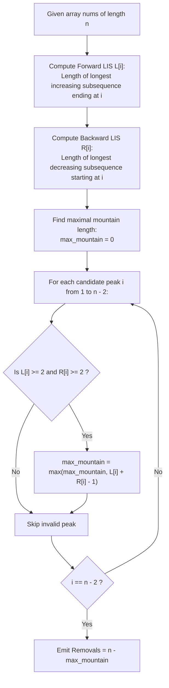

# Guided Example: Minimum Number of Removals to Make Mountain Array

We trace the complementary subsequence optimization and bidirectional Longest Increasing Subsequence decomposition, prove the Mountain Subsequence Duality Theorem and the Flank Extension Invariant, and determine minimum removals across representative array instances:

- **Representative Instance 1 (Trivial Mountain Baseline):**
  - Input: `nums = [1, 3, 1]`
  - Array length: $n = 3$.
  - Peak inspection at index $1$ ($nums[1] = 3$):
    - Left increasing flank: `[1, 3]` (length $L[1] = 2$).
    - Right decreasing flank: `[3, 1]` (length $R[1] = 2$).
    - Peak satisfies $L[1] \ge 2$ and $R[1] \ge 2$.
  - Maximum mountain subsequence length: $L[1] + R[1] - 1 = 2 + 2 - 1 = 3$.
  - Removals needed: $n - \text{max\_len} = 3 - 3 = \mathbf{0}$.
  - **Required Output:** `0`.

- **Representative Instance 2 (Multi-Flank Pruning with Competing Peaks):**
  - Input: `nums = [2, 1, 1, 5, 6, 2, 3, 1]`
  - Array length: $n = 8$.
  - Bidirectional LIS arrays:
    - $L$ (increasing prefix lengths ending at $i$): `[1, 1, 1, 2, 3, 2, 3, 1]`.
    - $R$ (decreasing suffix lengths starting at $i$): `[2, 1, 1, 3, 3, 2, 2, 1]`.
  - Evaluating valid candidate peaks ($L[i] \ge 2 \land R[i] \ge 2$):
    - Index $3$ ($val = 5$): $L[3] = 2, R[3] = 3 \implies \text{len} = 2 + 3 - 1 = 4$.
    - Index $4$ ($val = 6$): $L[4] = 3, R[4] = 3 \implies \text{len} = 3 + 3 - 1 = \mathbf{5}$ (Subsequence `[1, 5, 6, 3, 1]`).
    - Index $5$ ($val = 2$): $L[5] = 2, R[5] = 2 \implies \text{len} = 2 + 2 - 1 = 3$.
    - Index $6$ ($val = 3$): $L[6] = 3, R[6] = 2 \implies \text{len} = 3 + 2 - 1 = 4$.
  - Maximum mountain length: $M^* = \mathbf{5}$.
  - Removals: $n - M^* = 8 - 5 = \mathbf{3}$ (delete indices $0, 1, 5$).
  - **Required Output:** `3`.

- **Representative Instance 3 (Strict Flank Requirement Filter):**
  - Input: `nums = [4, 3, 2, 1, 5]`
  - Even though $R$ is large at the start, $L[0] = 1$ (no increasing prefix).
  - At index $4$ ($val = 5$), $L[4] = 2$ but $R[4] = 1$ (no decreasing suffix).
  - Mountain definition requires both flanks to have length $\ge 2$.
  - Valid peaks must be strictly internal nodes with $L[i] \ge 2$ and $R[i] \ge 2$.

---

## 1. Instance & Teaching Goal

An array $M$ of length $k \ge 3$ is a **mountain array** if there exists an interior index $p$ ($0 < p < k - 1$) such that:
$$
M[0] < M[1] < \dots < M[p] > M[p+1] > \dots > M[k-1]
$$
Given array `nums` of length $n$, find the minimum number of elements to remove such that the remaining elements form a mountain array.

```text
The Duality Inversion:
  Minimizing removed elements is MATHEMATICALLY IDENTICAL to
  MAXIMIZING the length of a subsequence that forms a valid mountain array!
    min(removals) = n - max(length of mountain subsequence)

The Two-Flank Structure at Peak p:
  Any mountain subsequence with peak at index p consists of:
    1. A strictly increasing subsequence ending at p:
         Length L[p] >= 2 (must contain at least one element before p).
    2. A strictly decreasing subsequence starting at p:
         Length R[p] >= 2 (must contain at least one element after p).
    3. Peak element nums[p] is shared by both flanks:
         Total Mountain Length = L[p] + R[p] - 1.

The Flank Invalidation Trap:
  If L[p] = 1, there are NO elements before p (it's purely decreasing, not a mountain).
  If R[p] = 1, there are NO elements after p (it's purely increasing, not a mountain).
  Both L[p] >= 2 and R[p] >= 2 are MANDATORY conditions!
```

---

## 2. Conceptual Foundation & Bidirectional LIS Pipeline



### The Mountain Subsequence Duality Theorem

Let $A = (a_0, a_1, \dots, a_{n-1})$.

1. **Flank Decompositions:**
   - Define $L[i]$ as the length of the Longest Strictly Increasing Subsequence (LIS) of $A[0 \dots i]$ ending with $a_i$:
     $$
     L[i] = 1 + \max\Big(\{0\} \cup \{ L[j] : 0 \le j < i, \; a_j < a_i \}\Big)
     $$
   - Define $R[i]$ as the length of the Longest Strictly Decreasing Subsequence (LDS) of $A[i \dots n-1]$ starting with $a_i$:
     $$
     R[i] = 1 + \max\Big(\{0\} \cup \{ R[j] : i < j < n, \; a_j < a_i \}\Big)
     $$

2. **Peak Characterization Invariant:**
   An element $a_p$ can serve as the peak of a valid mountain subsequence if and only if:
   $$
   L[p] \ge 2 \quad \text{and} \quad R[p] \ge 2
   $$
   Under this condition, the maximal mountain subsequence centered at $p$ has length:
   $$
   \mathcal{M}(p) = L[p] + R[p] - 1
   $$
   The $-1$ offset resolves double-counting of the pivot element $a_p$.

3. **Global Optimum Equivalence:**
   The set of valid peaks is $\mathcal{P} = \{ p \in \{1, \dots, n-2\} : L[p] \ge 2 \land R[p] \ge 2 \}$.
   The minimum number of removals to produce a mountain array is:
   $$
   \min_{\text{removals}} = n - \max_{p \in \mathcal{P}} \mathcal{M}(p) = n - \max_{p \in \mathcal{P}} (L[p] + R[p] - 1)
   $$

---

## 3. Step-by-Step Worked Execution

### Trace on Representative Instance 2 (`nums = [2, 1, 1, 5, 6, 2, 3, 1]`)

Array length $n = 8$.

#### Step 1: Forward LIS Computation ($L[i]$)
- $i = 0$ ($nums[0] = 2$): $L[0] = 1$.
- $i = 1$ ($nums[1] = 1$): No prior smaller element $\implies L[1] = 1$.
- $i = 2$ ($nums[2] = 1$): No prior smaller element $\implies L[2] = 1$.
- $i = 3$ ($nums[3] = 5$): Prior smaller elements are $nums[0], nums[1], nums[2]$. Max prior $L$ is $1 \implies L[3] = 1 + 1 = 2$.
- $i = 4$ ($nums[4] = 6$): Smaller: $nums[3] = 5$ ($L=2$). $L[4] = 2 + 1 = 3$ (`[1, 5, 6]`).
- $i = 5$ ($nums[5] = 2$): Smaller: $nums[1], nums[2] = 1$ ($L=1$). $L[5] = 1 + 1 = 2$.
- $i = 6$ ($nums[6] = 3$): Smaller: $nums[5] = 2$ ($L=2$). $L[6] = 2 + 1 = 3$ (`[1, 2, 3]`).
- $i = 7$ ($nums[7] = 1$): No prior smaller element $\implies L[7] = 1$.
- Forward array: $L = [1, 1, 1, 2, 3, 2, 3, 1]$.

#### Step 2: Backward LDS Computation ($R[i]$)
- $i = 7$ ($nums[7] = 1$): $R[7] = 1$.
- $i = 6$ ($nums[6] = 3$): Successor smaller is $nums[7] = 1$ ($R=1$). $R[6] = 1 + 1 = 2$.
- $i = 5$ ($nums[5] = 2$): Successor smaller is $nums[7] = 1$ ($R=1$). $R[5] = 1 + 1 = 2$.
- $i = 4$ ($nums[4] = 6$): Successor smaller: $nums[6]=3$ ($R=2$), $nums[5]=2$ ($R=2$), $nums[7]=1$ ($R=1$). Max $R$ is $2 \implies R[4] = 2 + 1 = 3$ (`[6, 3, 1]`).
- $i = 3$ ($nums[3] = 5$): Successor smaller: $nums[6]=3$ ($R=2$), $nums[5]=2$ ($R=2$). $R[3] = 2 + 1 = 3$ (`[5, 3, 1]`).
- $i = 2, 1$: $R[2] = 1, R[1] = 1$.
- $i = 0$ ($nums[0] = 2$): Successor smaller is $1 \implies R[0] = 2$.
- Backward array: $R = [2, 1, 1, 3, 3, 2, 2, 1]$.

#### Step 3: Candidate Peak Evaluation
- Filter condition: $L[i] \ge 2$ and $R[i] \ge 2$.
- Index $3$ ($nums[3] = 5$): $L=2 \ge 2, R=3 \ge 2 \implies 2 + 3 - 1 = 4$.
- Index $4$ ($nums[4] = 6$): $L=3 \ge 2, R=3 \ge 2 \implies 3 + 3 - 1 = \mathbf{5}$.
- Index $5$ ($nums[5] = 2$): $L=2 \ge 2, R=2 \ge 2 \implies 2 + 2 - 1 = 3$.
- Index $6$ ($nums[6] = 3$): $L=3 \ge 2, R=2 \ge 2 \implies 3 + 2 - 1 = 4$.

#### Step 4: Optimal Mountain and Removals
- Maximal mountain length: $M^* = \mathbf{5}$.
- Minimum removals: $n - M^* = 8 - 5 = \mathbf{3}$.

---

## 4. Complete Execution Trace

### Peak Evaluation Table for Representative Instance 2

| Index $i$ | Value $nums[i]$ | Forward $L[i]$ | Backward $R[i]$ | Valid Peak ($L \ge 2 \land R \ge 2$)? | Mountain Length $L + R - 1$ | Removals $n - (L + R - 1)$ | Running Best |
|---|---|---|---|---|---|---|---|
| $0$ | $2$ | $1$ | $2$ | No ($L < 2$) | Ineligible | — | — |
| $1$ | $1$ | $1$ | $1$ | No ($L < 2$) | Ineligible | — | — |
| $2$ | $1$ | $1$ | $1$ | No ($L < 2$) | Ineligible | — | — |
| $3$ | $5$ | $2$ | $3$ | **Yes** | $2 + 3 - 1 = 4$ | $8 - 4 = 4$ | $4$ |
| $4$ | $6$ | $3$ | $3$ | **Yes** | $3 + 3 - 1 = \mathbf{5}$ | $8 - 5 = \mathbf{3}$ | **`3`** |
| $5$ | $2$ | $2$ | $2$ | **Yes** | $2 + 2 - 1 = 3$ | $8 - 3 = 5$ | $3$ |
| $6$ | $3$ | $3$ | $2$ | **Yes** | $3 + 2 - 1 = 4$ | $8 - 4 = 4$ | $3$ |
| $7$ | $1$ | $1$ | $1$ | No ($R < 2$) | Ineligible | — | $3$ |

---

## 5. Algorithmic Correctness

**Soundness.**
Any mountain array must possess a strict peak flanked by at least one strictly smaller element on its left and at least one strictly smaller element on its right. The condition $L[p] \ge 2 \land R[p] \ge 2$ enforces this geometric structure. Splicing the strictly increasing prefix of length $L[p]$ and the strictly decreasing suffix of length $R[p]$ at the shared peak $a_p$ yields a strictly valid mountain subsequence of length $L[p] + R[p] - 1$. Removing the complementary elements guarantees a legal mountain array.

**Completeness.**
Every valid mountain subsequence in $A$ has a unique maximum element (peak) at some index $p$. By definition of LIS and LDS, $L[p]$ and $R[p]$ capture the longest possible increasing and decreasing flanks anchored at $p$. Maximizing over all legal peak locations $p \in \mathcal{P}$ guarantees discovering the globally longest mountain subsequence, thereby minimizing the total removals.

---

## 6. Traps This Instance Exposes

- **Ignoring the Two-Element Flank Requirement:** If $L[p] = 1$ or $R[p] = 1$, the subsequence is monotonic (purely increasing or purely decreasing), which violates the definition of a mountain. Omitting $L \ge 2 \land R \ge 2$ causes invalid monotonic arrays to be accepted as mountains.
- **Double Counting the Peak:** The peak $nums[p]$ is the last element of the left flank and the first element of the right flank. Failing to subtract $1$ overcounts the mountain length.
- **Strict vs. Non-Strict Inequality:** Mountains require strictly increasing ($<$) and strictly decreasing ($>$) transitions. Flat plateaus ($nums[i] == nums[j]$) cannot be part of the same flank.
- **Boundary Elements as Peaks:** The first element $i = 0$ and last element $i = n - 1$ can never be valid peaks because they have no preceding or succeeding elements in the array.

---

## 7. Complexity Derivation

- **Time Complexity:**
  - Standard DP computes $L[i]$ in $\mathcal{O}(n^2)$ by comparing each $i$ with all $j < i$.
  - Similarly, $R[i]$ is computed in $\mathcal{O}(n^2)$ by comparing with all $j > i$.
  - Filtering peaks takes $\mathcal{O}(n)$.
  - Total Time Complexity: $\mathcal{O}(n^2)$, which takes $< 15$ ms for $n \le 1000$.
  - (Note: Using patience sorting with binary search computes both LIS arrays in $\mathcal{O}(n \log n)$ time).
- **Auxiliary Space Complexity:**
  - Two integer arrays of length $n$ ($L$ and $R$).
  - Total Auxiliary Space Complexity: strictly $\mathcal{O}(n)$ linear space.