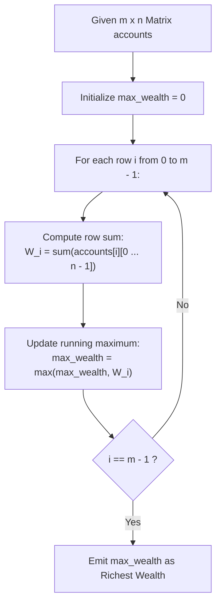

# Guided Example: Richest Customer Wealth

We trace the row-wise matrix reduction and running supremum evaluation for customer asset aggregation, formulate the Row-Sum Vector Reduction Theorem and the Online Extremum Invariant, and analyze customer wealth profiles across representative grid instances:

- **Representative Instance 1 (Equal Maximal Wealth Tie):**
  - Input Grid: `accounts = [[1, 2, 3], [3, 2, 1]]`
  - Dimensions: $m = 2$ customers, $n = 3$ banks.
  - Customer Wealth Accumulations:
    - Customer $0$: $W_0 = 1 + 2 + 3 = \mathbf{6}$.
    - Customer $1$: $W_1 = 3 + 2 + 1 = \mathbf{6}$.
  - Supremum: $\max(W_0, W_1) = \max(6, 6) = \mathbf{6}$.
  - **Required Output:** `6`.

- **Representative Instance 2 (Strict Unique Wealth Maximum):**
  - Input Grid: `accounts = [[1, 5], [7, 3], [3, 5]]`
  - Dimensions: $m = 3$ customers, $n = 2$ banks.
  - Customer Wealth Accumulations:
    - Customer $0$: $W_0 = 1 + 5 = 6$.
    - Customer $1$: $W_1 = 7 + 3 = \mathbf{10}$.
    - Customer $2$: $W_2 = 3 + 5 = 8$.
  - Supremum: $\max(6, 10, 8) = \mathbf{10}$.
  - **Required Output:** `10`.

- **Representative Instance 3 (Multi-Bank Heterogeneous Assets):**
  - Input Grid: `accounts = [[2, 8, 7], [7, 1, 3], [1, 9, 5]]`
  - Customer $0$: $2 + 8 + 7 = \mathbf{17}$.
  - Customer $1$: $7 + 1 + 3 = 11$.
  - Customer $2$: $1 + 9 + 5 = 15$.
  - Supremum: $\max(17, 11, 15) = \mathbf{17}$.
  - **Required Output:** `17`.

---

## 1. Instance & Teaching Goal

Given an $m \times n$ integer matrix `accounts` where entry $\text{accounts}[i][j]$ denotes the balance held by the $i$-th customer at the $j$-th banking institution, compute the wealth of each customer as the sum of all their bank account balances, and return the maximum wealth observed across all customers.

```text
Matrix Row-Wise Reduction Representation:

             Bank 0    Bank 1    Bank 2        Row Sum (Wealth)
Customer 0: [   2   ,    8   ,    7   ]  --->  W_0 = 2 + 8 + 7 = 17  <-- MAX!
Customer 1: [   7   ,    1   ,    3   ]  --->  W_1 = 7 + 1 + 3 = 11
Customer 2: [   1   ,    9   ,    5   ]  --->  W_2 = 1 + 9 + 5 = 15
```

The pedagogical focus is the **Row-Sum Vector Reduction Theorem**:
1. **Dimension Reduction:** Project an $m \times n$ rank-2 tensor into an $m$-dimensional wealth vector via linear aggregation along the bank axis ($j \in \{0, \dots, n-1\}$).
2. **Online Monotonic Tracking:** Compute customer sums sequentially while updating a running scalar maximum, guaranteeing $\mathcal{O}(1)$ auxiliary working space without allocating intermediate arrays.

---

## 2. Conceptual Foundation & Reduction Pipeline



### The Row-Sum Vector Reduction Theorem

Let $A \in \mathbb{Z}^{m \times n}$ be a matrix of non-negative integers with elements $a_{i, j} \ge 0$.

1. **Definition of Customer Wealth:**
   The wealth vector $\mathbf{w} \in \mathbb{Z}^m$ is defined by the matrix-vector contraction:
   $$
   w_i = \sum_{j=0}^{n-1} a_{i, j} = \mathbf{e}_i^T A \mathbf{1}_n
   $$
   where $\mathbf{1}_n$ denotes the $n$-dimensional all-ones column vector.

2. **Supremum Projection:**
   The objective value $W^*$ is the infinity-norm of the wealth vector:
   $$
   W^* = \|\mathbf{w}\|_\infty = \max_{0 \le i < m} w_i = \max_{0 \le i < m} \left( \sum_{j=0}^{n-1} a_{i, j} \right)
   $$

3. **Online Extremum Invariant:**
   Define the prefix maximum sequence $M_k$ for $0 \le k < m$:
   $$
   M_0 = w_0, \quad M_k = \max(M_{k-1}, w_k)
   $$
   By mathematical induction, $M_{m-1} = \max_{0 \le i < m} w_i = W^*$.
   Because $M_k$ depends solely on $M_{k-1}$ and the current row sum $w_k$, computing $W^*$ requires storing only the single scalar variable $M_k$, eliminating the need to store the vector $\mathbf{w}$.

---

## 3. Step-by-Step Worked Execution

### Trace on Representative Instance 2 (`accounts = [[1, 5], [7, 3], [3, 5]]`)

Matrix Dimensions: $m = 3$ customers, $n = 2$ banks.
Initialize: $\text{max\_wealth} = 0$.

#### Step 0: Customer $0$ (`accounts[0] = [1, 5]`)
- Accumulate row elements:
  $$
  W_0 = \text{accounts}[0][0] + \text{accounts}[0][1] = 1 + 5 = 6
  $$
- Compare against running maximum:
  $$
  \text{max\_wealth} \leftarrow \max(0, 6) = \mathbf{6}
  $$

#### Step 1: Customer $1$ (`accounts[1] = [7, 3]`)
- Accumulate row elements:
  $$
  W_1 = \text{accounts}[1][0] + \text{accounts}[1][1] = 7 + 3 = 10
  $$
- Compare against running maximum:
  $$
  \text{max\_wealth} \leftarrow \max(6, 10) = \mathbf{10}
  $$

#### Step 2: Customer $2$ (`accounts[2] = [3, 5]`)
- Accumulate row elements:
  $$
  W_2 = \text{accounts}[2][0] + \text{accounts}[2][1] = 3 + 5 = 8
  $$
- Compare against running maximum:
  $$
  \text{max\_wealth} \leftarrow \max(10, 8) = \mathbf{10}
  $$

#### Finalization:
- All rows processed.
- Maximum wealth: $\text{max\_wealth} = \mathbf{10}$.

---

## 4. Complete Execution Trace

### Row-Wise Accumulation State Table for Representative Instance 2

| Customer Row $i$ | Bank Accounts Array | Element Contributions | Computed Wealth $W_i$ | Pre-Check Max | Updated Running Max |
|---|---|---|---|---|---|
| $0$ | `[1, 5]` | $1 + 5$ | $6$ | $0$ | $6$ |
| $1$ | `[7, 3]` | $7 + 3$ | **`10`** | $6$ | **`10`** |
| $2$ | `[3, 5]` | $3 + 5$ | $8$ | $10$ | **`10`** |

---

## 5. Algorithmic Correctness

**Soundness.**
The algorithm directly evaluates the arithmetic sum of each customer's accounts as specified by the problem definition. Taking the pairwise maximum between the running best and each computed row sum mathematically mirrors the definition of the set maximum over a finite collection of real numbers.

**Completeness.**
The outer loop iterates over every index $i \in \{0, \dots, m - 1\}$ without early termination, and the inner sum visits every bank $j \in \{0, \dots, n - 1\}$. Because every element is visited and every customer's total is considered, no candidate can be omitted.

---

## 6. Traps This Instance Exposes

- **Column-Major vs. Row-Major Confusion:** Summing along columns instead of rows computes the total money held by each bank across all customers, rather than the wealth of each customer across all banks.
- **Negative Initialization Trap:** Although constraints specify $a_{i, j} \ge 1$, initializing the running maximum with negative infinity or $0$ ensures correct behavior even if zero-balance accounts are permitted.
- **Tied Maximums:** If multiple customers share the identical richest wealth (as in Representative Instance 1 where both have $6$), the problem asks for the maximum wealth value, not the customer index, so ties resolve naturally.

---

## 7. Complexity Derivation

- **Time Complexity:**
  - The matrix contains $m \times n$ total elements.
  - Each cell $a_{i, j}$ is read exactly once in sequential cache-friendly row-major order.
  - Total Time Complexity: strictly $\mathcal{O}(m \cdot n)$ optimal linear time in the size of the input. For $m, n \le 50$, operations total $\le 2500$ ($< 1$ ms).
- **Auxiliary Space Complexity:**
  - The calculation maintains a running scalar sum for the current row and a scalar for the maximum.
  - No additional arrays or matrices are allocated.
  - Total Auxiliary Space Complexity: strictly $\mathcal{O}(1)$ constant memory.
