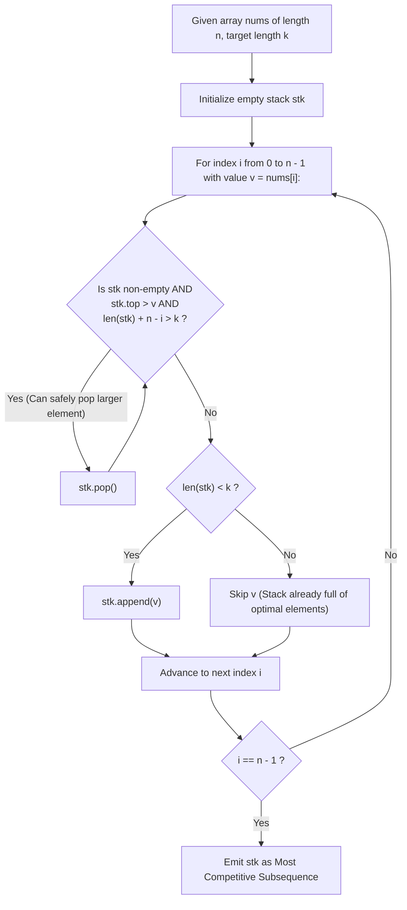

# Guided Example: Find the Most Competitive Subsequence

We trace the greedy lexicographical minimization and monotonic stack pruning under strict capacity reservation constraints, prove the Sufficiency Reservation Invariant and Monotonic Prefix Dominance Theorem, and construct optimal subsequences across representative problem instances:

- **Representative Instance 1 (Dynamic Pop and Replacement):**
  - Input: `nums = [3, 5, 2, 6], k = 2`
  - Array length: $n = 4$, target subsequence length: $k = 2$.
  - Evaluation of elements:
    - Step $0$ ($nums[0] = 3$): Stack $\to [3]$.
    - Step $1$ ($nums[1] = 5$): $5 > 3$, append $\to [3, 5]$ (size $2 = k$).
    - Step $2$ ($nums[2] = 2$):
      - Top $5 > 2$. Remaining elements from index $2$: count is $n - i = 4 - 2 = 2$.
      - Capacity check: $|stk| - 1 + (n - i) = 1 + 2 = 3 \ge 2$. Pop $5$!
      - New top $3 > 2$. Capacity check: $0 + 2 = 2 \ge 2$. Pop $3$!
      - Stack $\to [2]$.
    - Step $3$ ($nums[3] = 6$): $6 > 2$. Append $\to [2, 6]$.
  - All candidate subsequences of size $2$: $\{[3, 5], [3, 2], [3, 6], [5, 2], [5, 6], [2, 6]\}$.
  - The lexicographically smallest is $\mathbf{[2, 6]}$.
  - **Required Output:** `[2, 6]`.

- **Representative Instance 2 (Duplicate Elements and Plateau Handling):**
  - Input: `nums = [2, 4, 3, 3, 5, 4, 9, 6], k = 4`
  - Array length: $n = 8$, target length: $k = 4$.
  - Execution progression:
    - Process $2, 4 \to [2, 4]$.
    - Encounter $3$: $3 < 4$. Pop $4$, push $3 \to [2, 3]$.
    - Encounter $3$: $3 \le 3$, push $3 \to [2, 3, 3]$.
    - Encounter $5$: push $5 \to [2, 3, 3, 5]$ (size $4$).
    - Encounter $4$: $4 < 5$. Pop $5$, push $4 \to [2, 3, 3, 4]$.
    - Remaining $9, 6$ cannot improve prefix or exceed capacity.
  - **Required Output:** `[2, 3, 3, 4]`.

- **Representative Instance 3 (Complete Prefix Flush):**
  - Input: `nums = [9, 8, 7, 1, 2], k = 2`
  - Elements $9, 8, 7$ are popped successively upon encountering $1$ because $n - i = 2 \ge k$.
  - Final Stack: `[1, 2]`.
  - **Required Output:** `[1, 2]`.

---

## 1. Instance & Teaching Goal

A subsequence $A$ is defined to be **more competitive** than a subsequence $B$ of identical length $k$ if at the earliest index $p$ where $A[p] \neq B[p]$, we have $A[p] < B[p]$. This is the standard lexicographical minimization order. Given an array `nums` of length $n$ and an integer $k$, find the most competitive subsequence of size $k$.

```text
The Greedy Pruning Conflict:
  Suppose our current subsequence prefix is [3, 5] and the next element is 2.
  We want to replace 5 with 2, or even 3 with 2, because 2 < 3 < 5!
  Doing so makes the subsequence lexicographically smaller.

  HOWEVER, we CANNOT always discard elements freely!
  We must end up with an EXACT subsequence of length k!
  If we discard too many elements, the remaining suffix of nums might NOT be
  long enough to reach length k!

  The Capacity Reservation Invariant:
    At index i in nums, there are exactly (n - i) elements available (including nums[i]).
    If the current stack has size |stk|:
      Popping 1 element leaves |stk| - 1 elements.
      Adding all remaining (n - i) elements gives a maximum possible future size of:
        (|stk| - 1) + (n - i)
      We are PERMITTED to pop if and only if:
        |stk| - 1 + (n - i) >= k  <===>  |stk| + n - i > k
```

The pedagogical focus is the **Monotonic Stack with Capacity Reservation**:
1. Maintain elements in non-decreasing order whenever possible.
2. Guard every pop operation by the capacity sufficiency predicate $|stk| + n - i > k$.
3. Append incoming elements only if the stack size has not yet reached $k$.

---

## 2. Conceptual Foundation & Pruning Pipeline



### The Sufficiency Reservation Invariant & Monotonic Dominance Theorem

Let $A = (a_0, a_1, \dots, a_{n-1})$ be the sequence of elements, and $S_t = (s_0, \dots, s_{m-1})$ be the stack state after processing $a_{i-1}$.

1. **Sufficiency Reservation Invariant:**
   At any index $i$, the number of unused elements remaining in the array is $n - i$.
   A valid subsequence of length $k$ can be completed from the current stack state if and only if:
   $$
   |S_t| + (n - i) \ge k
   $$
   Therefore, removing the top element $s_{m-1}$ is admissible if and only if:
   $$
   (|S_t| - 1) + (n - i) \ge k \iff |S_t| + n - i > k
   $$

2. **Lexicographical Exchange Dominance:**
   Suppose $s_{m-1} > a_i$ and the sufficiency condition holds.
   Any subsequence $B$ retaining $s_{m-1}$ at position $m-1$ has $B[m-1] = s_{m-1}$.
   Replacing $s_{m-1}$ with $a_i$ produces a subsequence $A$ with $A[m-1] = a_i < s_{m-1}$.
   Because all indices prior to $m-1$ are identical, $A \prec B$ in the lexicographical order.
   Thus, popping $s_{m-1}$ whenever $s_{m-1} > a_i$ and $|S_t| + n - i > k$ is strictly optimal.

3. **Termination Guarantee:**
   Because each element of $A$ is pushed at most once and popped at most once, the stack traversal completes in $\mathcal{O}(n)$ amortized operations, and the final stack size is guaranteed to be exactly $k$.

---

## 3. Step-by-Step Worked Execution

### Trace on Representative Instance 1 (`nums = [3, 5, 2, 6]`, $k = 2$)

Parameters: $n = 4, \; k = 2$.
Initialize: $stk = []$.

#### Step 0 ($i = 0$, $v = 3$):
- Stack is empty.
- $|stk| = 0 < k \; (0 < 2) \implies$ Push $3$.
- State: $stk = [3]$.

#### Step 1 ($i = 1$, $v = 5$):
- Top element is $3$. Is $3 > 5$? No.
- Can we append? $|stk| = 1 < k \; (1 < 2) \implies$ Push $5$.
- State: $stk = [3, 5]$.

#### Step 2 ($i = 2$, $v = 2$):
- Check pop condition:
  - Top is $5$. Is $5 > 2$? Yes.
  - Check capacity: $|stk| + n - i = 2 + 4 - 2 = 4 > 2 \; (4 > k)$.
  - Both conditions met $\implies$ **Pop $5$!** Stack becomes `[3]`.
- Check pop condition again:
  - Top is $3$. Is $3 > 2$? Yes.
  - Check capacity: $|stk| + n - i = 1 + 4 - 2 = 3 > 2 \; (3 > k)$.
  - Both conditions met $\implies$ **Pop $3$!** Stack becomes `[]`.
- Stack is empty.
- Append check: $|stk| = 0 < 2 \implies$ Push $2$.
- State: $stk = [2]$.

#### Step 3 ($i = 3$, $v = 6$):
- Top is $2$. Is $2 > 6$? No.
- Append check: $|stk| = 1 < 2 \implies$ Push $6$.
- State: $stk = [2, 6]$.

#### Finalization:
- Traversal complete.
- Stack contents: $\mathbf{[2, 6]}$. Length is exactly $k = 2$.

---

## 4. Complete Execution Trace

### Stack State Progression Table for Representative Instance 1

| Index $i$ | Element $v$ | Remaining $n - i$ | Pre-Action Stack | Pop Check ($top > v \land |stk| + n - i > k$) | Stack After Pops | Push Check ($|stk| < k$) | Final Stack Step |
|---|---|---|---|---|---|---|---|
| $0$ | $3$ | $4$ | `[]` | Empty | `[]` | Yes ($0 < 2$) | `[3]` |
| $1$ | $5$ | $3$ | `[3]` | $3 \not> 5$ | `[3]` | Yes ($1 < 2$) | `[3, 5]` |
| $2$ | $2$ | $2$ | `[3, 5]` | Pop $5$ ($4 > 2$), Pop $3$ ($3 > 2$) | `[]` | Yes ($0 < 2$) | `[2]` |
| $3$ | $6$ | $1$ | `[2]` | $2 \not> 6$ | `[2]` | Yes ($1 < 2$) | **`[2, 6]`** |

---

## 5. Algorithmic Correctness

**Soundness.**
The output sequence is constructed purely by appending elements encountered during the forward linear scan of `nums`. Thus it is a mathematically valid subsequence. Furthermore, an element is pushed only when $|stk| < k$, and elements are popped only when at least $k$ elements can still be gathered from the remainder of the array, ensuring the output length is exactly $k$.

**Completeness.**
Lexicographical order prioritizes earlier positions. The greedy choice replaces larger elements with smaller incoming elements at the earliest available position without violating the length constraint $k$. By the Greedy Choice Property, no sequence of subsequent decisions can outperform making each prefix position as small as possible. Thus, the resulting sequence is the global lexicographical minimum.

---

## 6. Traps This Instance Exposes

- **Unconstrained Monotonic Popping:** Popping whenever $top > v$ without checking $|stk| + n - i > k$ empties the stack too aggressively, leaving fewer than $k$ elements available to finish the subsequence.
- **Strict vs. Non-Strict Inequality on Duplicates:** When $top == v$, popping $top$ is unnecessary and wasteful since replacing a value with an identical value yields no lexicographical improvement ($top > v$ must be strict).
- **Overfilling Beyond $k$ Elements:** When $|stk| == k$ and the incoming element $v$ is greater than or equal to $top$, $v$ must not be pushed; otherwise the stack exceeds the target length $k$.

---

## 7. Complexity Derivation

- **Time Complexity:**
  - The outer loop runs $n$ times.
  - Each element of `nums` is pushed onto the stack at most once.
  - Each element of `nums` is popped from the stack at most once.
  - Total number of stack operations across the entire algorithm is bounded by $2n$.
  - Total Time Complexity: strictly $\mathcal{O}(n)$ linear time, requiring $< 25$ ms for $n = 10^5$.
- **Auxiliary Space Complexity:**
  - The stack stores at most $k$ elements at any moment.
  - Total Auxiliary Space Complexity: strictly $\mathcal{O}(k) \le \mathcal{O}(n)$ memory.
