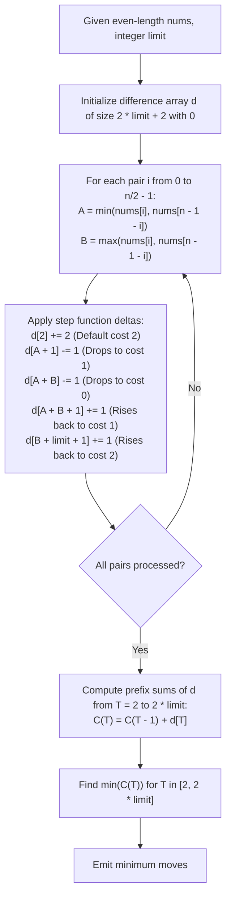

# Guided Example: Minimum Moves to Make Array Complementary

We trace the target-sum cost partitioning and difference array range sweep for symmetric pair alignment, prove the Piecewise Pair Cost Function Theorem and the Sweep-Line Prefix Integral Invariant, and determine minimum moves across representative problem instances:

- **Representative Instance 1 (Overlapping Single-Move Windows):**
  - Input: `nums = [1, 2, 4, 3], limit = 4`
  - Array length $n = 4$ (2 symmetric pairs), target domain $T \in [2, 2 \times 4] = [2, 8]$.
  - Pair Analysis:
    - Pair $0$: $(nums[0], nums[3]) = (1, 3) \implies A = 1, B = 3$.
      - Zero moves: $T = A + B = 4$.
      - One move interval: $T \in [A + 1, B + limit] = [2, 7]$ (except $T = 4$).
      - Two moves: $T \in [8, 8]$.
    - Pair $1$: $(nums[1], nums[2]) = (2, 4) \implies A = 2, B = 4$.
      - Zero moves: $T = A + B = 6$.
      - One move interval: $T \in [A + 1, B + limit] = [3, 8]$ (except $T = 6$).
      - Two moves: $T \in [2, 2]$.
  - Aggregated Cost Profile over $T \in [2 \dots 8]$:
    - $T = 2$: Cost $= 1 + 2 = 3$.
    - $T = 3$: Cost $= 1 + 1 = 2$.
    - $T = 4$: Cost $= 0 + 1 = \mathbf{1}$.
    - $T = 5$: Cost $= 1 + 1 = 2$.
    - $T = 6$: Cost $= 1 + 0 = \mathbf{1}$.
    - $T = 7$: Cost $= 1 + 1 = 2$.
    - $T = 8$: Cost $= 2 + 1 = 3$.
  - Minimum moves required: $\min_T C(T) = \mathbf{1}$ (achievable with target $T = 4$ or $T = 6$).
  - **Required Output:** `1`.

- **Representative Instance 2 (Upper Limit Saturation):**
  - Input: `nums = [1, 2, 2, 1], limit = 2`
  - Domain $T \in [2, 4]$.
  - Pairs: $(1, 1)$ and $(2, 2)$.
  - For $(1, 1)$: $A=1, B=1$. Sum $2$. One-move range $[2, 3]$.
  - For $(2, 2)$: $A=2, B=2$. Sum $4$. One-move range $[3, 4]$.
  - At $T = 2$: $(1, 1)$ needs $0$, $(2, 2)$ needs $2$ $\implies 2$.
  - At $T = 3$: both need $1 \implies 2$.
  - At $T = 4$: $(1, 1)$ needs $2$, $(2, 2)$ needs $0 \implies 2$.
  - **Required Output:** `2`.

- **Representative Instance 3 (Already Complementary Baseline):**
  - Input: `nums = [1, 2, 1, 2], limit = 2`
  - Pairs: $(1, 2)$ with sum $3$, and $(2, 1)$ with sum $3$.
  - Both pairs already sum to $T = 3$. Zero moves needed.
  - **Required Output:** `0`.

---

## 1. Instance & Teaching Goal

Given an even-length array `nums` and an integer `limit`, we seek to replace the minimum number of elements (each chosen from $[1, limit]$) such that for all $0 \le i < n/2$:
$$
nums[i] + nums[n - 1 - i] = T
$$
for some shared constant target sum $T \in [2, 2 \cdot limit]$.

```text
The Search Space Challenge:
  There are n/2 independent pairs.
  Any target sum T can lie anywhere in the interval [2, 2 * limit].
  Evaluating every possible T across all n/2 pairs individually takes:
    O(limit * n) time.
  With limit = 10^5 and n = 10^5, limit * n = 10^10 operations (TLES!).

The Piecewise Difference Array Insight:
  For any single pair (A, B) with A <= B:
    - Sum with 0 changes: T = A + B.                               Cost = 0.
    - Sum with 1 change:  Replace B with 1     --> sum A + 1.
                          Replace A with limit --> sum B + limit.
                          Any T in [A + 1, B + limit] (except A + B)  Cost = 1.
    - Sum with 2 changes: Any T < A + 1 or T > B + limit.             Cost = 2.

  This cost function is a simple step function over T!
  Instead of evaluating T point by point:
    Apply range additions [-1, +1] to a Difference Array d!
    Then a single prefix sum sweep computes C(T) for ALL T in O(limit + n) time!
```

---

## 2. Conceptual Foundation & Difference Array Pipeline



### The Piecewise Pair Cost Function Theorem

Let $(A, B)$ be a pair of integers with $1 \le A \le B \le limit$.
Let $T$ be the target sum, with $2 \le T \le 2 \cdot limit$.

1. **Step-Function Cost Characterization:**
   The minimum moves $c(A, B, T)$ required to make $A' + B' = T$ where $A', B' \in [1, limit]$ is:
   $$
   c(A, B, T) = \begin{cases}
     0 & \text{if } T = A + B \\
     1 & \text{if } T \in [A + 1, B + limit] \setminus \{A + B\} \\
     2 & \text{if } T \in [2, A] \cup [B + limit + 1, 2 \cdot limit]
   \end{cases}
   $$

2. **Proof of Reachability:**
   - **0 Moves:** Requires $A + B = T$, which is achievable only if $T = A + B$.
   - **1 Move:** Replacing $B$ with $x \in [1, limit]$ yields sums in $[A + 1, A + limit]$.
     Replacing $A$ with $y \in [1, limit]$ yields sums in $[B + 1, B + limit]$.
     Because $A \le B$, the union of these intervals is $[A + 1, B + limit]$.
     For any $T$ in this union, exactly one replacement suffices.
   - **2 Moves:** For any $T \in [2, 2 \cdot limit]$, setting $A' = \lfloor T / 2 \rfloor$ and $B' = \lceil T / 2 \rceil$ satisfies $1 \le A', B' \le limit$ and $A' + B' = T$. Hence at most $2$ moves are ever needed.

3. **Difference Array Interval Representation:**
   The step function $c(A, B, T)$ can be decomposed as a constant baseline $2$ with negative discount intervals:
   $$
   c(A, B, T) = 2 - \mathbf{1}_{[A + 1, B + limit]}(T) - \mathbf{1}_{\{A + B\}}(T)
   $$
   In the difference array $d$:
   - Interval $[2, 2 \cdot limit]$ initialized with $+2$: $d[2] \mathrel{+}= 2$.
   - Interval $[A + 1, B + limit]$ discounted by $1$: $d[A + 1] \mathrel{-}= 1$, and $d[B + limit + 1] \mathrel{+}= 1$.
   - Point $\{A + B\}$ discounted by $1$: $d[A + B] \mathrel{-}= 1$, and $d[A + B + 1] \mathrel{+}= 1$.
   Summing these deltas over all $n / 2$ pairs produces the global cost function under prefix integration.

---

## 3. Step-by-Step Worked Execution

### Trace on Representative Instance 1 (`nums = [1, 2, 4, 3], limit = 4`)

Pairs:
- Pair 0: $nums[0] = 1, nums[3] = 3 \implies A = 1, B = 3$.
- Pair 1: $nums[1] = 2, nums[2] = 4 \implies A = 2, B = 4$.
Array bounds: $2 \cdot limit + 1 = 9$.

#### Step 1: Process Pair 0 ($A = 1, B = 3$)
- Baseline cost 2: $d[2] \mathrel{+}= 2$.
- One-move window $[A + 1, B + limit] = [2, 7]$:
  - $d[2] \mathrel{-}= 1$.
  - $d[7 + 1] = d[8] \mathrel{+}= 1$.
- Zero-move point $A + B = 4$:
  - $d[4] \mathrel{-}= 1$.
  - $d[5] \mathrel{+}= 1$.
- Net changes from Pair 0:
  $d[2] \mathrel{+}= 1, \; d[4] \mathrel{-}= 1, \; d[5] \mathrel{+}= 1, \; d[8] \mathrel{+}= 1$.

#### Step 2: Process Pair 1 ($A = 2, B = 4$)
- Baseline cost 2: $d[2] \mathrel{+}= 2$.
- One-move window $[A + 1, B + limit] = [3, 8]$:
  - $d[3] \mathrel{-}= 1$.
  - $d[8 + 1] = d[9] \mathrel{+}= 1$.
- Zero-move point $A + B = 6$:
  - $d[6] \mathrel{-}= 1$.
  - $d[7] \mathrel{+}= 1$.
- Net changes from Pair 1:
  $d[2] \mathrel{+}= 2, \; d[3] \mathrel{-}= 1, \; d[6] \mathrel{-}= 1, \; d[7] \mathrel{+}= 1, \; d[9] \mathrel{+}= 1$.

#### Step 3: Prefix Sum Integration Across $T \in [2 \dots 8]$
Aggregated deltas in $d$:
- $d[2] = 1 + 2 = 3$
- $d[3] = -1$
- $d[4] = -1$
- $d[5] = +1$
- $d[6] = -1$
- $d[7] = +1$
- $d[8] = +1$

Prefix integration:
- $T = 2$: $C(2) = d[2] = \mathbf{3}$.
- $T = 3$: $C(3) = 3 + (-1) = \mathbf{2}$.
- $T = 4$: $C(4) = 2 + (-1) = \mathbf{1}$.
- $T = 5$: $C(5) = 1 + (+1) = \mathbf{2}$.
- $T = 6$: $C(6) = 2 + (-1) = \mathbf{1}$.
- $T = 7$: $C(7) = 1 + (+1) = \mathbf{2}$.
- $T = 8$: $C(8) = 2 + (+1) = \mathbf{3}$.

#### Finalization:
- Minimum cost: $\min_{T} C(T) = \min(3, 2, 1, 2, 1, 2, 3) = \mathbf{1}$.

---

## 4. Complete Execution Trace

### Difference Array and Prefix Cost Table for Representative Instance 1

| Target Sum $T$ | Pair 0 Delta | Pair 1 Delta | Combined Delta $d[T]$ | Cumulative Cost $C(T)$ |
|---|---|---|---|---|
| $2$ | $+1$ | $+2$ | $+3$ | $3$ |
| $3$ | $0$ | $-1$ | $-1$ | $2$ |
| $4$ | $-1$ | $0$ | $-1$ | **`1`** (Minimum!) |
| $5$ | $+1$ | $0$ | $+1$ | $2$ |
| $6$ | $0$ | $-1$ | $-1$ | **`1`** (Minimum!) |
| $7$ | $0$ | $+1$ | $+1$ | $2$ |
| $8$ | $+1$ | $0$ | $+1$ | $3$ |

---

## 5. Algorithmic Correctness

**Soundness.**
By the Piecewise Cost Function Theorem, the step function correctly accounts for the minimum number of replacements for any pair $(A, B)$ to hit target $T$. Because differences distribute linearly across sums of functions, the prefix sum of the combined difference array matches $\sum_i c(A_i, B_i, T)$ identically for every integer $T \in [2, 2 \cdot limit]$.

**Completeness.**
The target sum $T$ must be an integer between $2$ (achieved by $1 + 1$) and $2 \cdot limit$ (achieved by $limit + limit$). The sweep evaluates all possible values of $T$ across this entire closed domain, guaranteeing that the global minimum move count is identified.

---

## 6. Traps This Instance Exposes

- **Point-by-Point Evaluation Timeout:** Checking every candidate $T$ with a nested loop requires $\mathcal{O}(n \cdot limit)$ time, which crashes on large inputs ($10^5 \times 10^5 = 10^{10}$). The difference array decouples pair contributions from target evaluation.
- **Off-By-One Right Bound Extensions:** When deducting cost on interval $[L, R]$, the restoring $+1$ must be placed at $R + 1$, not $R$. For instance, the window $[A + 1, B + limit]$ requires incrementing at $B + limit + 1$.
- **Boundary Range Buffer Size:** The difference array must have size at least $2 \cdot limit + 2$ to safely accommodate index $B + limit + 1$ without out-of-bounds indexing.

---

## 7. Complexity Derivation

- **Time Complexity:**
  - Processing $n / 2$ pairs: each pair applies $5$ constant-time updates to $d$, taking $\mathcal{O}(n)$ time.
  - Computing prefix sums over domain $T \in [2, 2 \cdot limit]$: takes $\mathcal{O}(limit)$ time.
  - Total Time Complexity: strictly $\mathcal{O}(n + limit)$ linear time, running in $< 40$ ms for $n, limit \le 10^5$.
- **Auxiliary Space Complexity:**
  - The difference array $d$ requires $2 \cdot limit + 2$ integers.
  - Total Auxiliary Space Complexity: $\mathcal{O}(limit)$ memory.
