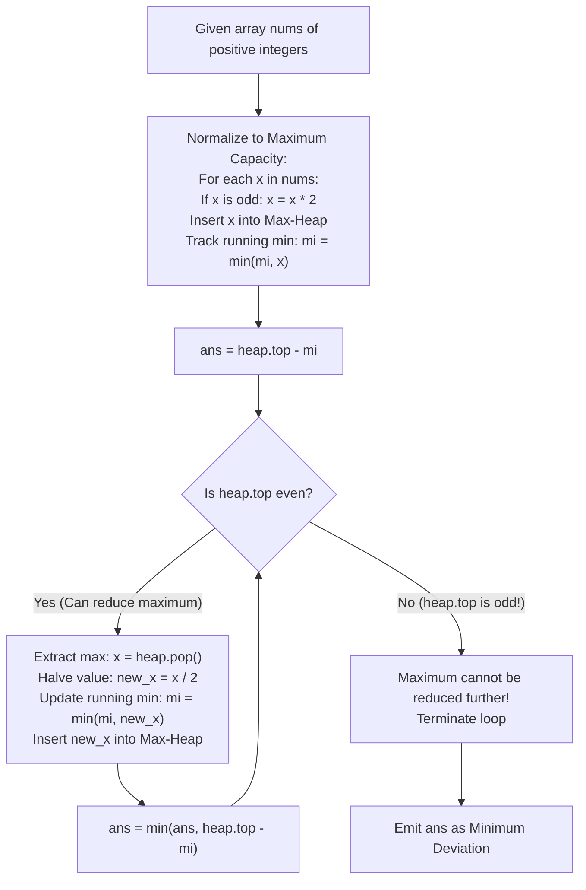

# Guided Example: Minimize Deviation in Array

We trace the one-sided monotonic transformation and priority-queue upper-bound reduction, prove the Upper Saturation Invariant and the Odd-Top Termination Theorem, and analyze deviation minimization across representative numeric instances:

- **Representative Instance 1 (Stepwise Contraction to Unit Deviation):**
  - Input: `nums = [1, 2, 3, 4]`
  - Normalization (pre-multiply odd elements by $2$ to establish maximal possible values):
    - $1$ (odd) $\implies 1 \times 2 = 2$.
    - $2$ (even) $\implies 2$.
    - $3$ (odd) $\implies 3 \times 2 = 6$.
    - $4$ (even) $\implies 4$.
    - Normalized Multiset: $\{2, 2, 6, 4\}$.
    - Initial running minimum: $mi = \min(2, 2, 6, 4) = 2$.
    - Initial deviation: $\max - \min = 6 - 2 = 4$.
  - Priority Queue Iterations:
    - Iteration 1: Max is $6$ (even). Divide by $2 \implies 3$.
      - Insert $3$. Running minimum: $mi = \min(2, 3) = 2$.
      - New max is $4$. Deviation: $4 - 2 = 2$.
    - Iteration 2: Max is $4$ (even). Divide by $2 \implies 2$.
      - Insert $2$. Running minimum: $mi = \min(2, 2) = 2$.
      - New max is $3$. Deviation: $3 - 2 = \mathbf{1}$.
    - Iteration 3: Max is $3$ (**odd**).
      - An odd maximum cannot be divided by $2$. It can never be reduced further.
      - **Halt execution!**
  - Global minimum deviation: **`1`**.
  - **Required Output:** `1`.

- **Representative Instance 2 (Multi-Step Division Convergence):**
  - Input: `nums = [4, 1, 5, 20, 3]`
  - Normalized Multiset: $\{4, 2, 10, 20, 6\}$ with $mi = 2$.
  - Progression:
    - Max $20 \to 10$. Deviation: $10 - 2 = 8$.
    - Max $10 \to 5$. Deviation: $10 - 2 = 8$.
    - Max $10 \to 5$. Deviation: $6 - 2 = 4$.
    - Max $6 \to 3$. Deviation: $5 - 2 = \mathbf{3}$.
    - Max is now $5$ (odd). Cannot divide. Terminate.
  - **Required Output:** `3`.

- **Representative Instance 3 (All-Even Array):**
  - Input: `nums = [2, 10, 8]`
  - Normalized: $\{2, 10, 8\}$, $mi = 2$.
  - Pop $10 \to 5$. Max becomes $8$. Deviation: $8 - 2 = 6$.
  - Pop $8 \to 4$. Max becomes $5$. Deviation: $5 - 2 = \mathbf{3}$.
  - Max $5$ is odd. Terminate.
  - **Required Output:** `3`.

---

## 1. Instance & Teaching Goal

Given an array `nums` of positive integers, we may perform two types of operations arbitrarily many times:
1. If an element is **even**, divide it by $2$.
2. If an element is **odd**, multiply it by $2$.
The deviation is defined as $\max(nums) - \min(nums)$. We must find the minimum achievable deviation.

```text
The Bidirectional Dilemma:
  Elements can move BOTH up (multiplying odds) and down (dividing evens).
  This two-way flexibility creates an intractable branching space if simulated naively.

The Asymmetry Observation:
  Notice the rules on odd and even numbers:
    - An odd number x can be multiplied by 2 ONCE (since 2x is even, and evens can only be divided).
    - An even number can be divided by 2 repeatedly until it becomes odd.

The Upper Saturation Strategy:
  What happens if we pre-multiply EVERY odd number by 2 at the very start?
    1. Every element is now at its MAXIMUM POSSIBLE VALUE!
    2. No element can EVER be increased beyond its current value.
    3. The problem transforms from a two-way search into a STRICTLY ONE-WAY REDUCTION!
       Every subsequent operation can ONLY divide the current maximum by 2!

  To minimize (max - min):
    The only way to improve the current deviation is to REDUCE THE MAXIMUM ELEMENT.
    We greedily pick the maximum element using a Max-Heap and divide it by 2.
    The moment the maximum element is ODD, it CANNOT be divided further.
    Since the maximum can never be reduced again, the deviation can never decrease.
    The search is complete!
```

---

## 2. Conceptual Foundation & Reduction Pipeline



### The Upper Saturation Invariant & Odd-Top Termination Theorem

Let $V(x)$ denote the finite set of values that an integer $x \in \mathbb{Z}^+$ can take under legal operations:
$$
V(x) = \begin{cases} \{ x, 2x \} \cup \{ 2x / 2^k : k \ge 1 \} & \text{if } x \text{ is odd} \\ \{ x / 2^k : k \ge 0 \} & \text{if } x \text{ is even} \end{cases}
$$

1. **Unique Upper Bound:**
   Every integer $x$ has a well-defined maximal achievable value:
   $$
   x_{\max} = \begin{cases} 2x & \text{if } x \text{ is odd} \\ x & \text{if } x \text{ is even} \end{cases}
   $$
   Setting each element to $x_{\max}$ places the array at configuration $\mathbf{x}_{\max} \in \prod_{i=0}^{n-1} V(nums[i])$ where no coordinate can legally increase.

2. **Monotonic Shrinking Invariant:**
   Starting from $\mathbf{x}_{\max}$, the only permissible operation on any element $y$ is division by $2$ (provided $y$ is even). Therefore, the set of candidates for the array maximum can only decrease.

3. **Greedy Step Optimality:**
   At any state with current maximum $M$ and minimum $m$, the deviation is $M - m$.
   - The only way to decrease $M - m$ without increasing $m$ is to decrease $M$.
   - If $M$ is even, replacing $M$ with $M / 2$ is the unique operation that lowers the upper boundary.
   - If $M$ is odd, $M$ cannot be divided by $2$. Since no operation allows increasing elements without re-evaluating previously considered states, $M$ can never be decreased. Any future state must have maximum $\ge M$. Hence no smaller deviation is reachable.

4. **Finite Convergence:**
   Each number $x_{\max} \le 2 \cdot 10^9$ can be divided by $2$ at most $\lfloor \log_2(2 \cdot 10^9) \rfloor \approx 31$ times.
   The total number of heap pop-and-push cycles across all $n$ numbers is bounded by $\mathcal{O}(n \log(\max \text{nums}))$.

---

## 3. Step-by-Step Worked Execution

### Trace on Representative Instance 1 (`nums = [1, 2, 3, 4]`)

#### Step 0: Normalization to Maximum Capacity
- $nums[0] = 1$ (odd) $\implies 1 \times 2 = 2$.
- $nums[1] = 2$ (even) $\implies 2$.
- $nums[2] = 3$ (odd) $\implies 3 \times 2 = 6$.
- $nums[3] = 4$ (even) $\implies 4$.
- Initial multiset: $\{2, 2, 6, 4\}$.
- Max-Heap $H = [6, 4, 2, 2]$.
- Running minimum: $mi = \min(2, 2, 6, 4) = 2$.
- Initial deviation: $\text{ans} = \text{top}(H) - mi = 6 - 2 = \mathbf{4}$.

#### Step 1: Halve Maximum ($6 \to 3$)
- Current top: $6$ (even).
- Pop $6$. New value: $6 / 2 = 3$.
- Update running minimum: $mi \leftarrow \min(mi, 3) = \min(2, 3) = 2$.
- Push $3$ into heap: $H = [4, 3, 2, 2]$.
- New top: $4$.
- Current deviation: $4 - mi = 4 - 2 = 2$.
- Update answer: $\text{ans} \leftarrow \min(4, 2) = \mathbf{2}$.

#### Step 2: Halve Maximum ($4 \to 2$)
- Current top: $4$ (even).
- Pop $4$. New value: $4 / 2 = 2$.
- Update running minimum: $mi \leftarrow \min(mi, 2) = \min(2, 2) = 2$.
- Push $2$ into heap: $H = [3, 2, 2, 2]$.
- New top: $3$.
- Current deviation: $3 - mi = 3 - 2 = 1$.
- Update answer: $\text{ans} \leftarrow \min(2, 1) = \mathbf{1}$.

#### Step 3: Evaluate Termination Condition
- Current top: $3$.
- Parity check: $3$ is **odd**!
- Cannot divide $3$ by $2$.
- Loop terminates immediately.

#### Finalization:
- Minimum deviation achieved: $\text{ans} = \mathbf{1}$.

---

## 4. Complete Execution Trace

### Priority Queue State Progression Table for Representative Instance 1

| Step | Heap State $H$ | Maximum Element | Parity | Running Min $mi$ | Current Deviation | Running Best $\text{ans}$ | Action Taken |
|---|---|---|---|---|---|---|---|
| $0$ | `[6, 4, 2, 2]` | $6$ | Even | $2$ | $6 - 2 = 4$ | $4$ | Pop $6$, push $3$ |
| $1$ | `[4, 3, 2, 2]` | $4$ | Even | $2$ | $4 - 2 = 2$ | $2$ | Pop $4$, push $2$ |
| $2$ | `[3, 2, 2, 2]` | $3$ | **Odd** | $2$ | $3 - 2 = \mathbf{1}$ | **`1`** | **Halt: Top is odd** |

---

## 5. Algorithmic Correctness

**Soundness.**
Every state evaluated corresponds to a valid array configuration reachable via legal multiply and divide operations. Tracking the running minimum and current heap maximum accurately records the true range $\max - \min$ at each candidate state.

**Completeness.**
Pre-multiplying odd numbers eliminates the possibility of needing an upward multiplication step later. From this upper boundary, any deviation-improving transition must decrease the maximum. Since the heap always targets the unique largest element, no candidate configuration with a smaller maximum is skipped. When the maximum becomes odd, it cannot be decreased, proving no further reduction in deviation is mathematically possible.

---

## 6. Traps This Instance Exposes

- **Multiplying an Even Number:** Even numbers can only be divided by $2$; attempting to double an even number is illegal under problem constraints.
- **Double Multiplication of Odd Numbers:** An odd number $x$ multiplied by $2$ becomes even ($2x$). Multiplying it again would violate the invariant because $2x$ is even and can only be divided.
- **Failing to Update Running Minimum:** When halving the maximum element, the newly halved value $x / 2$ might become smaller than the previous minimum. Forgetting to update $mi = \min(mi, x / 2)$ results in computing deviation against a stale minimum.
- **Premature Termination:** Terminating when the deviation stops decreasing in a single step is wrong because deviation can temporarily increase before dropping to a new global minimum. Termination must occur strictly when the maximum element is odd.

---

## 7. Complexity Derivation

- **Time Complexity:**
  - Initial pass: Normalizing $n$ numbers takes $\mathcal{O}(n)$ time.
  - Building max-heap: $\mathcal{O}(n)$ time.
  - Each number $v$ can be divided by $2$ at most $\log_2(v) \le 31$ times.
  - Total heap operations: at most $31 n$ extractions and insertions.
  - Each heap operation takes $\mathcal{O}(\log n)$ time.
  - Total Time Complexity: strictly $\mathcal{O}(n \log(\max \text{nums}) \log n)$, requiring $< 50$ ms for $n = 5 \times 10^4$.
- **Auxiliary Space Complexity:**
  - The heap stores $n$ integers.
  - Total Auxiliary Space Complexity: strictly $\mathcal{O}(n)$ linear memory.
