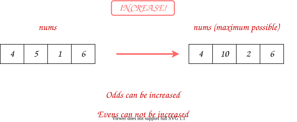
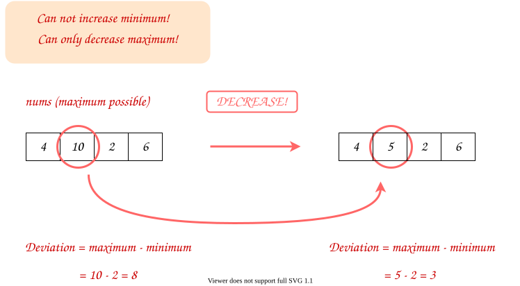
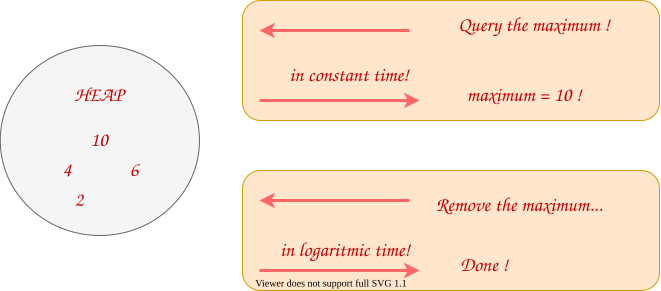
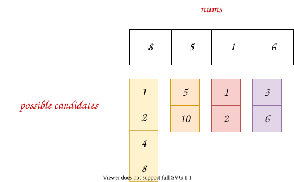
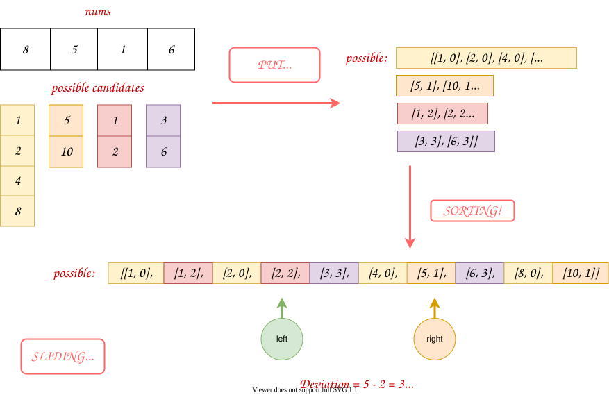
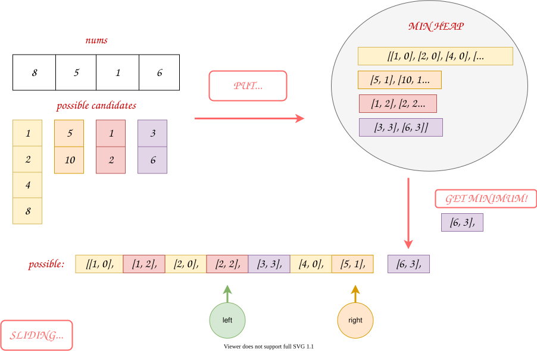
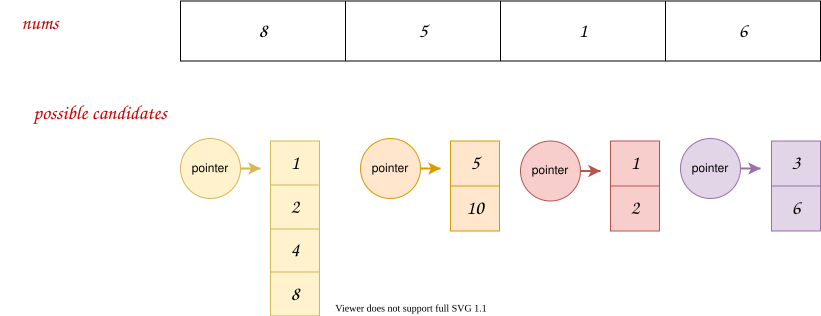
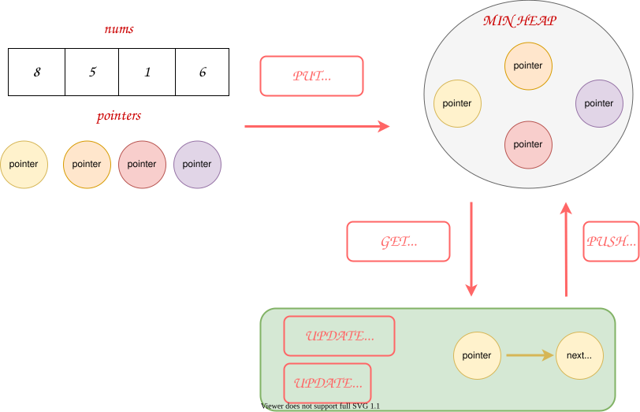
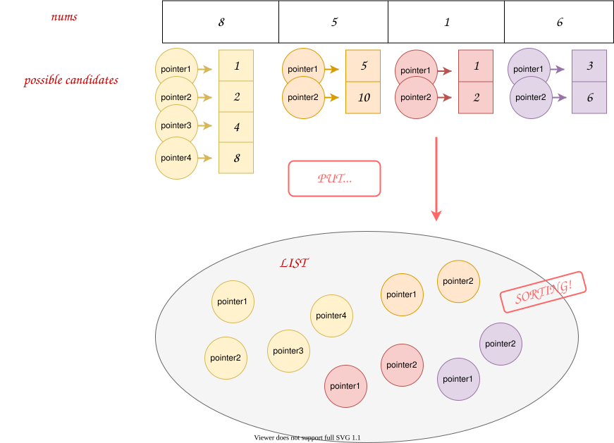

## Solution

---

#### Overview

The problem can be solved in many ways. With heap, we can directly solve it by simulation (and a little greedy idea). Also, with some pretreatments, we can transform it into [Smallest Range Covering Elements from K Lists](https://leetcode.com/problems/smallest-range-covering-elements-from-k-lists/).

Below, we will discuss five approaches: *Simulation + Heap*, *Pretreatment + Sorting + Sliding Window*, *Pretreatment + Heap + Sliding Window*, *Pretreatment + Heap + Pointers*, and *Pretreatment + Sorting + Pointers*.

Generally, we recommend the first approach since it is easy to implement and has good performance. We provide other approaches to explore possibilities and leave them for interested readers. In fact, there are many different approaches to tackle this problem, and the given five approaches are not enough to cover them all.

---

#### Approach 1: Simulation + Heap

**Intuition**

The problem gives two operations:

1. If the element is even, we can divide it by 2.
2. If the element is odd, we can multiply it by 2.

Consequently, we have two insights:

1. If the element is even, we can **not** increase it.
2. If the element is odd, we can **not** decrease it.

We can try to increase all numbers to their maximum and reduce them step by step.



According to the problem description:

$\text{deviation} = \text{maximum} - \text{minimum}$

Hence, there are only two ways to decrease $\text{deviation}$: decrease $\text{maximum}$, or increase $\text{minimum}$.

If we have increased all numbers to their maximum, then we can **not** increase $\text{minimum}$. If we want smaller $\text{deviation}$, we can only decrease $\text{maximum}$.



If the maximum is odd, then we can not decrease $\text{maximum}$ neither. In this case, we just return the recorded minimum deviation, since we can not decrease it anymore.

However, there is a remaining problem: we need to find the maximum and minimum after each modification. We do not want to iterate the whole list, since it is slow. Luckily, there is a data structure called [heap](https://en.wikipedia.org/wiki/Heap_(data_structure)) that maintains the maximum value in **logarithmic** time and returns the maximum value in **constant** time.

For the minimum, we just need to update it for each decrease of maximum.



> It's also OK to decrease all numbers to their **minimum** and then increase them step by step. Again, there are many possibilities.

**Algorithm**

*Step 1:* Initialize a max-heap `evens`.

   - For an even number in `nums`, put it directly into `evens`; for the odd number in `nums`, multiply by 2 and put it into `evens`.

*Step 2:* Maintain an integer `minimum` to keep tracking the smallest element in `evens`.

*Step 3:* Take out the maximum number in `evens`. Use the maximum and the maintained `minimum` to update the minimum deviation. If the maximum number is even, divide by 2 and push into `evens`.

*Step 4:* Repeat *Step 3* until the maximum number in `evens` is odd.

*Step 5:* Return the minimum deviation.

> Challenge: Can you implement the code yourself without seeing our implementations?

**Implementation**

```python
class Solution:
    def minimumDeviation(self, nums: List[int]) -> int:
        # since heapq is a min-heap
        # we use negative of the numbers to mimic a max-heap
        evens = []
        minimum = inf
        for num in nums:
            if num % 2 == 0:
                evens.append(-num)
                minimum = min(minimum, num)
            else:
                evens.append(-num*2)
                minimum = min(minimum, num*2)
        heapq.heapify(evens)
        min_deviation = inf
        while evens:
            current_value = -heapq.heappop(evens)
            min_deviation = min(min_deviation, current_value-minimum)
            if current_value % 2 == 0:
                minimum = min(minimum, current_value//2)
                heapq.heappush(evens, -current_value//2)
            else:
                # if the maximum is odd, break and return
                break
        return min_deviation
```

> Note: in the C++ and Java code, we push `num` into `evens` one by one. You can push them into a list and then change the list into a heap. That would yield faster performance but requires more codes. Our implementation is enough to pass the test.

**Complexity Analysis**

Let $N$ be the length of `nums`, and $M$ be the largest number in `nums`. In the worst case when $M$ is the power of $2$, there are $\log(M)$ possible values for $M$. Therefore, in the worst case, the total possible candidate number (denoted by $K$) is $K = N \cdot \log(M) = N\log(M)$.

* Time Complexity: $\mathcal{O}(K\log(N)) = \mathcal{O}(N\log(M)\log(N))$. In worst case, we need to push every candidate number into `evens`, and the size of `evens` is $\mathcal{O}(N)$. Hence, the total time complexity is $\mathcal{O}(K \cdot \log(N)) = \mathcal{O}(N\log(M)\log(N))$.

* Space Complexity: $\mathcal{O}(N)$, since there are at most $N$ elements in `evens`.

---

#### Approach 2: Pretreatment + Sorting + Sliding Window

**Intuition**

In *Approach 1*, we maintain a list and keep changing the elements of the list. Can we pre-calculate all the changeable candidates?

Yes, with a little pretreatment. For each even number, we divide it by $2$ until it becomes an odd number; for each odd number, we add itself and the twice of itself.



In this case, we transform it into a similar problem: select one number from each candidate list such that the deviation is minimum.

That is exactly [Smallest Range Covering Elements from K Lists](https://leetcode.com/problems/smallest-range-covering-elements-from-k-lists/). We highly recommend finishing it before continuing reading if you have not solved it.

From *Approach 2* to *Approach 5*, we will apply this pretreatment and use different methods to handle the following.

In this approach, we put all candidates into a single list and then sort the list. Suddenly, it becomes a sliding window problem.



All we need to do is find out the minimum interval such that the interval contains all index's candidates (i.e., contains all colors in the Figure above).

Of course, the length of the interval should be calculated by the difference between the ending value and the starting value.

> Also, we can sort the list from large to small alternatively. That is similar.

**Algorithm**

*Step 1:* Initialize a list `possible`.
  - Iterate `nums`. For each $\text{nums}[i]$, push all possible `[candidate, i]` pairs into the `possible` list.

*Step 2:* Sort `possible`.

*Step 3:* Initialize a vector `needInclude`, where $\text{needInclude}[i]$ marks if the sliding window includes `i`'s candidates or not (and how many it includes). Initialize an integer `notIncluded` representing the total number of index whose all candidates are not in the sliding window.

*Step 4:* Move the right pointer of the sliding window to one unit right.
  - If `notIncluded` shows that the sliding window includes every index's candidates (i.e., $notIncluded = 0$), move the left pointer to right until the sliding window does not include them. Update the minimum deviation during this period.

*Step 5:* Repeat *Step 4* until the right pointer reaches the end of `possible`.

*Step 6:* Return the minimum deviation.

> Challenge: Can you implement the code yourself without seeing our implementations?

**Implementation**

```python
class Solution:
    def minimumDeviation(self, nums: List[int]) -> int:
        n = len(nums)
        # pretreatment
        possible = []
        for i, num in enumerate(nums):
            if num % 2 == 0:
                temp = num
                possible.append((temp, i))
                while temp % 2 == 0:
                    temp //= 2
                    possible.append((temp, i))
            else:
                possible.append((num, i))
                possible.append((num*2, i))
        possible.sort()
        # start sliding window
        min_deviation = inf
        need_include = {i: 1 for i in range(n)}
        not_included = n
        current_start = 0

        for current_value, current_item in possible:
            need_include[current_item] -= 1
            if need_include[current_item] == 0:
                not_included -= 1
            if not_included == 0:
                while need_include[possible[current_start][1]] < 0:
                    need_include[possible[current_start][1]] += 1
                    current_start += 1
                if min_deviation > current_value - possible[current_start][0]:
                    min_deviation = current_value - possible[current_start][0]

                need_include[possible[current_start][1]] += 1
                current_start += 1
                not_included += 1

        return min_deviation
```

**Complexity Analysis**

Let $N$ be the length of `nums`, and $M$ be the largest number in `nums`. In the worst case when $M$ is the power of $2$, there are $\log(M)$ candidates for $M$. Therefore, in the worst case, the total candidate number (denoted by $K$) is $K = N \cdot \log(M) = N\log(M)$.

* Time Complexity: $\mathcal{O}(K\log(K)) = \mathcal{O}(N\log(M)\log(N\log(M)))$. In the worst case, `possible` has $K$ elements, and we need to sort it, which costs $\mathcal{O}(K\log(K))$. For the sliding window, we need $\mathcal{O}(K)$ time, since the left pointer and the right pointer visit every element in `possible` once.

* Space Complexity: $\mathcal{O}(K) = \mathcal{O}(N\log(M))$, since in the worst case, `possible` has $K$ elements.

---

#### Approach 3: Pretreatment + Heap + Sliding Window

**Intuition**

If you do not love sorting all candidates immediately, we can put all of them in a min-heap, and produce the next element on the fly when the right pointer moves to the right.



Note that this would not save you time complexity, just show the possibilities of solving this problem.

> Also, we can put all candidates in a max-heap instead of a min-heap. That is similar.

**Algorithm**

*Step 1:* Initialize a list `possible`.

  - Iterate `nums`. For $\text{nums}[i]$, push all possible `[candidate, i]` pairs into the `possible` list.

*Step 2:* Initialize a min-heap from `possible`.

*Step 3:* Initialize a vector `needInclude`, where $\text{needInclude}[i]$ marks if the sliding window includes `i`'s candidates or not (and how many it includes). Initialize an integer `notIncluded` representing the total number of index whose all candidates are not in the sliding window.

*Step 4:* Move the right pointer of the sliding window to one unit right. When the right pointer needs to go right, pop the minimum from the heap as the next element.
  - If `notIncluded` shows that the sliding window includes every index's candidates (i.e., $notIncluded = 0$), move the left pointer to right until the sliding window does not include them. Update the minimum deviation during this period.

*Step 5:* Repeat *Step 4* until the right pointer reaches the end of `possible`.

*Step 6:* Return the minimum deviation.

> Challenge: Can you implement the code yourself without seeing our implementations?

**Implementation**

```python
class Solution:
    def minimumDeviation(self, nums: List[int]) -> int:
        n = len(nums)
        # pretreatment
        possible = []
        for i, num in enumerate(nums):
            if num % 2 == 0:
                temp = num
                possible.append((temp, i))
                while temp % 2 == 0:
                    temp //= 2
                    possible.append((temp, i))
            else:
                possible.append((num, i))
                possible.append((num*2, i))

        heapq.heapify(possible)
        min_deviation = inf
        need_include = {i: 1 for i in range(n)}
        not_included = n
        current_start = 0
        seen = []
        # get minimum from heap
        while possible:
            current_value, current_item = heapq.heappop(possible)
            seen.append([current_value, current_item])
            need_include[current_item] -= 1
            if need_include[current_item] == 0:
                not_included -= 1
            if not_included == 0:
                while need_include[seen[current_start][1]] < 0:
                    need_include[seen[current_start][1]] += 1
                    current_start += 1
                if min_deviation > current_value - seen[current_start][0]:
                    min_deviation = current_value - seen[current_start][0]

                need_include[seen[current_start][1]] += 1
                current_start += 1
                not_included += 1

        return min_deviation
```

> Note: The C++ version is likely to yield *Time Limit Exceeded*. This might be because the time limit of C++ is tighter.

**Complexity Analysis**

Let $N$ be the length of `nums`, and $M$ be the largest number in `nums`. In the worst case when $M$ is the power of $2$, there are $\log(M)$ candidates for $M$. Therefore, in the worst case, the total candidate number (denoted by $K$) is $K = N \cdot \log(M) = N\log(M)$.

* Time Complexity: $\mathcal{O}(K\log(K)) = \mathcal{O}(N\log(M)\log(N\log(M)))$. In the worst case, `possible` has $K$ elements, and we need to pop every elements from it, which costs $\mathcal{O}(K\log(K))$. For the sliding window, we need $\mathcal{O}(K)$ time, since the left pointer and the right pointer visit every element in `possible` once.

* Space Complexity: $\mathcal{O}(K) = \mathcal{O}(N\log(M))$, since in the worst case, `possible` has $K$ elements.

---

#### Approach 4: Pretreatment + Heap + Pointers

**Intuition**

Still, with some pretreatments, we transform it into [Smallest Range Covering Elements from K Lists](https://leetcode.com/problems/smallest-range-covering-elements-from-k-lists/).

This time, we borrow some ideas from [Merge k Sorted Lists](https://leetcode.com/problems/merge-k-sorted-lists/) and *Approach 1*.

For each index, we initialize a pointer and point it to the top element (i.e., the minimum element).



According to some ideas in *Approach 1*,

>$\text{deviation} = \text{maximum} - \text{minimum}$
>
>There are only two ways to decrease $\text{deviation}$: decrease $\text{maximum}$, or increase $\text{minimum}$.

If we point all the pointers to the minimum element in the candidate list, that is similar to change all the numbers in `num` to the minimum candidate. In this case, we can **not** decrease $\text{maximum}$. We can only increase $\text{minimum}$.



Therefore, we can keep getting the minimum pointer from the heap, update the deviation, move the pointer point to the next element, and then push back the pointer to the heap.

> Of course, you can use a max heap instead of a min-heap. That requires some corresponding changes in the code.

> Essentially, this solution is similar to *Approach 1* except we pre-calculate all the candidates.

**Algorithm**

*Step 1:* Initialize a list `possibleList`.
  - $\text{possibleList}[i]$ contains a list of all possible candidates of $\text{nums}[i]$.

*Step 2:* Initialize a heap `pointers` containing starting pointers. Each starting pointer should point to the start of each candidate list.

*Step 3:* From `pointers` take out the minimum number. Update the minimum deviation. Push the next number of that pointer into `pointers`.

*Step 4:* Repeat *Step 3* until one of the pointers reaches the end.

*Step 5:* Return the minimum deviation.

> Challenge: Can you implement the code yourself without seeing our implementations?

**Implementation**

```python
class Solution:
    def minimumDeviation(self, nums: List[int]) -> int:
        # pretreatment
        possible_list = []
        for num in nums:
            candidates = []
            if num % 2 == 0:
                temp = num
                candidates.append(temp)
                while temp % 2 == 0:
                    temp //= 2
                    candidates.append(temp)
            else:
                candidates.append(2*num)
                candidates.append(num)
            # reverse candidates to sort from small to large
            possible_list.append(candidates[::-1])

        pointers = [(candidates[0], i, 0)
                    for i, candidates in enumerate(possible_list)]

        heapq.heapify(pointers)
        min_deviation = inf
        current_end = max(candidates[0] for candidates in possible_list)
        # get minimum from heap
        while pointers:
            current_start, index, index_in_candidates = heapq.heappop(pointers)
            if current_end - current_start < min_deviation:
                min_deviation = current_end - current_start
            # if the pointer reach last
            if index_in_candidates + 1 == len(possible_list[index]):
                return min_deviation
            next_value = possible_list[index][index_in_candidates+1]
            current_end = max(current_end, next_value)
            heapq.heappush(pointers, (next_value, index, index_in_candidates+1))
```

> Note: The C++ version is likely to yield *Time Limit Exceeded*. This might be because the time limit of C++ is tighter.

**Complexity Analysis**

Let $N$ be the length of `nums`, and $M$ be the largest number in `nums`. In the worst case when $M$ is the power of $2$, there are $\log(M)$ candidates for $M$. Therefore, in the worst case, the total candidate number (denoted by $K$) is $K = N \cdot \log(M) = N\log(M)$.

* Time Complexity: $\mathcal{O}(K\log(N)) = \mathcal{O}(N\log(M)\log(N))$. In the worst case, `possibleList` has $K$ candidates, and we need to push every candidates into `pointers`, which cost $\mathcal{O}(K\log(N))$.

* Space Complexity: $\mathcal{O}(N)$, since `pointers` always has $N$ elements.

---

#### Approach 5: Pretreatment + Sorting + Pointers

**Intuition**

Similar to *Approach 4*, if you do not like using the heap, we can pre-sort the pointers in the order we need, and get the next pointer one by one.



**Algorithm**

*Step 1:* Initialize a list `possibleList`.

  - $\text{possibleList}[i]$ contains a list of all possible candidates of $\text{nums}[i]$.

*Step 2:* Initialize a list `pointers` containing all pointers. Each pointer should point to one different candidate in `possibleList`.

*Step 3:* Sort `pointers`.

*Step 4:* From `pointers` take out the minimum number. Update the minimum deviation. Get the next pointer in the same candidate list.

*Step 5:* Repeat *Step 4* until one of the candidate lists reaches the end.

*Step 6:* Return the minimum deviation.

> Challenge: Can you implement the code yourself without seeing our implementations?

**Implementation**

```python
class Solution:
    def minimumDeviation(self, nums: List[int]) -> int:
        # pretreatment
        possible_list = []
        for num in nums:
            candidates = []
            if num % 2 == 0:
                temp = num
                candidates.append(temp)
                while temp % 2 == 0:
                    temp //= 2
                    candidates.append(temp)
            else:
                candidates.append(2*num)
                candidates.append(num)
            # reverse candidates to sort from small to large
            possible_list.append(candidates[::-1])

        pointers = [(candidate, index, index_in_candidates) for index,
                    candidates in enumerate(possible_list)
                    for index_in_candidates, candidate in enumerate(candidates)]
        pointers.sort()
        min_deviation = inf
        current_end = max(candidates[0] for candidates in possible_list)

        for current_start, index, index_in_candidates in pointers:
            if current_end - current_start < min_deviation:
                min_deviation = current_end - current_start
            # if the pointer reach last
            if index_in_candidates + 1 == len(possible_list[index]):
                return min_deviation
            next_value = possible_list[index][index_in_candidates+1]
            current_end = max(current_end, next_value)
```

> Note: The C++ version is likely to yield *Time Limit Exceeded*. This might be because the time limit of C++ is tighter.

**Complexity Analysis**

Let $N$ be the length of `nums`, and $M$ be the largest number in `nums`. In the worst case when $M$ is the power of $2$, there are $\log(M)$ candidates for $M$. Therefore, in the worst case, the total candidate number (denoted by $K$) is $K = N \cdot \log(M) = N\log(M)$.

* Time Complexity: $\mathcal{O}(K\log(K)) = \mathcal{O}(N\log(M)\log(N\log(M)))$. In the worst case, `possibleList` has $K$ candidates, and we need to sort $K$ pointers, which cost $\mathcal{O}(K\log(K))$.

* Space Complexity: $\mathcal{O}(K)$, since `pointers` has $K$ elements in the worst case.