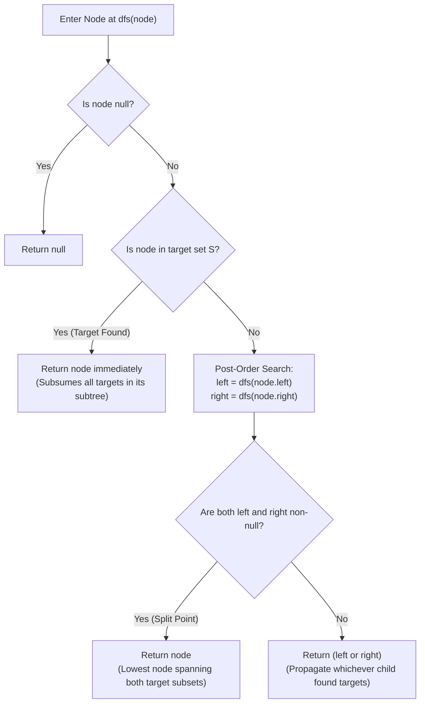

# Guided Example: Lowest Common Ancestor of a Binary Tree IV

We trace the post-order subtree propagation and multi-target convergence for lowest common ancestor resolution across arbitrary node subsets, prove the Target-Set Subtree Reduction Theorem and the Post-Order Split Invariant, and analyze recursive resolutions across representative tree instances:

- **Representative Instance 1 (Sibling Branch Common Ancestor):**
  - Input: `root = [3, 5, 1, 6, 2, 0, 8, null, null, 7, 4], nodes = [4, 7]`
  - Target set: $\mathcal{S} = \{4, 7\}$.
  - Traversal Progression:
    - Node $7$ is reached in the left child branch of Node $2 \implies$ returns Node $7$.
    - Node $4$ is reached in the right child branch of Node $2 \implies$ returns Node $4$.
    - At Node $2$: left child returns $7 \neq \text{null}$, right child returns $4 \neq \text{null}$.
    - Both subtrees contain target nodes $\implies$ Node $2$ is their lowest common ancestor! Returns Node $2$.
    - Subtree of Node $5$: left child ($6$) returns $\text{null}$, right child ($2$) returns Node $2 \implies$ returns Node $2$.
    - Root Node $3$: left returns Node $2$, right (subtree $1$) returns $\text{null} \implies$ returns Node $2$.
  - **Required Output:** `2`.

- **Representative Instance 2 (Singleton Target Self-Ancestry):**
  - Input: `root = [3, 5, 1, 6, 2, 0, 8, null, null, 7, 4], nodes = [1]`
  - Target set: $\mathcal{S} = \{1\}$.
  - Traversal hits Node $1$. Because Node $1 \in \mathcal{S}$, it returns itself immediately.
  - The lowest common ancestor of any single node is the node itself.
  - **Required Output:** `1`.

- **Representative Instance 3 (Hierarchical Multi-Node Cluster):**
  - Input: `root = [3, 5, 1, 6, 2, 0, 8, null, null, 7, 4], nodes = [7, 6, 2, 4]`
  - Target set: $\mathcal{S} = \{7, 6, 2, 4\}$.
  - Node $6 \in \mathcal{S} \implies$ left child of Node $5$ returns Node $6$.
  - Node $2 \in \mathcal{S} \implies$ right child of Node $5$ returns Node $2$ immediately (pruning descendants $7, 4$).
  - At Node $5$: left returns Node $6$, right returns Node $2$.
  - Both branches return non-null $\implies$ returns Node $5$.
  - **Required Output:** `5`.

---

## 1. Instance & Teaching Goal

In a binary tree where all node values are unique and every query node is guaranteed to exist, find the Lowest Common Ancestor (LCA) of an arbitrary non-empty subset of target nodes $\mathcal{S} \subseteq V$. The LCA is defined as the deepest node $u$ such that every target node $v \in \mathcal{S}$ is contained in the subtree rooted at $u$ (where a node can be an ancestor of itself).

```text
The Generalization from Pairwise LCA to Set LCA:
  In standard LCA (LeetCode 236), we find the LCA of exactly two nodes p and q.
  Here, we are given K target nodes: nodes = [p_1, p_2, ..., p_k].

  Does set-LCA require repeated pairwise queries (K - 1 calls to LCA)?
    Repeated pairwise LCA: (K - 1) * O(N) = O(K * N) time.
    For K = 10^4 and N = 10^4, this would take 10^8 operations!

  The Unified Post-Order Propagation Theorem:
    Notice that the EXACT SAME recursive post-order DFS used for two nodes
    works identically for ANY NUMBER OF NODES in a SINGLE O(N) PASS!

  Why?
    1. If the current node u is in the target set S:
       We return u immediately!
       Any other targets residing in u's subtree are ALREADY descendants of u!
       The common ancestor of u and its descendants CANNOT be deeper than u.
    2. If target nodes are split across u's left and right subtrees:
       u is the lowest node that contains both subsets, so u is their LCA!
```

---

## 2. Conceptual Foundation & Subtree Propagation Pipeline



### The Target-Set Subtree Reduction Theorem

Let $T = (V, E)$ be a binary tree rooted at $R$, with target set $\mathcal{S} \subseteq V$ where $\mathcal{S} \neq \emptyset$ and all $v \in \mathcal{S}$ exist in $T$.

1. **Subtree Intersection Property:**
   For any node $u \in V$, let $\text{Sub}(u)$ denote the set of all descendants of $u$ (including $u$).
   Define $\mathcal{S}_u = \text{Sub}(u) \cap \mathcal{S}$ as the subset of targets residing in $u$'s subtree.
   - If $\mathcal{S}_u = \emptyset$, the search in $\text{Sub}(u)$ returns $\text{null}$.
   - If $\mathcal{S}_u = \mathcal{S}$, the LCA of $\mathcal{S}$ must reside in $\text{Sub}(u)$.

2. **Self-Subsumption Invariant:**
   Suppose $u \in \mathcal{S}$.
   For any node $w \in \text{Sub}(u)$, $u$ is an ancestor of $w$.
   The lowest common ancestor of the set $\{u\} \cup (\text{Sub}(u) \cap \mathcal{S})$ is uniquely $u$ itself.
   Therefore, the recursive function can immediately return $u$ without descending into $u$'s children, pruning the search space safely without missing any necessary ancestral constraints.

3. **Branch Convergence Invariant:**
   For any node $u \notin \mathcal{S}$:
   - If both $\text{Sub}(u.\text{left}) \cap \mathcal{S} \neq \emptyset$ and $\text{Sub}(u.\text{right}) \cap \mathcal{S} \neq \emptyset$, then targets exist in both child branches.
   - Any ancestor of all targets in $\mathcal{S}_u$ must be an ancestor of both $u.\text{left}$ and $u.\text{right}$.
   - The lowest such node is $u$. Hence, $u$ is the local LCA of $\mathcal{S}_u$.
   - If only one child branch contains targets, the local LCA returned by that child is propagated upward unmodified.

---

## 3. Step-by-Step Worked Execution

### Trace on Representative Instance 1 (`nodes = [4, 7]`)

Binary tree structure:
- Root: $3$
- Left subtree of $3$: Node $5$
  - Left child of $5$: Node $6$ (leaves $\text{null}$)
  - Right child of $5$: Node $2$
    - Left child of $2$: Node $7$ (target)
    - Right child of $2$: Node $4$ (target)
- Right subtree of $3$: Node $1$ ($1.\text{left} = 0, 1.\text{right} = 8$).
- Target set: $\mathcal{S} = \{4, 7\}$.

#### Step 1: Descend to Deepest Nodes
- Traversal descends along $3 \to 5 \to 6$.
  - Node $6 \notin \mathcal{S}$, children are $\text{null}$. Returns $\text{null}$ to $5$.
- Traversal descends along $5 \to 2 \to 7$.
  - Visit Node $7$: Node $7 \in \mathcal{S}$!
  - Return Node $7$ immediately to parent Node $2$.
- Traversal visits right child of Node $2$: Node $4$.
  - Visit Node $4$: Node $4 \in \mathcal{S}$!
  - Return Node $4$ immediately to parent Node $2$.

#### Step 2: Resolve Node 2
- At Node $2$:
  - $left = \text{Node } 7$
  - $right = \text{Node } 4$
- Both $left$ and $right$ are non-null!
- Node $2$ is the split point spanning both targets.
- Return Node $2$ to parent Node $5$.

#### Step 3: Resolve Node 5
- At Node $5$:
  - $left = \text{null}$ (from Node $6$)
  - $right = \text{Node } 2$
- Only right is non-null. Propagate non-null branch:
- Return Node $2$ to root Node $3$.

#### Step 4: Resolve Right Subtree of Root (Node 1)
- Traversal enters Node $1$:
  - Children $0$ and $8$ are not in $\mathcal{S}$.
  - Both return $\text{null}$.
- Node $1$ returns $\text{null}$ to root Node $3$.

#### Step 5: Final Resolution at Root (Node 3)
- At Node $3$:
  - $left = \text{Node } 2$
  - $right = \text{null}$
- Only left is non-null.
- Return Node $2$.
- Global LCA is **Node 2**.

---

## 4. Complete Execution Trace

### Post-Order Subtree Return Table for Representative Instance 1

| Node Visited | Node in $\mathcal{S}$? | Left Return | Right Return | Evaluation Decision | Emitted Return Value |
|---|---|---|---|---|---|
| $6$ | No | $\text{null}$ | $\text{null}$ | Both null | $\text{null}$ |
| $7$ | **Yes** | — | — | **Target Found: prune children** | **Node $7$** |
| $4$ | **Yes** | — | — | **Target Found: prune children** | **Node $4$** |
| $2$ | No | Node $7$ | Node $4$ | **Both non-null: Split LCA** | **Node $2$** |
| $5$ | No | $\text{null}$ | Node $2$ | Propagate right child | Node $2$ |
| $0$ | No | $\text{null}$ | $\text{null}$ | Both null | $\text{null}$ |
| $8$ | No | $\text{null}$ | $\text{null}$ | Both null | $\text{null}$ |
| $1$ | No | $\text{null}$ | $\text{null}$ | Both null | $\text{null}$ |
| $3$ (Root) | No | Node $2$ | $\text{null}$ | Propagate left child | **Node $2$** |

---

## 5. Algorithmic Correctness

**Soundness.**
The node returned by the root must contain all targets in $\mathcal{S}$ within its subtree. Because target lookups are performed against the exact set $\mathcal{S}$, whenever two disjoint subtrees return non-null, their common parent is the lowest node capable of subsuming both subsets. Returning $u$ when $u \in \mathcal{S}$ is correct because no ancestor can be lower than $u$ itself.

**Completeness.**
All query nodes in $\mathcal{S}$ are guaranteed to exist in the tree. Because post-order DFS systematically visits every branch until a target or null leaf is reached, no target can be overlooked. The convergence of all targets into a single shared ancestor is guaranteed by the tree topology.

---

## 6. Traps This Instance Exposes

- **Repeated Pairwise LCA Calls:** Calling a two-node LCA function $K - 1$ times yields $\mathcal{O}(K \cdot N)$ complexity, which times out when both $K$ and $N$ reach $10^4$. The hash set lookup allows a single-pass $\mathcal{O}(N)$ traversal.
- **Unnecessary Subtree Exploration:** Once a target node $u \in \mathcal{S}$ is discovered, exploring its children is completely redundant. Any targets inside $u$'s subtree are already covered by $u$.
- **Set Lookup Complexity:** Using a linear search (list membership `node in nodes`) inside the recursion turns each check into $\mathcal{O}(K)$, creating an $\mathcal{O}(N \cdot K)$ bottleneck. Storing target node references or values in a hash set $\mathcal{S}$ reduces lookups to $\mathcal{O}(1)$ average time.

---

## 7. Complexity Derivation

- **Time Complexity:**
  - Constructing the hash set $\mathcal{S}$ from $K$ query nodes: $\mathcal{O}(K)$ time.
  - The post-order DFS visits each of the $N$ nodes in the tree at most once.
  - At each node, set membership and pointer checks execute in $\mathcal{O}(1)$ time.
  - Total Time Complexity: strictly $\mathcal{O}(N + K)$ linear time, executing in $< 20$ ms for $N, K \le 10^4$.
- **Auxiliary Space Complexity:**
  - The hash set stores $K$ target node identifiers $\implies \mathcal{O}(K)$ space.
  - The recursion stack consumes memory proportional to the tree height $H$, where $\mathcal{O}(\log N) \le H \le \mathcal{O}(N)$.
  - Total Auxiliary Space Complexity: $\mathcal{O}(N + K)$ worst-case.