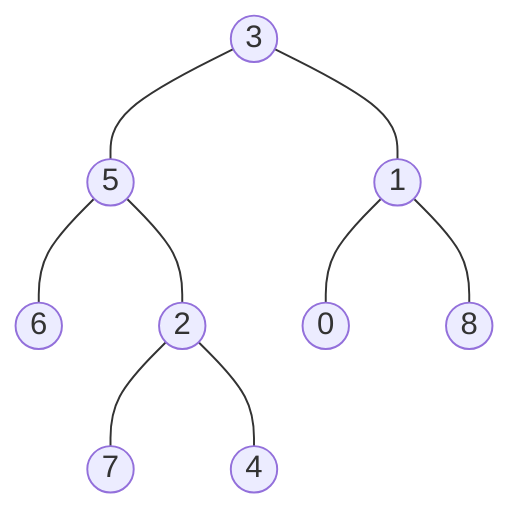

## Examples

**Example 1**

- **Input:** `root = [3, 5, 1, 6, 2, 0, 8, null, null, 7, 4], nodes = [4, 7]`
- **Output:** `2`
- **Explanation:** The lowest common ancestor of nodes 4 and 7 is node 2.

**Example 2**

- **Input:** `root = [3, 5, 1, 6, 2, 0, 8, null, null, 7, 4], nodes = [1]`
- **Output:** `1`
- **Explanation:** Node 1 is the sole target, so it is its own lowest common ancestor.

**Example 3**

- **Input:** `root = [3, 5, 1, 6, 2, 0, 8, null, null, 7, 4], nodes = [7, 6, 2, 4]`
- **Output:** `5`
- **Explanation:** All four target nodes (7, 6, 2, 4) reside in the subtree rooted at node 5, so node 5 is the LCA.
