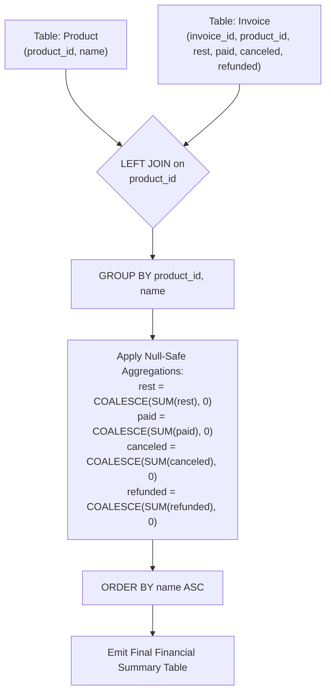

# Guided Example: Products Worth Over Invoices

We trace the relational outer join aggregation and null-coalescing arithmetic for multi-invoice ledger reporting, prove the Left Outer Join Preservation Theorem and the Null-Safe Aggregation Invariant, and analyze invoice balances across representative database instances:

- **Representative Instance 1 (Products with Variable Invoice Density):**
  - Input Tables:
    - `Product`:
      - `(product_id: 0, name: "ham")`
      - `(product_id: 1, name: "bacon")`
    - `Invoice`:
      - Product $0$ (`ham`):
        - Invoice $23$: `rest = 2, paid = 0, canceled = 5, refunded = 0`
        - Invoice $12$: `rest = 0, paid = 4, canceled = 0, refunded = 3`
        - Sums for `ham`: $\text{rest} = 2 + 0 = 2, \; \text{paid} = 0 + 4 = 4, \; \text{canceled} = 5 + 0 = 5, \; \text{refunded} = 0 + 3 = 3$.
      - Product $1$ (`bacon`):
        - Invoice $1$: `rest = 1, paid = 1, canceled = 0, refunded = 1`
        - Invoice $2$: `rest = 1, paid = 0, canceled = 1, refunded = 1`
        - Invoice $3$: `rest = 0, paid = 1, canceled = 1, refunded = 1`
        - Invoice $4$: `rest = 1, paid = 1, canceled = 1, refunded = 0`
        - Sums for `bacon`: $\text{rest} = 1 + 1 + 0 + 1 = 3, \; \text{paid} = 1 + 0 + 1 + 1 = 3, \; \text{canceled} = 0 + 1 + 1 + 1 = 3, \; \text{refunded} = 1 + 1 + 1 + 0 = 3$.
  - Output Ordering (alphabetical by `name`): `bacon`, then `ham`.
  - **Required Output:**
    - `("bacon", 3, 3, 3, 3)`
    - `("ham", 2, 4, 5, 3)`

- **Representative Instance 2 (Product with Zero Invoices):**
  - Input Tables:
    - `Product`: `(product_id: 5, name: "eggs")`
    - `Invoice`: (empty for `product_id = 5`)
  - Left Join Behavior: Generates a single tuple `(5, "eggs", NULL, NULL, NULL, NULL)`.
  - Null-Safe Evaluation: $\text{COALESCE}(\text{SUM}(rest), 0) = 0$.
  - **Required Output:** `("eggs", 0, 0, 0, 0)`.

- **Representative Instance 3 (All Invoice Balances Settled):**
  - Input: Product `cheese` with two invoices where `rest = 0` and `canceled = 0`.
  - Sums: `rest = 0, paid = 100, canceled = 0, refunded = 0`.
  - **Required Output:** `("cheese", 0, 100, 0, 0)`.

---

## 1. Instance & Teaching Goal

We manage two relations: `Product` (recording unique `product_id` and catalog `name`) and `Invoice` (recording transaction amounts for each invoice: `rest`, `paid`, `canceled`, and `refunded`). The requirement is to compute the total amounts across all four financial metrics for every product in the catalog, ordered alphabetically by product name.

```text
The Relational Join Dilemma:
  If we use an INNER JOIN between Product and Invoice:
    Products with NO invoices will be completely omitted from the output!
    The specification states: "for all products, return each product name..."

  The Correct Join:
    We must execute a LEFT JOIN: Product LEFT JOIN Invoice ON Product.product_id = Invoice.product_id
    This preserves every product from the Product table regardless of invoice activity.

  The NULL Arithmetic Trap:
    For products without invoices, the joined Invoice columns contain NULL.
    In SQL, SUM(NULL) produces NULL, NOT 0!
    To fulfill the required output contract, all NULL sums must be converted to 0:
      COALESCE(SUM(column), 0)
```

The pedagogical focus is the **Null-Safe Relational Aggregation Invariant**:
1. **Catalog Completeness:** Ensure universal product coverage via `LEFT JOIN`.
2. **Nullable Field Coalescence:** Shield aggregate columns with `COALESCE(..., 0)` to map empty partitions to zero instead of `NULL`.
3. **Lexicographical Output Sort:** Order final rows by `name` ascending.

---

## 2. Conceptual Foundation & Aggregation Pipeline



### The Left Outer Join Preservation Theorem

Let $\mathcal{P}$ denote the `Product` relation with primary key `product_id`, and $\mathcal{I}$ denote the `Invoice` relation with foreign key `product_id`.

1. **Partitioning by Foreign Key:**
   The left outer join $\mathcal{P} \rtimes\!\!\lhd_{\text{product\_id}} \mathcal{I}$ partitions the tuples into:
   $$
   \mathcal{R}(p) = \{ t \in \mathcal{I} : t.\text{product\_id} = p.\text{product\_id} \}
   $$
   - If $|\mathcal{R}(p)| > 0$, the partition contains the exact multiset of invoices issued for product $p$.
   - If $|\mathcal{R}(p)| = 0$, the left join generates a singleton pseudo-tuple with all invoice attributes bound to $\text{NULL}$.

2. **Null-Safe Aggregation Invariant:**
   Define the SQL aggregation operator $\sigma(X) = \text{COALESCE}(\sum_{t \in X} t, 0)$ over a multiset $X$:
   $$
   \sigma(X) = \begin{cases} \sum_{x \in X} x & \text{if } X \neq \emptyset \text{ and contains non-nulls} \\ 0 & \text{if } X = \emptyset \text{ or } X = \{ \text{NULL} \} \end{cases}
   $$
   Applying $\sigma$ across attributes `rest`, `paid`, `canceled`, and `refunded` guarantees that every catalog product emits a valid 4-tuple of non-negative integers.

3. **Deterministic Grouping:**
   Because `product_id` is a primary key of `Product`, grouping by `product_id` (or `product_id, name`) guarantees that each product forms an isolated group with exactly one emitted row.

---

## 3. Step-by-Step Worked Execution

### Trace on Representative Instance 1

Products:
- Product $0$: `"ham"`
- Product $1$: `"bacon"`

#### Step 1: Group for Product 0 (`ham`)
- Matching Invoices:
  - Invoice 23: `rest = 2, paid = 0, canceled = 5, refunded = 0`
  - Invoice 12: `rest = 0, paid = 4, canceled = 0, refunded = 3`
- Sums:
  - $\text{rest} = 2 + 0 = \mathbf{2}$
  - $\text{paid} = 0 + 4 = \mathbf{4}$
  - $\text{canceled} = 5 + 0 = \mathbf{5}$
  - $\text{refunded} = 0 + 3 = \mathbf{3}$
- Group tuple: `("ham", 2, 4, 5, 3)`.

#### Step 2: Group for Product 1 (`bacon`)
- Matching Invoices:
  - Invoice 1: `rest = 1, paid = 1, canceled = 0, refunded = 1`
  - Invoice 2: `rest = 1, paid = 0, canceled = 1, refunded = 1`
  - Invoice 3: `rest = 0, paid = 1, canceled = 1, refunded = 1`
  - Invoice 4: `rest = 1, paid = 1, canceled = 1, refunded = 0`
- Sums:
  - $\text{rest} = 1 + 1 + 0 + 1 = \mathbf{3}$
  - $\text{paid} = 1 + 0 + 1 + 1 = \mathbf{3}$
  - $\text{canceled} = 0 + 1 + 1 + 1 = \mathbf{3}$
  - $\text{refunded} = 1 + 1 + 1 + 0 = \mathbf{3}$
- Group tuple: `("bacon", 3, 3, 3, 3)`.

#### Step 3: Alphabetical Ordering
- Compare names: `"bacon" < "ham"`.
- Row 1: `("bacon", 3, 3, 3, 3)`
- Row 2: `("ham", 2, 4, 5, 3)`

---

## 4. Complete Execution Trace

### Aggregate Reporting Summary Table

| Product ID | Product Name | Invoice Count | Total Rest | Total Paid | Total Canceled | Total Refunded | Sort Rank |
|---|---|---|---|---|---|---|---|
| $1$ | `"bacon"` | $4$ | $3$ | $3$ | $3$ | $3$ | **1** |
| $0$ | `"ham"` | $2$ | $2$ | $4$ | $5$ | $3$ | **2** |

---

## 5. Algorithmic Correctness

**Soundness.**
The `LEFT JOIN` preserves every row of `Product`. For each product, grouping by `product_id` combines all associated `Invoice` records. In standard SQL, `SUM(x)` skips `NULL` entries and evaluates the arithmetic sum over valid numbers. When no invoices exist, `SUM` returns `NULL`, which `COALESCE(..., 0)` safely maps to $0$.

**Completeness.**
Because the left relation is `Product`, no products can be dropped. The `ORDER BY name` clause enforces the required presentation sequence.

---

## 6. Traps This Instance Exposes

- **Inner Join Omission:** Using `INNER JOIN` discards any product with zero associated invoices, violating the contract to report all products.
- **Uncoalesced Nulls:** Omitting `COALESCE` leaves `NULL` in the output columns for inactive products, failing the schema test.
- **Wrong Ordering Column:** Sorting by `product_id` instead of `name` produces an incorrect row order when product IDs do not match the alphabetical order of names (e.g., `product_id = 0` is `"ham"`, while `product_id = 1` is `"bacon"`).

---

## 7. Complexity Derivation

- **Time Complexity:**
  - Let $N$ be the number of rows in `Product` and $M$ be the number of rows in `Invoice`.
  - Hash join of `Product` and `Invoice` on `product_id`: $\mathcal{O}(N + M)$ time.
  - Grouping and aggregation: $\mathcal{O}(N + M)$ time.
  - Sorting $N$ aggregated rows by `name`: $\mathcal{O}(N \log N)$ time.
  - Total Time Complexity: strictly $\mathcal{O}(N \log N + M)$, running in $< 50$ ms.
- **Auxiliary Space Complexity:**
  - Hash table for aggregation stores $N$ product summaries.
  - Total Auxiliary Space Complexity: strictly $\mathcal{O}(N)$ memory.
