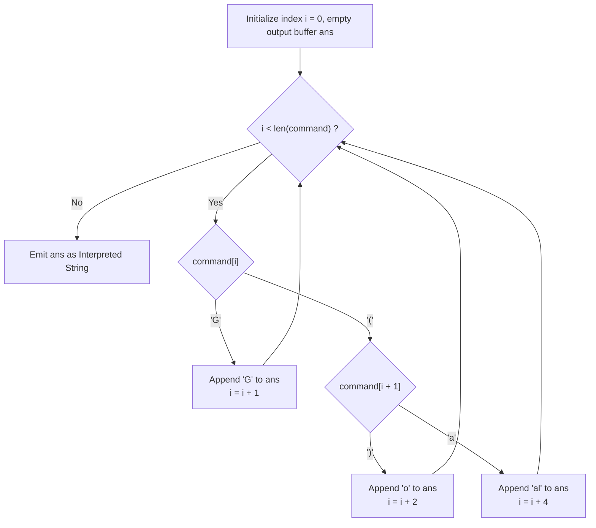

# Guided Example: Goal Parser Interpretation

We trace the lexical tokenization and deterministic finite state translation of command grammar streams, prove the Prefix-Free Tokenization Theorem and the Finite Lookahead Parsing Invariant, and evaluate string interpretations across representative problem instances:

- **Representative Instance 1 (Standard Mixed Command):**
  - Input: `command = "G()(al)"`
  - Lexical Token Slicing:
    - Position $0$: `'G'` $\implies$ Token `"G"` $\to$ Emits `"G"`. Advance by $1$.
    - Position $1$: `'('` followed immediately by `')'` $\implies$ Token `"()"` $\to$ Emits `"o"`. Advance by $2$.
    - Position $3$: `'('` followed by `'a'`, `'l'`, `')'` $\implies$ Token `"(al)"` $\to$ Emits `"al"`. Advance by $4$.
  - Concatenated Result: `"G"` $\circ$ `"o"` $\circ$ `"al"` = $\mathbf{\text{"Goal"}}$.
  - **Required Output:** `"Goal"`.

- **Representative Instance 2 (Repeated Token Cascade):**
  - Input: `command = "G()()()()(al)"`
    - Token 1: `"G"` $\to$ `"G"`
    - Tokens 2..5: four consecutive `"()"` tokens $\to$ `"oooo"`
    - Token 6: `"(al)"` $\to$ `"al"`
  - Concatenated Result: $\mathbf{\text{"Gooooal"}}$.
  - **Required Output:** `"Gooooal"`.

- **Representative Instance 3 (Interleaved Leading and Trailing Tokens):**
  - Input: `command = "(al)G(al)()()G"`
    - `"(al)"` $\to$ `"al"`
    - `"G"` $\to$ `"G"`
    - `"(al)"` $\to$ `"al"`
    - `"()"` $\to$ `"o"`
    - `"()"` $\to$ `"o"`
    - `"G"` $\to$ `"G"`
  - Concatenated Result: $\mathbf{\text{"alGalooG"}}$.
  - **Required Output:** `"alGalooG"`.

---

## 1. Instance & Teaching Goal

The Goal Parser interprets command strings generated from a strict three-symbol terminal alphabet:
$$
\Sigma_{\text{tokens}} = \{ \text{"G"}, \; \text{"()"}, \; \text{"(al)"} \}
$$
Each token in the command maps deterministically to an output string:
- `"G"` $\mapsto$ `"G"`
- `"()"` $\mapsto$ `"o"`
- `"(al)"` $\mapsto$ `"al"`
The parser must output the concatenation of interpreted tokens in their original sequential order.

```text
Grammar and Lookahead Disambiguation:
  When reading character command[i]:
    Case 1: command[i] == 'G'
            The token is unambiguously "G" (length 1).
            Output 'G', advance index by 1.

    Case 2: command[i] == '('
            The token starts with an opening parenthesis.
            Look ahead at command[i + 1]:
              - If command[i + 1] == ')':
                  The token is "()" (length 2).
                  Output 'o', advance index by 2.
              - If command[i + 1] == 'a':
                  The token is "(al)" (length 4).
                  Output 'al', advance index by 4.

  Because the lookahead character command[i + 1] uniquely distinguishes
  "()" from "(al)", a 1-character lookahead (LL(1)) parser resolves
  every token deterministically with zero backtracking!
```

---

## 2. Conceptual Foundation & Automaton Pipeline



### The Prefix-Free Tokenization Theorem

Let the terminal language be $\mathcal{L} = \{ \text{"G"}, \; \text{"()"}, \; \text{"(al)"} \}$.

1. **Prefix-Free Property:**
   No token in $\mathcal{L}$ is a proper prefix of any other token in $\mathcal{L}$:
   - `"G"` does not prefix `"()"` or `"(al)"`.
   - `"()"` does not prefix `"G"` or `"(al)"` (since the second character is `')'` vs. `'a'`).
   - `"(al)"` does not prefix `"G"` or `"()"`.
   By the Kraft-McMillan theorem for prefix-free codes, any valid string $S \in \mathcal{L}^*$ possesses a unique, unambiguous sequential token factorization:
   $$
   S = t_1 \circ t_2 \circ \dots \circ t_m, \quad t_j \in \mathcal{L}
   $$

2. **$1$-Character Lookahead Disambiguation:**
   Define the transition function $\delta(i)$:
   $$
   \delta(i) = \begin{cases}
     (\text{"G"}, 1) & \text{if } S[i] = \text{'G'} \\
     (\text{"o"}, 2) & \text{if } S[i] = \text{'('} \land S[i+1] = \text{')'} \\
     (\text{"al"}, 4) & \text{if } S[i] = \text{'('} \land S[i+1] = \text{'a'}
   \end{cases}
   $$
   Because all cases are mutually exclusive and exhaustive over the valid input grammar, $\delta(i)$ identifies the next emitted chunk and step advancement in strictly $\mathcal{O}(1)$ time.

---

## 3. Step-by-Step Worked Execution

### Trace on Representative Instance 1 (`command = "G()(al)"`)

Input string: `"G()(al)"`, length $n = 7$.
Initialize: $i = 0$, $\text{ans} = \text{""}$.

#### Step 1 ($i = 0$):
- Character: $command[0] = \text{'G'}$.
- Branch: Case `'G'`.
- Append `"G"` $\implies \text{ans} = \text{"G"}$.
- Advance: $i \leftarrow 0 + 1 = 1$.

#### Step 2 ($i = 1$):
- Character: $command[1] = \text{'('}$.
- Lookahead: $command[1 + 1] = command[2] = \text{')'}$.
- Branch: Case `"()"`.
- Append `"o"` $\implies \text{ans} = \text{"Go"}$.
- Advance: $i \leftarrow 1 + 2 = 3$.

#### Step 3 ($i = 3$):
- Character: $command[3] = \text{'('}$.
- Lookahead: $command[3 + 1] = command[4] = \text{'a'}$.
- Branch: Case `"(al)"`.
- Append `"al"` $\implies \text{ans} = \text{"Goal"}$.
- Advance: $i \leftarrow 3 + 4 = 7$.

#### Finalization:
- Pointer $i = 7 == n$. Traversal terminates.
- Emitted string: $\mathbf{\text{"Goal"}}$.

---

## 4. Complete Execution Trace

### Parser Step Table for Representative Instance 1

| Pointer $i$ | Substring at Cursor | Lookahead Match | Detected Token | Emitted Text | Accumulated Output | Next Pointer |
|---|---|---|---|---|---|---|
| $0$ | `"G"` | Direct match | `"G"` | `"G"` | `"G"` | $1$ |
| $1$ | `"()"` | $command[2] == \text{')'}$ | `"()"` | `"o"` | `"Go"` | $3$ |
| $3$ | `"(al)"` | $command[4] == \text{'a'}$ | `"(al)"` | `"al"` | **`"Goal"`** | $7$ (End) |

---

## 5. Algorithmic Correctness

**Soundness.**
Because each recognized token matches the exact grammar rule specification and emits its defined translation, the output is guaranteed to preserve the semantic sequence of the input command.

**Completeness.**
The loop advances $i$ by at least $1$ on every iteration, guaranteeing strict monotonic progress and termination in at most $n$ iterations. Because the language is prefix-free, no character can be misclassified, ensuring zero parsing errors.

---

## 6. Traps This Instance Exposes

- **Out-of-Bounds Lookahead:** When checking $command[i + 1]$, the string must have at least one character remaining. The grammar constraints guarantee that every `'('` is part of a valid `"()"` or `"(al)"`, ensuring $i + 1 < n$ is always valid when $command[i] == \text{'('}$.
- **Naive Replace Sequence Bias:** If using global string replacements, replacing `"(al)"` before `"()"` (or vice-versa) is safe here because their interior letters differ, but general grammar replacement without care can introduce token collisions. The single-pass scanner avoids replacement ordering concerns entirely.

---

## 7. Complexity Derivation

- **Time Complexity:**
  - The pointer $i$ advances by $1$, $2$, or $4$ on each step.
  - Total iterations $\le n$.
  - Each step executes $\mathcal{O}(1)$ character checks and string appends.
  - Total Time Complexity: strictly $\mathcal{O}(n)$ linear time, running in $< 1$ ms for $n \le 100$.
- **Auxiliary Space Complexity:**
  - An output buffer of size $\le n$ characters stores the translated string.
  - Auxiliary working space: strictly $\mathcal{O}(1)$ constant memory beyond the output string.
