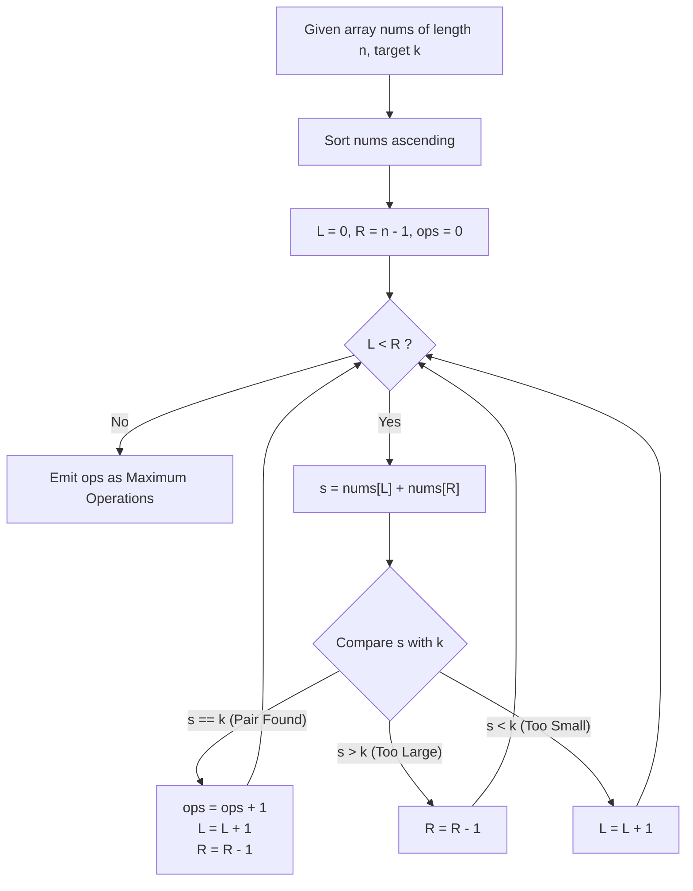

# Guided Example: Max Number of K-Sum Pairs

We trace the complementary multiset pairing and two-pointer greedy convergence for disjoint pair elimination, prove the Disjoint Complement Pair Theorem and the Two-Pointer Monotonic Invariant, and analyze pairing operations across representative problem instances:

- **Representative Instance 1 (Full Disjoint Pairing):**
  - Input: `nums = [1, 2, 3, 4], k = 5`
  - Array sorted: `[1, 2, 3, 4]`, length $n = 4$.
  - Two-Pointer Convergence ($L = 0, R = 3$):
    - Iteration 1: $nums[0] + nums[3] = 1 + 4 = 5 == k$.
      - Form pair $(1, 4)$.
      - Advance: $L \leftarrow 1, R \leftarrow 2$.
    - Iteration 2: $nums[1] + nums[2] = 2 + 3 = 5 == k$.
      - Form pair $(2, 3)$.
      - Advance: $L \leftarrow 2, R \leftarrow 1$.
    - Pointers crossed ($L > R$). Traversal halts.
  - Total operations completed: **`2`**.
  - **Required Output:** `2`.

- **Representative Instance 2 (Self-Complementary Duplicates and Parity Truncation):**
  - Input: `nums = [3, 1, 3, 4, 3], k = 6`
  - Frequency Analysis for $k = 6$:
    - Elements: three $3$'s, one $1$, one $4$.
    - Complement of $3$ is $6 - 3 = 3$ (Self-Complementary!).
    - Number of $3$'s is $3$. Pairs formed: $\lfloor 3 / 2 \rfloor = \mathbf{1}$ pair $(3, 3)$.
    - One $3$ remains unpaired.
    - Complement of $1$ is $5$ (count is $0 \implies 0$ pairs).
    - Complement of $4$ is $2$ (count is $0 \implies 0$ pairs).
  - Total operations: **`1`**.
  - **Required Output:** `1`.

- **Representative Instance 3 (Zero Viable Complements):**
  - Input: `nums = [10, 20, 30], k = 15`
  - All pairwise sums ($30, 40, 50$) strictly exceed $15$. Zero operations possible.
  - **Required Output:** `0`.

---

## 1. Instance & Teaching Goal

Given an integer array `nums` and an integer $k$, an operation consists of choosing two distinct elements $nums[i]$ and $nums[j]$ ($i \neq j$) such that $nums[i] + nums[j] = k$ and deleting them from the array. The objective is to maximize the total number of operations performed.

```text
The Pairing Strategy:
  Every valid operation pairs an element x with its complement k - x.
  Because each element can participate in AT MOST ONE operation,
  the problem is equivalent to maximum matching in a graph of complementary elements!

Two Equivalent Canonical Formulations:
  1. The Hash Map Frequency Formulation:
     Count frequencies of every element.
     - For distinct pairs (x != k - x):
         Number of pairs is min(freq[x], freq[k - x]).
     - For self-complementary pairs (x == k - x, i.e., 2x == k):
         Number of pairs is floor(freq[x] / 2).
     Summing over all unique x <= k / 2 yields the exact maximum in O(n) time!

  2. The Sorted Two-Pointer Formulation:
     Sort nums in non-decreasing order. Maintain pointers L = 0 and R = n - 1.
     - If nums[L] + nums[R] == k: Greedily pair them, advance both L and R.
     - If nums[L] + nums[R] > k:  Sum too large, decrease R.
     - If nums[L] + nums[R] < k:  Sum too small, increase L.
     Executes in O(n log n) time with O(1) auxiliary memory!
```

---

## 2. Conceptual Foundation & Pairing Pipeline



### The Disjoint Complement Pair Theorem

Let $M$ be the multiset of elements in `nums`.
For each distinct integer $v$, let $c(v)$ denote the multiplicity of $v$ in $M$.

1. **Orthogonality of Complementary Pairs:**
   For any two distinct values $u \neq v$, the condition $u + v = k$ couples the multiplicity of $u$ exclusively with the multiplicity of $v$. No element $u$ can simultaneously form a valid sum $k$ with any value other than $k - u$.
   Therefore, the maximum cardinality bipartite matching decomposes into independent pairwise subproblems across disjoint equivalence pairs $\{v, k - v\}$.

2. **Capacity Bounds:**
   - For $v \neq k - v$:
     Each match requires one copy of $v$ and one copy of $k - v$. The maximum number of disjoint pairs is bounded by:
     $$
     P(v) = \min\big(c(v), \; c(k - v)\big)
     $$
   - For $v = k - v$ (which occurs when $k$ is even and $v = k / 2$):
     Each match requires two distinct copies of $v$. The maximum number of pairs is:
     $$
     P(k / 2) = \left\lfloor \frac{c(k / 2)}{2} \right\rfloor
     $$

3. **Global Maximum Closed Form:**
   The maximum total operations is the sum over all $v < k / 2$:
   $$
   \mathcal{O}^* = \sum_{v < k/2} \min\big(c(v), c(k - v)\big) + \Big(\left\lfloor \frac{c(k / 2)}{2} \right\rfloor \text{ if } k \equiv 0 \pmod 2 \text{ else } 0\Big)
   $$
   Because every valid matching cannot exceed this upper bound, and the greedy two-pointer algorithm achieves this bound, $\mathcal{O}^*$ is strictly optimal.

---

## 3. Step-by-Step Worked Execution

### Trace on Representative Instance 1 (`nums = [1, 2, 3, 4]`, $k = 5$)

Sorted Array: `[1, 2, 3, 4]`. Length $n = 4$.
Initialize: $L = 0, R = 3, \text{ops} = 0$.

#### Step 1:
- Left element: $nums[L] = nums[0] = 1$.
- Right element: $nums[R] = nums[3] = 4$.
- Current sum: $1 + 4 = 5$.
- Compare: $5 == k \; (5 == 5)$.
- Match Found!
  - Increment operations: $\text{ops} \leftarrow 0 + 1 = 1$.
  - Advance both pointers: $L \leftarrow 0 + 1 = 1, \; R \leftarrow 3 - 1 = 2$.

#### Step 2:
- Left element: $nums[L] = nums[1] = 2$.
- Right element: $nums[R] = nums[2] = 3$.
- Current sum: $2 + 3 = 5$.
- Compare: $5 == k \; (5 == 5)$.
- Match Found!
  - Increment operations: $\text{ops} \leftarrow 1 + 1 = 2$.
  - Advance both pointers: $L \leftarrow 1 + 1 = 2, \; R \leftarrow 2 - 1 = 1$.

#### Step 3:
- Pointers check: $L = 2, R = 1 \implies L \ge R$.
- Loop terminates.
- Total operations: $\text{ops} = \mathbf{2}$.

---

## 4. Complete Execution Trace

### Two-Pointer State Progression Table for Representative Instance 1

| Step | Left Index $L$ | $nums[L]$ | Right Index $R$ | $nums[R]$ | Sum $s$ | Condition Evaluated | Pointer Actions | Cumulative Operations |
|---|---|---|---|---|---|---|---|---|
| $1$ | $0$ | $1$ | $3$ | $4$ | $5$ | $s == 5$ (Match) | $L \leftarrow 1, R \leftarrow 2$ | **`1`** |
| $2$ | $1$ | $2$ | $2$ | $3$ | $5$ | $s == 5$ (Match) | $L \leftarrow 2, R \leftarrow 1$ | **`2`** |
| $3$ | $2$ | — | $1$ | — | — | $L > R$ (Terminate) | Halt | **`2`** |

---

## 5. Algorithmic Correctness

**Soundness.**
Every operation selected by the algorithm pairs two elements whose sum equals $k$. Advancing $L$ and decrementing $R$ simultaneously removes both participating elements from consideration, ensuring no element is used more than once.

**Completeness.**
When sorted, if $nums[L] + nums[R] > k$, no element $\ge nums[L]$ can pair with $nums[R]$ to form a sum $\le k$, so $nums[R]$ can never participate in any valid pair; decrementing $R$ is strictly safe. Conversely, if $nums[L] + nums[R] < k$, no element $\le nums[R]$ can pair with $nums[L]$; incrementing $L$ is strictly safe. If $nums[L] + nums[R] == k$, pairing them greedily is optimal by the Disjoint Complement Pair Theorem.

---

## 6. Traps This Instance Exposes

- **Reusing the Same Element for Multiple Pairs:** An element at index $i$ cannot pair with multiple items. Advancing both pointers immediately consumes both elements.
- **Self-Pairing Odd Multiplicities:** When $k = 2v$, each pair consumes two distinct occurrences of $v$. If $c(v)$ is odd, one copy must remain unused. Integer division $\lfloor c(v) / 2 \rfloor$ correctly handles the leftover element.
- **Hash Map Double-Counting:** In frequency-based counting, iterating through all elements and blindly adding $\min(c(v), c(k-v))$ counts every pair twice unless restricted to $v < k / 2$.

---

## 7. Complexity Derivation

- **Time Complexity:**
  - **Two-Pointer Approach:** Sorting `nums` takes $\mathcal{O}(n \log n)$ time. The two pointers traverse the array in at most $n$ steps. Total Time: $\mathcal{O}(n \log n)$, running in $< 30$ ms for $n = 10^5$.
  - **Hash Map Approach:** Single pass to build frequency table, followed by iteration over unique keys: $\mathcal{O}(n)$ time.
- **Auxiliary Space Complexity:**
  - **Two-Pointer Approach:** Sorts in-place, requiring $\mathcal{O}(1)$ or $\mathcal{O}(\log n)$ auxiliary space.
  - **Hash Map Approach:** Hash table stores up to $n$ unique integer counts $\implies \mathcal{O}(n)$ memory.
