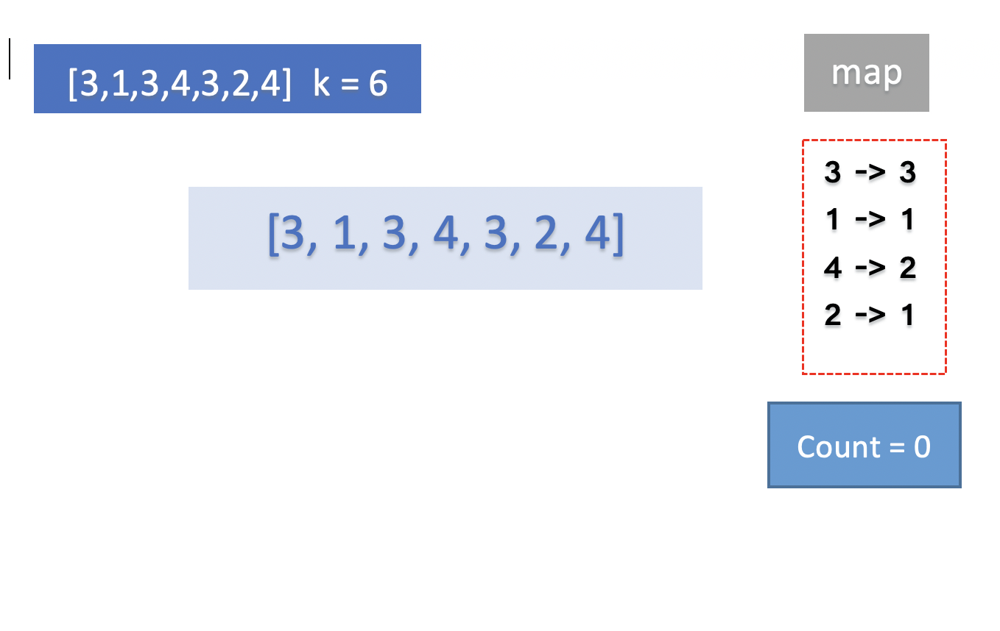
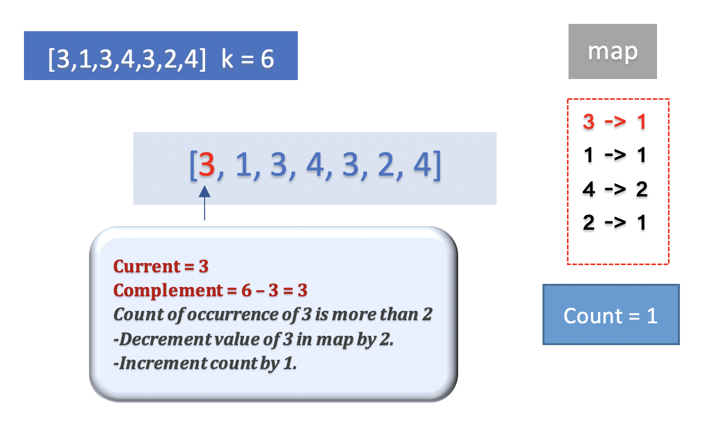
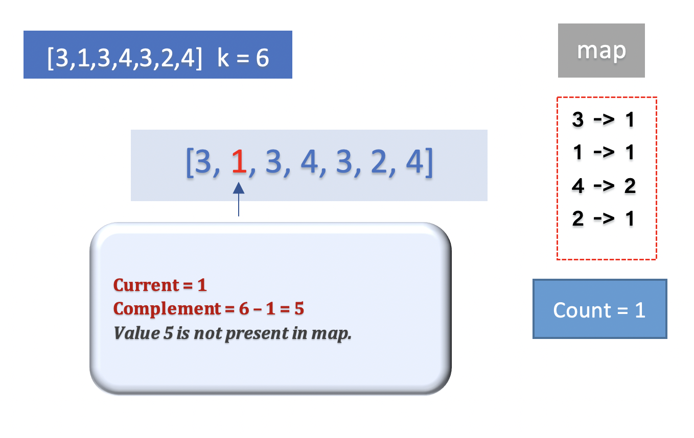
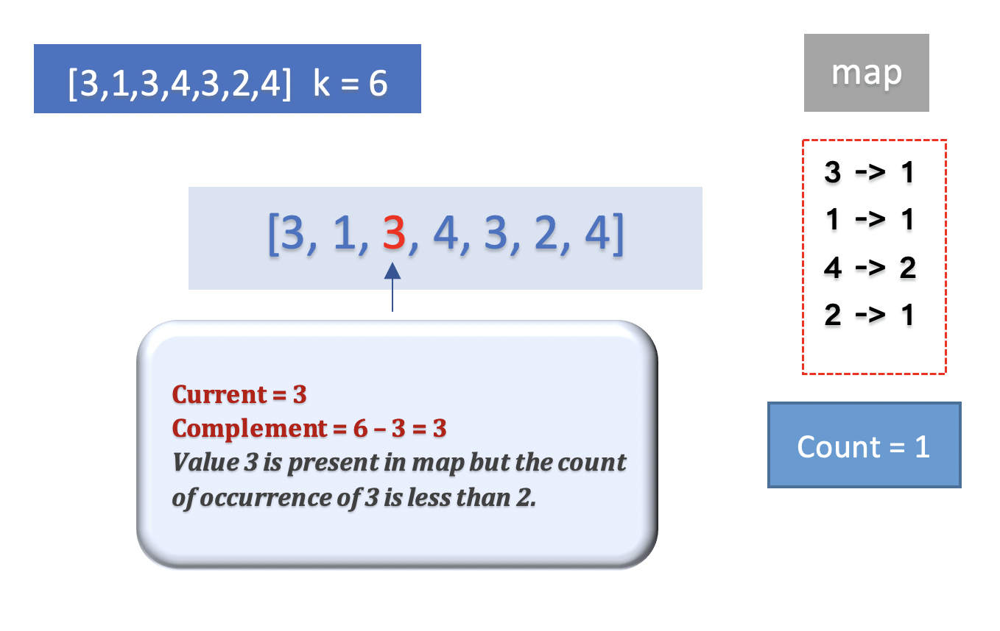
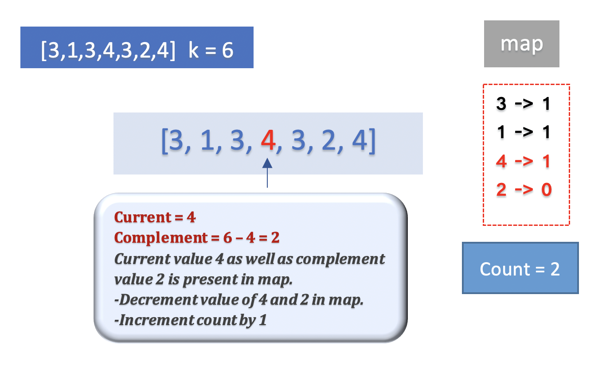
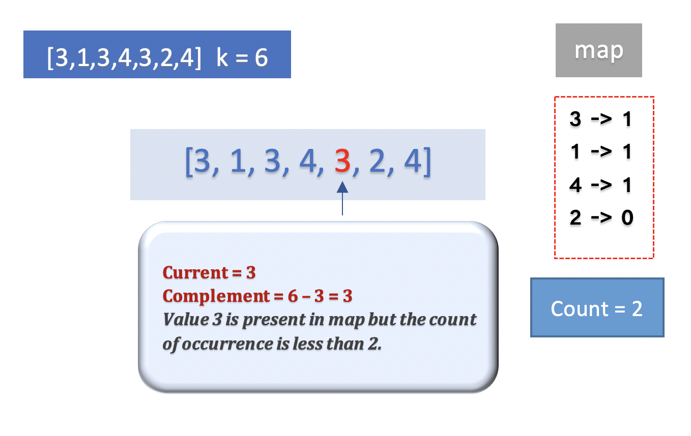
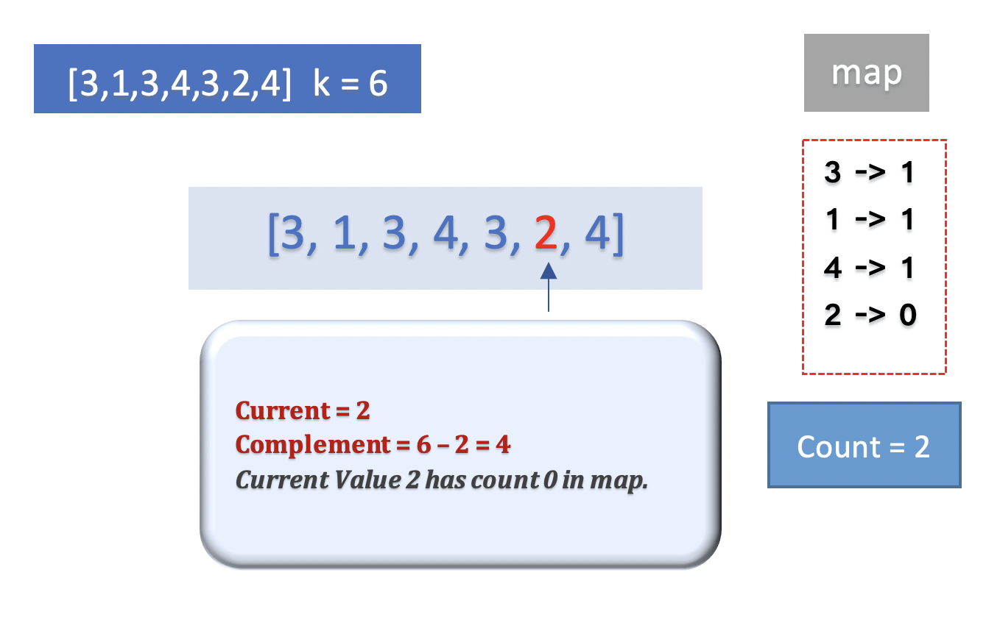
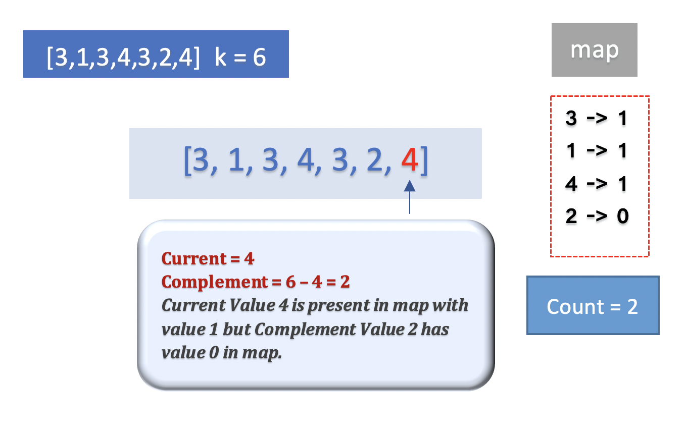
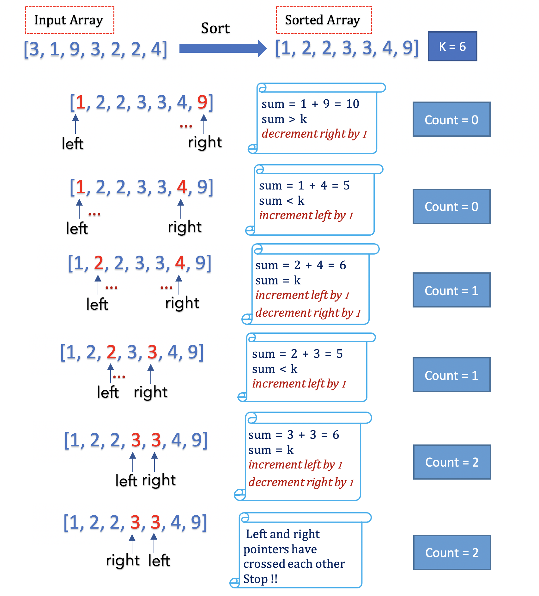

## Solution
---

#### Overview ####

The problem is to find the number of pairs in a given array `nums` such that the sum of each pair is `k`. Every element can be paired with any other element only once. For example, if `nums = [3,4,3]` and $k = 7$, we have to choose a pair in array `nums` with sum equal to `7`. Now if we pair element $4$ with element $3$ at $0^{th}$ index to form sum $7$, then we cannot again pair the same element $4$ with element $3$ at $2^{nd}$ index.

This problem is similar to one of the popular array problem [Two Sum](https://leetcode.com/problems/two-sum). The difference is that instead of finding _indexes_ of the first pair with sum equal to a given value, we have to find the count of all the pairs with sum equal to a given value. Since we don't have to retain the original indexes of elements, it could be an advantage for us. We could reorder or shuffle the array elements and try to solve the problem more efficiently. (In _Approach 4, we are going to sort the array in increasing order).

This is an interesting problem that can be implemented in various ways. Let's look at the different approaches in detail.

---

#### Approach 1: Brute Force

**Intuition**

The naive solution we could think of would be to pick an element from the array `nums`, then try to pair it with all the other elements in the array such that the sum of the pair formed is equal to `k`.

Once we find a matching pair, we could remove both elements from the array. However, removing the elements from an array could be costly, since an array stores element in a contiguous form, we could simply mark the array element to $0$ value. Thus, in our case $0$ value denotes that the element is already taken up or paired up with some other element.

We could begin by picking up the first element at the $0^{th}$ index and find it's pair by iterating over all the elements beginning from the element at $1^{st}$ index until we reach the end of the array. Thus, we could repeat the process until all the elements in the array are picked.

**Algorithm**

-  To implement the intuition, we would use a nested _for loop_. The outer loop would choose the first element of the pair using a pointer `first` and iterate from the $0^{th}$ index to the end of the array. The inner loop would choose the second element of the pair using a pointer `second` and iterate from the `first+1` index to the end of the array.

- We would also need to maintain a variable `count` which would be incremented every time we find a pair with sum equal to `k`.

-  Now, that we have 2 elements to form a pair, pointed by `first` and `second` pointers, we would check if the value of each pair sums up to `k`. If the sum is `k`, we need to do 2 things,
* Increment the variable `count` to count the current pair found.
   * Update the value of array positions pointed by `first` and `second` pointer to $0$. This is used to indicate that these elements are already taken up to form a pair.
 - The process would continue until all the elements are traversed.

**Implementation**

```cpp
class Solution {
public:
    int maxOperations(vector<int>& nums, int k) {
        int count = 0;
        for (int first = 0; first < nums.size(); first++) {
            // check if element pointed by first is already taken up
            if (nums[first] == 0) continue;
            for (int second = first + 1; second < nums.size(); second++) {
                // check if element pointed by second is already taken up
                if (nums[second] == 0) continue;
                if (nums[first] + nums[second] == k) {
                    nums[first] = nums[second] = 0;
                    count++;
                    break;
                }
            }
        }
        return count;
    }
};

```

**Complexity Analysis**

- Time Complexity : $\mathcal{O}(n^{2})$, where $n$ is the length of array `nums`. We are using a nested for loop and pairing up every single element with every other element in the array. Thus, the time complexity of this approach would be $\mathcal{O}(n^{2})$.

   _This approach is exhaustive and results in Time Limit Exceeded (TLE)_

- Space Complexity: $\mathcal{O}(1)$, as we are using constant extra space to store the variable `count` and maintain pointers, `first` and `second`.

---

#### Approach 2: Using Hashmap - Two Pass

**Intuition**

In the previous approach, for every element in the array, we had to find it's pair. Let's the first element of the pair be `x`. Now, we have to find the second element, say `y`, such that the sum of `x` and `y` is `k`. Instead of traversing the entire array to find a suitable pair `y` for every element `x`, can we do it in optimal time?

> Hint: We can try to find if the  _Complement_ of current element `x` with respect to `k` is present in the array or not in constant time.

If the first element in the pair is `x`, we know that the other element `y` must be equal to $k - x$ such that their sum is `k`. $(x + k - x = k)$. In other words, if the current element has the value `x`, we want to know if there is an element in the array with the value $k - x$.

The first data structure that comes to our mind is a _Set_. We could maintain a _Hash Set_ that contains all the elements in the array and we could search if there is an element with a particular value (i.e $k - x$) in a _Hash Set_ in constant time.

But, the input array may contain duplicates as well. Since there could be more than one element with a particular value, we must also store the count of the number of times each value is present in the array. We could build a _HashMap_ for that with key-value pair. The key would the element present in the array and its value would the number of times the value occurs in the array.

Now that we have a hash map that stores the elements present in the array with its count, we could simply traverse the given array `nums`. For every element `x` we could query hashmap to know if $k - x$ exists or not.

> It must be noted that, once we find a pair with sum equal to `k`, we must decrement the count of occurrence of those 2 elements from the map so that they aren't used again.

Based on the insight, let's implement the algorithm.

**Algorithm**

- Build a hashmap `map` where the key is the value of elements in the array and value is the count of the number of times that value is present in the array.

- Iterate over every element in the array `nums`. Let `current` be the element currently being traversed. Find the complement of the current element with respect to `k`, `complement` = $current - k$. The `complement` is a pair of `current` element that we are trying to find.

- However, it is possible that the `current` element is also taken before and paired with some other element. Hence, we check if both elements of the pair, `current` and `complement` are present in the map. If yes, we form the pair and remove those elements from the map.

> Instead of removing the elements from the map, we could simply decrement its count by $1$. An element with a count of $0$ is as good as being non-existent in the map.

 > Is there any other case where our algorithm may fail?

- If the value of the `current` element and `complement` element is the same, we need at least $2$ occurrences of that element to be present in the array, otherwise, we cannot form a pair.

   For example, if $k = 6$ and the value of the `current` element is `3`, the complement must be `3` as well. In this case, there must be $2$ elements in the array with the value `3` to form a pair.

- Every time we find a suitable pair of 2 elements with sum equal to `k`, increment the variable `count`. At the end, return the total number of pairs, `count` found in the array.

The following animation illustrates the idea with `nums = [3, 1, 3, 4, 3, 2, 4]` and $k = 6$.

















**Implementation**

```cpp
class Solution {
public:
    int maxOperations(vector<int>& nums, int k) {
        unordered_map<int, int> map;
        int count = 0;
        // build the hashmap with count of occurence of every element in array
        for (int i = 0; i < nums.size(); i++) {
            map[nums[i]] = map[nums[i]] + 1;
        }
        for (int i = 0; i < nums.size(); i++) {
            int current = nums[i];
            int complement = k - nums[i];
            if (map[current] > 0 && map[complement] > 0) {
                if ((current == complement) && map[current] < 2) continue;
                map[current] = map[current] - 1;
                map[complement] = map[complement] - 1;
                count++;
            }
        }
        return count;
    }
};
```

**Complexity Analysis**

- Time Complexity : $\mathcal{O}(n)$, where $n$ is the length of array `nums`. We iterate over an element in the array twice which takes $\mathcal{O}(n)$ time. First, to build a map from the array. Second, to find a pair for every element in the array. Also, to add or update an element in a hashmap takes constant time. This gives us total time complexity as $\mathcal{O}(n)$.

- Space Complexity: $\mathcal{O}(n)$, where $n$ is the length of array `nums`. We use an unordered map to store the values of the array with their count of occurrence. In the worst case, if every element in the array is unique, the maximum size of the map would grow up to $n$.

---

#### Approach 3: Using Hashmap - Single Pass

**Intuition**

In the previous approach, we iterated over the array twice. In the first pass, we were just building the hashmap. In the second pass, we found a pair for every element. Can we do the same in a single pass?

For every element `current`, we must first try to find if it's pair,`complement` exists in the map. If it does, there is no need to add the `current` element to the map and we could simply remove the `complement` element from the map.
If the `complement` element does not exist in the map, we could add the `current` element to the map.

> In this approach, the hashmap would only hold those array elements for which we have not yet found a suitable pair so far with sum equal to `k`. As and when the elements are paired up, we remove them from the map.

Thus, in a single pass, we can build the map as well as find the matching pair of every element. Let's look at the algorithm in detail.

**Algorithm**

- Initialize a hashmap `map` to store the elements that are traversed till now and not paired up with any element so far.

- A variable `count` would be initialized to $0$ and store the total number of pairs we find in the array.

- Iterate over each element in the array `nums`. For every traversed element `current`, calculate the `complement` value with respect to `k`. $complement = k - current$. Now check if the `complement` value exists in the map.

   * If the `complement` value exists in the map, simply remove it from the map. Note that, we would not add the `current` element in the map here, since it is already paired with `complement`.
  * Otherwise, add the `current` element to the map, so that it can be paired with some other array element in the future.

**Implementation**

```cpp
class Solution {
public:
    int maxOperations(vector<int>& nums, int k) {
        unordered_map<int, int> map;
        int count = 0;
        for (int i = 0; i < nums.size(); i++) {
            int current = nums[i];
            int complement = k - current;
            if (map[complement] > 0) {
                // remove complement from the map
                map[complement] = map[complement] - 1;
                count++;
            } else {
                 // add current element in the map
                map[current] = map[current] + 1;
            }
        }
        return count;
    }
};
```

**Complexity Analysis**

- Time Complexity : $\mathcal{O}(n)$, where $n$ is the length of array `nums`. We iterate over every element only once. Besides, checking or updating the value of a particular key element in the hashmap takes constant time. This gives us total time complexity as $\mathcal{O}(n)$.

- Space Complexity: $\mathcal{O}(n)$, where $n$ is the length of array `nums`. We use an unordered map to store the values of the array with their count of occurrence. In the worst case, if we do not find a `complement` pair of any `current` element, we would end up adding all the elements in the map and the maximum size of the map would grow up to $n$.

---

#### Approach 4: Two Pointer Approach Using Sort

**Intuition**

There is another approach to solve the problem. What if we sort the elements in an array in increasing order? Can we take advantage of this sorted order to find the pairs quickly?

In sorted array, we know that for every $i^{th}$ element, the value of $(i+1)^{th}$ element would always be greater than or equal it's own value. Similarly, the value of $(i-1)^{th}$ element would be less than or equal to its value.

We can use $2$ pointers, the first pointer `left`, is positioned at $0^{th}$ index of the array, and the second pointer `right` is positioned at $n^{th}$ index of the array. (where n is the size of array `nums`). Let's add the values of elements pointed by `left` and `right`, given by `sum`.

The value of the variable `sum` can be used to determine where a possible pair could lie,

- If the value of `sum` is less than the value of `k`, we know that we want a larger value. We also know that `left` is pointing to the smallest value in the array, hence we can increment the `left` pointer by $1$ to get a little larger value.

- Similarly, if the value of `sum` is greater than the value of `k`, we know that we want a smaller value. We also know that `right` is pointing to the largest value in the array, hence we can decrement the `right` pointer by $1$ to get a little smaller value.

- Otherwise, the value of `sum` must be equal to `k` and we have found one pair of elements pointed by `left` and `right` pointers respectively. We can increment the `left` pointer and decrement `right` pointer to find the next pair.

> In other words, we could say that, if the `left` pointer is pointing to the current element, we must adjust the `right` pointer to point to its `complement` and vice versa.

The following example illustrates the idea with `nums = [3, 1, 9, 3, 2, 2, 4]` and $k = 6$.



Let's look at the algorithm in detail.

**Algorithm**

- Sort the `nums` array in increasing i.e ascending order. We can use the built-in sort function.

- Initialize the `left` pointer to point at the $0^{th}$ index and the `right` pointer to point to the last index of the `nums` array. We could say that the `left` pointer points to the smallest element in the array, and the `right` points to the largest element.

- Add the values of array elements pointed by `left` and `right` pointer given by `sum`.
* If the value of `sum` is less than `k`, increment `left` pointer.
* If the value of `sum` is greater than `k`, increment the `right` pointer.
* Otherwise, we have found one pair with a sum equal to `k`. Increment `left` pointer and decrement `right` pointer so that we can go ahead and find another pair.

- The process would continue until the `left` pointer is less than the `right` pointer. Once the `left` and `right` pointer cross each other, we know that we have traversed all the elements and cannot find any other pair. Hence, we stop at that point.

**Implementation**

```cpp
class Solution {
public:
    int maxOperations(vector<int>& nums, int k) {
        sort(nums.begin(), nums.end());
        int count = 0;
        int left = 0;
        int right = nums.size() - 1;
        while (left < right) {
            if (nums[left] + nums[right] < k) {
                left++;
            } else if (nums[left] + nums[right] > k) {
                right--;
            } else {
                left++;
                right--;
                count++;
            }
        }
        return count;
    }
};
```

**Complexity Analysis**

- Time Complexity : $\mathcal{O}(n \log n)$, where $n$ is the length of array `nums`.

  The sort operation on the array takes $\mathcal{O}(n \log n)$ time.

   Each element is traversed only once, either by the `left` pointer or by the `right` pointer, depending on the fact that which pointer reaches that element first. Thus, traversing array takes $\mathcal{O}(n)$ time.

  This gives us total time complexity as $\mathcal{O}(n \log n)$ + $\mathcal{O}(n)$ = $\mathcal{O}(n \log n)$.

- Space Complexity: $\mathcal{O}(1)$. We use constant extra space to track the `count` variable and maintain `left`,`right` pointers.

* Space complexity : $\mathcal{O}(N)$ or $\mathcal{O}(\log{N})$

  - The space complexity of the sorting algorithm depends on the implementation of each program language.

  - For instance, the `std::sort()` function in C++ is implemented with the [Introsort](https://en.wikipedia.org/wiki/Introsort) algorithm whose space complexity is $\mathcal{O}(N)$.

  - In Java, the [Arrays.sort()](https://docs.oracle.com/javase/8/docs/api/java/util/Arrays.html#sort-byte:A-) is implemented as a variant of quicksort algorithm whose space complexity is $\mathcal{O}(\log{N})$.

---