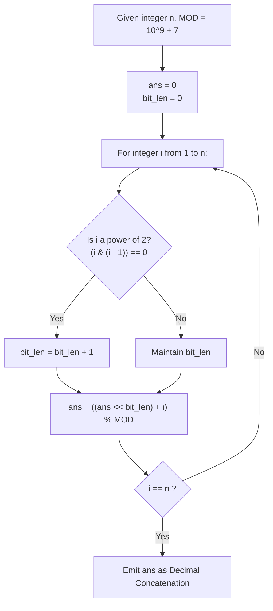

# Guided Example: Concatenation of Consecutive Binary Numbers

We trace the Horner-style modular bit-shift recurrence and dynamic bit-length scaling for sequential binary string concatenation, prove the Modular Left-Shift Recurrence Theorem and the Power-of-Two Bit-Length Invariant, and evaluate modular decimal values across representative instances:

- **Representative Instance 1 (Multi-Width Bit Concatenation):**
  - Input: $n = 3$
  - Binary representations:
    - $1 \implies \text{"1"}$ (bit length $L_1 = 1$).
    - $2 \implies \text{"10"}$ (bit length $L_2 = 2$).
    - $3 \implies \text{"11"}$ (bit length $L_3 = 2$).
  - Recurrence Evaluation modulo $10^9 + 7$:
    - Step 1 ($i = 1$): $f(1) = 1$.
    - Step 2 ($i = 2$): $f(2) = (f(1) \ll 2) + 2 = (1 \times 4) + 2 = \mathbf{6}$ (binary `"110"`).
    - Step 3 ($i = 3$): $f(3) = (f(2) \ll 2) + 3 = (6 \times 4) + 3 = \mathbf{27}$ (binary `"11011"`).
  - Terminal Value: $27 \pmod{10^9 + 7} = \mathbf{27}$.
  - **Required Output:** `27`.

- **Representative Instance 2 (Boundary Power-of-Two Transition):**
  - Input: $n = 4$
  - Previous state $f(3) = 27$.
  - Number $4$ in binary: `"100"` (bit length expands to $L_4 = 3$ because $4$ is a power of 2).
  - Step 4 ($i = 4$): $f(4) = (27 \ll 3) + 4 = (27 \times 8) + 4 = 216 + 4 = \mathbf{220}$ (binary `"11011100"`).
  - **Required Output:** `220`.

- **Representative Instance 3 (Large Scale Modulo Wrapping):**
  - Input: $n = 12$
  - Full binary string: `"1101110010111011110001001101010111100"` (length $37$ bits).
  - Unbounded decimal value: $118505380540$.
  - Modulo $10^9 + 7$: $118505380540 \pmod{10^9 + 7} = \mathbf{505379714}$.
  - **Required Output:** `505379714`.

---

## 1. Instance & Teaching Goal

Given an integer $n$, concatenate the binary representations of all integers from $1$ to $n$ in ascending order to form a single continuous binary sequence. Return the decimal value of this binary string, evaluated modulo $10^9 + 7$.

```text
The String Materialization Trap:
  For n = 10^5, each integer has between 1 and 17 bits.
  The total length of the concatenated binary string is:
    sum_{i=1}^{10^5} floor(log2(i) + 1) approx 1.5 * 10^6 bits!
  Constructing a string of 1.5 million characters or parsing a gigantic integer
  wastes massive memory and leads to severe runtime penalties.

The Online Horner Recurrence:
  Notice what happens in positional notation when a new binary number is appended:
    Current accumulator:  A (representing the prefix binary string)
    New integer:          i
    Bit-length of i:      L_i = floor(log2(i)) + 1
  Appending i to the right of A is MATHEMATICALLY EQUIVALENT to:
    A * 2^(L_i) + i  <===>  (A << L_i) | i

  Because modulo distributes over addition and multiplication:
    A_i = ((A_{i-1} << L_i) + i) mod (10^9 + 7)
  We can compute the entire value iteratively in O(n) time and O(1) space!
```

The pedagogical focus is the **Modular Bit-Shift Recurrence**:
1. **Dynamic Shift Horizon:** Track the exact bit-length $L_i$ of each integer $i$.
2. **Power-of-Two Invariant:** $L_i$ increments by $1$ if and only if $i$ is a power of 2 ($i \ \& \ (i - 1) == 0$).
3. **Modular Invariance:** Apply modulo $10^9 + 7$ at each iterative step to bound integer size within standard 64-bit precision.

---

## 2. Conceptual Foundation & Shift Pipeline



### The Modular Left-Shift Recurrence Theorem

Let $S_i$ denote the binary string formed by concatenating the binary representations of $1, 2, \dots, i$. Let $f(i) = \text{val}(S_i)$ denote its decimal interpretation.

1. **Bit Length Formula:**
   For any positive integer $i \in \mathbb{Z}^+$, its binary representation requires:
   $$
   L(i) = \lfloor \log_2 i \rfloor + 1
   $$
   The function $L(i)$ is a piecewise constant step function:
   $$
   L(i) = L(i - 1) + 1 \iff i = 2^k \text{ for some } k \ge 0
   $$

2. **Positional Shift Recurrence:**
   The string $S_i$ is formed by suffix concatenation: $S_i = S_{i-1} \circ \text{bin}(i)$.
   In base 2, appending a string of length $L(i)$ shifts the preceding numerical value to the left by $L(i)$ positions:
   $$
   f(i) = f(i - 1) \cdot 2^{L(i)} + i
   $$

3. **Homomorphic Modular Projection:**
   Let $M = 10^9 + 7$. Because the modulo operator is a ring homomorphism over $\mathbb{Z}$:
   $$
   f(i) \pmod M = \Big( \big( (f(i - 1) \pmod M) \cdot 2^{L(i)} \big) + i \Big) \pmod M
   $$
   Thus, tracking $f(i) \pmod M$ sequentially produces the exact remainder of the gigantic integer without precision loss.

---

## 3. Step-by-Step Worked Execution

### Trace on Representative Instance 1 ($n = 3$, $M = 10^9 + 7$)

Initialize: $ans = 0, \; L = 0$.

#### Step 1 ($i = 1$):
- Check power of 2: $1 \ \& \ (1 - 1) = 0 \implies$ Power of 2!
  - Increment bit length: $L \leftarrow 0 + 1 = 1$.
- Shift and accumulate:
  $$
  ans \leftarrow \big( (0 \ll 1) + 1 \big) \pmod M = 1
  $$
- Binary representation so far: `"1"` (value $1$).

#### Step 2 ($i = 2$):
- Check power of 2: $2 \ \& \ (2 - 1) = 2 \ \& \ 1 = 0 \implies$ Power of 2!
  - Increment bit length: $L \leftarrow 1 + 1 = 2$.
- Shift and accumulate:
  $$
  ans \leftarrow \big( (1 \ll 2) + 2 \big) \pmod M = (4 + 2) \pmod M = \mathbf{6}
  $$
- Binary representation so far: `"110"` (value $6$).

#### Step 3 ($i = 3$):
- Check power of 2: $3 \ \& \ (3 - 1) = 3 \ \& \ 2 = 2 \neq 0 \implies$ Not a power of 2.
  - Bit length remains $L = 2$.
- Shift and accumulate:
  $$
  ans \leftarrow \big( (6 \ll 2) + 3 \big) \pmod M = (24 + 3) \pmod M = \mathbf{27}
  $$
- Binary representation so far: `"11011"` (value $27$).

#### Finalization:
- Reached $n = 3$.
- Final answer: $\mathbf{27}$.

---

## 4. Complete Execution Trace

### Recurrence State Progression Table for $n = 5$

| Integer $i$ | Binary of $i$ | Power of 2? | Bit-Length $L$ | Shift Factor $2^L$ | Unbounded Computation | Modulo $10^9 + 7$ State | Serialized Binary |
|---|---|---|---|---|---|---|---|
| $1$ | `"1"` | **Yes** | $1$ | $2$ | $(0 \times 2) + 1 = 1$ | $1$ | `"1"` |
| $2$ | `"10"` | **Yes** | $2$ | $4$ | $(1 \times 4) + 2 = 6$ | $6$ | `"110"` |
| $3$ | `"11"` | No | $2$ | $4$ | $(6 \times 4) + 3 = 27$ | $27$ | `"11011"` |
| $4$ | `"100"` | **Yes** | $3$ | $8$ | $(27 \times 8) + 4 = 220$ | $220$ | `"11011100"` |
| $5$ | `"101"` | No | $3$ | $8$ | $(220 \times 8) + 5 = 1765$ | $1765$ | `"11011100101"` |

---

## 5. Algorithmic Correctness

**Soundness.**
The recurrence $f(i) = (f(i - 1) \cdot 2^{L(i)} + i) \pmod M$ strictly reflects the semantic meaning of binary string concatenation under standard positional arithmetic. Applying the modulo operation at each stage is sound by the algebraic properties of modular arithmetic.

**Completeness.**
The loop runs sequentially through every integer from $1$ to $n$, guaranteeing that every integer's binary representation is appended in the exact prescribed order without omissions.

---

## 6. Traps This Instance Exposes

- **String Allocation Memory Exhaustion:** Concatenating raw string chunks in memory allocates over a million characters for $n = 10^5$, creating severe garbage-collection thrashing. Arithmetic bit-shifting uses zero heap string allocations.
- **Logarithmic Calculation Inefficiencies:** Calling floating-point logarithms `math.log2(i)` inside the loop introduces precision errors and slows down execution. The bitwise check `(i & (i - 1)) == 0` updates bit-length in $\mathcal{O}(1)$ machine cycles.
- **Delayed Modulo Overflow:** Waiting until the end of the loop to apply modulo results in attempting to represent a number with over $10^6$ bits, crashing memory or exceeding integer limits. Modulo must be applied after every addition.

---

## 7. Complexity Derivation

- **Time Complexity:**
  - The loop iterates exactly $n$ times from $1$ to $n$.
  - Each iteration performs $1$ bit-shift, $1$ bitwise addition, $1$ bitwise AND check, and $1$ modulo operation.
  - All operations take $\mathcal{O}(1)$ time.
  - Total Time Complexity: strictly $\mathcal{O}(n)$ linear time, executing in $< 20$ ms for $n = 10^5$.
- **Auxiliary Space Complexity:**
  - Only two scalar registers (`ans` and `bit_len`) are maintained.
  - Total Auxiliary Space Complexity: strictly $\mathcal{O}(1)$ constant memory.
