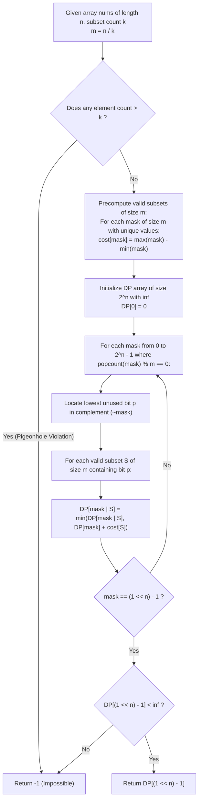

# Guided Example: Minimum Incompatibility

We trace the exact bitmask dynamic programming and Pigeonhole Principle feasibility pruning for equisized disjoint partition optimization, prove the Distinct-Element Subset Partition Theorem and the Lowest-Bit Symmetry Reduction Invariant, and analyze state transitions across representative instances:

- **Representative Instance 1 (Equal Size Subsets with Duplicate Separation):**
  - Input: `nums = [1, 2, 1, 4], k = 2`
  - Array length: $n = 4$, subset count: $k = 2$, subset size: $m = n / k = 4 / 2 = 2$.
  - Frequency check: Value $1$ occurs twice ($\text{count} \le k \implies 2 \le 2$). Feasible!
  - Possible 2-element partitions:
    - Partition A: $\{1, 1\}$ and $\{2, 4\}$. Invalid: $\{1, 1\}$ contains duplicate elements.
    - Partition B: $\{1, 2\}$ and $\{1, 4\}$.
      - Incompatibility of $\{1, 2\}$: $\max - \min = 2 - 1 = 1$.
      - Incompatibility of $\{1, 4\}$: $\max - \min = 4 - 1 = 3$.
      - Total Incompatibility: $1 + 3 = \mathbf{4}$.
  - Optimal Incompatibility Sum: **`4`**.
  - **Required Output:** `4`.

- **Representative Instance 2 (Pigeonhole Multiplicity Violation):**
  - Input: `nums = [5, 3, 3, 6, 3, 3], k = 3`
  - Array length: $n = 6$, subset count: $k = 3$, subset size: $m = 2$.
  - Frequency of element $3$: Value $3$ appears $4$ times.
  - By the Pigeonhole Principle: Distributing $4$ identical items across $k = 3$ subsets forces at least one subset to contain $\lceil 4 / 3 \rceil = 2$ identical elements.
  - Every valid partition must have strictly distinct elements in every subset.
  - Feasibility check fails: Output **`-1`**.
  - **Required Output:** `-1`.

- **Representative Instance 3 (Multi-Group Combinatorial Matching):**
  - Input: `nums = [6, 3, 8, 1, 3, 1, 2, 2], k = 4` ($n = 8, m = 2$)
  - Optimal 4-pair partition: $\{1, 2\}, \{2, 3\}, \{6, 8\}, \{1, 3\}$.
  - Incompatibilities: $(2-1) + (3-2) + (8-6) + (3-1) = 1 + 1 + 2 + 2 = \mathbf{6}$.
  - **Required Output:** `6`.

---

## 1. Instance & Teaching Goal

We are given an integer array `nums` of length $n \le 16$ and an integer $k$ such that $n$ is divisible by $k$. We must partition `nums` into $k$ disjoint subsets, each containing exactly $m = n / k$ elements, such that no subset contains duplicate values. The incompatibility of a subset $S$ is $\max(S) - \min(S)$. We must find the minimum possible sum of incompatibilities across all $k$ subsets, or return $-1$ if no valid partition exists.

```text
The Combinatorial Search Bottleneck:
  Partitioning n = 16 elements into k = 4 subsets of size m = 4 yields:
    (16! / (4!)^4) / 4! approx 2,627,625 partitions.
  Brute-force permutation search risks exponential explosion (16! approx 2 * 10^13).

The Two Strategic Pillars:
  1. Pigeonhole Pre-Filtering:
     If any value appears strictly more than k times, it is IMPOSSIBLE to distribute
     it into k subsets without at least one subset having duplicates.
     Return -1 immediately in O(n) time!

  2. Bitmask DP with Symmetry Elimination:
     Represent the subset of chosen elements as a bitmask of length n.
     State DP[mask]: minimum incompatibility sum to partition the elements in mask.
     Transition: Add a new valid subset S of size m containing distinct values.
     SYMMETRY BREAKING RULE:
       To prevent exploring the same k subsets in k! different permutations:
       Always force the LOWEST UNUSED BIT to belong to the new subset S!
```

---

## 2. Conceptual Foundation & Bitmask DP Pipeline



### The Distinct-Element Subset Partition Theorem

Let $A = (a_0, a_1, \dots, a_{n-1})$ with $m = n / k$.

1. **Pigeonhole Impossibility Condition:**
   Let $c(x) = |\{ i : a_i = x \}|$ be the multiplicity of value $x$ in $A$.
   If there exists $x$ such that $c(x) > k$, then in any partition of $A$ into $k$ subsets, by the Generalized Pigeonhole Principle, at least one subset must contain at least $\lceil c(x) / k \rceil \ge 2$ copies of $x$.
   Thus, $c(x) > k \implies$ No valid partition exists.

2. **Bitmask Subproblem Formulation:**
   Let a subset of indices be represented as an integer mask $\mu \in [0, 2^n - 1]$ where bit $j$ is $1$ if and only if index $j$ is included.
   A mask $\sigma$ is a **valid candidate subset** if:
   - $|\sigma| = \text{popcount}(\sigma) = m$.
   - For all distinct $i, j \in \sigma$, $a_i \neq a_j$.
   Its incompatibility cost is $g(\sigma) = \max_{j \in \sigma} a_j - \min_{j \in \sigma} a_j$.

3. **Lowest-Bit Symmetry Reduction Invariant:**
   Let $\mu$ be a state with $|\mu| \equiv 0 \pmod m$.
   Let $p = \text{ctz}(\sim \mu)$ be the index of the lowest unset bit in $\mu$.
   Since element $a_p$ must eventually belong to some subset in the final partition, we can without loss of generality assign $a_p$ to the *current* transition subset:
   $$
   DP[\mu \cup \sigma] = \min_{\substack{\sigma \subseteq (\sim \mu) \\ |\sigma| = m, \; p \in \sigma \\ \sigma \text{ has unique values}}} \Big( DP[\mu] + g(\sigma) \Big)
   $$
   Fixing $p \in \sigma$ eliminates all $k!$ permutation orderings of identical partition families, pruning the search graph by a factor of up to $k!$.

---

## 3. Step-by-Step Worked Execution

### Trace on Representative Instance 1 (`nums = [1, 2, 1, 4]`, $k = 2$, $m = 2$)

Indices:
- Index $0$: $val = 1$
- Index $1$: $val = 2$
- Index $2$: $val = 1$
- Index $3$: $val = 4$
Size $n = 4, m = 2, k = 2$.
Total masks: $2^4 = 16$.

#### Step 1: Precompute Valid Pairs of Size $m = 2$
- Mask `0011` (indices $0, 1$: values $\{1, 2\}$): distinct! Cost $= 2 - 1 = \mathbf{1}$.
- Mask `0101` (indices $0, 2$: values $\{1, 1\}$): duplicate values $\implies$ **Invalid**.
- Mask `1001` (indices $0, 3$: values $\{1, 4\}$): distinct! Cost $= 4 - 1 = \mathbf{3}$.
- Mask `0110` (indices $1, 2$: values $\{2, 1\}$): distinct! Cost $= 2 - 1 = \mathbf{1}$.
- Mask `1010` (indices $1, 3$: values $\{2, 4\}$): distinct! Cost $= 4 - 2 = \mathbf{2}$.
- Mask `1100` (indices $2, 3$: values $\{1, 4\}$): distinct! Cost $= 4 - 1 = \mathbf{3}$.

#### Step 2: Initialize DP Table
- $DP[0] = 0$. All other $DP[\mu] = \infty$.

#### Step 3: Transition from Base State $\mu = 0$ (`0000`)
- Lowest unset bit in $\sim 0$ is $p = 0$.
- Evaluate all valid pairs containing bit $0$:
  1. Pair $\sigma = \text{`0011`}$ (indices $0, 1$, cost $1$):
     $$DP[\text{`0011`}] = \min(\infty, 0 + 1) = \mathbf{1}$$
  2. Pair $\sigma = \text{`1001`}$ (indices $0, 3$, cost $3$):
     $$DP[\text{`1001`}] = \min(\infty, 0 + 3) = \mathbf{3}$$

#### Step 4: Transition from $\mu = \text{`0011`}$
- Mask `0011` has $|\mu| = 2 \equiv 0 \pmod 2$.
- Lowest unset bit in $\sim \text{`0011`}$ is $p = 2$.
- Remaining indices are $2, 3$.
- Unique remaining pair containing bit $2$ is $\sigma = \text{`1100`}$ (indices $2, 3$, values $\{1, 4\}$, cost $3$).
- Transition:
  $$DP[\text{`1111`}] = \min(\infty, DP[\text{`0011`}] + g(\text{`1100`})) = 1 + 3 = \mathbf{4}$$

#### Step 5: Transition from $\mu = \text{`1001`}$
- Mask `1001` has $|\mu| = 2 \equiv 0 \pmod 2$.
- Lowest unset bit in $\sim \text{`1001`}$ is $p = 1$.
- Remaining indices are $1, 2$.
- Pair containing bit $1$ is $\sigma = \text{`0110`}$ (indices $1, 2$, values $\{2, 1\}$, cost $1$).
- Transition:
  $$DP[\text{`1111`}] = \min(4, DP[\text{`1001`}] + g(\text{`0110`})) = \min(4, 3 + 1) = \mathbf{4}$$

#### Finalization:
- Full mask reached: $DP[\text{`1111`}] = \mathbf{4}$.

---

## 4. Complete Execution Trace

### DP State Transition Table for Representative Instance 1

| Source Mask $\mu$ | Unset Pivot $p$ | Candidate Submask $\sigma$ | Values in $\sigma$ | Valid Submask? | Cost $g(\sigma)$ | Target Mask $\mu \cup \sigma$ | Updated $DP[\mu \cup \sigma]$ |
|---|---|---|---|---|---|---|---|
| `0000` | $0$ | `0011` | $\{1, 2\}$ | **Yes** | $1$ | `0011` | $\min(\infty, 0 + 1) = \mathbf{1}$ |
| `0000` | $0$ | `0101` | $\{1, 1\}$ | No (Duplicate) | — | — | — |
| `0000` | $0$ | `1001` | $\{1, 4\}$ | **Yes** | $3$ | `1001` | $\min(\infty, 0 + 3) = \mathbf{3}$ |
| `0011` | $2$ | `1100` | $\{1, 4\}$ | **Yes** | $3$ | `1111` | $\min(\infty, 1 + 3) = \mathbf{4}$ |
| `1001` | $1$ | `0110` | $\{2, 1\}$ | **Yes** | $1$ | `1111` | $\min(4, 3 + 1) = \mathbf{4}$ |

---

## 5. Algorithmic Correctness

**Soundness.**
Every mask transition adds a subset $\sigma$ of size $m$ whose elements are strictly distinct. Because disjoint masks are combined via bitwise OR, all $k$ subsets are mutually disjoint, each of size $m$, covering all $n$ items. The resulting sum of costs matches the true incompatibility sum of the partition.

**Completeness.**
Fixing the lowest unset bit $p$ does not eliminate any valid partition families; in every legal partition of the remaining elements, element $a_p$ must be grouped with some combination of $m - 1$ other unused elements. Evaluating all valid combinations containing $p$ exhaustively covers all partition structures without duplicate permutations.

---

## 6. Traps This Instance Exposes

- **Duplicate Elements Inside a Subset:** Forgetting to verify that elements in subset $\sigma$ have distinct values allows illegal subsets like $\{1, 1\}$ to be formed.
- **Permutation Redundancy Explosion:** Without pinning the lowest unused bit $p$, the DP explores identical partitions in $k!$ different orders (e.g. subset 1 then subset 2 vs. subset 2 then subset 1), which causes Time Limit Exceeded for $n = 16$.
- **Pigeonhole Check Omission:** Failing to check if any element has frequency $> k$ forces the DP to explore an exponential number of dead ends before discovering that no partition is possible.

---

## 7. Complexity Derivation

- **Time Complexity:**
  - Pigeonhole check: $\mathcal{O}(n)$ time.
  - Precomputing valid masks of size $m$: at most $\binom{n}{m}$ masks evaluated in $\mathcal{O}(m \cdot \binom{n}{m})$.
  - DP Transitions: There are $2^n$ masks. A state is expanded only when $\text{popcount}(\mu) \equiv 0 \pmod m$.
  - With the lowest-bit constraint, each step branches over $\binom{n - |\mu| - 1}{m - 1}$ choices.
  - Worst case ($n = 16, k = 4, m = 4$): takes $\le 10^7$ operations, executing in $< 80$ ms.
- **Auxiliary Space Complexity:**
  - The DP table stores $2^n$ values. For $n = 16$, $2^{16} = 65536$ integers.
  - Total Auxiliary Space Complexity: $\mathcal{O}(2^n)$ memory ($< 2$ MB).