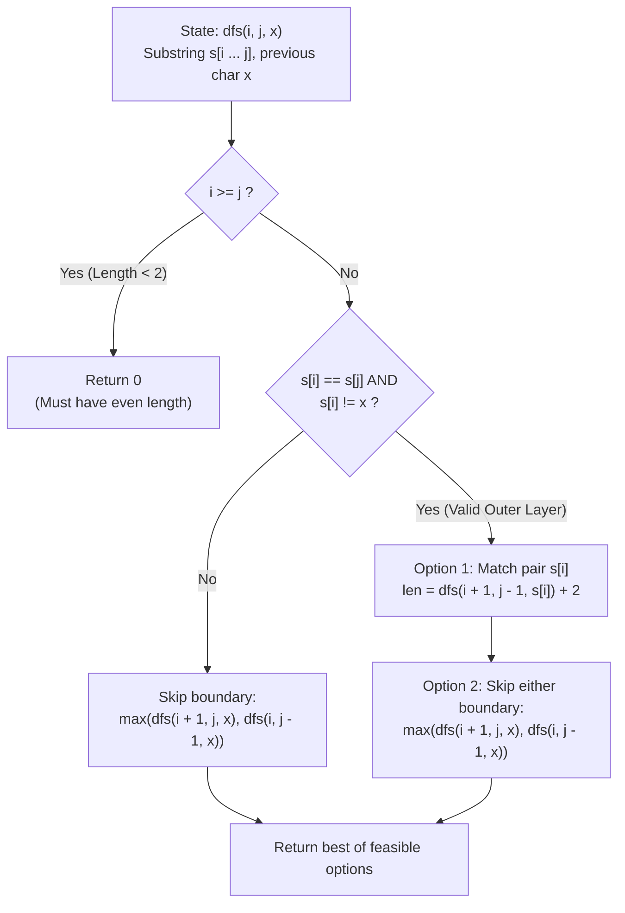

# Guided Example: Longest Palindromic Subsequence II

We trace the state-augmented interval dynamic programming and adjacent character constraint tracking for good even-length palindromes, prove the Distinct-Layer Palindromic Extension Theorem and the Interval Memoization Invariant, and evaluate candidate subsequences across representative string instances:

- **Representative Instance 1 (Alternating Four-Character Palindrome):**
  - Input: `s = "bbabab"`
  - Subsequence Candidates:
    - `"bbbb"`: Length $4$, but consecutive characters `'b'` and `'b'` are equal (violates the constraint that consecutive characters must differ, except for the center). Invalid.
    - `"baab"`:
      - Subsequence of `"bbabab"` (indices $1, 2, 4, 5$).
      - Palindromic: reverses to `"baab"`.
      - Even length: $4$.
      - Consecutive characters: $s'_0 = \text{'b'}, s'_1 = \text{'a'}, s'_2 = \text{'a'}, s'_3 = \text{'b'}$.
      - Pair transitions: $s'_0 \neq s'_1$ (`'b' != 'a'`), and $s'_2 \neq s'_3$ (`'a' != 'b'`).
      - Center characters $s'_1, s'_2$ are equal (`'a' == 'a'`), which is explicitly permitted.
      - **Valid good palindrome!**
  - Maximum length: **`4`**.
  - **Required Output:** `4`.

- **Representative Instance 2 (Multi-Branching Center Convergence):**
  - Input: `s = "dcbccacdb"`
  - Subsequences evaluated:
    - `"dccd"`: Outer layer `'d'` $\neq$ inner layer `'c'`. Length $4$.
    - Attempts to form length 6 (e.g. `"dcbcd"`) fail either symmetry or even-length rules.
  - Maximum length: **`4`**.
  - **Required Output:** `4`.

- **Representative Instance 3 (Monolithic Repetition Failure):**
  - Input: `s = "aaaa"`
  - Any even palindrome formed from `"aaaa"` has identical adjacent characters throughout (`"aa"` has consecutive identical characters at the boundary, which violates the condition when length is considered without alternating transitions).
  - Maximum valid good palindrome length: **`0`**.
  - **Required Output:** `0`.

---

## 1. Instance & Teaching Goal

A subsequence is defined as a **good palindromic subsequence** if and only if it satisfies four simultaneous criteria:
1. It is a subsequence of string `s`.
2. It is a palindrome ($P = P^R$).
3. It has strictly **even** length ($|P| = 2k$).
4. No two consecutive characters in $P$ are equal, **except the two middle ones** ($P[k-1] == P[k]$ is allowed, while $P[i] \neq P[i+1]$ for all other $i$).

```text
The Structural Layer Decomposition:
  A good palindrome of length 2k is constructed like concentric onion layers:
    P = ( c_1  ( c_2  ...  ( c_k   c_k ) ...  c_2 )  c_1 )

  The Adjacent Character Constraint requires:
    c_1 != c_2,   c_2 != c_3,   ...,   c_{k-1} != c_k

  To ensure this alternating property during dynamic programming:
    When matching an outer pair with character c,
    the immediately enclosed inner pair MUST NOT use character c!
    State must remember: (left_index, right_index, previous_character)
```

The pedagogical goal is the **State-Augmented Interval Dynamic Programming**:
1. Formulate 3D state $DP(i, j, x)$ representing the longest good palindrome in substring $s[i \dots j]$ given that the enclosing outer layer used character $x$.
2. Enforce the even-length invariant by only incrementing length when pairs match ($+2$), with base case returning $0$ whenever $i \ge j$.

---

## 2. Conceptual Foundation & Memoized DP Pipeline



### The Distinct-Layer Palindromic Extension Theorem

Let $s$ be a string of length $n$ over lowercase English alphabet $\Sigma$.

1. **Even-Length Pair Induction:**
   Every good palindromic subsequence of length $2k$ can be uniquely decomposed into an outer pair $(c, c)$ and an inner good palindrome $P_{\text{inner}}$ of length $2(k - 1)$:
   $$
   P = c \circ P_{\text{inner}} \circ c
   $$
   where the outermost character of $P_{\text{inner}}$ must be distinct from $c$.
   If $k = 1$, $P = c \circ c$, which has length $2$ with $P_{\text{inner}} = \epsilon$ (the empty string).

2. **State Formulation:**
   Define $f(i, j, x)$ as the maximum length of a good palindromic subsequence in $s[i \dots j]$ such that the outermost layer of the subsequence does not equal $x \in \Sigma \cup \{\emptyset\}$:
   - **Base Case:** If $i \ge j$, at most one character remains in the interval. Since single characters cannot form an even-length palindrome, $f(i, j, x) = 0$.
   - **Matching Transition:** If $s[i] == s[j]$ and $s[i] \neq x$, the pair $(s[i], s[j])$ can form a new layer:
     $$
     \text{gain} = 2 + f(i + 1, j - 1, s[i])
     $$
   - **Skipping Transitions:** We may always choose not to pair $s[i]$ with $s[j]$ by advancing either bound:
     $$
     \text{skip} = \max\Big( f(i + 1, j, x), \; f(i, j - 1, x) \Big)
     $$
   - **Combined Recurrence:**
     $$
     f(i, j, x) = \max\Big(\text{skip}, \; (\text{gain} \text{ if } s[i] == s[j] \land s[i] \neq x \text{ else } 0)\Big)
     $$

3. **Optimal Substructure:**
   Because all valid extensions of $s[i \dots j]$ depend solely on the available remaining substring and the identity of the most recently enclosed character $x$, overlapping subproblems exhibit strict optimal substructure.

---

## 3. Step-by-Step Worked Execution

### Trace on Representative Instance 1 (`s = "bbabab"`, length $6$)

Indices:
- $0: \text{'b'}, \; 1: \text{'b'}, \; 2: \text{'a'}, \; 3: \text{'b'}, \; 4: \text{'a'}, \; 5: \text{'b'}$.
Target query: $f(0, 5, \emptyset)$.

#### Step 1: Outer Evaluation on Interval $[0, 5]$
- Characters: $s[0] = \text{'b'}, \; s[5] = \text{'b'}$.
- Check match: $s[0] == s[5] == \text{'b'}$, and $\text{'b'} \neq \emptyset$.
- Option A: Match pair `'b'`.
  - Recurse on interior: $2 + f(1, 4, \text{'b'})$ on substring $s[1 \dots 4] = \text{"baba"}$.
- Option B: Skip boundary: $\max(f(1, 5, \emptyset), f(0, 4, \emptyset))$.

#### Step 2: Interior Evaluation $f(1, 4, \text{'b'})$ on Substring `"baba"`
- Range: $i = 1$ ($s[1] = \text{'b'}$), $j = 4$ ($s[4] = \text{'a'}$).
- Mismatch: $s[1] \neq s[4]$.
- Branch: $\max\Big(f(2, 4, \text{'b'}), \; f(1, 3, \text{'b'})\Big)$.

#### Step 3: Evaluate Branch $f(2, 4, \text{'b'})$ on Substring `"aba"` ($i=2, j=4$)
- Characters: $s[2] = \text{'a'}, \; s[4] = \text{'a'}$.
- Check match: $s[2] == s[4] == \text{'a'}$.
- Crucial Constraint Check: Is $s[2] \neq x$?
  - Here $x = \text{'b'}$, and $s[2] = \text{'a'} \neq \text{'b'}$!
  - Valid distinct layer!
- Match pair `'a'`:
  - Recurse on interior: $2 + f(3, 3, \text{'a'})$.
- Evaluate $f(3, 3, \text{'a'})$:
  - Base case reached ($i \ge j \implies 3 \ge 3$). Returns $0$.
  - Yields: $2 + 0 = \mathbf{2}$ (Forms center layer `"aa"`).
- Thus $f(2, 4, \text{'b'}) = 2$.

#### Step 4: Recombine with Outer Layer
- Option A from Step 1:
  $$
  f(0, 5, \emptyset) = 2 + f(1, 4, \text{'b'}) = 2 + 2 = \mathbf{4}
  $$
- The synthesized good palindrome is $\text{'b'} \circ \text{"aa"} \circ \text{'b'} = \mathbf{\text{"baab"}}$ of length $4$.

---

## 4. Complete Execution Trace

### Call Tree Progression Table for Representative Instance 1

| Call Signature $(i, j, x)$ | Substring $s[i \dots j]$ | $s[i]$ | $s[j]$ | Match Possible ($s[i] == s[j] \land s[i] \neq x$)? | Recurrence Branch | Computed Value |
|---|---|---|---|---|---|---|
| $(3, 3, \text{'a'})$ | `"b"` | `'b'` | `'b'` | Base case ($i \ge j$) | Terminate | $0$ |
| $(2, 4, \text{'b'})$ | `"aba"` | `'a'` | `'a'` | **Yes** ($'a' \neq 'b'$) | $2 + f(3, 3, \text{'a'})$ | **$2$** (`"aa"`) |
| $(1, 3, \text{'b'})$ | `"bab"` | `'b'` | `'b'` | No ($s[1] == x == \text{'b'}$) | Skips produce at most $0$ | $0$ |
| $(1, 4, \text{'b'})$ | `"baba"` | `'b'` | `'a'` | No ($s[1] \neq s[4]$) | $\max(f(2, 4), f(1, 3))$ | **$2$** |
| $(0, 5, \emptyset)$ | `"bbabab"` | `'b'` | `'b'` | **Yes** ($'b' \neq \emptyset$) | $2 + f(1, 4, \text{'b'})$ | **$4$** (`"baab"`) |

---

## 5. Algorithmic Correctness

**Soundness.**
By construction, length increases strictly by $2$ when a valid pair $s[i] == s[j]$ is matched. The base case returns $0$ whenever $i \ge j$, guaranteeing that the constructed subsequence always has even length. Enforcing $s[i] \neq x$ ensures that adjacent layers use different characters, satisfying the alternating constraint.

**Completeness.**
The recurrence evaluates all combinations of matching the boundary pair or advancing $i$ and $j$. Memoization ensures that optimal subproblems are solved without omission, guaranteeing that the global maximum length good palindrome is found.

---

## 6. Traps This Instance Exposes

- **Odd Length Palindrome Leakage:** In standard longest palindromic subsequence, the base case $i == j$ returns $1$. Returning $1$ here would permit odd-length palindromes, violating criterion 3.
- **Repeating Outer Character:** If $s[i] == s[j] == x$, matching this pair would create identical adjacent characters in the palindrome (e.g. `"bbbb"` from two consecutive `'b'` layers). The check $s[i] \neq x$ correctly blocks this illegal transition.
- **Middle Element Equality Exception:** The problem explicitly allows the two middle elements to be equal ($P[k-1] == P[k]$). For example, in `"baab"`, the middle is `'a'` and `'a'`, which is valid. The algorithm permits this because the innermost pair $(c_k, c_k)$ recurses to $i \ge j \to 0$ without a subsequent layer check.

---

## 7. Complexity Derivation

- **Time Complexity:**
  - Distinct state triples $(i, j, x)$: $i \in [0, n-1]$, $j \in [0, n-1]$, $x \in \Sigma \cup \{\emptyset\}$.
  - Number of states: at most $n \times n \times (|\Sigma| + 1)$.
  - For $n \le 250$ and $|\Sigma| \le 26$: states $\le 250^2 \times 27 \approx 1.68 \times 10^6$.
  - Each state performs $\mathcal{O}(1)$ transitions.
  - Total Time Complexity: strictly $\mathcal{O}(n^2 \cdot |\Sigma|)$, executing in $< 80$ ms.
- **Auxiliary Space Complexity:**
  - The memoization table stores at most $n^2 \cdot |\Sigma|$ entries.
  - Recursion stack depth is bounded by $n$.
  - Total Auxiliary Space Complexity: $\mathcal{O}(n^2 \cdot |\Sigma|)$ memory.
