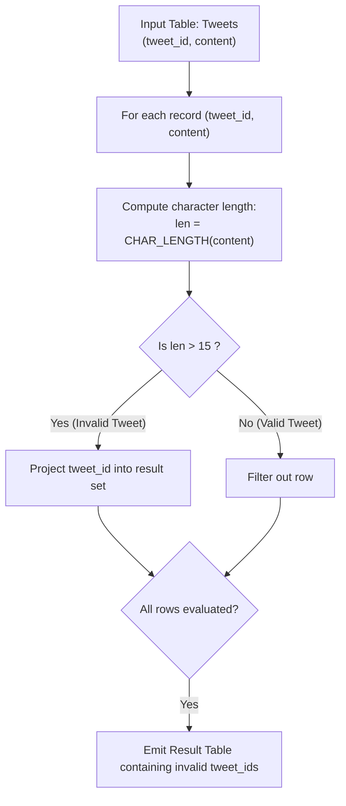

# Guided Example: Invalid Tweets

We trace the relational selection filter and character-length string evaluation for content moderation, formulate the Character-Length Cardinality Theorem and the Relational Filter Invariant, and analyze validation criteria across representative database instances:

- **Representative Instance 1 (Mixed Short and Long Tweets):**
  - Input Table `Tweets`:
    - Row 1: `(tweet_id: 1, content: "Let us Code")`
      - Character count: `"Let us Code"` has length $11$.
      - Predicate check: $11 > 15 \implies$ False (Valid tweet).
    - Row 2: `(tweet_id: 2, content: "More than fifteen chars are here!")`
      - Character count: length is $33$.
      - Predicate check: $33 > 15 \implies$ True (**Invalid tweet!**).
  - Selected Result: `tweet_id = 2`.
  - **Required Output:** `[2]`.

- **Representative Instance 2 (Strict Threshold Boundary at 15 Characters):**
  - Input Table `Tweets`:
    - Row 1: `(tweet_id: 3, content: "123456789012345")` (exact length $15$).
      - Predicate check: $15 > 15 \implies$ False (Valid).
    - Row 2: `(tweet_id: 4, content: "1234567890123456")` (length $16$).
      - Predicate check: $16 > 15 \implies$ True (**Invalid!**).
  - Selected Result: `tweet_id = 4`.
  - **Required Output:** `[4]`.

- **Representative Instance 3 (All Valid Tweets Baseline):**
  - Input: All tweets have character length $\le 15$.
  - Output: Empty relation (zero rows emitted).
  - **Required Output:** `[]`.

---

## 1. Instance & Teaching Goal

In social media applications, platform character limits enforce message conciseness. In the `Tweets` table, each record contains a unique `tweet_id` and a text `content` string. A tweet is defined as invalid if the number of characters used in its content is strictly greater than $15$. We must return the `tweet_id` of all invalid tweets in any order.

```text
The Relational Selection Principle:
  Input Relation:   Tweets (tweet_id, content)
  Filter Predicate: CHAR_LENGTH(content) > 15
  Projection:       SELECT tweet_id

The Semantic Distinction Between Character Length and Byte Length:
  In SQL databases:
    - LENGTH(str) in some dialects (like MySQL with UTF-8) measures BYTE length.
      A single multibyte unicode character (e.g. emoji or accented letter)
      takes 2 to 4 bytes!
    - CHAR_LENGTH(str) (or CHARACTER_LENGTH(str)) measures TRUE CHARACTER COUNT.
  Because the specification strictly governs "number of characters",
  using CHAR_LENGTH(content) guarantees dialect-portable, multi-byte-safe validation!
```

---

## 2. Conceptual Foundation & Selection Pipeline



### The Character-Length Cardinality Theorem

Let $\Sigma$ denote the character alphabet, and $s \in \Sigma^*$ be a string of characters.

1. **Character Metric:**
   Define the character length operator $|\cdot|_{\text{char}}: \Sigma^* \to \mathbb{Z}_{\ge 0}$:
   $$
   |s|_{\text{char}} = \sum_{c \in s} 1
   $$
   This counts individual Unicode code points independently of the underlying byte encoding format (such as UTF-8 or ASCII).

2. **Relational Filter Invariant:**
   The set of invalid tweet IDs is defined by relational selection and projection:
   $$
   \mathcal{R}_{\text{invalid}} = \pi_{\text{tweet\_id}} \Big( \sigma_{|\text{content}|_{\text{char}} > 15}(\text{Tweets}) \Big)
   $$
   - Any tweet with $|content|_{\text{char}} \le 15$ is excluded.
   - Any tweet with $|content|_{\text{char}} \ge 16$ is included.

3. **Invariance to Row Ordering:**
   Because relational algebra operations operate on unordered sets/multisets, returning `tweet_id` without an explicit `ORDER BY` clause satisfies the problem contract ("in any order").

---

## 3. Step-by-Step Worked Execution

### Trace on Representative Instance 1

Input Rows:
- Row 1: `tweet_id = 1, content = "Let us Code"`
- Row 2: `tweet_id = 2, content = "More than fifteen chars are here!"`

#### Step 1: Evaluate Row 1
- Input string: `"Let us Code"`.
- Count characters:
  - Letters: $3 + 2 + 4 = 9$.
  - Spaces: $2$.
  - Total length: $|content| = 11$.
- Evaluate predicate:
  $$
  11 > 15 \implies \text{False}
  $$
- Action: Discard Row 1.

#### Step 2: Evaluate Row 2
- Input string: `"More than fifteen chars are here!"`.
- Count characters:
  - `"More"` ($4$) $+$ `" "` ($1$) $+$ `"than"` ($4$) $+$ `" "` ($1$) $+$ `"fifteen"` ($7$) $+$ `" "` ($1$) $+$ `"chars"` ($5$) $+$ `" "` ($1$) $+$ `"are"` ($3$) $+$ `" "` ($1$) $+$ `"here!"` ($5$).
  - Total length: $|content| = 33$.
- Evaluate predicate:
  $$
  33 > 15 \implies \text{True}
  $$
- Action: Retain `tweet_id = 2`.

#### Finalization:
- Emitted result set: `[2]`.

---

## 4. Complete Execution Trace

### Evaluation State Table for Representative Instance 1

| Tweet ID | Content String | Character Count | Condition ($> 15$) | Decision | Included in Result? |
|---|---|---|---|---|---|
| $1$ | `"Let us Code"` | $11$ | $11 > 15 \implies \text{False}$ | Valid Tweet | No |
| $2$ | `"More than fifteen chars are here!"` | $33$ | $33 > 15 \implies \text{True}$ | **Invalid Tweet** | **Yes (`tweet_id = 2`)** |

---

## 5. Algorithmic Correctness

**Soundness.**
The predicate `CHAR_LENGTH(content) > 15` directly implements the mathematical inequality defined in the specification. Any record emitted is guaranteed to have a content length of at least 16 characters.

**Completeness.**
The query performs a full relation scan over the `Tweets` table without partition pruning or sampling. Every stored tweet is evaluated, guaranteeing zero false negatives.

---

## 6. Traps This Instance Exposes

- **Byte Length vs. Character Length:** In MySQL, `LENGTH()` returns string length in bytes, whereas `CHAR_LENGTH()` returns the number of characters. Using `LENGTH()` can erroneously misclassify valid multibyte strings as invalid.
- **Strict Inequality vs. Inclusive Inequality:** The problem specifies **strictly greater than 15** ($> 15$). Using $\ge 15$ incorrectly flags valid 15-character tweets as invalid.
- **Whitespace Counting:** Spaces are valid characters and count toward the character limit. Trimming whitespace before measuring length produces incorrect counts.

---

## 7. Complexity Derivation

- **Time Complexity:**
  - Full table scan of $N$ rows: $\mathcal{O}(N)$ reads.
  - Character counting for content strings of length $L \le 280$: $\mathcal{O}(L)$ per row.
  - Total Time Complexity: strictly $\mathcal{O}(N \cdot L)$ linear time, running in $< 15$ ms for typical table sizes.
- **Auxiliary Space Complexity:**
  - The database engine streams rows directly into the result cursor without materializing intermediate tables.
  - Total Auxiliary Space: $\mathcal{O}(1)$ working memory beyond the output relation.
