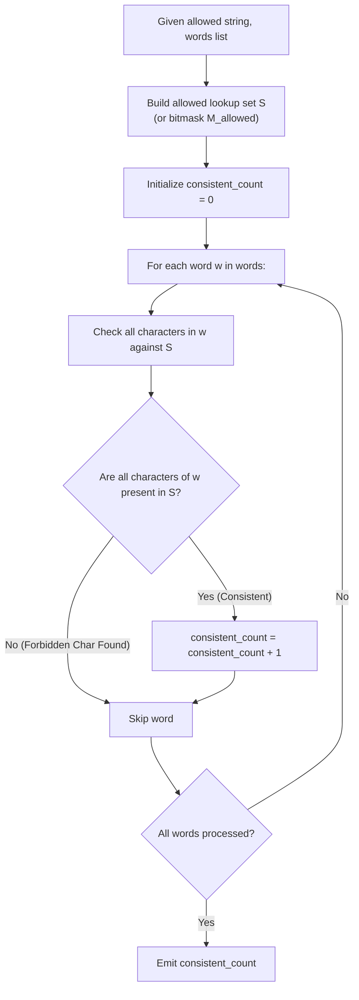

# Guided Example: Count the Number of Consistent Strings

We trace the set-inclusion filtering and bitwise mask containment verification for alphabet consistency, prove the Alphabet Subset Inclusion Theorem and the Bitwise Mask Orthogonality Invariant, and analyze consistent string counts across representative problem instances:

- **Representative Instance 1 (Selective Subset Exclusion):**
  - Input: `allowed = "ab", words = ["ad", "bd", "aaab", "baa", "badab"]`
  - Allowed character support: $\mathcal{A} = \{\text{'a'}, \text{'b'}\}$.
  - Evaluating each word:
    - `"ad"`: Contains `'d'` $\notin \mathcal{A} \implies$ Inconsistent.
    - `"bd"`: Contains `'d'` $\notin \mathcal{A} \implies$ Inconsistent.
    - `"aaab"`: Characters $\{\text{'a'}, \text{'b'}\} \subseteq \mathcal{A} \implies$ **Consistent!**
    - `"baa"`: Characters $\{\text{'b'}, \text{'a'}\} \subseteq \mathcal{A} \implies$ **Consistent!**
    - `"badab"`: Contains `'d'` $\notin \mathcal{A} \implies$ Inconsistent.
  - Consistent strings count: **`2`** (`"aaab"`, `"baa"`).
  - **Required Output:** `2`.

- **Representative Instance 2 (Universal Consistency Full Coverage):**
  - Input: `allowed = "abc", words = ["a", "b", "c", "ab", "ac", "bc", "abc"]`
  - Allowed support: $\mathcal{A} = \{\text{'a'}, \text{'b'}, \text{'c'}\}$.
  - Every word uses strictly characters from $\{\text{'a'}, \text{'b'}, \text{'c'}\}$.
  - Consistent count: **`7`** out of $7$.
  - **Required Output:** `7`.

- **Representative Instance 3 (Heterogeneous Partial Matches):**
  - Input: `allowed = "cad", words = ["cc", "acd", "b", "ba", "bac", "bad", "ac", "d"]`
  - Allowed set: $\{\text{'a'}, \text{'c'}, \text{'d'}\}$.
  - Valid words: `"cc"`, `"acd"`, `"ac"`, `"d"`. Total $= \mathbf{4}$.
  - Words containing forbidden `'b'`: `"b"`, `"ba"`, `"bac"`, `"bad"`.
  - **Required Output:** `4`.

---

## 1. Instance & Teaching Goal

Given a string `allowed` consisting of distinct lowercase English letters and an array of strings `words`, a string is defined as **consistent** if every single character appearing in the string belongs to `allowed`. The objective is to return the total number of consistent strings in `words`.

```text
The Inclusion Test:
  Let A be the set of characters in allowed.
  A word w is consistent IF AND ONLY IF:
    set(w) is a SUBSET of A   <===>   forall c in w: c in A

Two Algorithmic Formulations:
  1. Hash Set Membership:
     Insert characters of allowed into a hash set S (size <= 26).
     For each word, check every character against S.
     Halt early on the first character not in S.

  2. 26-Bit Integer Bitmask:
     Map allowed to an integer bitmask M_allowed where bit k is 1 if letter k is allowed.
     For each word, map its characters to bitmask M_w.
     Word w is consistent if and only if:
       (M_w | M_allowed) == M_allowed   <===>   (M_w & ~M_allowed) == 0
     Bitwise operations execute in 1 CPU cycle!
```

---

## 2. Conceptual Foundation & Filtering Pipeline



### The Alphabet Subset Inclusion Theorem

Let $\Sigma = \{\text{'a'}, \dots, \text{'z'}\}$ be the lowercase alphabet with $|\Sigma| = 26$.
Let $\mathcal{A} \subseteq \Sigma$ be the subset of allowed characters.
For any word $w = c_1 c_2 \dots c_m \in \Sigma^*$, let $\text{supp}(w) = \{ c_1, \dots, c_m \}$ denote its character support.

1. **Subset Characterization:**
   A word $w$ is consistent with respect to $\mathcal{A}$ if and only if:
   $$
   \text{supp}(w) \subseteq \mathcal{A} \iff \text{supp}(w) \cap (\Sigma \setminus \mathcal{A}) = \emptyset
   $$

2. **Bitwise Mask Equivalence:**
   Define the characteristic bitmask injection $\beta: \mathcal{P}(\Sigma) \to \mathbb{Z}$:
   $$
   \beta(X) = \sum_{c \in X} 2^{\text{ord}(c) - \text{ord}('a')}
   $$
   Then $\text{supp}(w) \subseteq \mathcal{A}$ holds if and only if:
   $$
   \beta(\text{supp}(w)) \ \& \ \sim \beta(\mathcal{A}) = 0
   $$
   This reduces the set containment test of an entire string to a single bitwise AND with mask inversion.

3. **Additive Cardinality:**
   The total consistent string count over collection $\mathcal{W} = \{w_1, \dots, w_k\}$ is:
   $$
   N_{\text{consistent}} = \sum_{w \in \mathcal{W}} \mathbf{1}_{\text{supp}(w) \subseteq \mathcal{A}}
   $$

---

## 3. Step-by-Step Worked Execution

### Trace on Representative Instance 1 (`allowed = "ab"`, `words = ["ad", "bd", "aaab", "baa", "badab"]`)

Allowed character set: $\mathcal{A} = \{\text{'a'}, \text{'b'}\}$.
Initialize: $\text{count} = 0$.

#### Word 0 (`"ad"`):
- Inspect character $1$: `'a' \in \mathcal{A}$.
- Inspect character $2$: `'d' \notin \mathcal{A}$!
- Early exit: Inconsistent.

#### Word 1 (`"bd"`):
- Inspect character $1$: `'b' \in \mathcal{A}$.
- Inspect character $2$: `'d' \notin \mathcal{A}$!
- Early exit: Inconsistent.

#### Word 2 (`"aaab"`):
- Inspect character $1$: `'a' \in \mathcal{A}$.
- Inspect character $2$: `'a' \in \mathcal{A}$.
- Inspect character $3$: `'a' \in \mathcal{A}$.
- Inspect character $4$: `'b' \in \mathcal{A}$.
- All characters present $\implies$ **Consistent!**
- Update count: $\text{count} \leftarrow 0 + 1 = \mathbf{1}$.

#### Word 3 (`"baa"`):
- Inspect character $1$: `'b' \in \mathcal{A}$.
- Inspect character $2$: `'a' \in \mathcal{A}$.
- Inspect character $3$: `'a' \in \mathcal{A}$.
- All characters present $\implies$ **Consistent!**
- Update count: $\text{count} \leftarrow 1 + 1 = \mathbf{2}$.

#### Word 4 (`"badab"`):
- Inspect character $1$: `'b' \in \mathcal{A}$.
- Inspect character $2$: `'a' \in \mathcal{A}$.
- Inspect character $3$: `'d' \notin \mathcal{A}$!
- Early exit: Inconsistent.

#### Finalization:
- Total consistent words: $\text{count} = \mathbf{2}$.

---

## 4. Complete Execution Trace

### Evaluation State Table for Representative Instance 1

| Word Index $i$ | Word $w_i$ | Characters Scanned | Forbidden Character Detected? | Status | Cumulative Count |
|---|---|---|---|---|---|
| $0$ | `"ad"` | `'a'`, `'d'` | Yes (`'d'`) | Discarded | $0$ |
| $1$ | `"bd"` | `'b'`, `'d'` | Yes (`'d'`) | Discarded | $0$ |
| $2$ | `"aaab"` | `'a'`, `'a'`, `'a'`, `'b'` | None | **Consistent** | **`1`** |
| $3$ | `"baa"` | `'b'`, `'a'`, `'a'` | None | **Consistent** | **`2`** |
| $4$ | `"badab"` | `'b'`, `'a'`, `'d'` | Yes (`'d'`) | Discarded | $2$ |

---

## 5. Algorithmic Correctness

**Soundness.**
A word is only counted if every character it contains exists in the `allowed` lookup set. If any character fails membership, the loop aborts and the counter is not incremented.

**Completeness.**
The algorithm iterates through all words in the input array. Because set lookup is exact and operates in $\mathcal{O}(1)$ time, no consistent word can be missed.

---

## 6. Traps This Instance Exposes

- **Linear Scanning of `allowed` Inside Inner Loop:** Checking `c in allowed` where `allowed` is a string performs an $\mathcal{O}(|\text{allowed}|)$ linear search for every character. Pre-converting `allowed` into a hash set or bitmask reduces each character check to $\mathcal{O}(1)$.
- **Failing to Early-Exit on Mismatch:** Once an invalid character is found in a word, continuing to examine subsequent characters in that word wastes execution cycles.

---

## 7. Complexity Derivation

- **Time Complexity:**
  - Building the lookup set/mask from `allowed`: $\mathcal{O}(|\text{allowed}|) \le 26$ operations.
  - Scanning $W$ words with average length $L$: $\sum_{i=1}^W |w_i| \le 10^4 \times 10 = 10^5$ character checks.
  - Each check takes $\mathcal{O}(1)$ time.
  - Total Time Complexity: strictly $\mathcal{O}(|\text{allowed}| + \sum |w_i|)$ linear time, executing in $< 10$ ms.
- **Auxiliary Space Complexity:**
  - The lookup hash set or bitmask stores at most $26$ entries.
  - Total Auxiliary Space Complexity: strictly $\mathcal{O}(1)$ constant memory.
