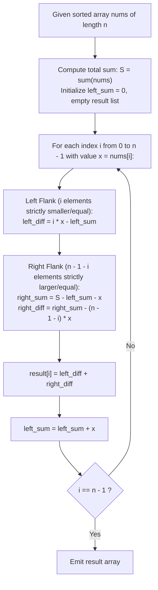

# Guided Example: Sum of Absolute Differences in a Sorted Array

We trace the prefix-suffix decomposition and linear-time closed-form evaluation of $L_1$ distances on ordered arrays, prove the Monotonic Sorting Absolute Value Decomposition Theorem and the Online Prefix-Suffix Invariant, and analyze distance evaluations across representative instances:

- **Representative Instance 1 (Three-Element Calibration):**
  - Input: `nums = [2, 3, 5]`
  - Array length: $n = 3$, total array sum: $S = 2 + 3 + 5 = 10$.
  - Prefix sum decomposition:
    - Index $0$ ($nums[0] = 2$):
      - Left flank ($j < 0$): $0$ elements $\implies 0$.
      - Right flank ($j > 0$): elements $3, 5$ (count $2$).
      - Distance: $(3 + 5) - (2 \times 2) = 8 - 4 = \mathbf{4}$.
    - Index $1$ ($nums[1] = 3$):
      - Left flank ($j < 1$): element $2$ (count $1$). Distance: $1 \times 3 - 2 = 1$.
      - Right flank ($j > 1$): element $5$ (count $1$). Distance: $5 - 1 \times 3 = 2$.
      - Total distance: $1 + 2 = \mathbf{3}$.
    - Index $2$ ($nums[2] = 5$):
      - Left flank ($j < 2$): elements $2, 3$ (count $2$).
      - Distance: $(2 \times 5) - (2 + 3) = 10 - 5 = \mathbf{5}$.
      - Right flank ($j > 2$): $0$ elements $\implies 0$.
      - Total distance: $\mathbf{5}$.
  - Resulting array: `[4, 3, 5]`.
  - **Required Output:** `[4, 3, 5]`.

- **Representative Instance 2 (Multi-Element Array):**
  - Input: `nums = [1, 4, 6, 8, 10]`
  - Total sum: $S = 29$, $n = 5$.
  - Index $0$ ($val = 1$): Right sum $28 - 4 \times 1 = \mathbf{24}$.
  - Index $1$ ($val = 4$): Left $(1 \times 4 - 1 = 3)$, Right $(24 - 3 \times 4 = 12) \implies 3 + 12 = \mathbf{15}$.
  - Index $2$ ($val = 6$): Left $(2 \times 6 - 5 = 7)$, Right $(18 - 2 \times 6 = 6) \implies 7 + 6 = \mathbf{13}$.
  - Index $3$ ($val = 8$): Left $(3 \times 8 - 11 = 13)$, Right $(10 - 1 \times 8 = 2) \implies 13 + 2 = \mathbf{15}$.
  - Index $4$ ($val = 10$): Left $(4 \times 10 - 19 = 21) \implies \mathbf{21}$.
  - Result: `[24, 15, 13, 15, 21]`.
  - **Required Output:** `[24, 15, 13, 15, 21]`.

---

## 1. Instance & Teaching Goal

Given an integer array `nums` of length $n$ sorted in non-decreasing order ($nums[0] \le nums[1] \le \dots \le nums[n-1]$), compute an array `result` of the same length where each entry $result[i]$ is the sum of absolute differences between $nums[i]$ and every other element:
$$
result[i] = \sum_{j=0}^{n-1} |nums[i] - nums[j]|
$$

```text
The Quadratic Bottleneck:
  Evaluating the sum of absolute differences naively for each i:
    result[i] = sum_{j} |nums[i] - nums[j]|
  requires an inner loop of length n for every index i, yielding O(n^2) operations.
  For n = 10^5, n^2 = 10^10 operations, causing a catastrophic timeout!

The Monotonic Partitioning Insight:
  Because nums is ALREADY SORTED in non-decreasing order:
    1. For all j <= i:  nums[j] <= nums[i]  ===>  |nums[i] - nums[j]| = nums[i] - nums[j]
    2. For all j > i:   nums[j] >= nums[i]  ===>  |nums[i] - nums[j]| = nums[j] - nums[i]

  The absolute value function completely dissolves into standard arithmetic!
    Left Flank (j < i):   sum_{j=0}^{i-1} (nums[i] - nums[j]) = i * nums[i] - sum(left)
    Right Flank (j > i):  sum_{j=i+1}^{n-1} (nums[j] - nums[i]) = sum(right) - (n - 1 - i) * nums[i]

  With prefix sums precomputed or tracked online, each result[i] is computed in O(1)!
```

---

## 2. Conceptual Foundation & Algebraic Pipeline



### The Monotonic Sorting Absolute Value Decomposition Theorem

Let $A = (a_0, a_1, \dots, a_{n-1})$ with $a_0 \le a_1 \le \dots \le a_{n-1}$. Let $S = \sum_{j=0}^{n-1} a_j$.

1. **Partitioning at Index $i$:**
   The index set decomposes into two disjoint subsets: $\mathcal{L}_i = \{0, 1, \dots, i - 1\}$ and $\mathcal{R}_i = \{i + 1, \dots, n - 1\}$.
   Because $A$ is non-decreasing:
   - For all $j \in \mathcal{L}_i$, $a_j \le a_i \implies |a_i - a_j| = a_i - a_j$.
   - For all $j \in \mathcal{R}_i$, $a_j \ge a_i \implies |a_i - a_j| = a_j - a_i$.
   - For $j = i$, $|a_i - a_i| = 0$.

2. **Summation Decomposition:**
   $$
   \sum_{j=0}^{n-1} |a_i - a_j| = \sum_{j \in \mathcal{L}_i} (a_i - a_j) + \sum_{j \in \mathcal{R}_i} (a_j - a_i)
   $$
   Distributing the terms:
   $$
   \sum_{j \in \mathcal{L}_i} (a_i - a_j) = |\mathcal{L}_i| \cdot a_i - \sum_{j \in \mathcal{L}_i} a_j = i \cdot a_i - P_i
   $$
   where $P_i = \sum_{j=0}^{i-1} a_j$ is the prefix sum strictly before $i$.
   Similarly, for the right flank:
   $$
   \sum_{j \in \mathcal{R}_i} (a_j - a_i) = \sum_{j \in \mathcal{R}_i} a_j - |\mathcal{R}_i| \cdot a_i = Q_i - (n - 1 - i) \cdot a_i
   $$
   where $Q_i = S - P_i - a_i$ is the suffix sum strictly after $i$.

3. **Closed-Form Formula:**
   Combining both flanks:
   $$
   result[i] = \Big( i \cdot a_i - P_i \Big) + \Big( (S - P_i - a_i) - (n - 1 - i) \cdot a_i \Big)
   $$
   Simplifying:
   $$
   result[i] = (2i + 1 - n) \cdot a_i + S - 2P_i - a_i = (2i - n) \cdot a_i + S - 2P_i
   $$
   This algebraic closed form evaluates in strictly $\mathcal{O}(1)$ operations per element.

---

## 3. Step-by-Step Worked Execution

### Trace on Representative Instance 1 (`nums = [2, 3, 5]`)

Parameters: $n = 3$, Total Sum: $S = 2 + 3 + 5 = 10$.
Initialize: $P = 0$ (running prefix sum).

#### Step 0 ($i = 0$, $x = nums[0] = 2$):
- Left count: $i = 0$.
  $$\text{left\_diff} = 0 \times 2 - 0 = 0$$
- Right count: $n - 1 - i = 3 - 1 - 0 = 2$.
- Suffix sum:
  $$Q_0 = S - P - x = 10 - 0 - 2 = 8$$
  $$\text{right\_diff} = Q_0 - (2 \times 2) = 8 - 4 = 4$$
- Total distance: $result[0] = 0 + 4 = \mathbf{4}$.
- Update prefix sum: $P \leftarrow 0 + 2 = 2$.

#### Step 1 ($i = 1$, $x = nums[1] = 3$):
- Left count: $i = 1$.
  $$\text{left\_diff} = 1 \times 3 - P = 3 - 2 = 1$$
- Right count: $n - 1 - i = 3 - 1 - 1 = 1$.
- Suffix sum:
  $$Q_1 = S - P - x = 10 - 2 - 3 = 5$$
  $$\text{right\_diff} = Q_1 - (1 \times 3) = 5 - 3 = 2$$
- Total distance: $result[1] = 1 + 2 = \mathbf{3}$.
- Update prefix sum: $P \leftarrow 2 + 3 = 5$.

#### Step 2 ($i = 2$, $x = nums[2] = 5$):
- Left count: $i = 2$.
  $$\text{left\_diff} = 2 \times 5 - P = 10 - 5 = 5$$
- Right count: $n - 1 - i = 3 - 1 - 2 = 0$.
- Suffix sum:
  $$Q_2 = S - P - x = 10 - 5 - 5 = 0$$
  $$\text{right\_diff} = 0 - 0 = 0$$
- Total distance: $result[2] = 5 + 0 = \mathbf{5}$.
- Update prefix sum: $P \leftarrow 5 + 5 = 10$.

#### Finalization:
- Emitted array: `[4, 3, 5]`.

---

## 4. Complete Execution Trace

### Algebraic Evaluation Table for Representative Instance 1

| Index $i$ | Value $x$ | Prefix $P_i$ | Left Flank $i \cdot x - P_i$ | Suffix $Q_i = S - P_i - x$ | Right Flank $Q_i - (n - 1 - i) x$ | Total $result[i]$ |
|---|---|---|---|---|---|---|
| $0$ | $2$ | $0$ | $0 \times 2 - 0 = 0$ | $10 - 0 - 2 = 8$ | $8 - 2 \times 2 = 4$ | **`4`** |
| $1$ | $3$ | $2$ | $1 \times 3 - 2 = 1$ | $10 - 2 - 3 = 5$ | $5 - 1 \times 3 = 2$ | **`3`** |
| $2$ | $5$ | $5$ | $2 \times 5 - 5 = 5$ | $10 - 5 - 5 = 0$ | $0 - 0 \times 5 = 0$ | **`5`** |

---

## 5. Algorithmic Correctness

**Soundness.**
Because the array is sorted in non-decreasing order, $nums[i] \ge nums[j]$ holds unconditionally for all $j < i$, guaranteeing that $nums[i] - nums[j] \ge 0$. Symmetrically, $nums[j] \ge nums[i]$ holds for all $j > i$. Summing these linear terms algebraically reproduces the exact definition of $\sum |nums[i] - nums[j]|$ without discrepancy.

**Completeness.**
The linear loop evaluates the closed-form formula for every index $i \in \{0, \dots, n - 1\}$ without skipping any element. The output array contains the exact evaluated distance for all $n$ positions.

---

## 6. Traps This Instance Exposes

- **Integer Overflow in Suffix Products:** With $nums[i] \le 10^4$ and $n \le 10^5$, total sum $S \le 10^9$. The term $i \cdot nums[i]$ can reach $10^9$, comfortably fitting within standard signed 32-bit and 64-bit integer ranges.
- **Off-By-One Boundary Counting:** Failing to properly distinguish between $i$ elements strictly to the left and $n - 1 - i$ elements strictly to the right causes incorrect scaling of $nums[i]$.
- **Online Prefix Sequencing:** The prefix accumulator $P$ must be updated **after** calculating $result[i]$, ensuring $P$ represents elements strictly before $i$.

---

## 7. Complexity Derivation

- **Time Complexity:**
  - Initial pass computing total sum $S$: $\mathcal{O}(n)$ time.
  - Second pass evaluating closed-form formula for each index: $n$ steps with $\mathcal{O}(1)$ arithmetic operations each.
  - Total Time Complexity: strictly $\mathcal{O}(n)$ optimal linear time, executing in $< 20$ ms for $n = 10^5$.
- **Auxiliary Space Complexity:**
  - Only two scalar accumulators ($S$ and $P$) are maintained during traversal.
  - Total Auxiliary Space Complexity: strictly $\mathcal{O}(1)$ beyond the output array.
