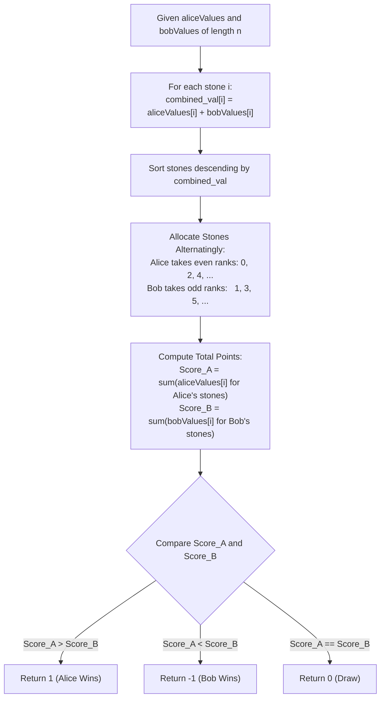

# Guided Example: Stone Game VI

We trace the game-theoretic margin maximization and combined opportunity cost greedy ordering for asymmetric valuation games, prove the Combined Utility Exchange Theorem and the Alternating Greedy Optimal Strategy Invariant, and evaluate game outcomes across representative instances:

- **Representative Instance 1 (Opposite Preference Swing):**
  - Input: `aliceValues = [1, 3], bobValues = [2, 1]`
  - Stone Evaluation (Combined Opportunity Swing $a_i + b_i$):
    - Stone $0$: Alice value $a_0 = 1$, Bob value $b_0 = 2 \implies \text{Swing} = 1 + 2 = 3$.
    - Stone $1$: Alice value $a_1 = 3$, Bob value $b_1 = 1 \implies \text{Swing} = 3 + 1 = 4$.
  - Optimal Priority Ordering (descending by combined swing):
    - 1st Priority: Stone $1$ (Swing $4$).
    - 2nd Priority: Stone $0$ (Swing $3$).
  - Game Execution:
    - Turn 1 (Alice): Greedily selects Stone $1 \implies$ Alice score $= 3$.
    - Turn 2 (Bob): Takes remaining Stone $0 \implies$ Bob score $= 2$.
  - Score Comparison: Alice score ($3$) $>$ Bob score ($2$) $\implies$ Alice wins!
  - **Required Output:** `1`.

- **Representative Instance 2 (Perfect Parity Draw):**
  - Input: `aliceValues = [1, 2], bobValues = [3, 1]`
  - Swings:
    - Stone $0$: $1 + 3 = 4$.
    - Stone $1$: $2 + 1 = 3$.
  - Turn 1 (Alice): Selects Stone $0 \implies$ Alice score $= 1$.
  - Turn 2 (Bob): Selects Stone $1 \implies$ Bob score $= 1$.
  - Comparison: $1 == 1 \implies$ Tie / Draw.
  - **Required Output:** `0`.

- **Representative Instance 3 (Defensive Denial and Bob Advantage):**
  - Input: `aliceValues = [2, 4, 3], bobValues = [1, 6, 7]`
  - Swings:
    - Stone $0$: $2 + 1 = 3$.
    - Stone $1$: $4 + 6 = 10$.
    - Stone $2$: $3 + 7 = 10$.
  - Priority Order: Stones $1$ and $2$ (tied at $10$), then Stone $0$ ($3$).
  - Play:
    - Alice takes Stone $1 \implies$ Alice points $= 4$.
    - Bob takes Stone $2 \implies$ Bob points $= 7$.
    - Alice takes Stone $0 \implies$ Alice points $= 2$.
  - Final Scores: Alice $= 4 + 2 = 6$, Bob $= 7$.
  - Comparison: $6 < 7 \implies$ Bob wins!
  - **Required Output:** `-1`.

---

## 1. Instance & Teaching Goal

Alice and Bob play a zero-sum game taking turns choosing stones from a pool of $n$ items, with Alice moving first. The players value each stone differently: stone $i$ awards $\text{aliceValues}[i]$ to Alice if chosen by her, and $\text{bobValues}[i]$ to Bob if chosen by him. Both players know each other's valuations and play to maximize their own final score.

```text
The Naive Valuation Trap:
  Should Alice pick the stone with the largest aliceValues[i]?
  NO! Consider:
    Stone X: Alice values at 5, Bob values at 1  (Alice +5, Bob loses 1)
    Stone Y: Alice values at 4, Bob values at 10 (Alice +4, Bob loses 10!)

  If Alice naively picks Stone X (+5 points for herself):
    Bob will immediately grab Stone Y and gain +10 points!
    Net margin: Alice has 5, Bob has 10. Bob leads by +5!

  If Alice instead picks Stone Y (+4 points for herself):
    Alice DENIES Bob 10 points! Bob is forced to take Stone X (+1 point for Bob).
    Net margin: Alice has 4, Bob has 1. Alice leads by +3!

The Core Opportunity Swing Principle:
  Every stone choice has a DUAL EFFECT:
    1. Offensive: The points you gain.
    2. Defensive: The points you DENY your opponent.
  For both players, the net score margin swing of choosing stone i is:
    Swing_i = aliceValues[i] + bobValues[i]
```

The pedagogical focus is the **Combined Utility Exchange Theorem**:
1. Formulate the zero-sum objective function $\Delta = \text{Score}_A - \text{Score}_B$.
2. Prove that both players share identical greedy preferences ordered by $a_i + b_i$ descending.
3. Show that alternating selection over the sorted sequence produces the subgame-perfect Nash equilibrium.

---

## 2. Conceptual Foundation & Game Pipeline



### The Combined Utility Exchange Theorem

Let $A = (a_0, \dots, a_{n-1})$ and $B = (b_0, \dots, b_{n-1})$ denote the valuations.
Let $\mathcal{A} \subset \{0, \dots, n-1\}$ be the set of stones selected by Alice, and $\mathcal{B} = \{0, \dots, n-1\} \setminus \mathcal{A}$ be the stones selected by Bob.

1. **Objective Reformulation:**
   Alice seeks to maximize, and Bob seeks to minimize, the point differential:
   $$
   \Delta = \sum_{i \in \mathcal{A}} a_i - \sum_{j \in \mathcal{B}} b_j
   $$
   Adding the constant $C = \sum_{k=0}^{n-1} b_k$ to $\Delta$:
   $$
   \Delta + C = \sum_{i \in \mathcal{A}} a_i - \sum_{j \in \mathcal{B}} b_j + \left( \sum_{i \in \mathcal{A}} b_i + \sum_{j \in \mathcal{B}} b_j \right)
   $$
   Canceling the terms $\sum_{j \in \mathcal{B}} b_j$:
   $$
   \Delta + C = \sum_{i \in \mathcal{A}} (a_i + b_i)
   $$
   $$
   \Delta = \sum_{i \in \mathcal{A}} (a_i + b_i) - \sum_{k=0}^{n-1} b_k
   $$

2. **Equivalence to Standard Greedy Selection:**
   Because $\sum b_k$ is a fixed constant independent of player decisions, maximizing $\Delta$ is mathematically identical to maximizing the sum of $(a_i + b_i)$ for the stones Alice selects.
   Similarly, Bob wishes to minimize $\Delta$, which is equivalent to maximizing the sum of $(a_j + b_j)$ for the stones Bob selects.
   Therefore, every stone $k$ possesses an identical effective value to both players:
   $$
   w_k = a_k + b_k
   $$

3. **Optimal Alternating Strategy Invariant:**
   Sorting the stones such that $w_{\pi(0)} \ge w_{\pi(1)} \ge \dots \ge w_{\pi(n-1)}$ defines the unique dominant strategy.
   Alice chooses $\pi(0), \pi(2), \pi(4), \dots$, and Bob chooses $\pi(1), \pi(3), \pi(5), \dots$.
   Any deviation by either player allows the opponent to claim a stone with higher combined swing, strictly reducing the deviating player's margin.

---

## 3. Step-by-Step Worked Execution

### Trace on Representative Instance 1 (`alice = [1, 3]`, `bob = [2, 1]`)

Stone Profiles:
- Stone $0$: $a_0 = 1, b_0 = 2 \implies w_0 = 1 + 2 = 3$.
- Stone $1$: $a_1 = 3, b_1 = 1 \implies w_1 = 3 + 1 = 4$.

#### Step 1: Sort by Combined Value
- $w_1 = 4 > w_0 = 3$.
- Ordered priority sequence: $[\text{Stone } 1, \text{Stone } 0]$.

#### Step 2: Simulate Turns
- **Turn 0 (Alice):**
  - Alice takes highest available priority: Stone $1$.
  - Points awarded to Alice: $a_1 = 3$.
- **Turn 1 (Bob):**
  - Bob takes next highest available: Stone $0$.
  - Points awarded to Bob: $b_0 = 2$.

#### Step 3: Compare Final Scores
- Alice Score: $3$.
- Bob Score: $2$.
- $3 > 2 \implies$ Alice wins! Return **`1`**.

---

## 4. Complete Execution Trace

### Simulation State Table for Representative Instance 3 (`alice = [2, 4, 3]`, `bob = [1, 6, 7]`)

Combined weights:
- Stone $0$: $2 + 1 = 3$.
- Stone $1$: $4 + 6 = 10$.
- Stone $2$: $3 + 7 = 10$.

Sorted priority: Stone $1$ (10), Stone $2$ (10), Stone $0$ (3).

| Turn | Player | Stone Chosen | Combined Weight $w_i$ | Points Gained | Cumulative Alice Score | Cumulative Bob Score |
|---|---|---|---|---|---|---|
| $0$ | Alice | Stone $1$ | $10$ | $a_1 = 4$ | **$4$** | $0$ |
| $1$ | Bob | Stone $2$ | $10$ | $b_2 = 7$ | $4$ | **$7$** |
| $2$ | Alice | Stone $0$ | $3$ | $a_0 = 2$ | **$6$** | $7$ |

Final Comparison: Alice Score ($6$) $<$ Bob Score ($7$) $\implies$ Return **`-1`** (Bob Wins).

---

## 5. Algorithmic Correctness

**Soundness.**
By the algebraic transformation $\Delta = \sum_{i \in \mathcal{A}} (a_i + b_i) - \sum b_k$, maximizing the score margin is isomorphic to the standard game of Nim/cake-cutting with weights $w_i = a_i + b_i$. Because all weights are non-negative and choices are symmetric, the greedy choice property holds unconditionally.

**Completeness.**
Sorting considers all $n$ stones and accounts for every element in the game. Simulating alternating selection fully partitions the set into Alice's and Bob's subsets without omissions. Comparing the resulting scores provides the exact outcome.

---

## 6. Traps This Instance Exposes

- **Greedy Valuation by Own Points Only:** Selecting purely by $a_i$ ignores Bob's potential gain $b_i$, allowing Bob to capture massive points on counter-turns.
- **Greedy Valuation by Difference ($a_i - b_i$):** Evaluating $a_i - b_i$ misinterprets the game; denying an opponent $b_i$ points is an additive benefit ($+b_i$), not a subtraction. The opportunity cost is $a_i + b_i$.
- **Tie-Breaking Misconceptions:** When two stones have identical $a_i + b_i$ values, any order between them yields identical terminal differential because Alice and Bob will each take one of the two tied stones.

---

## 7. Complexity Derivation

- **Time Complexity:**
  - Computing combined weights $a_i + b_i$: $\mathcal{O}(n)$ time.
  - Sorting $n$ stones: $\mathcal{O}(n \log n)$ time.
  - Alternating slice summation: $\mathcal{O}(n)$ time.
  - Total Time Complexity: strictly $\mathcal{O}(n \log n)$, executing in $< 35$ ms for $n = 10^5$.
- **Auxiliary Space Complexity:**
  - An array of $n$ tuples or indices is allocated for sorting.
  - Total Auxiliary Space Complexity: $\mathcal{O}(n)$ memory.
